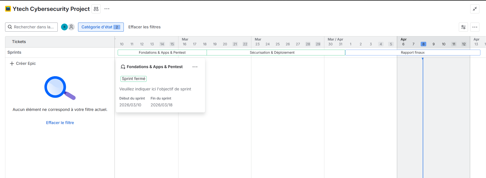

# Présentation du projet

## Contexte général

Dans le cadre de la formation **JobInTech Cybersécurité — Casablanca 2025**, le **Groupe 4** a eu pour mission de concevoir, déployer et sécuriser l'infrastructure réseau complète d'une entreprise fictive : **Ytech Solutions**.

Ce projet final de 5 semaines couvre l'ensemble du cycle d'une infrastructure d'entreprise réelle : de l'analyse des risques jusqu'au test d'intrusion, en passant par le déploiement des services, la segmentation réseau, la supervision et la sauvegarde.

Ce projet reproduit un environnement réel d’entreprise, en s’inspirant des pratiques utilisées dans les centres de sécurité (SOC).

---
## Objectif du projet

L’objectif de ce projet est de concevoir une infrastructure réseau sécurisée et réaliste pour une entreprise, en appliquant les bonnes pratiques de cybersécurité.

Le projet vise également à :
- identifier les vulnérabilités d’une infrastructure existante
- mettre en place des solutions de sécurisation
- utiliser des outils professionnels (Wazuh, Zabbix, Nessus…)
- valider la sécurité via un test d’intrusion (Pentest)

---

## Périmètre du projet

Le projet porte sur la transformation d'une infrastructure initiale vulnérable en une architecture sécurisée, segmentée et supervisée, conforme aux bonnes pratiques de la norme **ISO/IEC 27001**.
Une comparaison entre l’infrastructure initiale et l’infrastructure sécurisée a été réalisée afin de mesurer l’impact des améliorations.

| Domaine | Ce qui a été réalisé |
|---|---|
| **Réseau** | Segmentation VLAN, double firewall, DMZ |
| **Applications** | App Web Laravel, App CRUD RH, Chatbot IA |
| **Sécurité** | Hardening, WAF, Zero Trust, VPN WireGuard |
| **Supervision** | Zabbix, Wazuh SIEM, Grafana SOC, Nessus |
| **Accès** | Bitwarden, Headscale/Tailscale, Bastion SSH |
| **Sauvegarde** | Règle 3-2-1, chiffrement AES-256, Google Drive |
| **DevOps** | GitHub multi-branches, Docker Compose |
| **Tests** | Pentest avant/après, rapport comparatif |

---

## Durée et organisation

Le projet s'est déroulé sur **3 sprints** gérés avec Jira :

```
Sprint 1 (Semaines 1-2) — Fondations : architecture, apps, infra initiale
Sprint 2 (Semaines 3-4) — Sécurisation : hardening, monitoring, Zero Trust
Sprint 3 (Semaine 5)    — Pentest, rapport final, présentation jury
```

---

## Dépôt GitHub

Le code source, les configurations et la documentation technique sont versionnés sur GitHub, avec une branche par membre de l'équipe :

```
https://github.com/oussanea/Ytech_project
```

| Branche | Contenu |
|---|---|
| `feature/chatbot-ollama` | Chatbot YtechBot + MariaDB + Docker |
| `feature/monitoring` | Zabbix + Bitwarden + Nessus + Grafana |
| `hr-crud-app-feature` | Application CRUD RH |
| `feature/hardening` | Hardening Ubuntu + OPNSense |
| `app-ecommerce` | App Web Laravel + Wazuh |
| `feature/network` | Cisco + Grafana SOC Dashboard |

---

## Documentation

La présente documentation technique a été générée avec **Docusaurus** et couvre l'intégralité des choix d'architecture, des configurations déployées, des résultats de tests et des perspectives d'amélioration.
