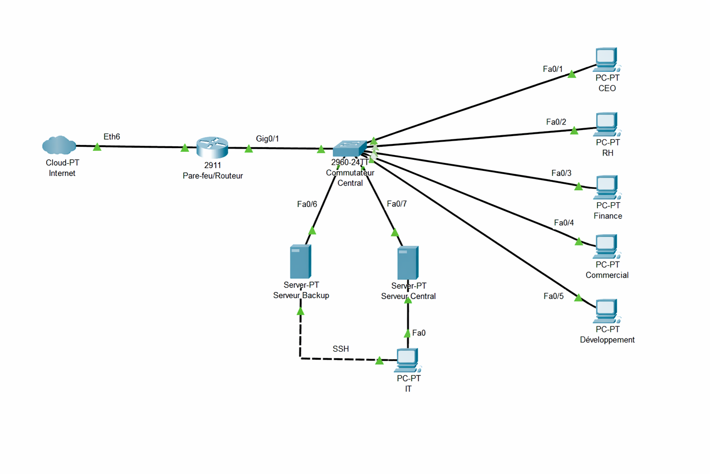

### Topologie du Réseau Plat

L'infrastructure initiale de **Ytech Solutions** repose sur un modèle de "réseau plat" où la segmentation est inexistante. Cette configuration, bien que simple à administrer, ne répond à aucune exigence de sécurité moderne.

#### 🔍 Visualisation de l'Architecture
Le réseau est structuré autour d'un unique switch central (Core Switch) qui relie tous les équipements sans distinction de zone. Un routeur basique assure la liaison avec Internet et fait office de pare-feu périmétrique minimal.

*(Note : Ce schéma illustre la connexion directe de tous les départements et serveurs au même segment réseau)*

#### 🚦 Analyse des Flux de Communication
Dans cette configuration, les flux de données ne sont pas maîtrisés et suivent une logique de confiance implicite :
*   **Absence de DMZ** : L'application web exposée publiquement partage le même réseau que les données RH confidentielles.
*   **Visibilité Totale** : Un poste de travail du département Marketing peut techniquement communiquer avec le serveur de Base de Données sans aucune restriction.
*   **Flux non filtrés** : Aucun contrôle d'accès (ACL) n'est configuré entre les différents services internes.

#### ⚠️ Risque de Propagation
Cette topologie est particulièrement vulnérable aux attaques par **propagation latérale**. Si un seul PC de l'entreprise est infecté par un malware ou un ransomware, l'attaquant peut atteindre l'intégralité des serveurs et des données de l'entreprise en quelques minutes, car aucun obstacle réseau ne bloque son avancée.

> 🛡️ **Transition vers la cible** : Cette absence de frontières internes est le principal défaut que nous corrigeons avec la mise en place du routage inter-VLAN et d'une politique de filtrage stricte.
