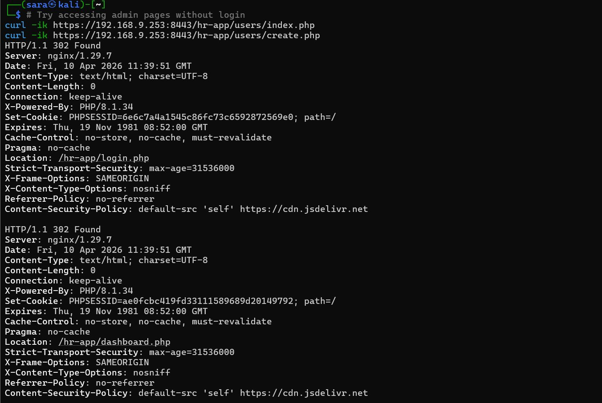
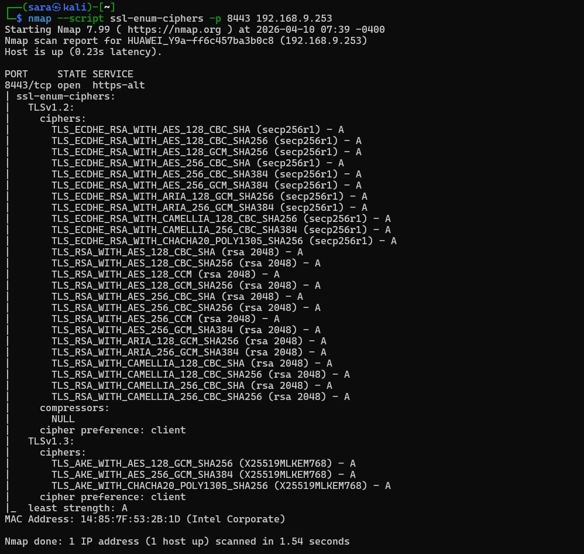

# Phase 1 : Reconnaissance et Fingerprinting (Information Gathering)

La phase initiale de l'audit consiste à collecter des informations sur les cibles sans interaction intrusive. Cette étape est cruciale pour identifier la stack technologique de **Ytech Solutions** et orienter les recherches de vulnérabilités spécifiques.

---

## 🌐 Application Web — `192.168.10.21`

### 1. Identification des Technologies (WhatWeb)

L'outil **WhatWeb** a été utilisé pour extraire l'empreinte digitale (fingerprinting) du serveur web.

* **Commande :** `whatweb 192.168.10.21`
* **Résultats :**
    * **Serveur Web :** Nginx version `1.24.0` (Ubuntu)
    * **Redirection :** HTTP → HTTPS (301 Moved Permanently)
    * **Risque :** La version précise du serveur est exposée — **Information Disclosure**

---

### 2. Analyse des En-têtes HTTP (Curl)

* **Commande :** `curl -I http://192.168.10.21`
* **Vulnérabilités Identifiées :**
    * `Server: nginx/1.24.0` → Version exposée
    * Absence de `Strict-Transport-Security` (HSTS)
    * Absence de `X-Frame-Options` → Clickjacking possible
    * Absence de `X-Content-Type-Options` → MIME sniffing

---

### 3. Audit de la Couche de Transport (SSLScan)

* **Commande :** `sslscan 192.168.10.21`
* **Points de Risque :**
    * **Certificat Auto-signé :** Exposition aux attaques **MITM**
    * TLS 1.2 et 1.3 activés mais sans chaîne de confiance valide

:::info Résumé — Application Web
Le serveur expose sa version et manque de configurations de sécurité HTTP de base. Vulnérable à l'interception de données et à la reconnaissance avancée.
:::

---

## 🔐 Application RH — `192.168.9.253:8443`

### 1. Test de Connectivité

* **Commande :** `ping 192.168.9.253`
* **Résultat :** ✅ Hôte accessible — 0% perte de paquets

### 2. Analyse des En-têtes HTTP (Curl)

* **Commande :** `curl -ik https://192.168.9.253:8443/hr-app/login.php`
* **Résultats :**

| Header | Valeur | Observation |
|---|---|---|
| Server | `nginx/1.29.7` | Version exposée |
| X-Powered-By | `PHP/8.1.34` | Version PHP exposée |
| Set-Cookie | `PHPSESSID=xxx; path=/` | Pas de flag `HttpOnly` ni `Secure` |
| HSTS | ❌ Absent | Manquant |
| CSP | ❌ Absent | Manquant |

### 3. Audit SSL (Nmap)

* **Commande :** `nmap -sC -sV -A 192.168.9.253`
* **Résultats :**
    * Seul port ouvert : **8443/tcp** nginx 1.29.7
    * SSL Certificate CN : `192.168.56.20` → **mismatch** avec IP `192.168.9.253`
    * TLS 1.0, 1.1, 1.2 supportés → anciennes versions actives

:::info Résumé — Application RH
L'application RH expose les versions de ses composants et manque de tous les headers de sécurité essentiels. Le certificat SSL présente un mismatch de CN.
:::
