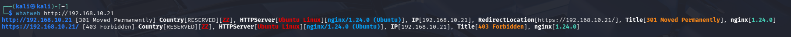
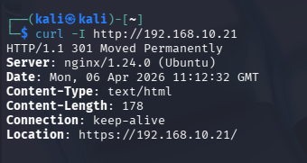
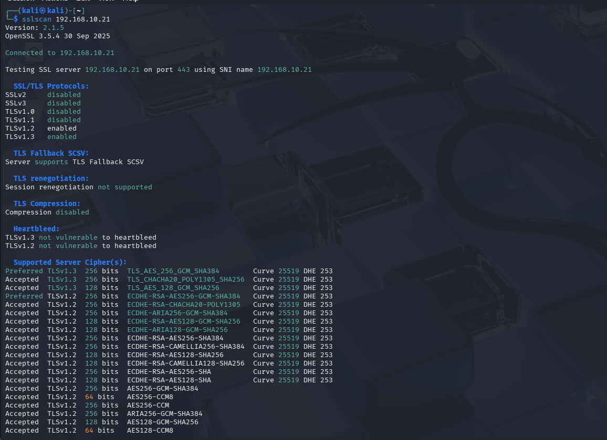
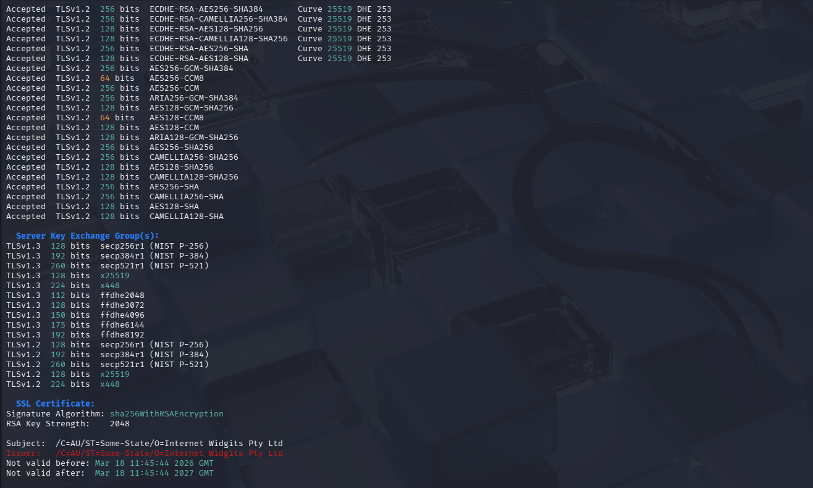

# Phase 1 : Reconnaissance et Fingerprinting (Information Gathering)

La phase initiale de l'audit consiste à collecter des informations sur la cible sans interaction intrusive. Cette étape est cruciale pour identifier la stack technologique de **Ytech Solutions** et orienter les recherches de vulnérabilités spécifiques.

---

## 1. Identification des Technologies (WhatWeb)

L'outil **WhatWeb** a été utilisé pour extraire l'empreinte digitale (fingerprinting) du serveur web. Cette commande permet d'identifier le moteur du site, le serveur, et le système d'exploitation.

* **Commande :** `whatweb 192.168.10.21`
* **Analyse technique :** * **Serveur Web :** Nginx version `1.24.0` (Ubuntu).
    * **Redirection :** Le serveur redirige automatiquement le trafic HTTP vers HTTPS (301 Moved Permanently).
    * **Informations Critiques :** La divulgation de la version précise du serveur (`1.24.0`) est une faille de type **Information Disclosure**. Elle permet à un attaquant de cibler des exploits connus (CVE) pour cette version spécifique de Nginx sur Ubuntu.

---

## 2. Analyse Approfondie des En-têtes HTTP (Curl)

L'examen des en-têtes de réponse via la commande `curl -I` permet de vérifier la présence ou l'absence de mécanismes de durcissement (Hardening).

* **Commande :** `curl -I http://192.168.10.21`
* **Vulnérabilités Identifiées :**
    * **Information Disclosure :** L'en-tête `Server: nginx/1.24.0 (Ubuntu)` confirme l'architecture logicielle sous-jacente.
    * **Absence de Headers de Sécurité :** L'audit révèle que les protections essentielles suivantes sont manquantes :
        * `Strict-Transport-Security` (HSTS) : Le navigateur n'est pas forcé d'utiliser exclusivement le HTTPS.
        * `X-Frame-Options` : L'absence de ce header rend l'application vulnérable aux attaques de type **Clickjacking**.
        * `X-Content-Type-Options` : Le serveur ne bloque pas le "MIME sniffing", ce qui peut être exploité pour forcer le navigateur à interpréter des fichiers de manière incorrecte.

---

## 3. Audit de la Couche de Transport (SSLScan)

Pour évaluer la robustesse du chiffrement HTTPS, nous avons utilisé **SSLScan**. Cette analyse permet de détecter l'usage de protocoles obsolètes ou de certificats non sécurisés.

* **Commande :** `sslscan 192.168.10.21`
* **Points de Risque :** * **Certificat Auto-signé (Self-signed) :** Le certificat n'étant pas émis par une autorité de certification de confiance, l'infrastructure est exposée à des attaques de type **Man-In-The-Middle (MITM)**.
    * **Confidentialité :** Bien que TLS 1.2 et 1.3 soient activés, l'absence d'une chaîne de confiance valide compromet l'intégrité de la connexion pour les employés de Ytech.

---

:::info Résumé de la Phase 1
Le serveur est extrêmement bavard et manque de configurations de sécurité de base au niveau HTTP. L'infrastructure est actuellement vulnérable à l'interception de données et à la reconnaissance avancée.
:::