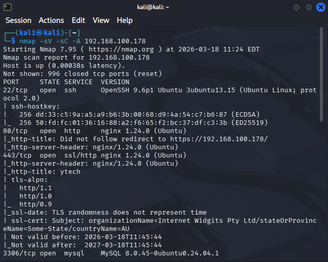
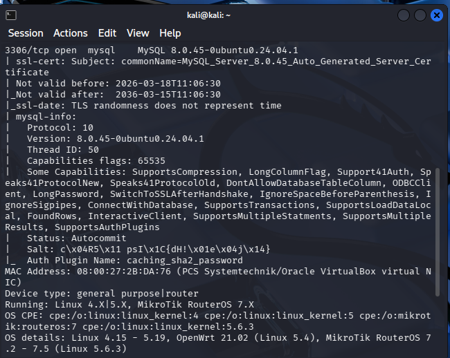
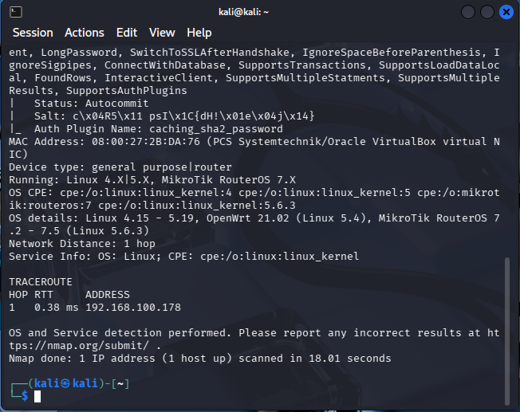
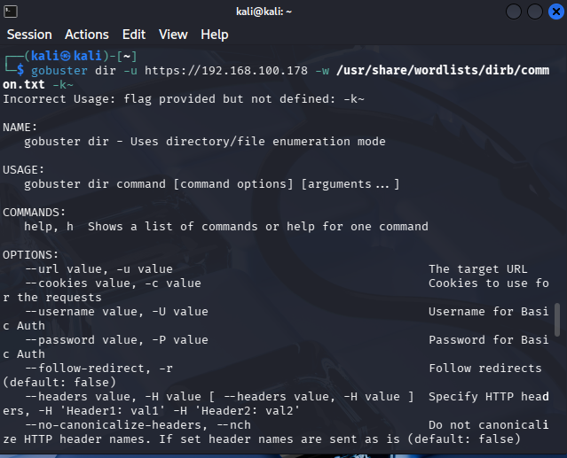
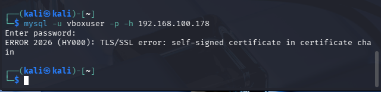

# Phase 2 : Scanning Actif et Énumération

Une fois la reconnaissance terminée, nous passons à une phase d'interaction directe avec le serveur. L'objectif est de cartographier avec précision tous les services à l'écoute et de découvrir l'arborescence cachée de l'infrastructure **Ytech Solutions**.

---

## 1. Cartographie des Services Réseau (Nmap)

Le scan de ports exhaustif est l'étape fondamentale pour identifier la surface d'attaque réelle. Nous avons utilisé **Nmap** avec une détection de version et des scripts de vulnérabilité par défaut.

* **Commande :** `nmap -sV -sC -p- 192.168.10.21`
* **Analyse des Services Critiques :**
    * **Port 22 (SSH) :** OpenSSH 9.6p1. Service d'administration exposé, vulnérable aux tentatives de brute-force si aucune politique de bannissement (type Fail2Ban) n'est active.
    * **Port 80/443 (HTTP/S) :** Serveur Nginx 1.24.0. C'est la porte d'entrée de l'application de gestion.
    * **Port 3306 (MySQL) :** **FAILLE CRITIQUE**. Le service MySQL 8.0.45 est accessible sur l'interface réseau. 
* **Impact Business :** Un attaquant peut tenter de compromettre directement la base de données sans passer par l'interface web, ce qui expose les données sensibles des employés à une extraction massive.

---

## 2. Énumération de Répertoires Web (Gobuster)

L'énumération permet de découvrir des fichiers ou des dossiers qui ne sont pas liés par des hyperliens visibles (fichiers de backup, logs, répertoires de config).

* **Outil :** **Gobuster** en mode `dir`.
* **Dictionnaire utilisé :** `common.txt` (Wordlist standard de 20 000 mots).
* **Résultats de l'énumération :**
    * `/images` (Status: 301)
    * `/js` (Status: 301)
    * `/css` (Status: 301)
* **Analyse :** Bien que les répertoires sensibles comme `/admin` ou les fichiers `.env` n'aient pas été détectés avec ce dictionnaire, la réponse positive du serveur confirme qu'il n'existe aucune protection contre l'énumération automatisée. Cela permet à un attaquant d'utiliser des dictionnaires plus volumineux pour trouver des points d'entrée cachés.

---

## 3. Test d'Exploitabilité : Accès distant MySQL

Suite à la détection du port 3306 ouvert, une tentative de connexion distante a été effectuée pour vérifier la segmentation du réseau.

* **Commande :** `mysql -u root -p -h 192.168.10.21`
* **Observation :** La tentative de connexion a échoué suite à une erreur TLS (Handshake), mais l'accessibilité du service confirme que le serveur accepte les tentatives de connexion externes.
* **Risque :** Cette exposition permet de lancer des attaques par déni de service (DoS) sur le moteur de base de données ou de tenter de forcer les mots de passe des comptes administrateurs.

---

:::warning Alerte de Sécurité
L'exposition publique du service **MySQL (3306)** représente la vulnérabilité réseau la plus sévère à ce stade. Elle doit impérativement être corrigée par une règle de firewall ou en configurant MySQL pour n'écouter que sur `127.0.0.1`.
:::