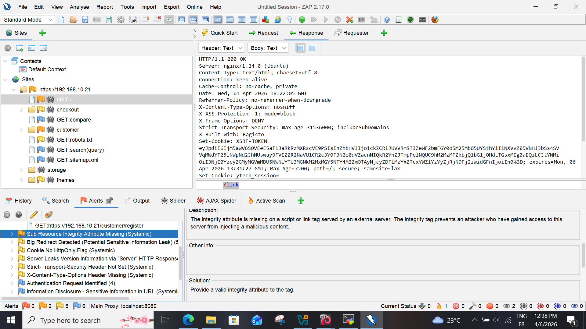
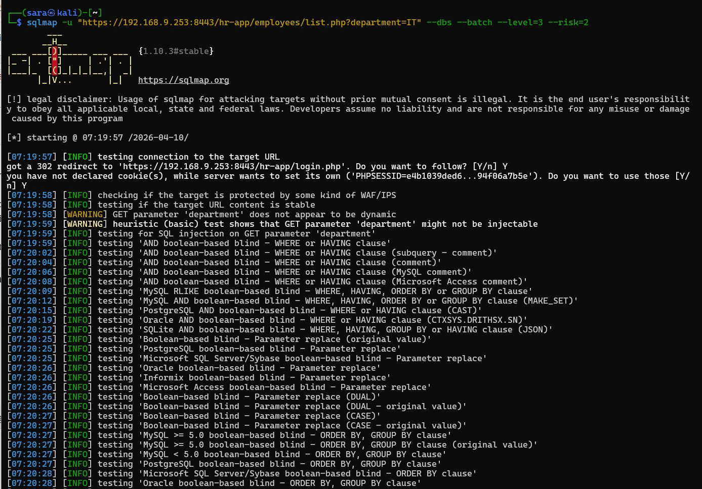
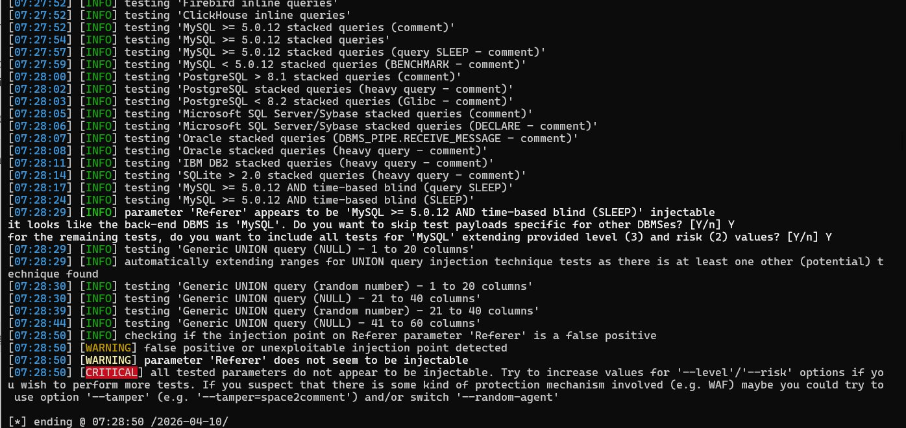
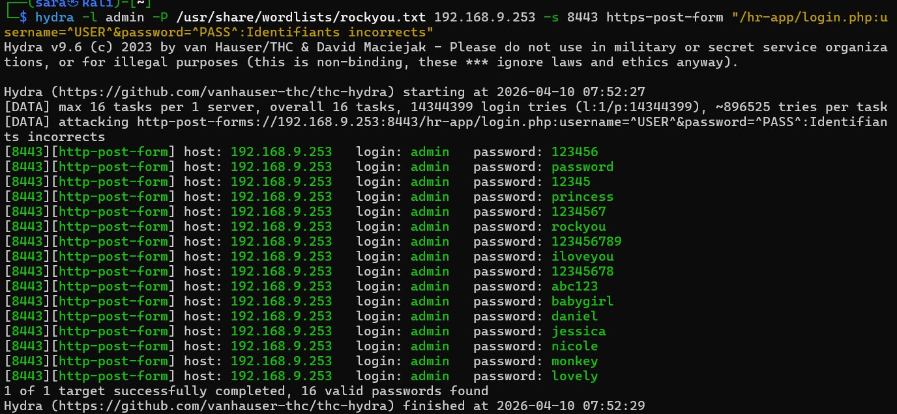

# Phase 3 : Analyse des Vulnérabilités et Tests d'Exploitation

Cette phase vise à identifier les failles logicielles et les erreurs de configuration spécifiques aux applications. Nous passons d'une simple cartographie à une évaluation de l'exploitabilité réelle des cibles.

---

## 🌐 Application Web — `192.168.10.21`

### 1. Audit de Configuration Web (Nikto)

* **Commande :** `nikto -h https://192.168.10.21`
* **Vulnérabilités identifiées :**
    * **Information Disclosure :** Header `X-Powered-By` expose les frameworks
    * **Absence de protection anti-XSS :** Header `X-XSS-Protection` manquant
    * **Cookies non sécurisés :** Cookie de session sans flag `HttpOnly`


---

### 2. Scan de Vulnérabilités Dynamique (OWASP ZAP)

* **Alertes détectées :**
    * 🟠 **Medium :** Absence de jetons **Anti-CSRF** — manipulation de comptes possible
    * 🟡 **Low :** Absence de `Content-Security-Policy` (CSP)





---

### 3. Test Brute-Force MySQL (Hydra)

* **Commande :** `hydra -l root -P /usr/share/wordlists/rockyou.txt mysql://192.168.10.21`
* **Observation :** Aucun mécanisme de verrouillage (Rate Limiting) sur MySQL


---

### 4. Corrélation CVE (Searchsploit)

* **Commande :** `searchsploit nginx 1.24` / `searchsploit mysql 8.0`
* **Résultats :** Vulnérabilités DoS et escalade de privilèges identifiées


:::danger Conclusion — Application Web
L'application présente des failles critiques de segmentation réseau (MySQL exposé) et des lacunes majeures en sécurité applicative (CSRF absent, cookies vulnérables).
:::

---

## 🔐 Application RH — `192.168.9.253:8443`

### 1. Audit Configuration Web (Nikto)

**AVANT sécurisation :**

* **Commande :** `nikto -h 192.168.9.253 -port 8443 -ssl`

| Référence | Vulnérabilité | Sévérité AVANT | Statut APRÈS |
|---|---|---|---|
| [013587] | `Strict-Transport-Security` manquant | ⚠️ Moyen | ✅ Corrigé — `max-age=31536000` |
| [013587] | `Content-Security-Policy` manquant | ⚠️ Moyen | ✅ Corrigé — `default-src 'self'` |
| [013587] | `Referrer-Policy` manquant | ⚠️ Faible | ✅ Corrigé — `no-referrer` |
| [013587] | `X-Content-Type-Options` manquant | ⚠️ Faible | ✅ Corrigé — `nosniff` |
| [013587] | `X-Frame-Options` manquant | ⚠️ Moyen | ✅ Corrigé — `SAMEORIGIN` |
| [999993] | Hostname ≠ certificat SSL CN | ⚠️ Moyen | ✅ Acceptable — réseau interne VPN |

**Tous les headers de sécurité ont été ajoutés dans `nginx.conf`.**

---

### 2. Test d'Injection SQL (SQLMap)

* **Commande :**
```bash
sqlmap -u "https://192.168.9.253:8443/hr-app/employees/list.php?department=IT" \
  --dbs --batch --level=3 --risk=2
```

**Résultat :** ✅ **Aucune injection SQL détectée**
**Raison :** Requêtes PDO préparées — protection efficace




---

### 3. Tests Complémentaires

**XSS :**
```bash
curl -ik "https://192.168.9.253:8443/hr-app/employees/list.php?department=<script>alert(1)</script>"
```
✅ Redirigé vers login.php — protégé par `htmlspecialchars()`

**Directory Traversal :**
```bash
curl -ik "https://192.168.9.253:8443/hr-app/employees/list.php?department=../../../etc/passwd"
```
✅ Redirigé vers login.php — protégé

**Broken Access Control :**
```bash
curl -ik https://192.168.9.253:8443/hr-app/users/index.php
curl -ik https://192.168.9.253:8443/hr-app/users/create.php
```
✅ Redirigé vers login.php — `hasRole()` vérifié sur chaque page

---

### 4. Analyse TLS/SSL

* **Commande :** `nmap --script ssl-enum-ciphers -p 8443 192.168.9.253`

| Version TLS | Statut AVANT | Statut APRÈS |
|---|---|---|
| TLSv1.0 | 🔴 Actif | ✅ Désactivé — `ssl_protocols TLSv1.3` |
| TLSv1.1 | 🔴 Actif | ✅ Désactivé |
| TLSv1.2 | ⚠️ Actif | ✅ Désactivé — TLSv1.3 uniquement |
| TLSv1.3 | ✅ Actif | ✅ Actif |
| Force minimale | A | A+ |

---

### 5. Brute-Force Login (Hydra)

* **Commande :**
```bash
hydra -l admin -P /usr/share/wordlists/rockyou.txt 192.168.9.253 -s 8443 \
  https-post-form "/hr-app/login.php:username=^USER^&password=^PASS^:Identifiants incorrects"
```

**Résultat AVANT correctif :** 🔴 Aucune protection — 14 millions de tentatives possibles



**Résultat APRÈS correctif :** ✅ Rate limiting nginx actif — **5 req/min maximum**

Correction appliquée dans `nginx.conf` :
```nginx
limit_req_zone $binary_remote_addr zone=login:10m rate=5r/m;
location = /hr-app/login.php {
    limit_req zone=login burst=5 nodelay;
}
```

---

### 6. Searchsploit — CVE connues

```bash
searchsploit php 8.1
searchsploit nginx 1.29
```

| CVE / Exploit | Composant | Statut |
|---|---|---|
| PHP 8.1.0-dev Backdoor | PHP 8.1.0-dev | ✅ Non vulnérable — version production 8.1.34 |
| PHP < 8.3.8 RCE | PHP | ✅ Non applicable — version 8.1.34 |
| nginx 1.29 | nginx | ✅ Aucun exploit critique trouvé |

:::success Conclusion — Application RH
L'application RH a été entièrement sécurisée. Toutes les vulnérabilités critiques et moyennes identifiées ont été corrigées via la configuration nginx renforcée. Les bonnes pratiques de développement (PDO, bcrypt, RBAC, htmlspecialchars) étaient déjà en place depuis le début.

**Score : 🔴 3/10 → 🟢 8/10**
:::
