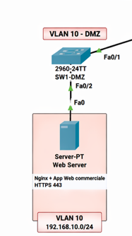

### Isolation des Services Publics

La **DMZ (VLAN 10)** est la zone la plus exposée de l'infrastructure de **Ytech Solutions**. Elle a été conçue pour héberger les services devant être accessibles depuis Internet tout en garantissant qu'une compromission de ces services ne permette pas d'accéder au réseau interne de l'entreprise.

#### 🏗️ Architecture de la Zone
Dans notre simulation sous **Cisco Packet Tracer**, la DMZ est isolée sur le réseau `192.168.10.0/24`. Elle héberge l'actif le plus exposé : le **Web Server**.

*   **Service Principal** : Application commerciale Laravel (Vente de packs web).
*   **Serveur Web** : Nginx configuré avec le support **TLS 1.3**.
*   **Protection Frontale** : WAF ModSecurity avec l'ensemble de règles **OWASP Core Rule Set (CRS)**.

#### 🚦 Flux et Filtrage (Politique de la DMZ)
La sécurité de cette zone repose sur un filtrage bidirectionnel extrêmement strict opéré par le firewall **OPNsense** :

1.  **Internet → DMZ** : Seul le trafic sur le port **HTTPS (443)** est autorisé. Tout autre port (SSH, HTTP) est systématiquement bloqué au niveau du WAN.
2.  **DMZ → Interne** : Il existe une barrière étanche entre la DMZ et les VLANs internes (RH, MGMT, BACKUP). L'application web n'a **aucune visibilité** sur le reste du réseau.
3.  **DMZ → Base de données (VLAN 25)** : Seul le flux vers le port **3306 (MariaDB)** est autorisé pour permettre à l'application Laravel de communiquer avec la base `db_clients`. Ce flux est restreint par l'IP source du serveur web.

#### 🛡️ Mesures de Sécurité Déployées
*   **WAF ModSecurity** : Bloque en temps réel les tentatives d'injection SQL, de Cross-Site Scripting (XSS) et de Path Traversal détectées dans les requêtes HTTP.
*   **Headers de sécurité** : Configuration de Nginx pour inclure des en-têtes comme `Strict-Transport-Security` et `X-Frame-Options`.
*   **Intégrité** : Un agent **Wazuh** est installé sur le serveur pour remonter toute modification suspecte des fichiers de configuration de l'application.

#### 🚀 Scénario de Production vs Simulation
*   **Simulation** : Le serveur web est une VM Ubuntu sous VirtualBox avec une IP bridge `192.168.10.21`.
*   **Production Réelle** : La DMZ serait placée sur une interface physique dédiée de l'appliance **OPNSense** pour garantir une isolation matérielle totale. Les certificats auto-signés seraient remplacés par des certificats **Let's Encrypt** renouvelés automatiquement.

:::warning Principe de confinement
Même si un attaquant parvient à exploiter une faille 0-day sur l'application Laravel, il se retrouvera prisonnier du VLAN 10. Sans accès SSH et sans visibilité sur le VLAN 25 (DB) ou 50 (ADMIN), son impact reste confiné à la zone publique.
:::
