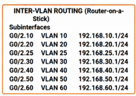

### Architecture de l'Adressage IP

La gestion rigoureuse des adresses IP est le premier rempart contre les accès non autorisés. Pour **Ytech Solutions**, nous avons conçu un plan d'adressage hiérarchisé qui sépare physiquement et logiquement les différents services. Cette structure facilite non seulement la gestion des flux par le firewall mais simplifie également l'audit de sécurité.

#### 🏗️ Adressage des VLANs (Réseau Physique)
Conçue sous **Cisco Packet Tracer**, cette topologie utilise des sous-réseaux distincts pour chaque zone de confiance. Chaque VLAN dispose d'une passerelle (Gateway) configurée sur le routeur central (Router-on-a-Stick).

| VLAN | Zone de Confiance | Sous-réseau IP | Passerelle (.1) | Actifs principaux |
| :--- | :--- | :--- | :--- | :--- |
| **10** | **DMZ** | 192.168.10.0/24 | 192.168.10.1 | Web Server (Laravel) |
| **20** | **APP** | 192.168.20.0/24 | 192.168.20.1 | APP Server (RH, Chatbot) |
| **25** | **DB** | 192.168.25.0/24 | 192.168.25.1 | DB Server (MariaDB) |
| **30** | **MGMT** | 192.168.30.0/24 | 192.168.30.1 | Monitoring, Headscale, Wazuh |
| **40** | **IT ADMINS** | 192.168.40.0/24 | 192.168.40.1 | Bastion SSH, Postes IT |
| **50** | **EMPLOYEES** | 192.168.50.0/24 | 192.168.50.1 | Postes Windows (RH, Marketing...) |
| **60** | **BACKUP** | 192.168.60.0/24 | 192.168.60.1 | Backup Server |

#### 🔐 Adressage Overlay (Réseau Zero Trust Headscale)
En complément du réseau physique, une couche d'adressage **Zero Trust** est déployée via **Headscale**. Ces adresses IP ne sont accessibles qu'après authentification forte et via un tunnel chiffré, rendant les serveurs invisibles sur le réseau local standard.

| Node | IP Zero Trust (Tailnet) | Rôle et Service |
| :--- | :--- | :--- |
| **app-server** | 100.64.0.1 | Accès sécurisé aux Apps RH et Chatbot |
| **web-server** | 100.64.0.2 | Administration sécurisée du Web Server |
| **backup-server** | 100.64.0.3 | Flux de sauvegarde chiffrés |
| **db-server** | 100.64.0.4 | Accès restreint à MariaDB |
| **monitoring** | 100.64.0.5 | Dashboard SOC et Contrôle Headscale |

#### 🚀 Coexistence Simulation vs Production
Il est important de noter la flexibilité de ce plan d'adressage entre notre environnement de test et la cible réelle en entreprise.

| Contexte | Méthode d'Adressage | Outils utilisés |
| :--- | :--- | :--- |
| **Simulation** | IPs Host-Only et Bridged | VirtualBox, Cisco Packet Tracer |
| **Production Réelle** | Adressage statique rigoureux | Switches Cisco Catalyst 2960, OPNsense |

#### 🛡️ Avantages de ce Double Plan
1.  **Invisibilité des Services** : Un attaquant scannant le réseau local `192.168.x.x` ne verra pas les interfaces Zero Trust `100.64.x.x`.
2.  **Filtrage Granulaire** : Les ACL Cisco et les règles OPNsense bloquent les flux entre VLANs (ex: VLAN 50 vers VLAN 25), tandis que Headscale gère l'autorisation par identité d'utilisateur.
3.  **Conformité ISO 27001** : Ce plan répond directement aux exigences de séparation des environnements et de contrôle d'accès réseau.
