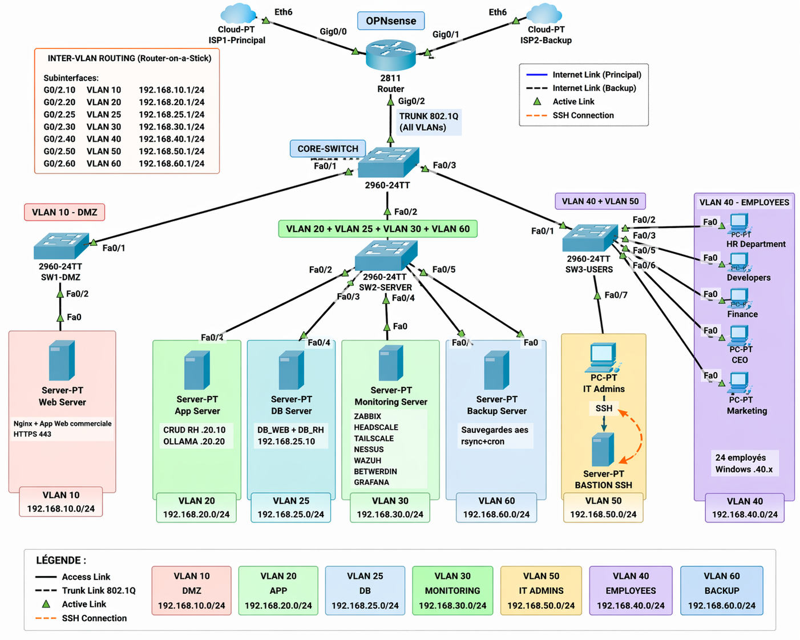

### Synthèse de l'Infrastructure Sécurisée

Le schéma final de l'architecture de **Ytech Solutions** représente l'aboutissement de notre stratégie de **défense en profondeur**. Conçue sous **Cisco Packet Tracer**, cette topologie intègre l'ensemble des mesures de segmentation, de filtrage et d'identité nécessaires pour protéger les actifs critiques de l'entreprise.

"Schéma directeur de l'infrastructure cible sécurisée de Ytech Solutions réalisée"

#### 🗺️ Architecture Logique et Physique
L'infrastructure s'articule autour d'un cœur de réseau intelligent capable de gérer l'isolation de nos **7 zones de confiance** :

1.  **Le Cœur de Réseau (Core Layer)** : Un switch **Cisco Catalyst 2960** centralise l'ensemble des flux. Il est relié au routeur via un **Trunk 802.1Q**, permettant le transport sécurisé des étiquettes de VLANs.
2.  **Le Routage Inter-VLAN (Router-on-a-Stick)** : Un routeur Cisco 2811 assure le routage entre les segments tout en appliquant des **ACL (Access Control Lists)** strictes pour interdire tout flux non autorisé par défaut.
3.  **Le Périmètre de Sécurité (Gateway)** : Le firewall **OPNSense** agit comme la passerelle ultime vers l'extérieur. Il gère le **NAT**, le **Failover ISP** (double connexion Internet) et l'inspection de paquets via **Suricata IPS**.

#### 🚦 Cartographie des Flux Critiques
Le schéma final garantit que les données sensibles circulent uniquement sur des chemins contrôlés :
*   **Flux Public** : Internet → OPNSense (Port 443) → VLAN 10 (DMZ).
*   **Flux Applicatif** : VLAN 20 (APP) → VLAN 25 (DB) sur le port 3306 uniquement.
*   **Flux de Gestion** : VLAN 40 (IT) → VLAN 30 (MGMT) via un tunnel **Zero Trust Headscale** chiffré.
*   **Flux de Sauvegarde** : Tous VLANs → VLAN 60 (BACKUP) à 02h00 via un canal isolé.

#### 🛠️ De la Simulation à la Réalité
Bien que modélisée avec précision dans **Cisco Packet Tracer**, cette architecture est directement transposable sur du matériel de production.

| Composant de Simulation | Équivalent de Production Réelle |
| :--- | :--- |
| **Routeur Cisco 2811** | Appliance matérielle **OPNSense** dédiée |
| **Core Switch 2960** | Switch managé **Cisco Catalyst 2960-X** (Gigabit) |
| **Serveurs VirtualBox** | Grappe de serveurs **Dell PowerEdge R350** |
| **Lien Cloud-PT** | Double adduction fibre optique (Orange / Maroc Telecom) |

#### ✅ Conclusion du Chapitre
Cette architecture transforme Ytech Solutions en une forteresse numérique. En ramenant la quasi-totalité des risques critiques en zone **verte (criticité ≤ 4/16)**, nous assurons non seulement la conformité **ISO 27001**, mais surtout la pérennité économique de l'entreprise face aux cybermenaces modernes.
