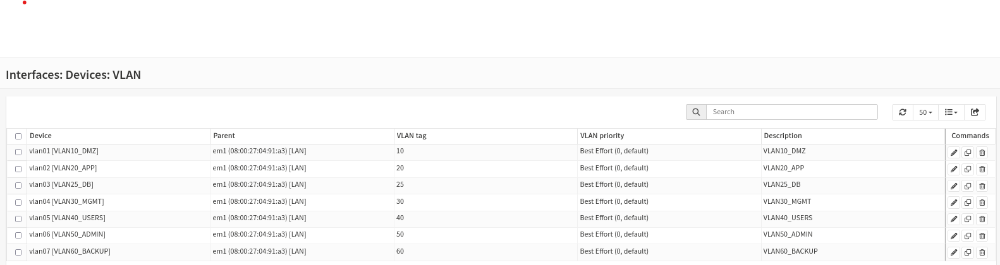

### L'Isolation comme Fondement de la Sécurité

Pour rompre avec la vulnérabilité du réseau plat initial, l'architecture cible de **Ytech Solutions** repose sur une segmentation stricte en **7 zones étanches** appelées VLANs [1, 2]. Cette structure permet d'appliquer le principe du moindre privilège : chaque département ou service est confiné dans une zone isolée, et tout flux entre ces zones doit être explicitement autorisé par le firewall.

#### 📊 Inventaire Technique des VLANs
Conçue sous **Cisco Packet Tracer**, cette topologie définit des sous-réseaux isolés pour chaque fonction critique de l'entreprise.

| VLAN | Nom | Réseau IP | Actifs et Services Hébergés | Criticité |
| :--- | :--- | :--- | :--- | :--- |
| **10** | **DMZ** | 192.168.10.0/24 | App Web commerciale (Laravel), Nginx, WAF ModSecurity [1, 5] | 🔴 Critique |
| **20** | **APP** | 192.168.20.0/24 | Application CRUD RH, Chatbot YtechBot (Ollama) [1, 5] | 🔴 Critique |
| **25** | **DB** | 192.168.25.0/24 | Serveur MariaDB (Bases : clients, RH, chatbot) [1, 5] | 🔴 Critique |
| **30** | **MGMT** | 192.168.30.0/24 | Monitoring (Zabbix), Wazuh, Grafana, Headscale, Bitwarden [1, 5] | 🟡 Élevée |
| **40** | **IT ADMINS**| 192.168.40.0/24 | Postes d'administration IT, Bastion SSH [5, 7] | 🔴 Critique |
| **50** | **EMPLOYEES**| 192.168.50.0/24 | 24 postes de travail (RH, Finance, Marketing, CEO) [1, 5, 7] | 🟡 Modérée |
| **60** | **BACKUP** | 192.168.60.0/24 | Serveur de sauvegarde, Scripts Rclone, Chiffrement AES [1, 5] | 🔴 Critique |

#### 🚦 Logique de Routage : Router-on-a-Stick
Le cœur de cette segmentation est le **routage Inter-VLAN** configuré sur le routeur central (simulé par un Cisco 2811) . 

*   **Le Trunk 802.1Q** : L'interface `Gig0/2` du Core Switch est configurée en mode Trunk pour transporter le trafic de tous les VLANs vers le routeur via un seul lien physique.
*   **Sous-interfaces** : Chaque VLAN dispose d'une passerelle par défaut (Gateway) configurée comme sous-interface sur le routeur (ex: `G0/2.10` pour le VLAN 10).
*   **Filtrage Inter-VLAN** : Notre configuration impose une politique **"Deny by Default"** . Par exemple, le VLAN 50 (Employees) ne peut jamais initier de connexion directe vers le VLAN 25 (DB) ; seul le VLAN 20 (APP) y est autorisé sur le port 3306.

#### 🚀 De la Simulation à la Production Réelle
Si ce projet utilise **Cisco Packet Tracer** et des machines virtuelles pour la démonstration, l'architecture est conçue pour être déployée physiquement en entreprise avec des performances de grade professionnel.

| Élément | Simulation (Projet) | Production Proposée |
| :--- | :--- | :--- |
| **Commutation** | Switch virtuel Cisco | Switchs managés physiques (**Cisco Catalyst 2960**) |
| **Routage** | Router-on-a-Stick logiciel | Appliance matérielle dédiée pour **OPNsense** |
| **Serveurs** | VirtualBox (Ressources partagées) | Serveurs physiques dédiés (**Dell PowerEdge R350**)|
| **Redondance** | Instance unique | Clustering de serveurs et Failover matériel complet |
