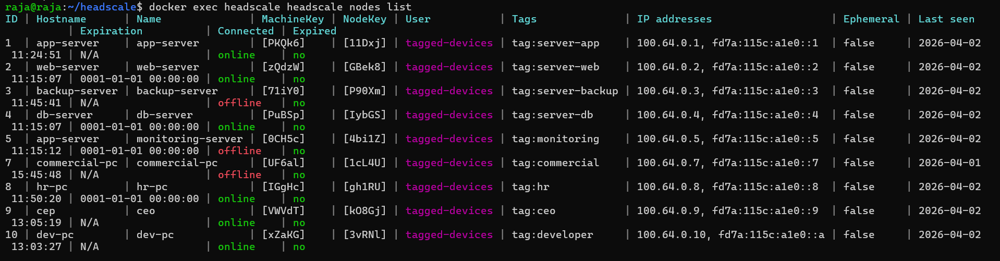
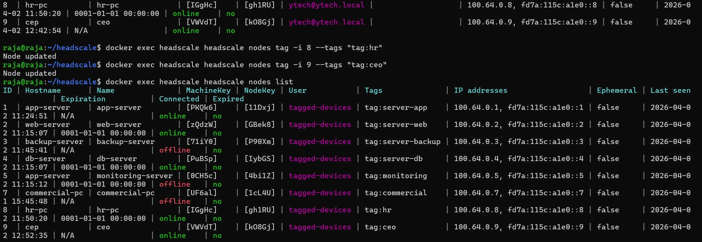
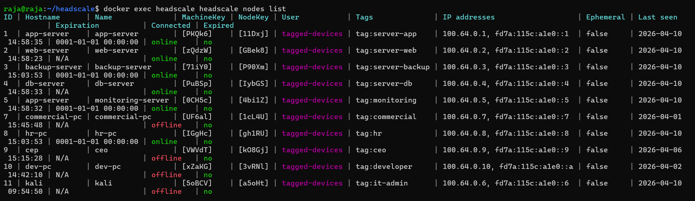
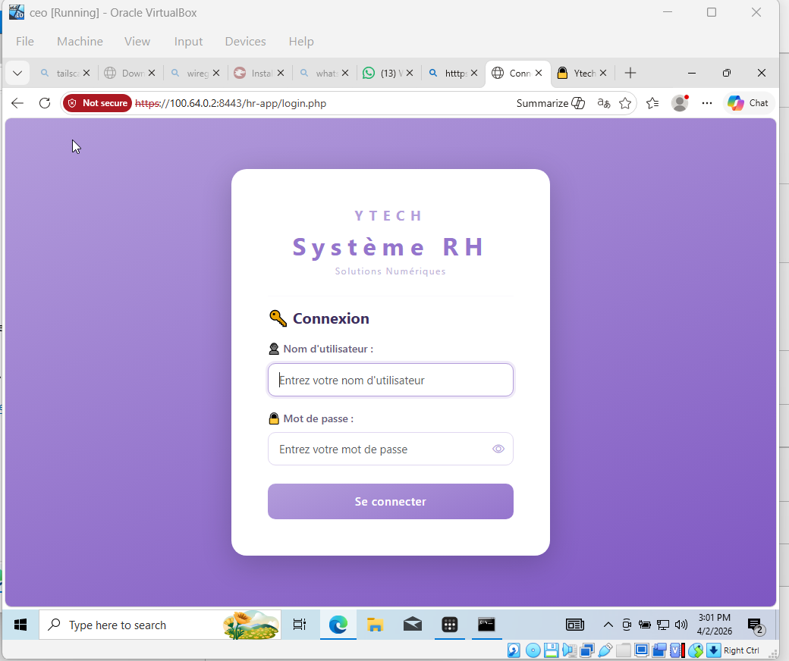

# 🔐 Architecture Zero Trust (ZTNA)

### La Fin de la Confiance Implicite

Dans l'architecture initiale de **Ytech Solutions**, le réseau était "plat" : une fois à l'intérieur du LAN, tout le monde faisait confiance à tout le monde. Pour l'architecture cible, nous avons adopté le modèle **Zero Trust Network Access (ZTNA)**. Le principe directeur est simple : **"Ne jamais faire confiance, toujours vérifier"**.

L'accès aux ressources n'est plus accordé en fonction de l'emplacement physique, mais repose sur l'identité de l'utilisateur, l'état de la machine et une authentification forte.

---

## 🛠️ Le Cœur du Système : Headscale & Tailscale

Pour implémenter cette stratégie sans frais de licence, nous avons déployé une stack open source robuste et souveraine :

1. **Headscale (Le Contrôle)** : Installé sur la VM de **Monitoring (VLAN 30)**, il s'agit de la version open source auto-hébergée du serveur de contrôle Tailscale. Il gère la base de données des nœuds, les clés de chiffrement et les politiques d'accès sans que les données ne quittent l'infrastructure de l'entreprise.
2. **Tailscale (Les Agents)** : Des agents légers sont installés sur chaque serveur critique (Web, APP, DB, Backup) et sur les postes des administrateurs.
3. **Le Moteur WireGuard** : Headscale utilise le protocole **WireGuard** pour créer des tunnels chiffrés point à point (Peer-to-Peer), garantissant que même si un switch est compromis, les données restent illisibles.

### Comparaison des solutions VPN

| Critère | Headscale | Tailscale | WireGuard classique |
|---|---|---|---|
| Open source | ✅ Oui | ⚠️ Partiellement | ✅ Oui |
| Auto-hébergé | ✅ Oui | ❌ Cloud Tailscale | ✅ Oui |
| Interface graphique | ❌ CLI uniquement | ✅ Oui | ❌ Non |
| Contrôle ACL granulaire | ✅ Oui | ✅ Oui | ⚠️ Manuel |
| Confidentialité données | ✅ 100% interne | ❌ Données sur cloud | ✅ 100% interne |
| Protocole sous-jacent | WireGuard | WireGuard | WireGuard |

---

## 🌐 L'Overlay Network (Réseau Superposé)

Headscale crée un réseau virtuel sécurisé au-dessus de notre infrastructure physique. Chaque machine reçoit une adresse IP unique dans la plage réservée **100.64.0.0/10**, totalement isolée du trafic local standard.

### Déploiement via Docker

```bash
docker run -d \
  --name headscale \
  --restart unless-stopped \
  -v ./config:/etc/headscale \
  -p 8085:8085 \
  headscale/headscale:latest serve
```

### Nœuds connectés — État réel du réseau

| ID | Hostname | Tag | IP Tailscale | Statut |
|---|---|---|---|---|
| 1 | app-server | tag:server-app | 100.64.0.1 | 🟢 online |
| 2 | web-server | tag:server-web | 100.64.0.2 | 🟢 online |
| 3 | backup-server | tag:server-backup | 100.64.0.3 | 🟢 online |
| 4 | db-server | tag:server-db | 100.64.0.4 | 🟢 online |
| 5 | monitoring-server | tag:monitoring | 100.64.0.5 | 🟢 online |
| 7 | commercial-pc | tag:commercial | 100.64.0.7 | 🔴 offline |
| 8 | hr-pc | tag:hr | 100.64.0.8 | 🟢 online |
| 9 | ceo | tag:ceo | 100.64.0.9 | 🔴 offline |
| 10 | dev-pc | tag:developer | 100.64.0.10 | 🔴 offline |
| 11 | kali | tag:it-admin | 100.64.0.6 | 🔴 offline |

### Gestion CLI — Commandes utilisées

```bash
# Lister tous les nœuds
docker exec headscale headscale nodes list

# Assigner les tags
docker exec headscale headscale nodes tag -i 8 --tags "tag:hr"
docker exec headscale headscale nodes tag -i 9 --tags "tag:ceo"
```


*Tous les nœuds connectés et leurs adresses IP Tailscale*


*Tags assignés à chaque nœud selon son rôle*


*État final — 11 nœuds connectés avec leurs tags (docker exec headscale headscale nodes list)*

---

## 🔐 Politiques d'Accès — ACL Zero Trust

Le Zero Trust applique strictement le principe du **moindre privilège**. Les règles ACL sont définies dans le fichier `acl.hujson` :

```json
{
  "tagOwners": {
    "tag:it-admin":      ["ytech@ytech.local"],
    "tag:developer":     ["ytech@ytech.local"],
    "tag:hr":            ["ytech@ytech.local"],
    "tag:finance":       ["ytech@ytech.local"],
    "tag:commercial":    ["ytech@ytech.local"],
    "tag:ceo":           ["ytech@ytech.local"],
    "tag:server-app":    ["ytech@ytech.local"],
    "tag:server-web":    ["ytech@ytech.local"],
    "tag:server-db":     ["ytech@ytech.local"],
    "tag:server-backup": ["ytech@ytech.local"],
    "tag:monitoring":    ["ytech@ytech.local"]
  },
  "acls": [
    { "action": "accept", "src": ["tag:it-admin"], "dst": ["*:*"] },
    { "action": "accept", "src": ["*"], "dst": ["tag:server-app:80", "tag:server-app:443"] },
    { "action": "accept", "src": ["tag:hr"], "dst": ["tag:server-web:8443", "tag:server-web:8501"] },
    { "action": "accept", "src": ["tag:ceo"], "dst": ["tag:server-web:8443", "tag:server-web:8501"] },
    { "action": "accept", "src": ["tag:monitoring"], "dst": ["tag:server-app:*", "tag:server-web:*", "tag:server-db:*"] },
    { "action": "accept", "src": ["tag:server-app", "tag:server-web"], "dst": ["tag:server-db:3306"] }
  ]
}
```

### Politique par rôle

| Rôle | Accès autorisés |
|---|---|
| 🔑 IT Admin | Accès total à tous les nœuds |
| 👔 CEO | Lecture seule App RH (8443) + Chatbot (8501) |
| 🧑‍💼 HR | App RH (8443) + Chatbot (8501) |
| 💰 Finance/Commercial | App (443) + Chatbot (8501) |
| 👨‍💻 Developer | Chatbot (8501) uniquement |
| 📊 Monitoring | Tous les serveurs — supervision |
| 🗄️ App/Web → DB | Port 3306 MySQL uniquement |

---

## 🎯 Démonstration Zero Trust en Action


### Accès autorisé — CEO vers App RH

Le Directeur Général (CEO) dispose d'un accès en lecture seule à l'application CRUD RH.


*CEO peut consulter les employés mais ne peut pas modifier — principe du moindre privilège*

:::info Zero Trust en action
Être connecté au VPN ne suffit pas. Chaque accès est explicitement autorisé ou refusé par les règles ACL selon le **tag** du nœud. Un employé Finance connecté au réseau ne peut pas accéder à l'App RH — même depuis l'intérieur du tunnel Headscale.
:::

---

## 🚦 Distinction : VPN WireGuard vs Zero Trust Headscale

Il est crucial de ne pas confondre les deux solutions de sécurité déployées :

| | VPN WireGuard | Zero Trust Headscale |
|---|---|---|
| **Configuré sur** | Firewall OPNsense | VM Monitoring (VLAN 30) |
| **Usage** | Accès distant — télétravail | Sécurité interne inter-serveurs |
| **Qui l'utilise** | Employés depuis Internet | Serveurs + admins en interne |
| **Contrôle d'accès** | Tunnel tout ou rien | ACL granulaires par tag/rôle |
| **En cas d'intrusion** | Limite l'accès WAN | Bloque les mouvements latéraux |

