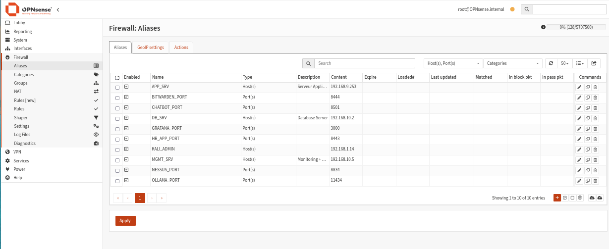
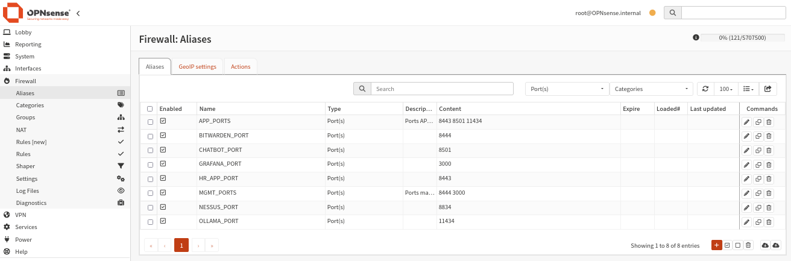
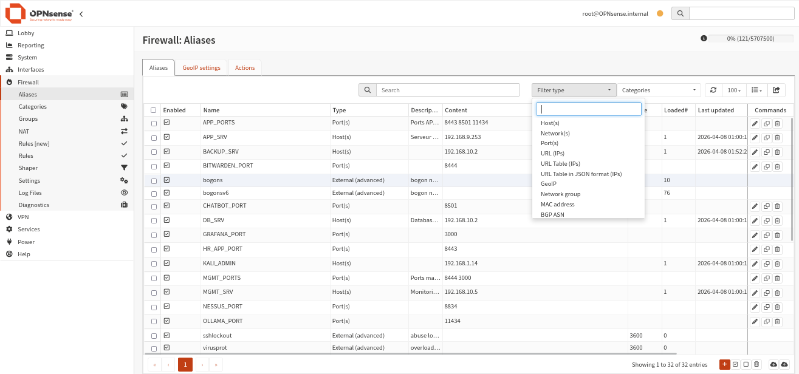

import Tabs from '@theme/Tabs';
import TabItem from '@theme/TabItem';

# 🏷️ Aliases Firewall

## Rôle des aliases

Les aliases permettent de **nommer des ressources réseau** (hôtes, réseaux, ports) pour les réutiliser dans les règles firewall. Ils rendent les règles plus lisibles, plus maintenables et moins sujettes aux erreurs.

**Chemin :** `Firewall → Aliases`

## Vue complète des aliases



14 aliases sont définis au total, répartis en deux catégories : **hôtes** et **ports**.

## Aliases d'hôtes (Host)

Ces aliases pointent vers des adresses IP spécifiques de l'infrastructure.



| Nom | Type | Adresse IP | Description |
|-----|------|-----------|-------------|
| `APP_SRV` | Host(s) | 192.168.9.253 | Serveur Applicatif (Laravel/RH/Chatbot) |
| `DB_SRV` | Host(s) | 192.168.10.2 | Database Server (MySQL/MariaDB) |
| `MGMT_SRV` | Host(s) | 192.168.10.5 | Monitoring + Zabbix/Wazuh/Grafana |
| `KALI_ADMIN` | Host(s) | 192.168.1.14 | Machine d'administration Kali Linux |
| `Ytech_Servers` | Host(s) | Groupe serveurs | Tous les serveurs de l'infrastructure |
| `Ytech_Team` | Host(s) | IPs équipe | Membres de l'équipe Y-Tech |

## Aliases de ports (Port)

Ces aliases regroupent les ports des services exposés par l'infrastructure.

| Nom | Type | Port(s) | Service |
|-----|------|---------|---------|
| `HR_APP_PORT` | Port(s) | 8443 | Application RH (Laravel HTTPS) |
| `CHATBOT_PORT` | Port(s) | 8501 | YtechBot (Streamlit) |
| `OLLAMA_PORT` | Port(s) | 11434 | Ollama LLM API |
| `BITWARDEN_PORT` | Port(s) | 8444 | Bitwarden (gestionnaire de mots de passe) |
| `NESSUS_PORT` | Port(s) | 8834 | Nessus (scanner de vulnérabilités) |
| `GRAFANA_PORT` | Port(s) | 3000 | Grafana (tableaux de bord) |

## Aliases groupés

Ces aliases combinent plusieurs ports ou hôtes pour simplifier les règles.

| Nom | Type | Contenu | Utilisation |
|-----|------|---------|-------------|
| `APP_PORTS` | Port(s) | 8443, 8501, 11434 | Accès équipe vers serveur APP |
| `MGMT_PORTS` | Port(s) | 8444, 3000 | Accès équipe vers outils MGMT |

## Types d'aliases disponibles dans OPNsense



OPNsense supporte plusieurs types d'aliases :

| Type | Description |
|------|-------------|
| `Host(s)` | Adresses IP individuelles |
| `Network(s)` | Plages réseau CIDR |
| `Port(s)` | Numéros de ports TCP/UDP |
| `URL (IPs)` | Liste d'IPs depuis URL distante |
| `GeoIP` | Filtrage par pays |
| `MAC address` | Adresses MAC |

## Exemple de création d'une règle avec alias

```
// Avant aliases (illisible)
Source: 192.168.1.14  →  Destination: 192.168.10.5  Port: 8834

// Après aliases (lisible et maintenable)
Source: KALI_ADMIN    →  Destination: MGMT_SRV       Port: NESSUS_PORT
```

:::tip Bonne pratique
Toujours utiliser des aliases plutôt que des IPs directes dans les règles. Si une IP change, il suffit de modifier l'alias — toutes les règles qui l'utilisent sont automatiquement mises à jour.
:::
