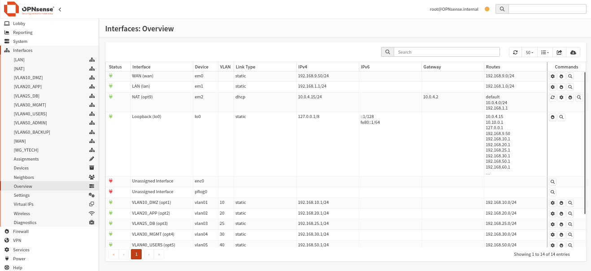

import Tabs from '@theme/Tabs';
import TabItem from '@theme/TabItem';

# ⚙️ Installation & Configuration initiale

## Prérequis VM VirtualBox

OPNsense est déployé dans une machine virtuelle VirtualBox avec la configuration réseau suivante :

| Interface VM | Mode réseau | Rôle |
|---|---|---|
| em0 | Bridged (réseau réel) | WAN — connecté au réseau physique |
| em1 | Internal Network | LAN — réseau interne VirtualBox |
| (optionnel) | NAT | Accès Internet pour mises à jour et Suricata |

:::warning Point critique
WAN et LAN ne doivent **jamais** être dans le même sous-réseau. C'est l'erreur la plus fréquente lors de la configuration initiale.
:::

## Configuration console initiale

Depuis la console OPNsense (avant l'interface web), les étapes suivantes ont été effectuées :

### 1. Assignation des interfaces

```
vtnet0 → WAN  (em0 — réseau bridged)
vtnet1 → LAN  (em1 — réseau interne)
```

### 2. Configuration IP des interfaces

<Tabs>
  <TabItem value="lan" label="LAN" default>

```
Interface : LAN (em1)
Adresse IP : 192.168.1.1
Masque     : /24 (255.255.255.0)
DHCP       : désactivé (IP statique)
```

  </TabItem>
  <TabItem value="wan" label="WAN">

```
Interface : WAN (em0)
Adresse IP : 192.168.9.50
Masque     : /24
Mode       : Bridged sur réseau physique
```

  </TabItem>
</Tabs>

## Connexion de Kali Admin

La machine d'administration Kali Linux est configurée dans le même sous-réseau que le LAN OPNsense :

```bash
# Configuration réseau Kali Admin
IP      : 192.168.1.14/24
Gateway : 192.168.1.1

# Vérification de la connectivité
ip a
ip route
ping 192.168.1.1
```

## Accès à l'interface web

L'interface web d'OPNsense est accessible depuis Kali Admin via HTTPS :

```
URL      : https://192.168.1.1
Login    : root
Password : (défini lors de l'installation)
```

:::tip
Lors du premier accès, le certificat SSL est auto-signé. Il faut accepter l'exception de sécurité dans le navigateur.
:::

## Vue des interfaces (Interfaces → Overview)



La capture ci-dessus confirme la configuration stable des interfaces avant la création des VLANs :

| Interface | Device | IPv4 | Gateway |
|-----------|--------|------|---------|
| WAN | em0 | 192.168.9.50/24 | 192.168.9.0/24 default |
| LAN | em1 | 192.168.1.11/24 | 192.168.1.1 |

:::note Interface NAT ajoutée ultérieurement
Une interface NAT a été ajoutée à la VM OPNsense pour permettre le téléchargement des règles Suricata et les mises à jour système. Cette interface NAT ne concerne **que** la VM OPNsense, pas les autres machines du réseau.
:::
