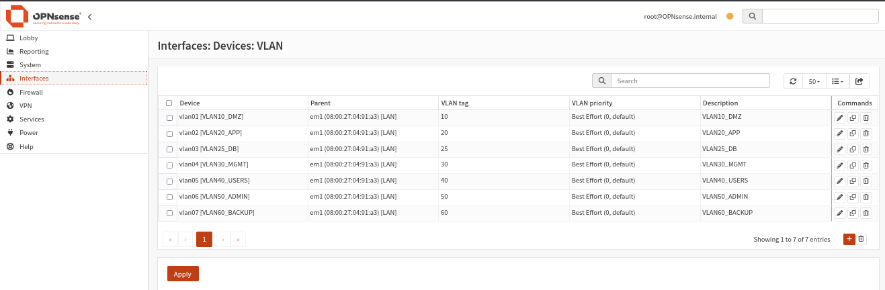
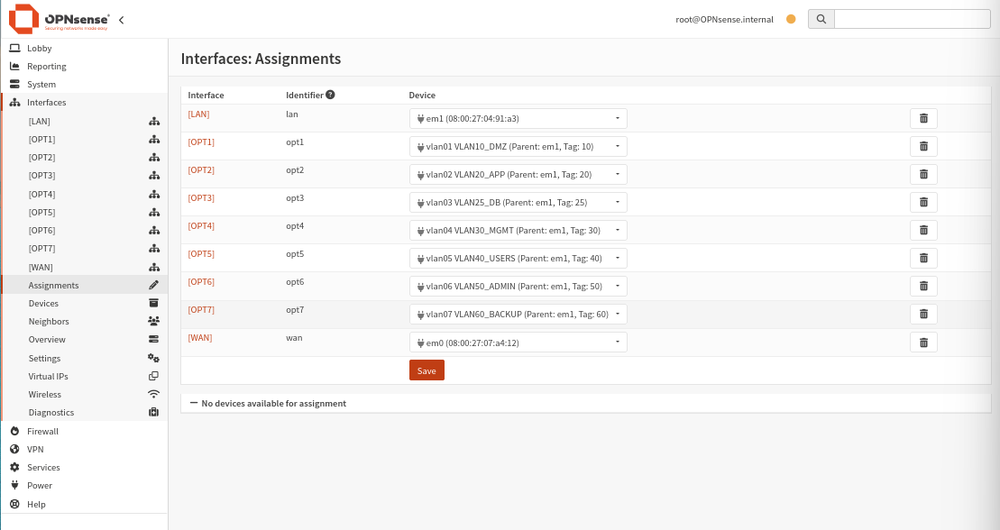
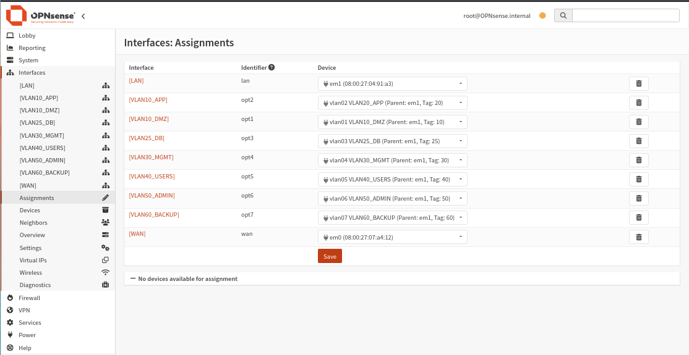
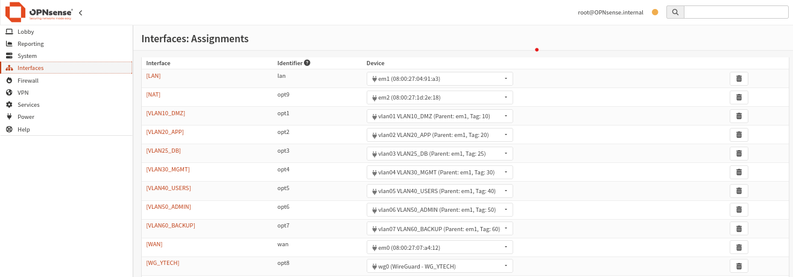

import Tabs from '@theme/Tabs';
import TabItem from '@theme/TabItem';

# 🌐 Interfaces & VLANs

## Plan de segmentation

La segmentation réseau est réalisée via des **VLANs 802.1Q** créés sur l'interface LAN (em1). Chaque VLAN correspond à une zone de sécurité avec des droits d'accès distincts.

| VLAN | Tag | Réseau | Passerelle | Rôle |
|------|-----|--------|------------|------|
| VLAN10_DMZ | 10 | 192.168.10.0/24 | 192.168.10.1 | Zone démilitarisée |
| VLAN20_APP | 20 | 192.168.20.0/24 | 192.168.20.1 | Serveurs applicatifs |
| VLAN25_DB | 25 | 192.168.25.0/24 | 192.168.25.1 | Base de données |
| VLAN30_MGMT | 30 | 192.168.30.0/24 | 192.168.30.1 | Gestion & monitoring |
| VLAN40_USERS | 40 | 192.168.40.0/24 | 192.168.40.1 | Utilisateurs |
| VLAN50_ADMIN | 50 | 192.168.50.0/24 | 192.168.50.1 | Administration |
| VLAN60_BACKUP | 60 | 192.168.60.0/24 | 192.168.60.1 | Sauvegardes |

## Étape 1 — Création des VLANs

**Chemin :** `Interfaces → Other Types → VLAN`



Les 7 VLANs sont créés sur l'interface parente **em1 (LAN)** avec les tags 802.1Q correspondants :

| Device | Parent | VLAN Tag | Description |
|--------|--------|----------|-------------|
| vlan01 [OPT1] | em1 [LAN] | 10 | VLAN10_DMZ |
| vlan02 [OPT2] | em1 [LAN] | 20 | VLAN20_APP |
| vlan03 [OPT3] | em1 [LAN] | 25 | VLAN25_DB |
| vlan04 [OPT4] | em1 [LAN] | 30 | VLAN30_MGMT |
| vlan05 [OPT5] | em1 [LAN] | 40 | VLAN40_USERS |
| vlan06 [OPT6] | em1 [LAN] | 50 | VLAN50_ADMIN |
| vlan07 [OPT7] | em1 [LAN] | 60 | VLAN60_BACKUP |

## Étape 2 — Assignation des interfaces

**Chemin :** `Interfaces → Assignments`

<Tabs>
  <TabItem value="avant" label="Avant renommage" default>



Les VLANs apparaissent initialement sous les noms génériques **OPT1 à OPT7**.

  </TabItem>
  <TabItem value="apres" label="Après renommage">



Après configuration de chaque interface, les noms sont personnalisés pour correspondre au rôle de chaque VLAN.

  </TabItem>
  <TabItem value="wg" label="Avec WireGuard">



L'interface WireGuard (OPT8 → WG_YTECH) apparaît après la configuration VPN.

  </TabItem>
</Tabs>

## Étape 3 — Configuration IP des interfaces VLAN

Pour chaque interface VLAN, la configuration suivante est appliquée :

**Chemin :** `Interfaces → [VLAN_NAME]`

```
☑ Enable Interface
Type         : Static IPv4
IPv4 Address : 192.168.XX.1 / 24
```

:::info Exemple pour VLAN20_APP
```
Interface    : VLAN20_APP (opt2)
Enable       : ✅
IPv4         : 192.168.20.1 / 24
Description  : VLAN20_APP
```
:::

## Vue finale des assignations

| Interface | Identifiant | Device assigné |
|-----------|-------------|----------------|
| [LAN] | lan | em1 (MAC: 08:00:27:04:91:a3) |
| [VLAN10_DMZ] | opt1 | vlan01 — Parent: em1, Tag: 10 |
| [VLAN20_APP] | opt2 | vlan02 — Parent: em1, Tag: 20 |
| [VLAN25_DB] | opt3 | vlan03 — Parent: em1, Tag: 25 |
| [VLAN30_MGMT] | opt4 | vlan04 — Parent: em1, Tag: 30 |
| [VLAN40_USERS] | opt5 | vlan05 — Parent: em1, Tag: 40 |
| [VLAN50_ADMIN] | opt6 | vlan06 — Parent: em1, Tag: 50 |
| [VLAN60_BACKUP] | opt7 | vlan07 — Parent: em1, Tag: 60 |
| [WAN] | wan | em0 (MAC: 08:00:27:07:a4:12) |

:::warning Règle importante
OPNsense **ne filtre que le trafic qui passe par lui**. Pour que la segmentation VLAN soit effective, les machines de chaque VLAN doivent avoir OPNsense comme passerelle par défaut (gateway).
:::
