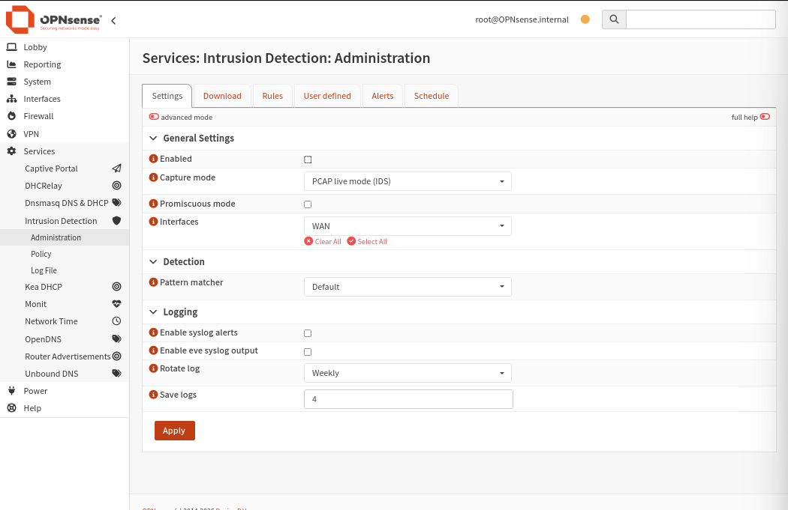
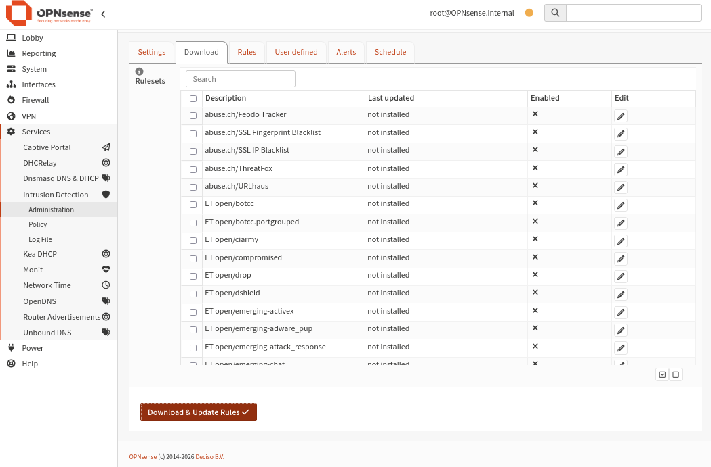
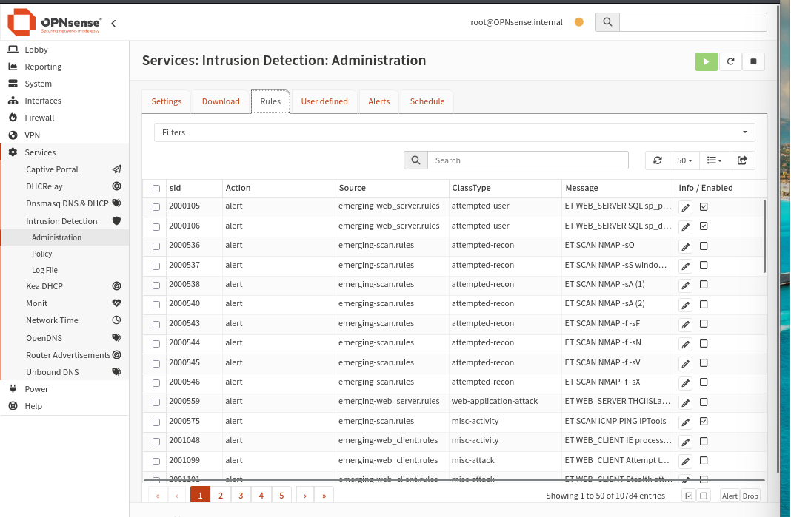
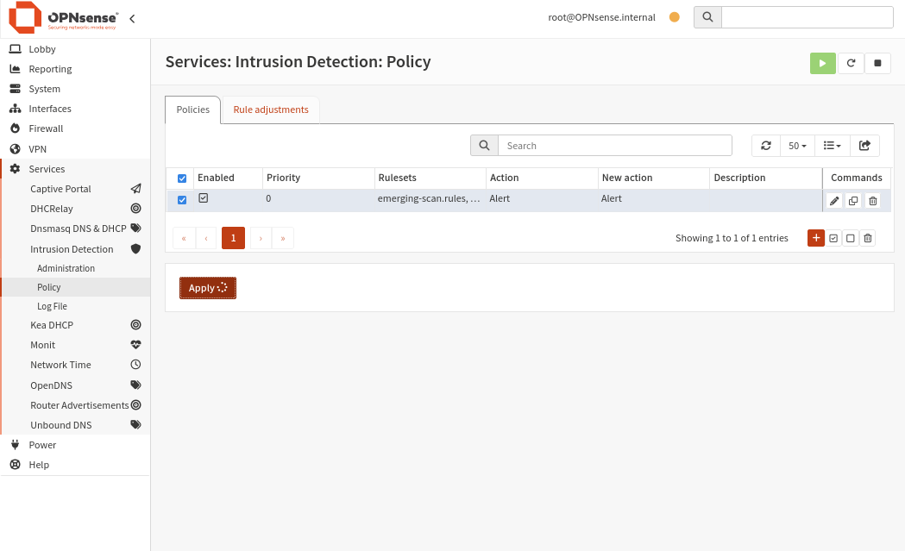
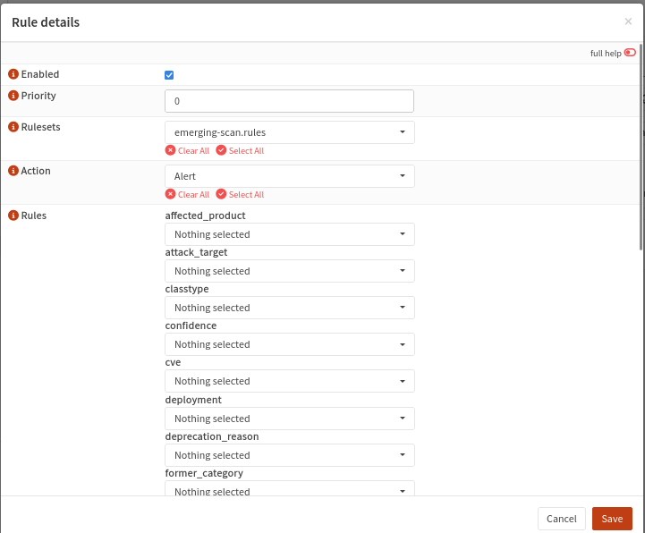
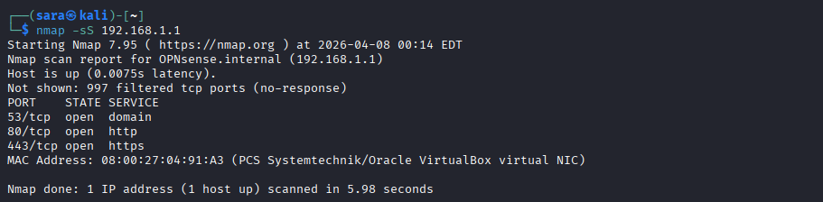
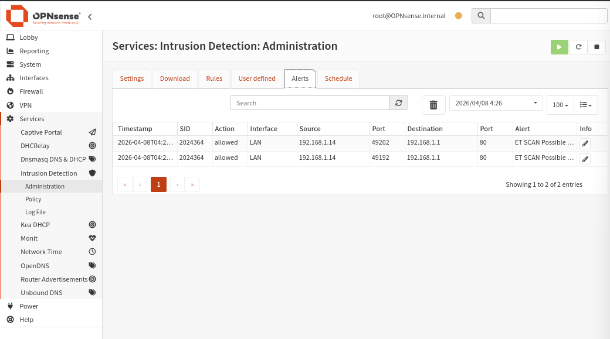
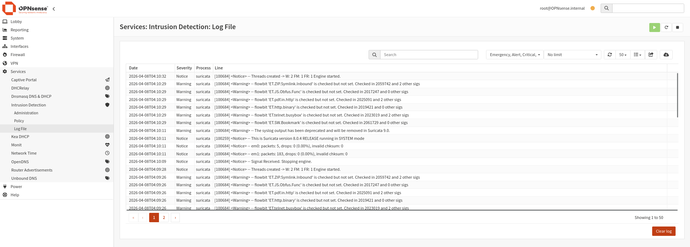

import Tabs from '@theme/Tabs';
import TabItem from '@theme/TabItem';

# 📡 Logs & Surveillance — Suricata IDS

## Présentation de Suricata

**Suricata** est le moteur de détection d'intrusions (IDS/IPS) intégré à OPNsense. Il analyse le trafic réseau en temps réel et génère des alertes lorsqu'il détecte des comportements suspects ou des signatures d'attaques connues.

**Chemin :** `Services → Intrusion Detection`

| Mode | Description | Impact réseau |
|------|-------------|---------------|
| **IDS** (Intrusion Detection) | Surveille et alerte uniquement | Aucun — trafic non bloqué |
| **IPS** (Intrusion Prevention) | Surveille et bloque | Actif — peut couper des flux |

:::info Choix du mode IDS
Le mode **IDS** a été retenu pour cette configuration afin d'éviter les faux positifs qui pourraient bloquer du trafic légitime. En production, une phase de tuning des règles précède le passage en IPS.
:::

## Configuration — Settings



**Chemin :** `Services → Intrusion Detection → Administration → Settings`

| Paramètre | Valeur | Description |
|-----------|--------|-------------|
| **Enabled** | ☐ (puis activé) | Activation du service |
| **Capture mode** | PCAP live mode (IDS) | Mode détection pure |
| **Interfaces** | WAN | Interface(s) surveillée(s) |
| **Promiscuous mode** | ☐ | Mode promiscuité désactivé |
| **Enable syslog alerts** | ☐ | Alertes vers syslog |
| **Rotate log** | Weekly | Rotation des logs |
| **Save logs** | 4 | Nombre de logs conservés |

## Téléchargement des rulesets

**Chemin :** `Services → Intrusion Detection → Administration → Download`



Les rulesets Emerging Threats sont téléchargés depuis Internet. Les principales catégories installées :

| Ruleset | Description |
|---------|-------------|
| `ET open/botcc` | Command & Control botnets |
| `ET open/compromised` | Hôtes compromis connus |
| `ET open/drop` | IPs à bloquer (DROP list) |
| `ET open/emerging-scan` | Détection de scans réseau |
| `ET open/emerging-attack_response` | Réponses d'attaques |
| `ET open/emerging-web_server` | Attaques serveurs web |
| `ET open/emerging-malware` | Signatures malware |

:::warning Prérequis réseau
Le téléchargement des règles nécessite un accès Internet depuis OPNsense. Dans cet environnement, une interface NAT a été ajoutée à la VM OPNsense spécifiquement pour cette raison.
:::

## Règles disponibles après téléchargement

**Chemin :** `Services → Intrusion Detection → Administration → Rules`



Après téléchargement, **10 784 règles** sont disponibles, dont notamment :

| SID | Source | ClassType | Message |
|-----|--------|-----------|---------|
| 2000105 | emerging-web_server | attempted-user | ET WEB_SERVER SQL injection |
| 2000536 | emerging-scan | attempted-recon | ET SCAN NMAP -sO |
| 2000537 | emerging-scan | attempted-recon | ET SCAN NMAP -sS |
| 2000575 | emerging-scan | misc-activity | ET SCAN ICMP PING IPTools |
| 2001048 | emerging-web_client | misc-activity | ET WEB_CLIENT IE process |

## Configuration de la Policy

**Chemin :** `Services → Intrusion Detection → Policy`



Une policy active les règles téléchargées avec l'action souhaitée :



| Paramètre | Valeur |
|-----------|--------|
| **Enabled** | ✅ |
| **Priority** | 0 |
| **Rulesets** | emerging-scan.rules, ... |
| **Action** | Alert |
| **New action** | Alert |

:::info Policy vs Rules
- **Rules** = base de données des règles téléchargées (catalogue)
- **Policy** = sélection et activation des règles selon l'action souhaitée (Alert / Drop)

Sans policy, les règles téléchargées ne sont **pas actives**.
:::

## Test de validation — Nmap Scan

Pour valider le fonctionnement de Suricata, un scan Nmap a été lancé depuis Kali Admin :



```bash
# Scan SYN depuis Kali Admin (192.168.1.14)
nmap -sS 192.168.1.1

# Résultats du scan
Host: 192.168.1.1 (OPNsense)
Ports ouverts:
  53/tcp   open  domain
  80/tcp   open  http
  443/tcp  open  https
```

## Alertes Suricata détectées

**Chemin :** `Services → Intrusion Detection → Alerts`



Les alertes générées par le scan Nmap :

| Timestamp | SID | Action | Interface | Source | Port Src | Destination | Port Dst | Alert |
|-----------|-----|--------|-----------|--------|----------|-------------|----------|-------|
| 2026-04-08T04:2... | 2024364 | allowed | LAN | 192.168.1.14 | 49202 | 192.168.1.1 | 80 | ET SCAN Possible... |
| 2026-04-08T04:2... | 2024364 | allowed | LAN | 192.168.1.14 | 49192 | 192.168.1.1 | 80 | ET SCAN Possible... |

:::success Validation réussie
Suricata a correctement détecté le scan réseau Nmap avec la signature **ET SCAN Possible** (SID 2024364). Le système IDS fonctionne comme attendu.
:::

## Log File Suricata

**Chemin :** `Services → Intrusion Detection → Log File`



Le log file affiche les événements système de Suricata :

| Severity | Message type | Description |
|----------|-------------|-------------|
| Notice | Engine started | Suricata version 8.0.4 démarré |
| Warning | Flowbit not set | Règles avec dépendances manquantes |
| Notice | Packets stats | Statistiques em0/em1 |

:::note Warnings flowbit
Les messages `flowbit 'XX' is checked but not set` sont normaux. Ils indiquent des règles qui dépendent d'autres règles non activées. Ce n'est pas une erreur critique.
:::

## Bilan de la surveillance

| Composant | État | Détail |
|-----------|------|--------|
| Suricata | ✅ Actif | Mode IDS, interface LAN/WAN |
| Rulesets | ✅ Téléchargés | Emerging Threats + scan rules |
| Policy | ✅ Active | emerging-scan.rules, action Alert |
| Alertes | ✅ Fonctionnel | Scan Nmap détecté |
| Logs | ✅ Actifs | Rotation hebdomadaire, 4 fichiers |
