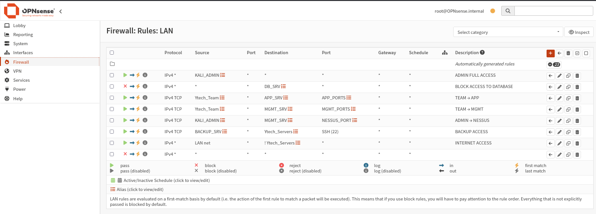
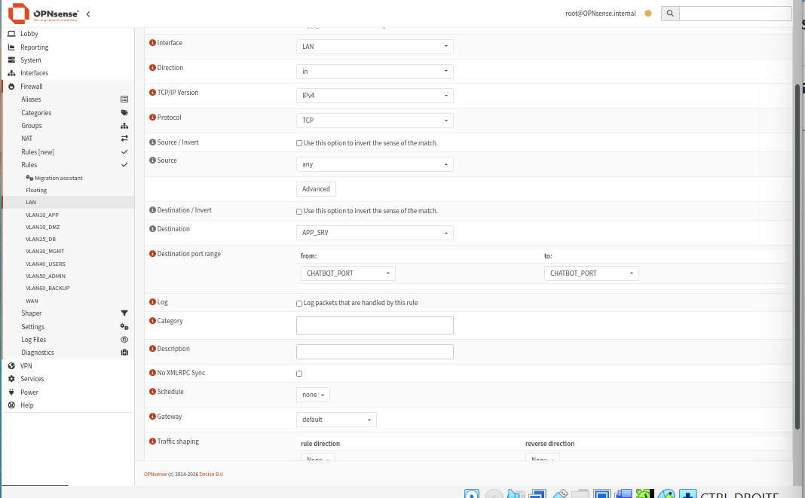

import Tabs from '@theme/Tabs';
import TabItem from '@theme/TabItem';

# 🛡️ Règles Firewall — Interface LAN

## Politique générale

Les règles firewall appliquent le **principe du moindre privilège** : seuls les flux explicitement autorisés sont permis. La dernière règle est toujours un **BLOCK ALL** implicite.

**Chemin :** `Firewall → Rules → LAN`

:::info Ordre d'évaluation
OPNsense évalue les règles dans l'ordre, du **haut vers le bas**. La première règle qui correspond au paquet est appliquée. L'ordre est donc critique.
:::

## Vue des règles LAN



## Détail des règles

### Règle 1 — ADMIN FULL ACCESS

```
Action      : ✅ Pass
Protocole   : IPv4 *
Source      : KALI_ADMIN (192.168.1.14)
Destination : any
Port        : any
Description : ADMIN FULL ACCESS
```

> L'administrateur Kali a accès total à tous les segments. C'est la règle la plus permissive, volontairement placée en premier pour garantir l'accès admin en toutes circonstances.

---

### Règle 2 — BLOCK ACCESS TO DATABASE

```
Action      : ❌ Block
Protocole   : IPv4 *
Source      : any
Destination : DB_SRV (192.168.10.2)
Port        : any
Description : BLOCK ACCESS TO DATABASE
```

> Protège le serveur de base de données. Tout accès direct à DB_SRV qui ne vient pas via APP_SRV est bloqué.

---

### Règle 3 — TEAM → APP

```
Action      : ✅ Pass
Protocole   : IPv4 TCP
Source      : Ytech_Team
Destination : APP_SRV (192.168.9.253)
Port        : APP_PORTS (8443, 8501, 11434)
Description : TEAM → APP
```

> Les membres de l'équipe peuvent accéder aux services applicatifs (HR App, Chatbot, Ollama).

---

### Règle 4 — TEAM → MGMT

```
Action      : ✅ Pass
Protocole   : IPv4 TCP
Source      : Ytech_Team
Destination : MGMT_SRV (192.168.10.5)
Port        : MGMT_PORTS (8444, 3000)
Description : TEAM → MGMT
```

> Les membres de l'équipe peuvent accéder aux outils de gestion (Bitwarden, Grafana).

---

### Règle 5 — ADMIN → NESSUS

```
Action      : ✅ Pass
Protocole   : IPv4 TCP
Source      : KALI_ADMIN
Destination : MGMT_SRV
Port        : NESSUS_PORT (8834)
Description : ADMIN → NESSUS
```

> Seul l'administrateur peut accéder à l'interface Nessus (scanner de vulnérabilités).

---

### Règle 6 — BACKUP ACCESS

```
Action      : ✅ Pass
Protocole   : IPv4 TCP
Source      : BACKUP_SRV
Destination : Ytech_Servers
Port        : 22 (SSH)
Description : BACKUP ACCESS
```

> Le serveur de backup peut se connecter en SSH aux autres serveurs pour effectuer les sauvegardes.

---

### Règle 7 — INTERNET ACCESS

```
Action      : ✅ Pass
Protocole   : IPv4 *
Source      : LAN net
Destination : ! Ytech_Servers (inversion)
Port        : any
Description : INTERNET ACCESS
```

> Permet l'accès Internet au LAN, tout en **bloquant** l'accès direct aux serveurs internes (grâce à l'inversion `!`).

---

### Règle 8 — BLOCK ALL (implicite)

```
Action      : ❌ Block
Protocole   : IPv4 *
Source      : *
Destination : *
Description : BLOCK ALL
```

> Tout ce qui n'est pas explicitement autorisé par les règles précédentes est bloqué.

## Exemple de configuration d'une règle



Les champs principaux lors de la création d'une règle :

| Champ | Description |
|-------|-------------|
| **Interface** | Sur quelle interface s'applique la règle |
| **Direction** | `in` (trafic entrant dans l'interface) |
| **Protocol** | TCP, UDP, ICMP, ou any |
| **Source** | IP source ou alias |
| **Destination** | IP destination ou alias |
| **Destination port range** | Port ou alias de port |
| **Description** | Libellé de la règle (obligatoire) |

## Tableau récapitulatif

| # | Action | Source | Destination | Port | Description |
|---|--------|--------|-------------|------|-------------|
| 1 | ✅ Pass | KALI_ADMIN | any | any | ADMIN FULL ACCESS |
| 2 | ❌ Block | any | DB_SRV | any | BLOCK DATABASE |
| 3 | ✅ Pass | Ytech_Team | APP_SRV | APP_PORTS | TEAM → APP |
| 4 | ✅ Pass | Ytech_Team | MGMT_SRV | MGMT_PORTS | TEAM → MGMT |
| 5 | ✅ Pass | KALI_ADMIN | MGMT_SRV | NESSUS_PORT | ADMIN → NESSUS |
| 6 | ✅ Pass | BACKUP_SRV | Ytech_Servers | 22 | BACKUP ACCESS |
| 7 | ✅ Pass | LAN net | !Ytech_Servers | any | INTERNET ACCESS |
| 8 | ❌ Block | * | * | * | BLOCK ALL |
