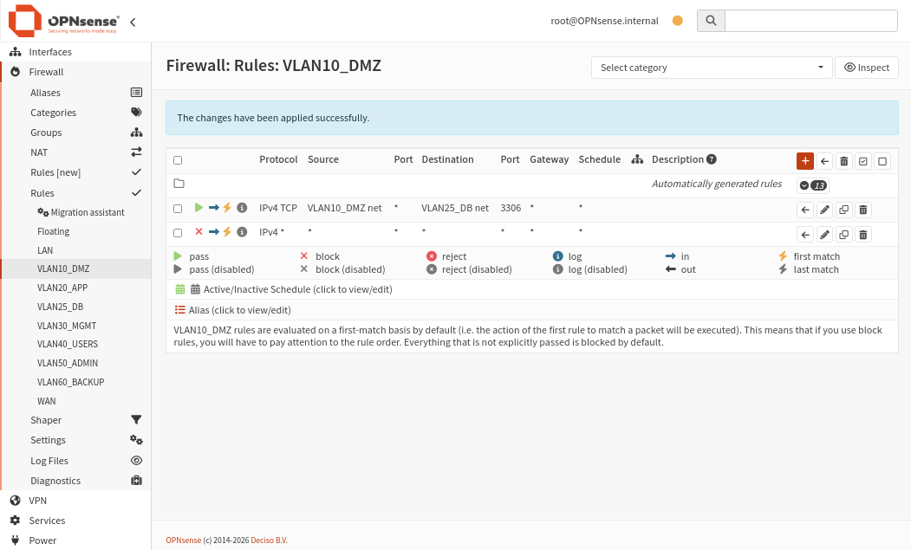
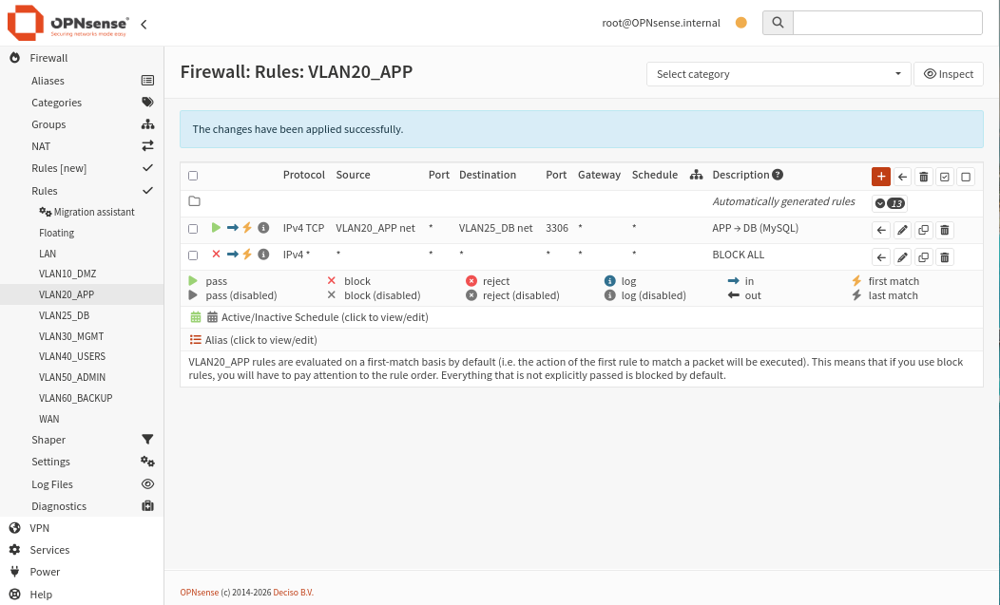
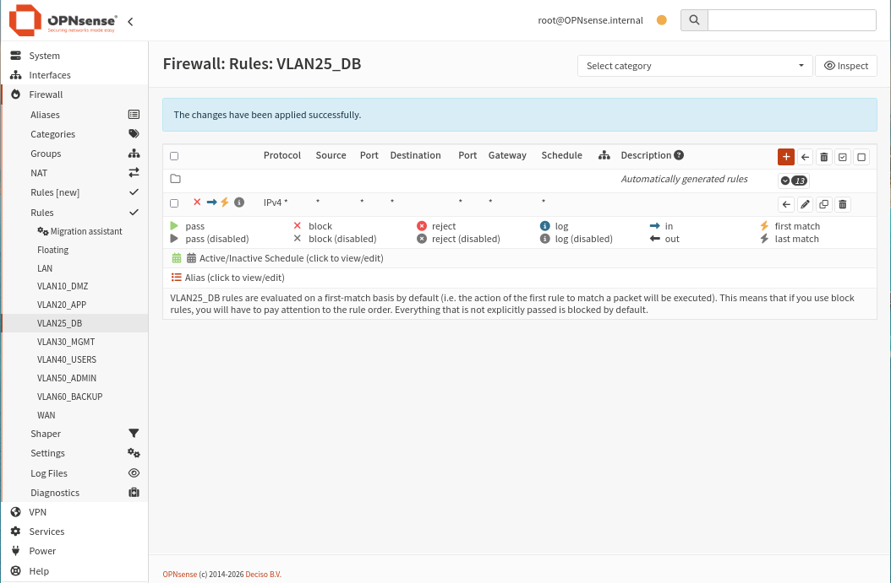
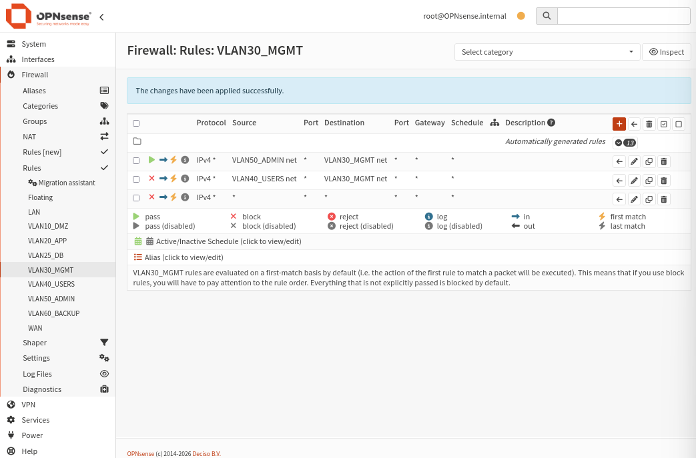
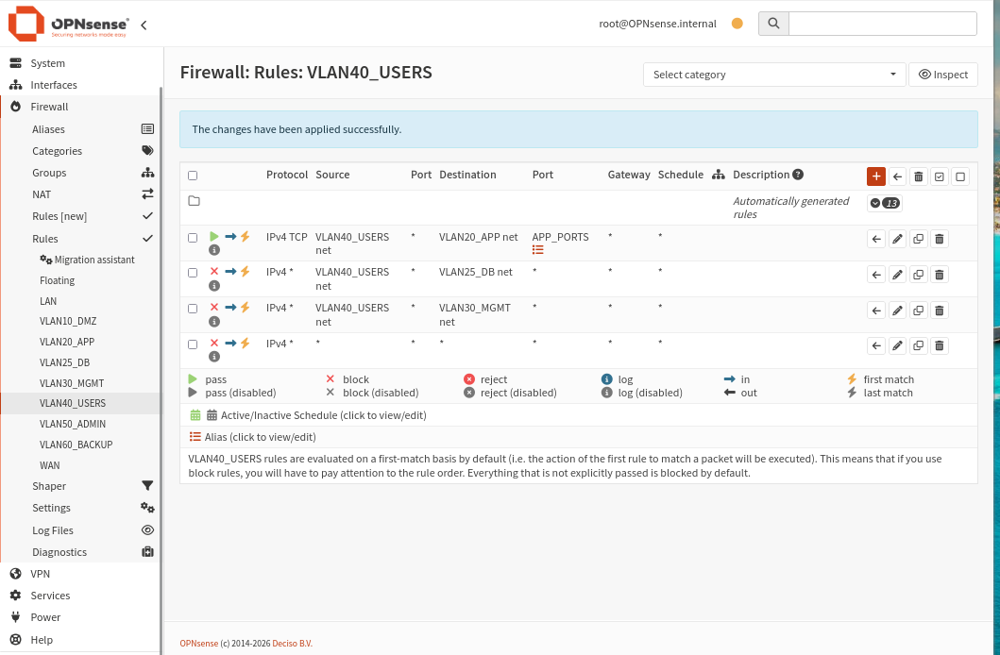
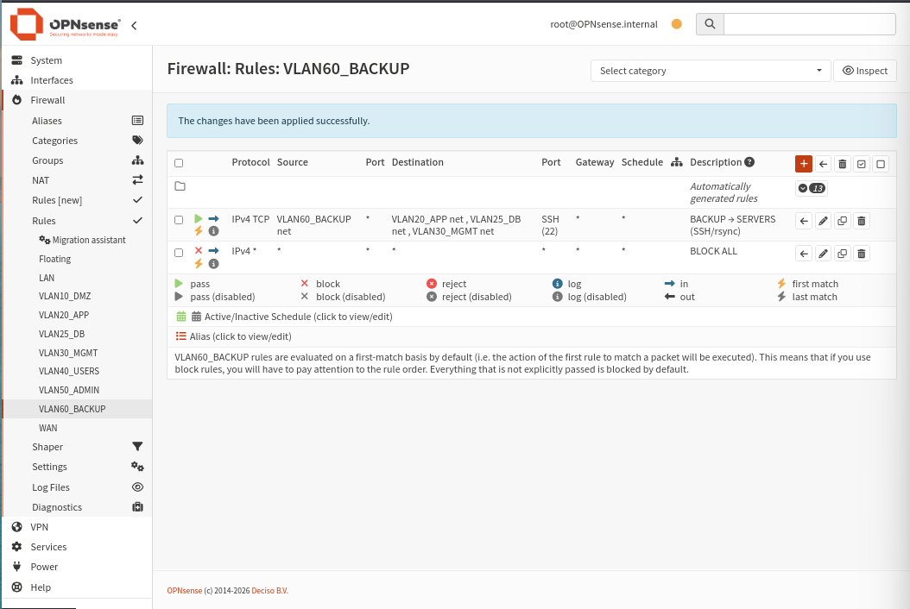
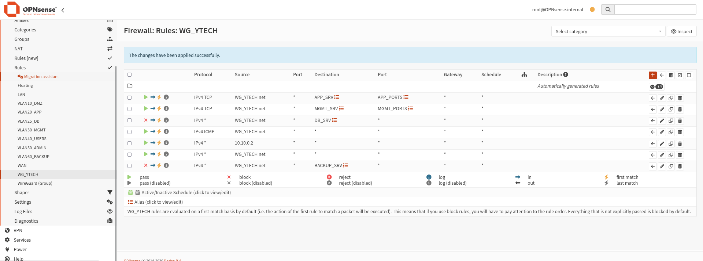

import Tabs from '@theme/Tabs';
import TabItem from '@theme/TabItem';

# 🔀 Règles inter-VLAN

## Principe de segmentation

Les règles inter-VLAN définissent quels flux sont autorisés entre les différentes zones de sécurité. Par défaut, **aucune communication inter-VLAN n'est autorisée** — tout doit être explicitement permis.

**Chemin :** `Firewall → Rules → [VLAN_NAME]`

:::tip Architecture Zero Trust
Ces règles implémentent une logique **Zero Trust** : chaque VLAN est isolé, et les communications inter-zones sont accordées selon le principe du moindre privilège.
:::

## Matrice des flux autorisés

| Source → Destination | DB (3306) | APP | MGMT | SSH | Internet |
|----------------------|-----------|-----|------|-----|----------|
| **DMZ → DB** | ✅ | ❌ | ❌ | ❌ | ❌ |
| **APP → DB** | ✅ | — | ❌ | ❌ | ❌ |
| **ADMIN → MGMT** | ❌ | ❌ | ✅ | ❌ | ❌ |
| **USERS → APP** | ❌ | ✅ | ❌ | ❌ | ❌ |
| **USERS → DB** | ❌ | — | ❌ | ❌ | — |
| **USERS → MGMT** | ❌ | — | ❌ | ❌ | — |
| **BACKUP → Serveurs** | ❌ | SSH | SSH | ✅ | ❌ |
| **DB** | — | ❌ | ❌ | ❌ | ❌ |

## VLAN10_DMZ — Zone Démilitarisée



La DMZ héberge les services exposés. Elle peut accéder à la base de données mais tout autre trafic est bloqué.

| # | Action | Source | Destination | Port | Description |
|---|--------|--------|-------------|------|-------------|
| 1 | ✅ Pass | VLAN10_DMZ net | VLAN25_DB net | 3306 (MySQL) | WEB → DB |
| 2 | ❌ Block | * | * | * | BLOCK ALL |

```
Logique : La DMZ accède uniquement à la DB sur le port MySQL.
Tout autre flux depuis la DMZ est bloqué.
```

---

## VLAN20_APP — Serveurs Applicatifs



Les serveurs applicatifs (Laravel, CRUD RH, Chatbot) peuvent communiquer avec la base de données.

| # | Action | Source | Destination | Port | Description |
|---|--------|--------|-------------|------|-------------|
| 1 | ✅ Pass | VLAN20_APP net | VLAN25_DB net | 3306 (MySQL) | APP → DB (MySQL) |
| 2 | ❌ Block | * | * | * | BLOCK ALL |

```
Logique : Seul le flux APP vers DB sur MySQL est autorisé.
Les serveurs APP ne peuvent pas accéder à d'autres VLANs.
```

---

## VLAN25_DB — Base de Données



Le VLAN base de données est le segment le plus restrictif. **Aucun trafic initié depuis la DB n'est autorisé.**

| # | Action | Source | Destination | Port | Description |
|---|--------|--------|-------------|------|-------------|
| 1 | ❌ Block | * | * | * | BLOCK ALL |

```
Logique : La DB ne peut initier aucune connexion vers l'extérieur.
Elle répond uniquement aux connexions entrantes autorisées depuis APP et DMZ.
```

:::danger Zone maximalement protégée
Le VLAN DB est le plus sensible de l'infrastructure. Son isolation totale en sortie est une mesure de sécurité critique contre les exfiltrations de données.
:::

---

## VLAN30_MGMT — Gestion & Monitoring



Le VLAN de management autorise uniquement les administrateurs. Les utilisateurs normaux sont explicitement bloqués.

| # | Action | Source | Destination | Port | Description |
|---|--------|--------|-------------|------|-------------|
| 1 | ✅ Pass | VLAN50_ADMIN net | VLAN30_MGMT net | any | ADMIN → MGMT |
| 2 | ❌ Block | VLAN40_USERS net | VLAN30_MGMT net | any | BLOCK USERS → MGMT |
| 3 | ❌ Block | * | * | * | BLOCK ALL |

```
Logique : Seuls les admins (VLAN50) peuvent accéder aux outils de monitoring.
Les utilisateurs (VLAN40) sont explicitement bloqués.
```

---

## VLAN40_USERS — Utilisateurs



Les utilisateurs ont un accès limité aux applications. L'accès à la DB et au MGMT est interdit.

| # | Action | Source | Destination | Port | Description |
|---|--------|--------|-------------|------|-------------|
| 1 | ✅ Pass | VLAN40_USERS net | VLAN20_APP net | APP_PORTS | USERS → APP |
| 2 | ❌ Block | VLAN40_USERS net | VLAN25_DB net | * | BLOCK USERS → DB |
| 3 | ❌ Block | VLAN40_USERS net | VLAN30_MGMT net | * | BLOCK USERS → MGMT |
| 4 | ❌ Block | * | * | * | BLOCK ALL |

```
Logique : Les utilisateurs peuvent utiliser les applications (HR App, Chatbot).
L'accès direct à la DB et aux outils d'administration est interdit.
```

---

## VLAN50_ADMIN — Administration

Le VLAN Admin bénéficie d'un accès complet à toute l'infrastructure. Les règles de ce VLAN permettent à l'équipe d'administration d'intervenir sur tous les segments.

| # | Action | Source | Destination | Port | Description |
|---|--------|--------|-------------|------|-------------|
| 1 | ✅ Pass | VLAN50_ADMIN net | any | any | ADMIN FULL ACCESS |

---

## VLAN60_BACKUP — Sauvegardes



Le serveur de backup peut se connecter en SSH aux serveurs applicatifs, DB et MGMT pour effectuer les sauvegardes.

| # | Action | Source | Destination | Port | Description |
|---|--------|--------|-------------|------|-------------|
| 1 | ✅ Pass | VLAN60_BACKUP net | VLAN20_APP net, VLAN25_DB net, VLAN30_MGMT net | 22 (SSH) | BACKUP → SERVERS |
| 2 | ❌ Block | * | * | * | BLOCK ALL |

```
Logique : Le serveur de backup accède uniquement en SSH aux serveurs ciblés.
Aucun autre trafic depuis le VLAN BACKUP n'est autorisé.
```

## VPN WireGuard — Règles d'accès distant

**Chemin :** `Firewall → Rules → WG_YTECH`



Les utilisateurs connectés via VPN ont un accès contrôlé aux services internes :

| # | Action | Source | Destination | Port | Description |
|---|--------|--------|-------------|------|-------------|
| 1 | ✅ Pass | WG_YTECH net | APP_SRV | APP_PORTS | VPN → APP |
| 2 | ✅ Pass | WG_YTECH net | MGMT_SRV | MGMT_PORTS | VPN → MGMT |
| 3 | ❌ Block | WG_YTECH net | DB_SRV | * | BLOCK VPN → DB |
| 4 | ✅ Pass | WG_YTECH net | * | ICMP | ICMP (tests) |
| 5 | ✅ Pass | 10.10.0.2 | * | any | Admin VPN full access |
| 6 | ✅ Pass | WG_YTECH net | * | * | Internet via VPN |
| 7 | ❌ Block | WG_YTECH net | BACKUP_SRV | * | BLOCK VPN → BACKUP |

:::note Accès VPN
Les utilisateurs VPN accèdent aux applications et aux outils de monitoring, mais **jamais directement** à la base de données.
:::
