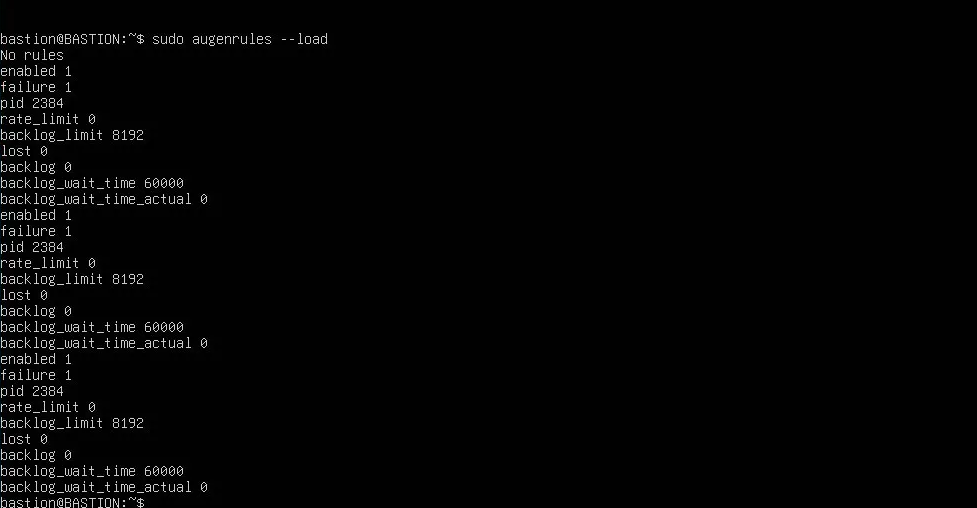
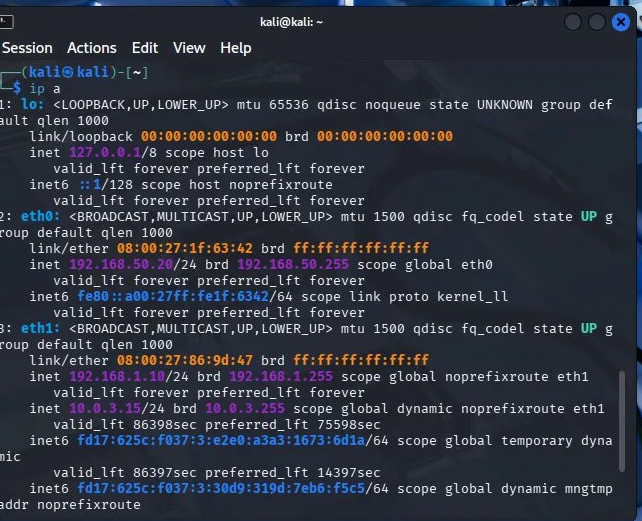
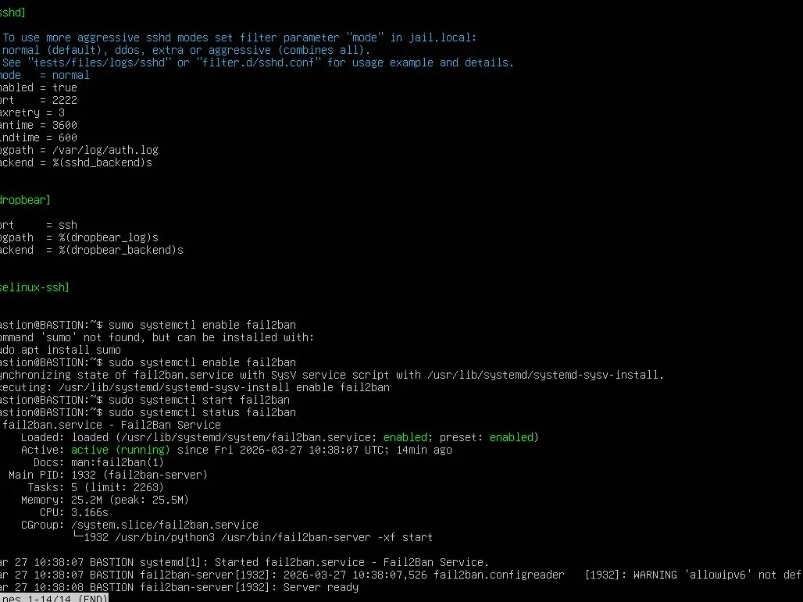
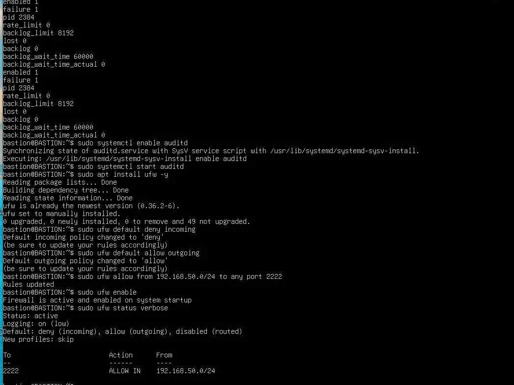

import Tabs from '@theme/Tabs';
import TabItem from '@theme/TabItem';

# 🏰 Bastion SSH — Jump Host

## Rôle du bastion

Le **bastion SSH** est une VM Ubuntu dédiée qui joue le rôle de **point d'entrée unique** pour tous les accès SSH à l'infrastructure. Aucun serveur n'est accessible en SSH directement — tout passe obligatoirement par le bastion.

Ce pattern s'appelle **Jump Host** : l'administrateur se connecte d'abord au bastion, puis rebondit via `ProxyJump` vers le serveur cible.

```
Kali Admin (192.168.50.20 — VLAN50_ADMIN)
      │
      │ SSH port 2222 (port non standard)
      │ autorisé uniquement depuis 192.168.50.0/24
      ▼
┌──────────────────────────────────┐
│          BASTION                 │
│  VM Ubuntu — hostname: BASTION   │
│  IP : 192.168.1.20               │
│  SSH : port 2222                 │
│  UFW  ✅ │ Fail2ban ✅ │ auditd ✅│
└────────────┬─────────────────────┘
             │  SSH ProxyJump (-J)
             │
             ├──▶  APP_SRV   192.168.9.253
             ├──▶  DB_SRV    192.168.10.2
             ├──▶  MGMT_SRV  192.168.10.5
             └──▶  BACKUP    192.168.60.x
```

## Caractéristiques techniques

| Attribut | Valeur |
|----------|--------|
| **Machine** | VM Ubuntu (VirtualBox) |
| **Hostname** | BASTION |
| **IP** | 192.168.1.20 |
| **Réseau** | LAN (192.168.1.0/24) |
| **Port SSH** | **2222** (port non standard) |
| **Accès entrant** | Uniquement depuis VLAN50_ADMIN (192.168.50.0/24) |
| **Firewall local** | UFW |
| **Anti-brute force** | Fail2ban |
| **Audit système** | auditd |

---

## 1 — SSH sur port 2222

Le port SSH est changé de 22 à **2222** pour réduire l'exposition aux scans automatisés et bots qui ciblent le port 22 standard.

```bash
# /etc/ssh/sshd_config
Port 2222
PasswordAuthentication no      # clés SSH uniquement
PermitRootLogin no             # pas de connexion root directe
```

### Validation du service


```bash
sudo systemctl restart ssh
sudo systemctl status ssh
```

```
● ssh.service - OpenBSD Secure Shell server
  Active: active (running) since Fri 2026-03-27 10:36:39 UTC
  Main PID: 1718 (sshd)
  Server listening on 0.0.0.0 port 2222.
  Server listening on :: port 2222.
```

:::success Port 2222 actif
Le service SSH écoute bien sur le **port 2222** sur toutes les interfaces IPv4 et IPv6.
:::

---

## 2 — UFW — Firewall local

UFW (**Uncomplicated Firewall**) est configuré pour restreindre les connexions entrantes uniquement au VLAN50_ADMIN.



### Commandes appliquées

```bash
# Politique par défaut : tout bloquer en entrée
sudo ufw default deny incoming
sudo ufw default allow outgoing

# Autoriser SSH port 2222 uniquement depuis VLAN50_ADMIN
sudo ufw allow from 192.168.50.0/24 to any port 2222

# Activation du firewall
sudo ufw enable
```

### Statut final

```bash
sudo ufw status verbose
```

```
Status: active
Logging: on (low)
Default: deny (incoming), allow (outgoing), disabled (routed)
New profiles: skip

To           Action     From
--           ------     ----
2222         ALLOW IN   192.168.50.0/24
```

:::info Restriction réseau stricte
Le port 2222 est ouvert **uniquement** depuis `192.168.50.0/24` (VLAN50_ADMIN). Toute tentative de connexion SSH depuis le LAN, les autres VLANs, ou Internet est rejetée par UFW.
:::

### Confirmation — Kali Admin sur VLAN50



La machine Kali Admin est sur `192.168.50.20/24` (VLAN50_ADMIN), ce qui lui donne accès au bastion port 2222 :

```
eth0: 192.168.50.20/24   ← VLAN50_ADMIN  ✅ accès bastion autorisé
eth1: 192.168.1.10/24    ← LAN
      10.0.3.15/24        ← NAT / Internet
```

---

## 3 — Fail2ban — Anti-brute force

**Fail2ban** analyse les logs SSH en temps réel et bannit automatiquement les IPs qui dépassent le seuil d'échecs d'authentification.

### Installation et activation

```bash
sudo apt install fail2ban -y
sudo systemctl enable fail2ban
sudo systemctl start fail2ban
```

```
● fail2ban.service - Fail2Ban Service
  Active: active (running) since Fri 2026-03-27 10:38:07 UTC; 14min ago
  Main PID: 1932 (fail2ban-server)
  Server ready.
```

### Configuration `/etc/fail2ban/jail.local`



```ini
[sshd]
enabled  = true
port     = 2222
maxretry = 3
bantime  = 3600
findtime = 600
logpath  = /var/log/auth.log
backend  = %(sshd_backend)s
```

| Paramètre | Valeur | Signification |
|-----------|--------|---------------|
| `enabled` | `true` | Jail active |
| `port` | `2222` | Surveille le port SSH personnalisé |
| `maxretry` | `3` | 3 tentatives échouées maximum |
| `bantime` | `3600` | Bannissement pendant **1 heure** |
| `findtime` | `600` | Fenêtre de détection : **10 minutes** |
| `logpath` | `/var/log/auth.log` | Source des logs analysés |

:::warning Efficacité anti-brute force
3 essais échoués en 10 minutes → bannissement automatique de 1 heure. Une attaque par dictionnaire classique est stoppée net dès la 3ème tentative.
:::

### Commandes utiles

```bash
# Statut et IPs bannies
sudo fail2ban-client status sshd

# Débannir manuellement une IP
sudo fail2ban-client set sshd unbanip <IP>

# Voir les logs fail2ban
sudo tail -f /var/log/fail2ban.log
```

---

## 4 — auditd — Audit système

**auditd** est le daemon d'audit Linux qui enregistre en continu les événements système critiques sur le bastion.

### Installation et activation

```bash
sudo apt install auditd -y
sudo systemctl enable auditd
sudo systemctl start auditd
```

### Chargement des règles



```bash
sudo augenrules --load
```

```
enabled  1
failure  1
pid      2384
backlog_limit    8192
lost             0
backlog          0
backlog_wait_time 60000
```

### Consultation des événements audités

```bash
# Toutes les authentifications SSH aujourd'hui
sudo ausearch -m USER_AUTH -ts today

# Escalades sudo
sudo ausearch -m USER_CMD -ts today

# Modifications de fichiers sensibles
sudo ausearch -f /etc/ssh/sshd_config -ts today
sudo ausearch -f /etc/fail2ban/jail.local -ts today
```

:::info auditd vs auth.log
`auth.log` enregistre les connexions SSH. `auditd` va plus loin : il trace les commandes `sudo`, les modifications de fichiers de configuration, les changements de comptes — essentiel pour une investigation forensique complète.
:::

---

## 5 — Utilisation du bastion — ProxyJump

La fonctionnalité **ProxyJump** (`-J`) permet de rebondir via le bastion de manière transparente.

<Tabs>
  <TabItem value="commande" label="Commande directe" default>

```bash
# Syntaxe générale — port 2222 obligatoire
ssh -J admin@192.168.1.20:2222 admin@<serveur-cible>

# Exemples
ssh -J admin@192.168.1.20:2222 admin@192.168.9.253   # APP_SRV
ssh -J admin@192.168.1.20:2222 admin@192.168.10.2    # DB_SRV
ssh -J admin@192.168.1.20:2222 admin@192.168.10.5    # MGMT_SRV
```

  </TabItem>
  <TabItem value="config" label="~/.ssh/config">

Configurer une fois, utiliser partout :

```ini
# Bastion — port 2222
Host bastion
    HostName     192.168.1.20
    User         admin
    Port         2222
    IdentityFile ~/.ssh/id_ed25519

# Serveurs — via bastion automatiquement
Host app-srv
    HostName     192.168.9.253
    User         admin
    ProxyJump    bastion
    IdentityFile ~/.ssh/id_ed25519

Host db-srv
    HostName     192.168.10.2
    User         admin
    ProxyJump    bastion
    IdentityFile ~/.ssh/id_ed25519

Host mgmt-srv
    HostName     192.168.10.5
    User         admin
    ProxyJump    bastion
    IdentityFile ~/.ssh/id_ed25519
```

```bash
# Connexion simplifiée
ssh app-srv    # rebond automatique via bastion:2222
ssh db-srv
ssh mgmt-srv
```

  </TabItem>
  <TabItem value="vpn" label="Via VPN WireGuard">

Depuis un peer VPN (sara — 10.10.0.2) après connexion WireGuard :

```bash
ssh -J admin@192.168.1.20:2222 admin@192.168.9.253
```

Flux complet :
```
Client VPN (10.10.0.2)
  → WireGuard chiffré → OPNsense (10.10.0.1 → 192.168.1.1)
  → LAN → Bastion (192.168.1.20 : port 2222)
  → UFW vérifie : source est-elle dans 192.168.50.0/24 ?
    (le trafic VPN est routé via LAN, selon les règles WG_YTECH)
  → ProxyJump SSH → Serveur cible
```

  </TabItem>
</Tabs>

---

## Synthèse du hardening appliqué

| Couche | Outil | Configuration | Objectif |
|--------|-------|---------------|----------|
| **Port SSH** | sshd_config | Port 2222 | Éviter les scans sur port 22 |
| **Firewall local** | UFW | ALLOW 2222 from 192.168.50.0/24 | Restriction réseau stricte |
| **Anti-brute force** | Fail2ban | 3 essais / 10min → ban 1h | Bloquer les attaques par dictionnaire |
| **Audit système** | auditd | augenrules --load | Traçabilité forensique |
| **Auth** | SSH keys | PasswordAuthentication no | Pas de mot de passe SSH |

:::tip Défense en profondeur sur le bastion
**4 couches de protection indépendantes :** OPNsense firewall (en amont) → UFW local (restriction VLAN) → Fail2ban (anti-brute force) → auditd (audit forensique). Un attaquant devrait contourner chacune de ces couches séquentiellement.
:::
