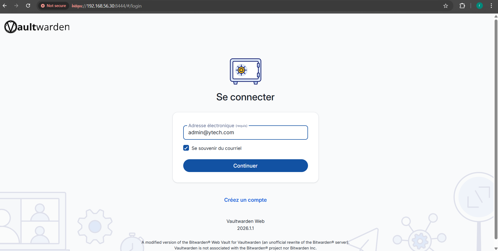
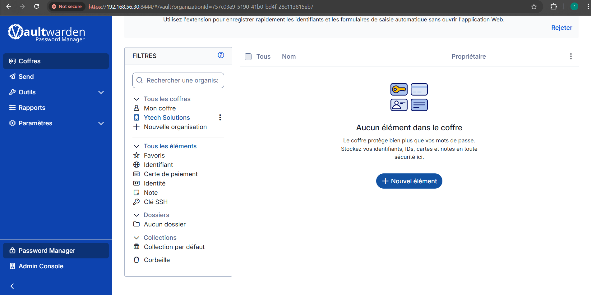
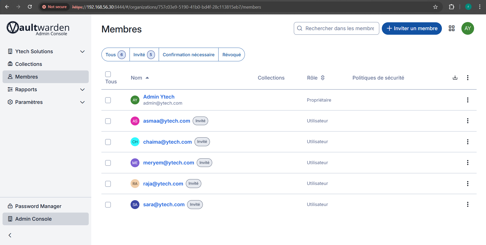

# Bitwarden — Gestion centralisée des credentials

## Pourquoi un gestionnaire de mots de passe d'entreprise ?

Le mot de passe est la première ligne de défense de n'importe quel système. Et pourtant, c'est souvent la plus faible. Voici la réalité dans la plupart des entreprises sans gestionnaire centralisé :

- Les mots de passe sont **réutilisés** entre plusieurs services
- Ils sont **stockés dans des fichiers texte**, des Post-it ou des tableurs Excel
- Ils sont **trop simples** pour être retenus facilement
- Quand un employé part, **personne ne sait quels accès révoquer**

Pour Ytech Solutions qui gère des accès SSH, des bases de données, des APIs et des interfaces web sensibles, ce comportement est **inacceptable**. Bitwarden résout ce problème en centralisant, chiffrant et organisant tous les credentials de l'équipe.

> 💶 **Dimension financière** : Une compromission de credentials est la cause n°1 des violations de données, représentant **61% des incidents** (Verizon DBIR 2023). Le coût moyen d'un tel incident est de **4,5 millions de dollars**. Bitwarden (Vaultwarden) est déployé ici pour **0 €** en licence — c'est l'investissement sécurité avec le meilleur rapport coût/protection qui existe.

---

## Pourquoi Vaultwarden plutôt que Bitwarden officiel ?

**Vaultwarden** est une implémentation open source du serveur Bitwarden, compatible avec tous les clients officiels Bitwarden (web, desktop, mobile, extensions navigateur).

| Critère | Bitwarden Cloud | Vaultwarden (self-hosted) |
|---|---|---|
| Coût | 3$/user/mois (Teams) | **0 €** |
| Données | Hébergées chez Bitwarden Inc. | **100% sur nos serveurs** |
| RGPD | Dépend des CGU | **Contrôle total** |
| Fonctionnalités | Complètes | Complètes (API compatible) |
| Maintenance | Automatique | Manuelle (Docker) |

Pour un projet académique et pour une entreprise soucieuse de sa confidentialité, **Vaultwarden auto-hébergé** est le choix évident : coût nul, données sous contrôle total, conformité RGPD garantie.

---

## Déploiement

Bitwarden (Vaultwarden) est déployé sur la **VM3 (Monitoring Server)** dans le VLAN 30, derrière le proxy Nginx.

| Attribut | Valeur |
|---|---|
| **IP** | `192.168.56.30` / `192.168.10.5` |
| **Port interne** | `8081` (HTTP) |
| **Port exposé** | `8444` (HTTPS via Nginx) |
| **URL** | `https://192.168.56.30:8444` |
| **Image Docker** | `vaultwarden/server:latest` |

:::warning Accès restreint
Bitwarden n'est **jamais exposé sur Internet**. Il est accessible uniquement depuis le réseau interne VLAN 30 et via tunnel Tailscale pour les administrateurs en déplacement. OPNSense bloque tout accès WAN vers le port 8444.
:::

:::info Docker Compose
La configuration Docker Compose complète est documentée dans la section [DevOps — Docker Compose](/devops/docker-compose).
:::

---

## Interface et fonctionnalités


*Interface Utilisateur Vaultwarden*


*Dashboard Bitwarden (Vaultwarden) — coffre centralisé de l'équipe Ytech*

### Organisation des credentials

Les credentials sont organisés en **collections** par catégorie d'accès :

| Collection | Contenu | Accès |
|---|---|---|
| **Serveurs SSH** | Clés et mots de passe SSH VM1, VM2, VM3 | Admins IT uniquement |
| **Bases de données** | Credentials MariaDB (root + users applicatifs) | Admins IT uniquement |
| **Interfaces web** | Zabbix, Grafana, Nessus, Headscale UI | Équipe selon rôle |
| **Services cloud** | Google Drive rclone, GitHub tokens | Admins IT uniquement |
| **Certificats** | Clés SSL, backup.key | Admins IT uniquement |

---

## Sécurité de Bitwarden

### Chiffrement des données

Vaultwarden chiffre toutes les données **côté client** avant de les envoyer au serveur :

```
Données brutes
      ↓
Chiffrement AES-256-CBC (clé dérivée du master password)
      ↓
Données chiffrées stockées sur le serveur
      ↓
Déchiffrement uniquement côté client (jamais sur le serveur)
```

> Même si un attaquant accède directement à la base de données de Vaultwarden, les données sont **illisibles sans le master password** du compte concerné.

### Master password

Le master password de chaque compte suit une politique stricte :
- Minimum **16 caractères**
- Combinaison majuscules, minuscules, chiffres, symboles
- **Jamais stocké** sur le serveur (dérivé en clé de chiffrement localement)
- **Non récupérable** en cas d'oubli — renforcement de la responsabilité individuelle

### Accès réseau

```bash
# OPNSense — Bitwarden accessible uniquement depuis réseau interne
Pass : VLAN 30 → Bitwarden:8444    ✅
Pass : VLAN 50 → Bitwarden:8444    ✅ (admins)
Block : WAN → Bitwarden:8444       ✗ BLOQUÉ
Block : VLAN 40 → Bitwarden:8444   ✗ BLOQUÉ (employés standards)
```

---

## Intégration dans le workflow de l'équipe

### Pour les administrateurs IT

Chaque accès à un serveur ou service passe par Bitwarden :

```
1. Ouvrir l'extension Bitwarden dans le navigateur
2. Récupérer le credential de la collection appropriée
3. Se connecter au service
4. Jamais copier un mot de passe dans un fichier texte
```

### Pour les développeurs

Les tokens GitHub, clés API et credentials de développement sont stockés dans Bitwarden et partagés via les collections — plus de secrets hardcodés dans le code.

### Rotation des mots de passe

Bitwarden facilite la **rotation régulière** des credentials :
- Génération d'un nouveau mot de passe fort en un clic
- Mise à jour dans Bitwarden
- Tous les membres de la collection voient automatiquement le nouveau credential

---

*Membres de Ytechs Solutions- Acces Vaultwarden*
## Argumentation du choix

### Pourquoi pas KeePass ou LastPass ?

| Critère | Vaultwarden | KeePass | LastPass |
|---|---|---|---|
| Multi-utilisateurs | ✅ Natif (collections) | ⚠️ Fichier partagé | ✅ |
| Self-hosted | ✅ | ✅ (fichier local) | ✗ Cloud uniquement |
| Interface web | ✅ | ✗ | ✅ |
| Extension navigateur | ✅ Officielle Bitwarden | ⚠️ Plugins tiers | ✅ |
| API pour intégration | ✅ | ✗ | ✅ |
| Coût | **0 €** | Gratuit | 3-4$/user/mois |
| Incidents sécurité | Aucun connu | Aucun | 🔴 Hack 2022 (données volées) |

LastPass a subi une **violation majeure en 2022** où des coffres chiffrés ont été volés. C'est précisément pour éviter ce risque que Vaultwarden auto-hébergé a été choisi — nos données ne quittent jamais notre infrastructure.

> 💶 **Valeur ajoutée** : En cas d'audit de sécurité ou de certification ISO 27001, la présence d'un gestionnaire de mots de passe centralisé et auto-hébergé est un **point fort systématiquement valorisé**. C'est l'un des contrôles les plus simples à mettre en place et les plus efficaces pour réduire le risque de compromission par credentials faibles ou réutilisés.

---