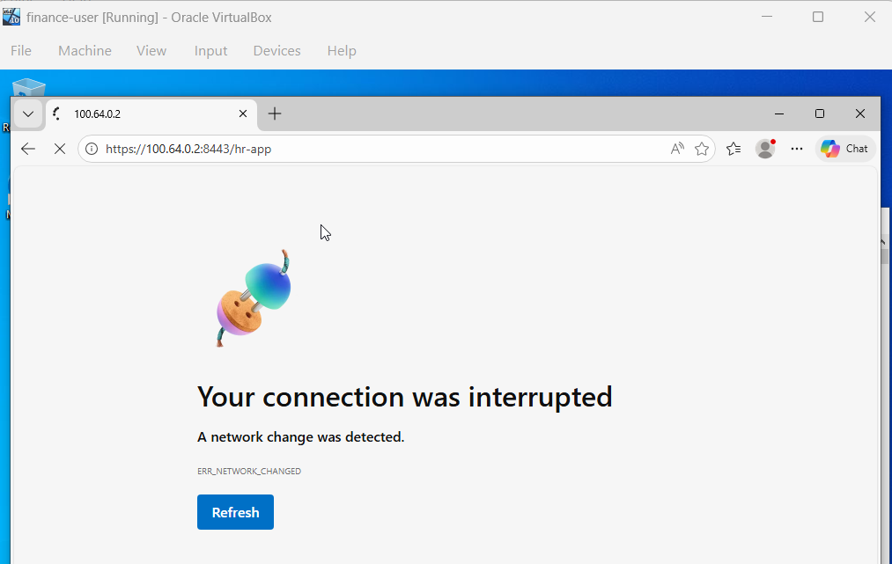

# Headscale / Tailscale

## Qu'est-ce que Headscale ?

Headscale est une implémentation open source et **auto-hébergée** du serveur de coordination Tailscale. Il permet de créer un réseau VPN maillé entre plusieurs machines via WireGuard, sans dépendre de serveurs cloud externes.

Dans Ytech Solutions, Headscale remplace le cloud Tailscale — toutes les données restent dans notre infrastructure.

---

## Comparaison des solutions VPN

| Critère | Headscale | Tailscale | WireGuard classique |
|---------|-----------|-----------|---------------------|
| Open source | ✅ Oui | ⚠️ Partiellement | ✅ Oui |
| Auto-hébergé | ✅ Oui | ❌ Cloud Tailscale | ✅ Oui |
| Interface graphique | ❌ CLI uniquement | ✅ Oui | ❌ Non |
| Contrôle ACL granulaire | ✅ Oui | ✅ Oui | ⚠️ Manuel |
| Confidentialité données | ✅ 100% interne | ❌ Données sur cloud | ✅ 100% interne |
| Protocole sous-jacent | WireGuard | WireGuard | WireGuard |

---

## Déploiement via Docker

```bash
docker run -d \
  --name headscale \
  --restart unless-stopped \
  -v ./config:/etc/headscale \
  -p 8080:8080 \
  headscale/headscale:latest serve
```

---

## Nœuds du réseau Ytech Solutions

| ID | Hostname | Tag | Adresse IP | Statut |
|----|----------|-----|------------|--------|
| 1 | app-server | tag:server-app | 100.64.0.1 | 🟢 online |
| 2 | web-server | tag:server-web | 100.64.0.2 | 🟢 online |
| 3 | backup-server | tag:server-backup | 100.64.0.3 | 🔴 offline |
| 4 | db-server | tag:server-db | 100.64.0.4 | 🟢 online |
| 5 | monitoring-server | tag:monitoring | 100.64.0.5 | 🟢 online |
| 7 | commercial-pc | tag:commercial | 100.64.0.7 | 🔴 offline |
| 8 | hr-pc | tag:hr | 100.64.0.8 | 🟢 online |
| 9 | ceo | tag:ceo | 100.64.0.9 | 🟢 online |
| 10 | dev-pc | tag:developer | 100.64.0.10 | 🟢 online |

---

## Gestion CLI

### Lister les nœuds

```bash
docker exec headscale headscale nodes list
```


### Assigner les tagss

```bash
docker exec headscale headscale nodes tag -i 8 --tags "tag:hr"
docker exec headscale headscale nodes tag -i 9 --tags "tag:ceo"
```


### État final du réseau


---

## Démonstration Zero Trust — Accès refusé

Le nœud `finance-user` tente d'accéder à l'application RH. Les règles ACL bloquent la connexion au niveau réseau, même si l'utilisateur est connecté au VPN.



## ✅ Accès autorisé – CEO vers l’application RH

Le Directeur Général (CEO) dispose d’un accès en lecture seule à l’application CRUD RH.

### 🔍 Vérification de l’accès

Un test a été réalisé depuis un poste CEO afin de vérifier l’accès à l’application RH.

Résultat :

- Accès à l’interface autorisé
- Consultation des employés possible
- Aucune modification ou suppression autorisée

### 📸 Preuve d’accès


:::info Zero Trust en action
Être connecté au VPN ne suffit pas. Chaque accès est explicitement autorisé ou refusé par les règles ACL selon le **tag** du nœud — principe du moindre privilège.
:::
