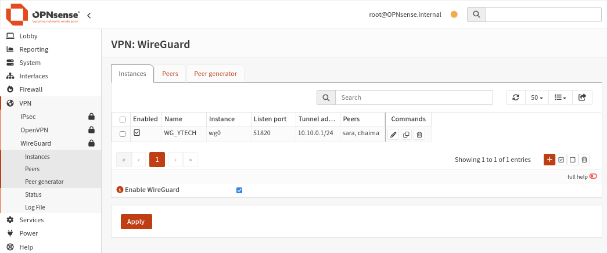
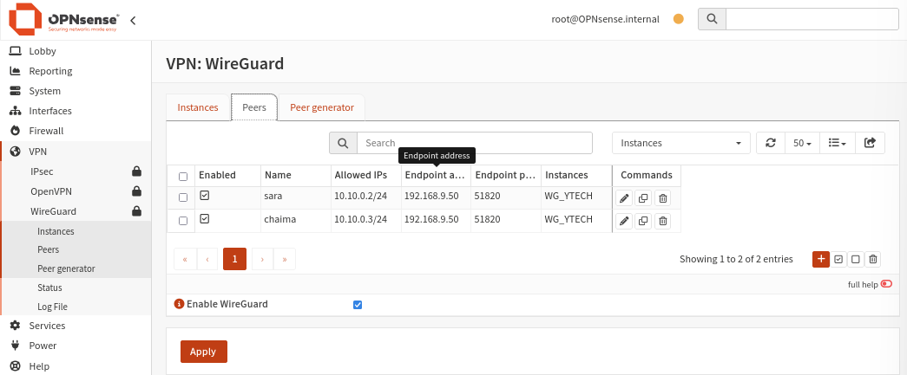
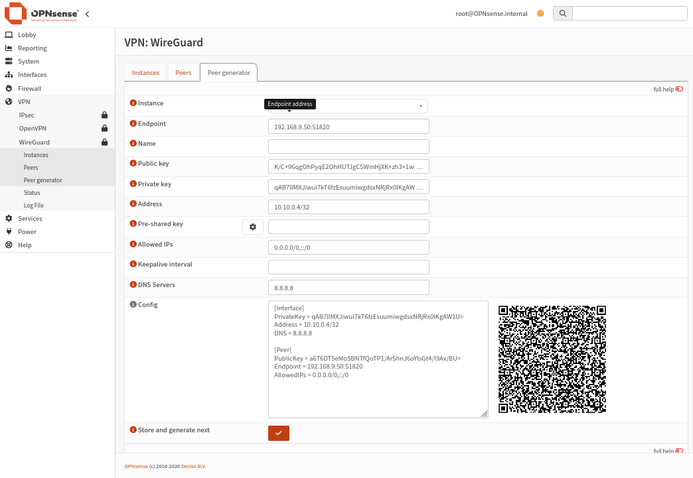
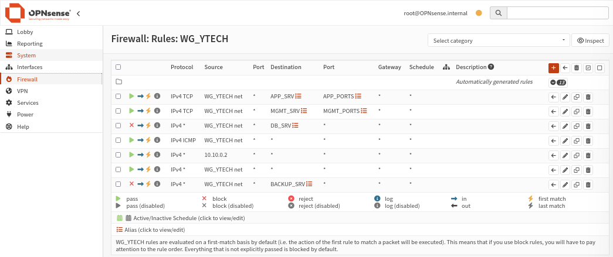

import Tabs from '@theme/Tabs';
import TabItem from '@theme/TabItem';

# 🔐 VPN WireGuard — Accès distant sécurisé

## Présentation

**WireGuard** est le protocole VPN configuré sur OPNsense pour permettre l'accès distant sécurisé à l'infrastructure Y-Tech. Il offre des performances élevées, une cryptographie moderne et une configuration simple comparée à IPsec ou OpenVPN.

**Chemin :** `VPN → WireGuard`

| Caractéristique | Valeur |
|-----------------|--------|
| **Protocole** | WireGuard (UDP) |
| **Port d'écoute** | 51820 |
| **Instance** | WG_YTECH |
| **Tunnel address** | 10.10.0.1/24 |
| **Interface assignée** | wg0 → OPT8 → WG_YTECH |
| **Peers configurés** | 2 (sara, chaima) |

:::info Architecture d'accès
Les utilisateurs distants se connectent via WireGuard et accèdent uniquement aux services autorisés (APP, MGMT). L'accès direct à la base de données est bloqué depuis le VPN.
:::

## Schéma du flux VPN

```
Utilisateur distant (sara / chaima)
          │
          │  UDP 51820 (chiffré WireGuard)
          ▼
  ┌───────────────────────────────┐
  │     OPNsense — WAN            │
  │     192.168.9.50:51820        │
  │                               │
  │  [Interface WG_YTECH / wg0]   │
  │  Tunnel : 10.10.0.1/24        │
  │                               │
  │  Firewall Rules WG_YTECH      │
  │  ✅ → APP_SRV (APP_PORTS)    │
  │  ✅ → MGMT_SRV (MGMT_PORTS)  │
  │  ❌ → DB_SRV (bloqué)        │
  │  ❌ → BACKUP_SRV (bloqué)    │
  └───────────────────────────────┘
          │
          ├──▶ APP_SRV  192.168.9.253  (HR App :8443, Chatbot :8501)
          ├──▶ MGMT_SRV 192.168.10.5  (Bitwarden :8444, Grafana :3000)
          └──✖ DB_SRV   192.168.10.2  (BLOQUÉ)
```

---

## Étape 1 — Création de l'instance WireGuard

**Chemin :** `VPN → WireGuard → Instances`



Une seule instance est définie pour l'ensemble de l'infrastructure :

| Champ | Valeur | Description |
|-------|--------|-------------|
| **Enabled** | ✅ | Instance active |
| **Name** | WG_YTECH | Nom de l'instance |
| **Listen port** | 51820 | Port UDP d'écoute |
| **Tunnel address** | 10.10.0.1/24 | IP du serveur dans le tunnel |
| **Instance (device)** | wg0 | Interface noyau créée |

:::warning IP du tunnel vs IP d'interface
L'adresse IP `10.10.0.1/24` est définie **dans l'instance WireGuard**, pas dans `Interfaces → WG_YTECH`. Ne pas configurer d'IP statique dans l'écran d'interface — cela provoquerait un conflit.
:::

---

## Étape 2 — Assignation de l'interface

**Chemin :** `Interfaces → Assignments`

Après création de l'instance WG_YTECH, l'interface `wg0` apparaît dans la liste des interfaces disponibles :

1. Elle est assignée → elle devient **OPT8**
2. OPT8 est renommée en **WG_YTECH**
3. L'interface est activée (`Enable Interface`)

:::note
L'interface WG_YTECH n'a **pas d'adresse IPv4 statique** configurée manuellement. L'adresse du tunnel (`10.10.0.1/24`) est gérée entièrement par WireGuard.
:::

---

## Étape 3 — Création des peers (Peer Generator)

**Chemin :** `VPN → WireGuard → Peer generator`

Le Peer Generator d'OPNsense permet de créer la configuration client directement depuis l'interface web, avec génération automatique des clés et d'un QR code pour les appareils mobiles.



### Peers configurés

| Nom | Adresse tunnel | Endpoint | Port | Instance |
|-----|----------------|----------|------|----------|
| **sara** | 10.10.0.2/32 | 192.168.9.50 | 51820 | WG_YTECH |
| **chaima** | 10.10.0.3/32 | 192.168.9.50 | 51820 | WG_YTECH |

### Détail d'un peer — Exemple : sara

<Tabs>
  <TabItem value="champs" label="Champs de configuration" default>

| Champ | Valeur | Description |
|-------|--------|-------------|
| **Instance** | WG_YTECH | Instance associée |
| **Endpoint** | 192.168.9.50:51820 | IP WAN d'OPNsense + port |
| **Name** | sara | Identifiant du peer |
| **Address** | 10.10.0.2/32 | IP du client dans le tunnel |
| **Allowed IPs** | 0.0.0.0/0, ::/0 | Tout le trafic passe par le VPN |
| **Keepalive interval** | 25 | Maintien de la connexion (secondes) |
| **DNS Servers** | 8.8.8.8 | DNS utilisé côté client |

  </TabItem>
  <TabItem value="config" label="Fichier de config client">

```ini
[Interface]
PrivateKey = <clé_privée_client>
Address = 10.10.0.2/32
DNS = 8.8.8.8

[Peer]
PublicKey = <clé_publique_serveur_WG_YTECH>
Endpoint = 192.168.9.50:51820
AllowedIPs = 0.0.0.0/0, ::/0
PersistentKeepalive = 25
```

  </TabItem>
  <TabItem value="qr" label="QR Code">

OPNsense génère automatiquement un **QR code** depuis la configuration du peer. Il suffit de le scanner depuis l'application WireGuard mobile (iOS/Android) pour importer la configuration sans saisie manuelle.



  </TabItem>
</Tabs>

:::tip Endpoint = IP WAN, pas IP LAN
Un point fondamental : le champ **Endpoint** doit contenir l'**adresse IP WAN** d'OPNsense (`192.168.9.50`), pas l'IP LAN (`192.168.1.1`). C'est l'adresse que le client VPN utilise pour joindre le serveur depuis l'extérieur.
:::

---

## Étape 4 — Règles firewall WG_YTECH

**Chemin :** `Firewall → Rules → WG_YTECH`

Les règles firewall sur l'interface WG_YTECH définissent ce que les utilisateurs VPN peuvent atteindre une fois connectés.



### Vue complète des règles

| # | Action | Protocole | Source | Destination | Port | Description |
|---|--------|-----------|--------|-------------|------|-------------|
| 1 | ✅ Pass | IPv4 TCP | WG_YTECH net | APP_SRV | APP_PORTS | VPN → APP |
| 2 | ✅ Pass | IPv4 TCP | WG_YTECH net | MGMT_SRV | MGMT_PORTS | VPN → MGMT |
| 3 | ❌ Block | IPv4 * | WG_YTECH net | DB_SRV | * | BLOCK VPN → DB |
| 4 | ✅ Pass | IPv4 ICMP | WG_YTECH net | * | * | ICMP (tests ping) |
| 5 | ✅ Pass | IPv4 * | 10.10.0.2 | * | * | Admin VPN full access |
| 6 | ✅ Pass | IPv4 * | WG_YTECH net | * | * | Internet via VPN |
| 7 | ❌ Block | IPv4 * | WG_YTECH net | BACKUP_SRV | * | BLOCK VPN → BACKUP |

### Logique des règles

**Règle 1 — VPN → APP**
Les utilisateurs VPN peuvent accéder aux applications (HR App port 8443, Chatbot port 8501, Ollama port 11434).

**Règle 2 — VPN → MGMT**
Les utilisateurs VPN peuvent accéder aux outils de gestion (Bitwarden port 8444, Grafana port 3000).

**Règle 3 — BLOCK VPN → DB**
Aucun utilisateur VPN ne peut accéder directement à la base de données. L'accès DB passe obligatoirement par la couche applicative.

**Règle 4 — ICMP**
Autorise les pings depuis le tunnel VPN pour faciliter les tests de connectivité.

**Règle 5 — Admin VPN full access**
L'IP `10.10.0.2` (peer `sara`) bénéficie d'un accès complet à toute l'infrastructure depuis le VPN.

**Règle 6 — Internet via VPN**
Le trafic Internet des clients VPN est routé via OPNsense (split tunneling désactivé — `AllowedIPs = 0.0.0.0/0`).

**Règle 7 — BLOCK VPN → BACKUP**
Le serveur de backup n'est pas accessible depuis le VPN. Les sauvegardes restent un processus interne uniquement.

---

## Plan d'adressage du tunnel VPN

| IP tunnel | Rôle | Peer |
|-----------|------|------|
| 10.10.0.1/24 | Serveur WireGuard (OPNsense) | WG_YTECH instance |
| 10.10.0.2/32 | Client admin | sara |
| 10.10.0.3/32 | Client équipe | chaima |
| 10.10.0.4/32 → ... | Peers futurs | — |

---

## Tests de validation — Connectivité & SSH

### Test ping depuis un peer VPN connecté

Une fois le tunnel WireGuard établi, la connectivité vers les machines internes est validée par ping :

```bash
# Depuis le peer sara (10.10.0.2) — après connexion VPN
ping 192.168.1.20

# Résultats
64 bytes from 192.168.1.20: icmp_seq=1 ttl=64 time=2.65 ms
64 bytes from 192.168.1.20: icmp_seq=2 ttl=64 time=1.56 ms
64 bytes from 192.168.1.20: icmp_seq=3 ttl=64 time=2.04 ms
--- 192.168.1.20 ping statistics ---
6 packets transmitted, 6 received, 0% packet loss
rtt min/avg/max/mdev = 1.034/1.667/2.652/0.543 ms
```

✅ **0% de perte** — le tunnel est opérationnel.

### Vérification du service SSH sur la cible

```bash
# Vérification des ports en écoute
ss -tuln
# udp  UNCONN  [fe80::2874:583e:ba0a:c977]%eth1:546
# tcp  LISTEN  0.0.0.0:22
# tcp  LISTEN  [::]:22

# Statut du service SSH
systemctl status ssh

# ssh.service — OpenBSD Secure Shell server
# Active: active (running) since Wed 2026-04-08 13:08:37 EDT
# Main PID: 800 (sshd)
# Server listening on 0.0.0.0 port 22.
# Server listening on :: port 22.
```

:::success Validation
Le service SSH est **actif et en écoute** sur le port 22. La machine est joignable depuis le tunnel VPN, ce qui confirme que les règles firewall WireGuard autorisent correctement le trafic ICMP et SSH vers les machines internes.
:::

---

## Bilan de la configuration VPN

| Composant | État | Détail |
|-----------|------|--------|
| Instance WG_YTECH | ✅ Créée | Port 51820, tunnel 10.10.0.1/24 |
| Interface assignée | ✅ Active | wg0 → OPT8 → WG_YTECH |
| Peer sara | ✅ Configuré | 10.10.0.2/32, QR code généré |
| Peer chaima | ✅ Configuré | 10.10.0.3/32, QR code généré |
| Règles firewall | ✅ Appliquées | Accès APP + MGMT, DB bloquée |
| Tests complets | ⏳ En attente | À valider une fois les peers connectés |

:::note Tests de validation
Les tests complets de connectivité VPN (connexion client → ping → accès services) seront effectués une fois les peers (sara, chaima) connectés depuis leurs machines. Voir le chapitre **15. Tests & Validation** pour les procédures de test.
:::
