# 🏢 Application CRUD RH — Système de Gestion des Ressources Humaines

## Qu'est-ce que l'Application RH ?

L'application RH Ytech Solutions est une application web interne de gestion des ressources humaines développée **entièrement en PHP 8.1** avec Apache, conteneurisée via Docker et servie en HTTPS. Elle permet la gestion complète des employés, des absences et des comptes utilisateurs selon le rôle de chaque utilisateur.

Contrairement à des solutions SaaS comme BambooHR ou Workday, cette application est **100% hébergée en interne** — aucune donnée RH ne quitte l'infrastructure de l'entreprise.

> 💶 **Dimension financière** : Un abonnement BambooHR coûte **6$/employé/mois**, soit **1 728 $/an** pour 24 employés — avec risque de fuite de données sensibles. L'application RH interne offre les mêmes fonctionnalités essentielles pour **0 €** en licences, avec une conformité RGPD totale.

---

## Stack Technique

| Composant | Technologie | Rôle |
|---|---|---|
| **Backend** | PHP 8.1 | Logique métier, requêtes PDO |
| **Base de données** | MariaDB (compatible MySQL) | Stockage employés, absences, utilisateurs |
| **Interface web** | Bootstrap 5.3 | Interface responsive multi-device |
| **Serveur web** | Apache 2.4 | Serveur HTTP/HTTPS |
| **Administration BDD** | phpMyAdmin | Interface graphique MariaDB |
| **Conteneurisation** | Docker + Docker Compose | Déploiement reproductible |
| **HTTPS** | SSL auto-signé (OpenSSL) | Chiffrement des communications |

---

## Architecture de Déploiement

L'application RH est déployée sur la **VM2 (Web Server)** :

```
Web Server (192.168.9.253 / 192.168.56.20)
│
├── Container : ytech-crud (PHP 8.1 + Apache)
│     port   : 8443 (HTTPS)
│     url    : https://192.168.9.253:8443/hr-app
│
├── Container : ytech-nginx (Reverse Proxy)
│     port   : 8443 → 443
│
└── MariaDB (192.168.56.25 — DB Server séparé)
      base   : ytech_rh
      tables : users, employees, departments, absences
```

---

## Installation et Déploiement

### Étape 1 — Connexion SSH au serveur

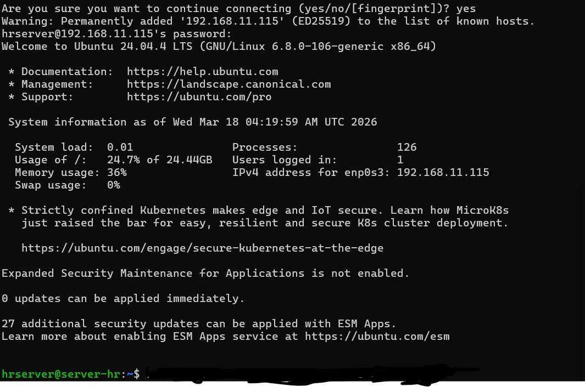
*Connexion SSH depuis la machine de développement vers le serveur Ubuntu*

### Étape 2 — Installation Apache2

```bash
sudo apt update && sudo apt install apache2 -y
sudo systemctl enable apache2
sudo systemctl start apache2
```

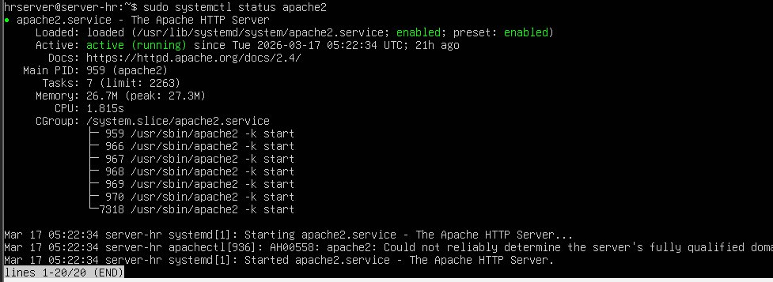
*Installation et démarrage d'Apache2 sur Ubuntu 24.04*

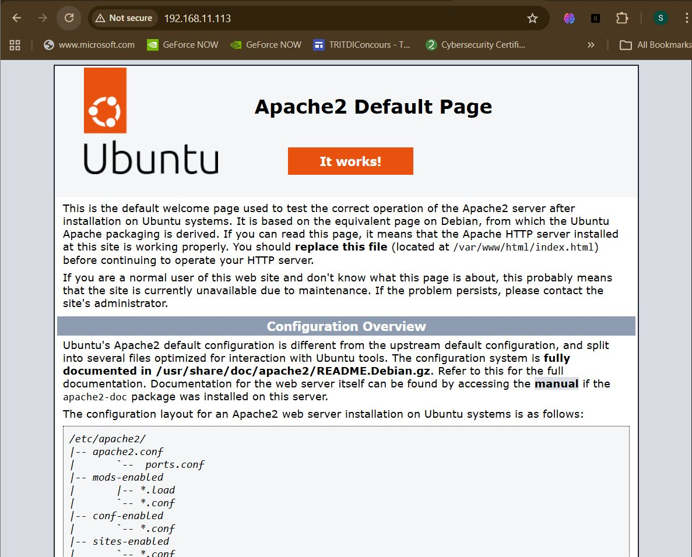
*Apache2 en cours d'exécution — page de test accessible*

### Conteneurs Docker actifs

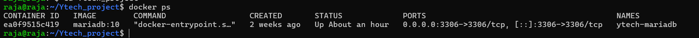
*Conteneur MariaDB déployé et actif sur le serveur DB*

### Étape 3 — Installation MariaDB et PHP

```bash
sudo apt install mariadb-server php8.1 php8.1-mysql libapache2-mod-php -y
```

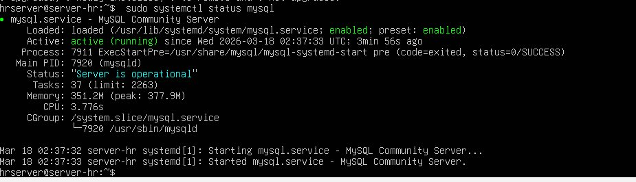
*Installation de MariaDB et des extensions PHP*

### Étape 4 — Sécurisation MariaDB

```bash
sudo mysql_secure_installation
```

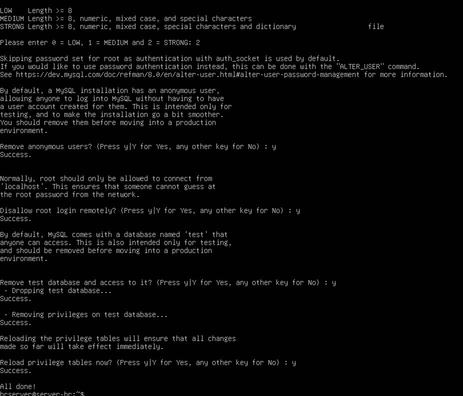
*Configuration sécurisée de MariaDB : suppression utilisateurs anonymes, désactivation accès root distant*

### Étape 5 — Installation phpMyAdmin

```bash
sudo apt install phpmyadmin -y
```

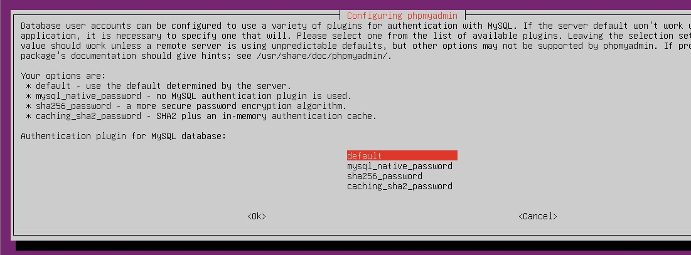
*Interface phpMyAdmin installée et accessible*

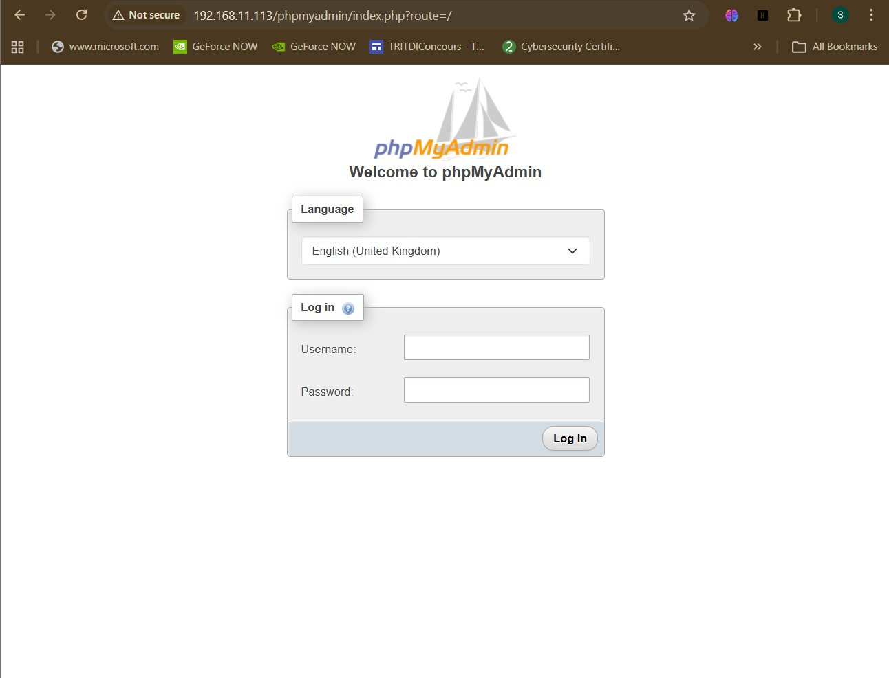
*phpMyAdmin connecté à la base de données ytech_rh*

---

## Les 6 Départements

| Département | Description |
|---|---|
| Commercial & Marketing | Gestion clients et activités commerciales |
| Développement | Développement et maintenance applicative |
| Direction Générale | Pilotage stratégique |
| Finance / Comptabilité | Gestion financière et facturation |
| Informatique (IT) | Administration systèmes et réseaux |
| Ressources Humaines | Gestion du personnel |

---

## Les 3 Rôles et Permissions

| Fonctionnalité | CEO | HR | IT Admin |
|---|:---:|:--:|:--------:|
| Voir les employés | ✅ | ✅ | ✅ |
| Ajouter un employé | ❌ | ✅ | ✅ |
| Modifier un employé | ❌ | ✅ | ✅ |
| Supprimer un employé | ❌ | ❌ | ✅ |
| Marquer absent | ❌ | ✅ | ✅ |
| Tableau de bord stats | ✅ | ✅ | ✅ |
| Gérer les utilisateurs | ❌ | ❌ | ✅ |

---

## Aperçu de l'Application

### Page de connexion
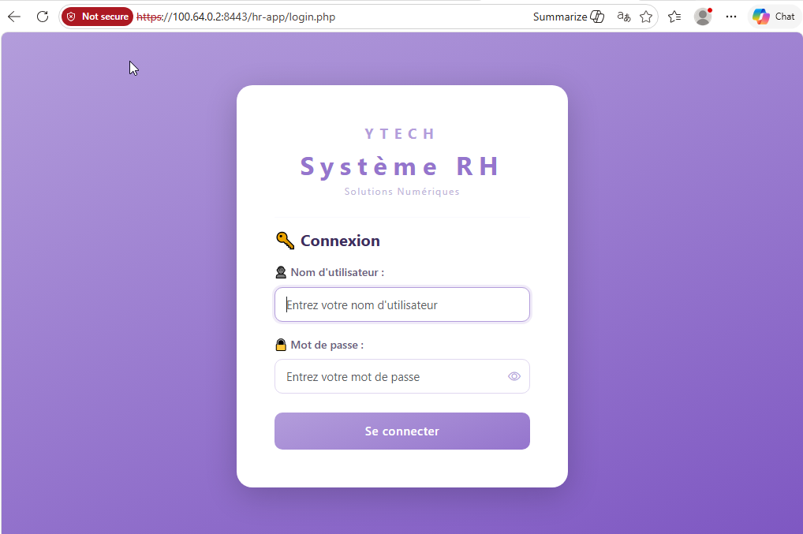
*Page d'authentification sécurisée — bcrypt + protection session*

### Tableau de bord — IT Admin
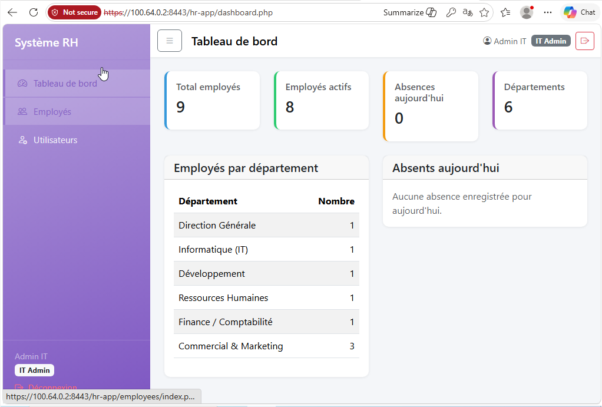
*Dashboard avec statistiques : 9 employés, 6 départements, absences du jour*

### Tableau de bord — RH
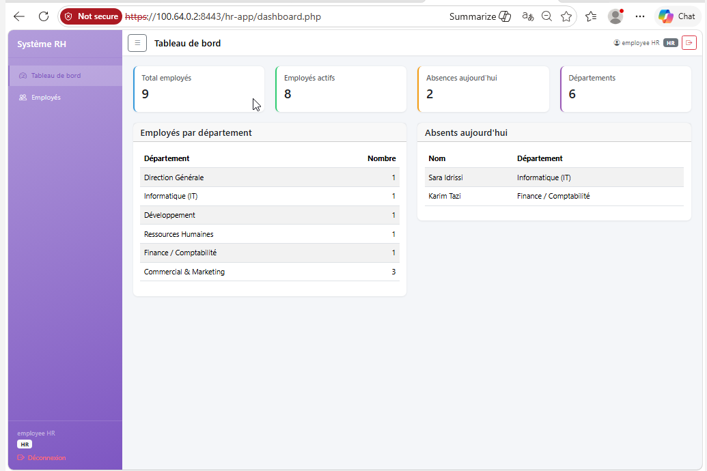
*Vue HR — absences du jour visibles, accès limité aux fonctions RH*

### Sélection de département
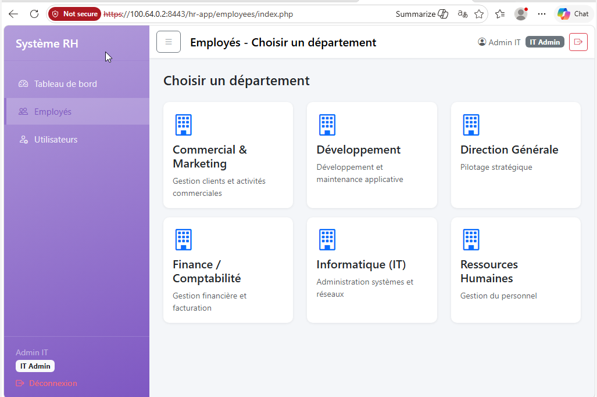
*Navigation par département — accès filtré selon le rôle*

### Liste des employés — IT Admin
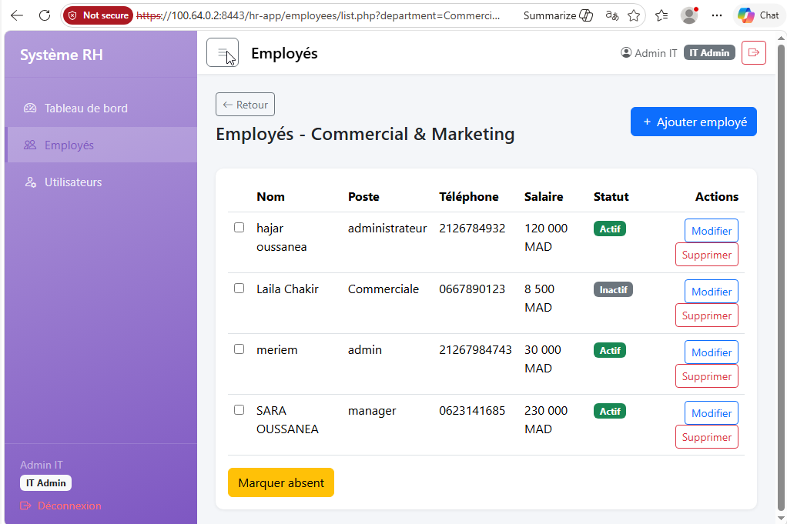
*Vue complète avec boutons Modifier / Supprimer / Marquer absent*

### Liste des employés — CEO (lecture seule)
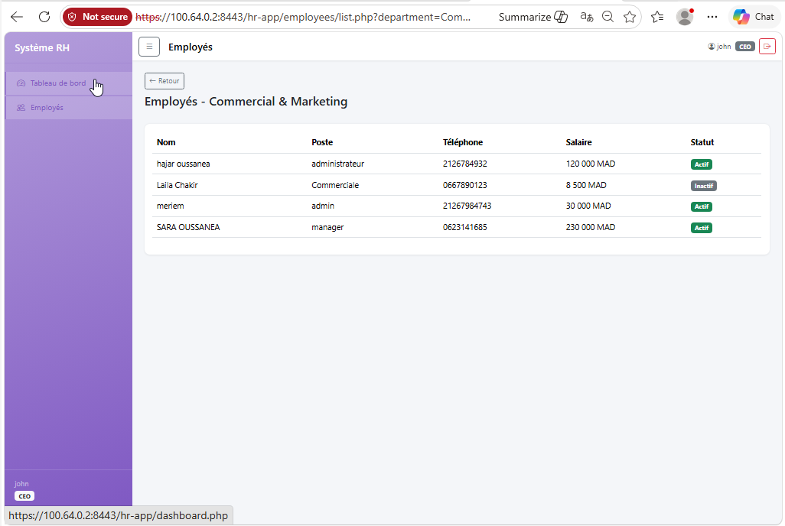
*Vue CEO en lecture seule — aucune action possible*

### Ajouter un employé
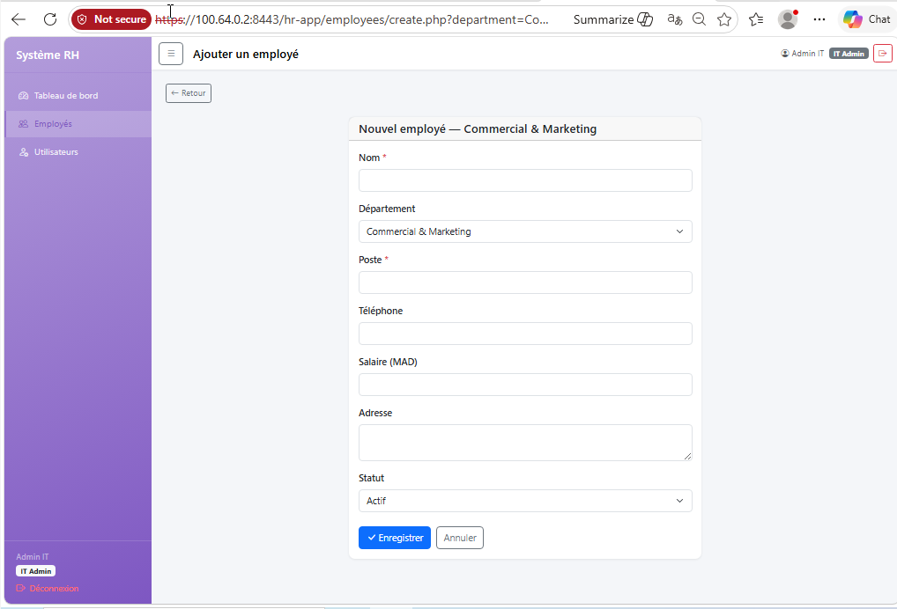
*Formulaire de création — accessible HR et IT Admin*

### Modifier un employé
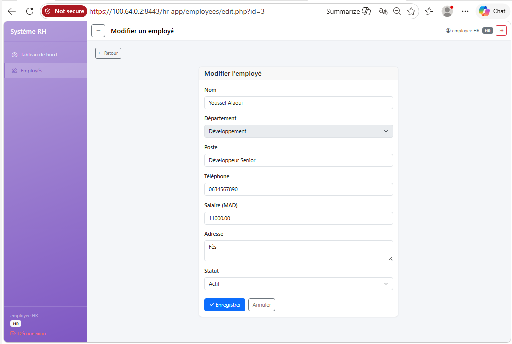
*Formulaire de modification avec contrôle d'accès par rôle*

### Gestion des utilisateurs — IT Admin uniquement
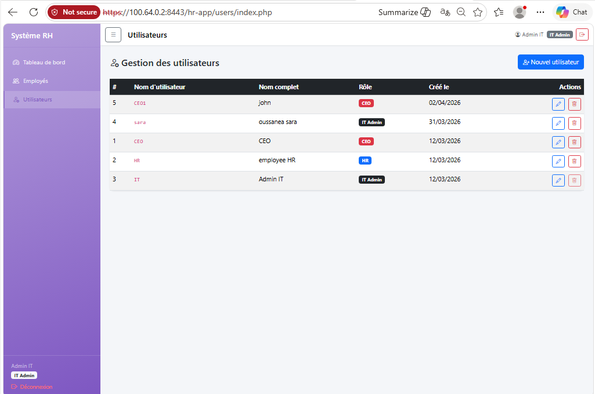
*Page de gestion des comptes système — IT Admin uniquement*

---

## Base de Données

:::info Architecture base de données
La base de données de l'application RH est **`ytech_rh`** sur le serveur MariaDB dédié (`192.168.56.25`). Elle est partagée sur le même serveur MariaDB que les bases `ytech_chatbot` et `ytech_clients`, mais totalement **isolée** — l'utilisateur `rh_user` n'a accès qu'à `ytech_rh` uniquement. Voir [Base de données](/10-services-infrastructure/base-de-donnees) pour l'architecture complète.
:::

### Schéma

```sql
-- Base : ytech_rh
-- Utilisateurs système
CREATE TABLE users (
    id INT PRIMARY KEY AUTO_INCREMENT,
    username VARCHAR(50) UNIQUE NOT NULL,
    password VARCHAR(255) NOT NULL,  -- bcrypt hash
    role ENUM('CEO', 'HR', 'IT') NOT NULL,
    created_at TIMESTAMP DEFAULT CURRENT_TIMESTAMP
);

-- Employés
CREATE TABLE employees (
    id INT PRIMARY KEY AUTO_INCREMENT,
    first_name VARCHAR(50) NOT NULL,
    last_name VARCHAR(50) NOT NULL,
    department VARCHAR(100) NOT NULL,
    email VARCHAR(100),
    phone VARCHAR(20),
    hire_date DATE,
    created_at TIMESTAMP DEFAULT CURRENT_TIMESTAMP
);

-- Absences
CREATE TABLE absences (
    id INT PRIMARY KEY AUTO_INCREMENT,
    employee_id INT,
    absence_date DATE NOT NULL,
    created_at TIMESTAMP DEFAULT CURRENT_TIMESTAMP,
    FOREIGN KEY (employee_id) REFERENCES employees(id)
);
```

---

## Sécurité du Code

| Mesure | Implémentation | Protection contre |
|---|---|---|
| PDO préparées | Toutes les requêtes SQL | Injection SQL |
| bcrypt | `password_hash()` rounds=10 | Vol de BDD + crack hashes |
| htmlspecialchars | Toutes les sorties HTML | XSS |
| hasRole() | Vérifié sur chaque page | Broken Access Control |
| session_regenerate_id | À chaque login | Session fixation |
| HTTPS TLS | SSL auto-signé | Interception réseau |
| .gitignore | `config/database.php` exclu | Fuite credentials |

---

## Structure du Projet

```
hr-app/
├── config/
│   ├── database.php      ← Connexion PDO (non committé — volume Docker)
│   └── app.php           ← Constantes, session, rôles
├── includes/
│   ├── auth.php          ← hasRole(), requireLogin()
│   ├── header.php        ← Layout Bootstrap 5 + sidebar
│   └── footer.php
├── employees/
│   ├── index.php         ← Choix département
│   ├── list.php          ← Liste employés
│   ├── create.php        ← Ajouter employé
│   ├── edit.php          ← Modifier employé
│   └── delete.php        ← Supprimer (IT Admin)
├── users/
│   ├── index.php         ← Liste utilisateurs (IT Admin)
│   ├── create.php        ← Créer compte
│   ├── edit.php          ← Modifier / changer mdp
│   └── delete.php        ← Supprimer compte
├── dashboard.php
├── login.php / logout.php
├── Dockerfile
├── docker-compose.yml
└── nginx.conf
```

---

## Accès et URLs

| Réseau | URL |
|---|---|
| Host-Only (interne VM) | `https://192.168.56.20:8443/hr-app` |
| Bridge (réseau de classe) | `https://192.168.9.253:8443/hr-app` |
| Via Headscale VPN | `https://100.64.0.2:8443/hr-app` |

:::warning Accès restreint
L'application RH n'est **jamais exposée sur Internet**. L'accès est limité au réseau interne et aux utilisateurs authentifiés via Headscale/Tailscale. OPNSense bloque tout accès WAN vers le port 8443.
:::

---

## Lien avec le Pentest

Le pentest réalisé sur cette application a révélé **10 vulnérabilités dont 4 critiques** (exposition `.git`, `docker-compose.yml`, absence de rate limiting, headers manquants). Toutes les vulnérabilités critiques ont été corrigées.

:::note MySQL vs MariaDB
Le pentest mentionne "MySQL" — MariaDB est un fork 100% compatible avec MySQL. Les commandes SQL, les outils (phpMyAdmin, PDO, SQLMap) et les vulnérabilités testées sont identiques. La distinction ne change pas les résultats du pentest.
:::

Voir [Rapport de Pentest HR App]() pour le détail complet.
