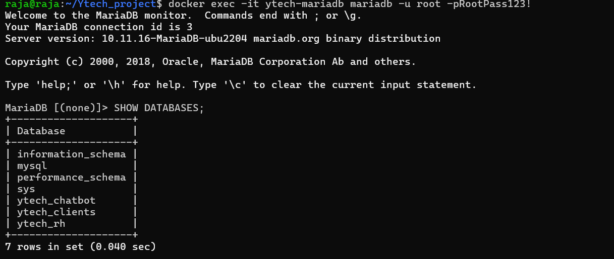
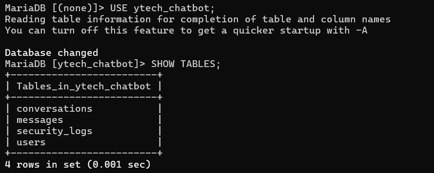
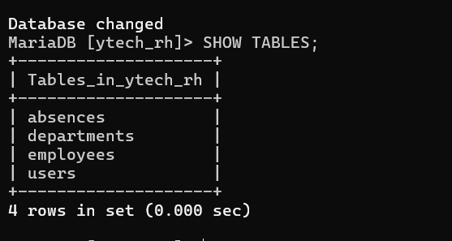
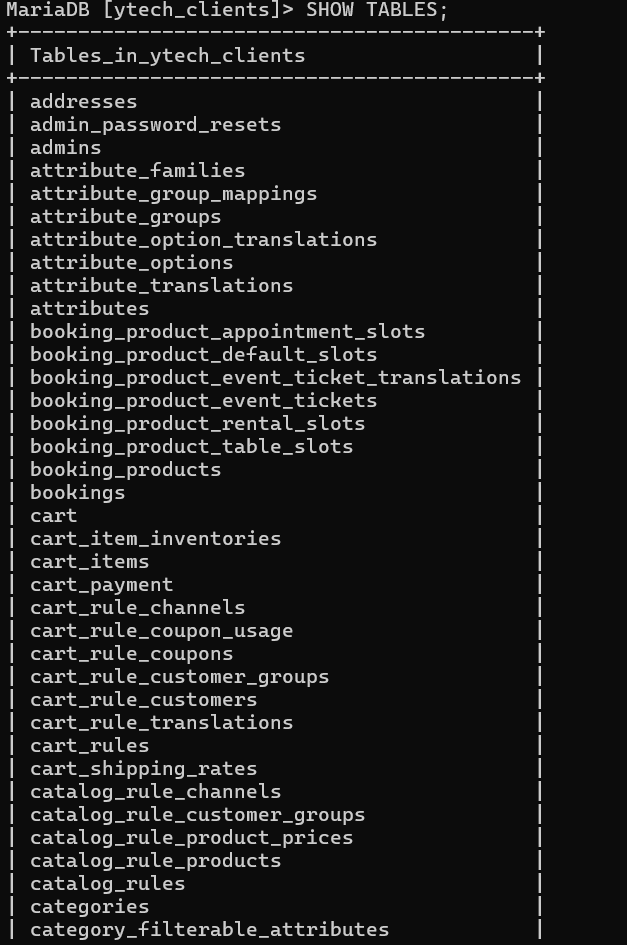

# Base de données — MariaDB

## Pourquoi une base de données dédiée et isolée ?

Dans l'infrastructure initiale de Ytech Solutions, toutes les données étaient stockées sur le même serveur que les applications — sans séparation, sans restriction d'accès. C'est comme garder l'argent de caisse, les contrats des employés et le code source des clients dans le même tiroir ouvert à tous.

L'architecture cible repose sur un principe simple : **la base de données est une zone ultra-sensible**, placée dans son propre VLAN, accessible uniquement par les serveurs qui en ont strictement besoin.

> 💶 **Dimension financière** : La base de données contient les actifs les plus précieux de l'entreprise — données clients (RGPD), données RH (confidentielles), données applicatives. Une fuite coûte en moyenne **180 $ par enregistrement compromis** (IBM 2023). Avec 24 employés et des dizaines de clients, une fuite non maîtrisée peut rapidement atteindre **plusieurs dizaines de milliers d'euros** de préjudice.

---

## Architecture

MariaDB est déployé sur la **VM2 (DB Server)** dans le **VLAN 25** — totalement isolé :

```
VLAN 25 — DB Server
│
├── IP Host-Only  : 192.168.56.25
├── IP Bridge     : 192.168.10.2
├── Port MariaDB  : 3306
│
├── Base : ytech_chatbot  → user: chatbot    @ 192.168.56.20 uniquement
├── Base : ytech_rh       → user: rh_user    @ 192.168.56.20 uniquement
└── Base : ytech_clients  → user: web_user   @ 192.168.10.21 uniquement
```

### Règle fondamentale

```
Internet        → DB Server  ✗ BLOQUÉ (OPNSense)
VLAN 40 USERS   → DB Server  ✗ BLOQUÉ (ACL Cisco)
VLAN 50 ADMIN   → DB Server  ✗ BLOQUÉ sauf SSH
APP Server      → DB Server  ✅ Port 3306 autorisé
Web Server      → DB Server  ✅ Port 3306 autorisé
```

---

:::info Docker Compose & Déploiement
La configuration Docker Compose complète de MariaDB et les étapes de déploiement sont détaillées dans la section [DevOps & Déploiement](/devops/docker-compose).
:::

---

## Les 3 bases de données

### Séparation stricte

Chaque application dispose de sa **propre base de données** et de son **propre utilisateur MariaDB** avec des droits limités à sa base uniquement. C'est le principe du moindre privilège appliqué à la couche données.

```
Application Web (Laravel)  →  db_clients  →  web_user  (SELECT, INSERT, UPDATE)
Application CRUD RH        →  db_rh       →  rh_user   (SELECT, INSERT, UPDATE, DELETE)
Chatbot YtechBot           →  ytech_chatbot → chatbot  (ALL sur sa base uniquement)
```

> Si un attaquant compromet l'application web et accède à `web_user`, il ne peut voir **que** `db_clients` — jamais les données RH ni le chatbot. La compromission est **cloisonnée**.



*Les 3 bases de données sur MariaDB*


---

### Base `ytech_chatbot`

Stocke les utilisateurs, conversations et messages du chatbot YtechBot.

```sql
CREATE DATABASE ytech_chatbot CHARACTER SET utf8mb4;

CREATE USER 'chatbot'@'192.168.56.20'
  IDENTIFIED BY 'ChatbotPass123!';
GRANT ALL ON ytech_chatbot.* TO 'chatbot'@'192.168.56.20';

-- Tables principales
-- users          : comptes employés + bcrypt hash
-- conversations  : historique avec soft delete
-- messages       : échanges user/assistant
```

*Tables de la base de données du Chatbot*

---

### Base `ytech_rh`

Stocke les fiches employés gérées par l'application CRUD RH.

```sql
CREATE DATABASE ytech_rh CHARACTER SET utf8mb4;

CREATE USER 'rh_user'@'192.168.56.20'
  IDENTIFIED BY 'RHPass123!';
GRANT SELECT, INSERT, UPDATE, DELETE
  ON ytech_rh.* TO 'rh_user'@'192.168.56.20';

-- Tables principales
-- employees : nom, prénom, poste, salaire, département
-- departments : liste des départements
```


*Tables de la base de données des Employés*

:::danger Données RH — Sensibilité maximale
La base `ytech_rh` contient des **données personnelles** au sens du RGPD (salaires, contrats, informations privées). Elle est accessible **uniquement** depuis l'APP Server via l'utilisateur `rh_user` — jamais directement depuis un poste utilisateur.
:::

---

### Base `ytech_clients`

Stocke les données clients de l'application web commerciale.

```sql
CREATE DATABASE ytech_clients CHARACTER SET utf8mb4;

CREATE USER 'web_user'@'192.168.10.21'
  IDENTIFIED BY 'ClientsPass123!';
GRANT SELECT, INSERT, UPDATE
  ON ytech_clients.* TO 'web_user'@'192.168.10.21';

-- Tables principales
-- clients   : contacts, commandes
-- orders    : packs commandés, statut
-- products  : catalogue packs web
```


*Tables de la base de données des Clients*

---

## Sécurisation MariaDB

### Configuration réseau

```ini
# /etc/mysql/mariadb.conf.d/50-server.cnf
bind-address = 192.168.56.25   # Écoute uniquement sur l'IP interne
skip-networking = OFF           # Réseau activé mais restreint par bind-address
```

### UFW — Règles firewall

```bash
# Autoriser uniquement APP Server et Web Server
sudo ufw allow from 192.168.56.20 to any port 3306
sudo ufw allow from 192.168.9.253 to any port 3306
sudo ufw allow from 192.168.10.21 to any port 3306

# Bloquer tout le reste sur 3306
sudo ufw deny 3306

sudo ufw enable
```

### Principe du moindre privilège BDD

```sql
-- ✅ BON : droits limités par utilisateur et par IP source
CREATE USER 'web_user'@'192.168.10.21' ...;
GRANT SELECT, INSERT, UPDATE ON ytech_clients.* TO 'web_user'@'192.168.10.21';

-- ✗ MAUVAIS : ce qu'on évite absolument
-- CREATE USER 'admin'@'%' IDENTIFIED BY 'password';
-- GRANT ALL PRIVILEGES ON *.* TO 'admin'@'%';
```

### Surveillance Wazuh

L'agent Wazuh est installé sur la VM2 pour surveiller :
- Les connexions entrantes sur le port 3306
- Les requêtes SQL anormales (volume inhabituel, accès hors horaires)
- Les modifications de structure des tables
- Les tentatives de connexion échouées

---

## Sauvegarde des bases

Les trois bases font l'objet d'une **sauvegarde quotidienne automatique** à 02h00 :

```bash
# Dump MariaDB depuis le Backup Server
docker exec ytech-mariadb mariadb-dump \
  -u root -pRootPass123! ytech_chatbot \
  > /backup/db/ytech_chatbot_$(date +%Y%m%d).sql

docker exec ytech-mariadb mariadb-dump \
  -u root -pRootPass123! ytech_rh \
  > /backup/db/ytech_rh_$(date +%Y%m%d).sql

docker exec ytech-mariadb mariadb-dump \
  -u root -pRootPass123! ytech_clients \
  > /backup/db/ytech_clients_$(date +%Y%m%d).sql

# Chiffrement AES-256
openssl enc -aes-256-cbc -pbkdf2 \
  -in /backup/db/ytech_rh_$(date +%Y%m%d).sql \
  -out /backup/db/ytech_rh_$(date +%Y%m%d).enc \
  -pass file:/etc/backup.key
```


*Container MariaDB actif sur VM2 — DB Server*

---

## Argumentation du choix technologique

### Pourquoi MariaDB plutôt que MySQL ou PostgreSQL ?

| Critère | MariaDB | MySQL | PostgreSQL |
|---|---|---|---|
| Licence | 100% open source (GPL) | Propriétaire Oracle | 100% open source |
| Compatibilité | Drop-in replacement MySQL | Standard | Différent |
| Performance | Excellente pour OLTP | Bonne | Très bonne |
| Communauté | Active | Oracle-dépendant | Très active |
| Docker image | Officielle légère | Officielle | Officielle |

MariaDB a été choisi car il est **100% open source** (MySQL appartient à Oracle avec des contraintes de licence commerciale), **compatible** avec les applications PHP/Laravel sans modification, et **éprouvé** en production dans des milliers d'entreprises.

### Pourquoi 3 bases séparées plutôt qu'une seule ?

La séparation des bases est un choix de **sécurité et d'architecture** :

1. **Isolation des compromissions** — une faille sur l'app web ne donne pas accès aux données RH
2. **Droits granulaires** — chaque utilisateur BDD n'a accès qu'à ce dont il a besoin
3. **Auditabilité** — les logs de chaque base sont séparés et analysables indépendamment
4. **Conformité RGPD** — les données personnelles (RH) sont physiquement séparées des données commerciales

> 💶 Cette séparation est recommandée par la CNIL dans ses guides de conformité RGPD. En cas de contrôle, démontrer que les données RH sont isolées et protégées est un argument fort qui peut éviter des sanctions.
