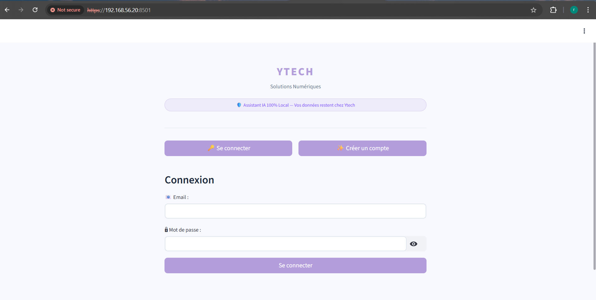
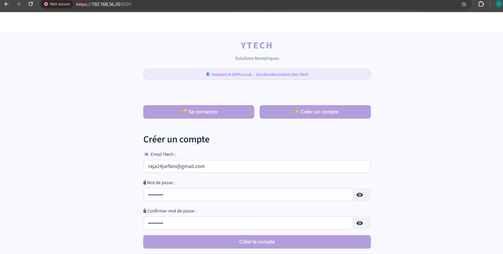
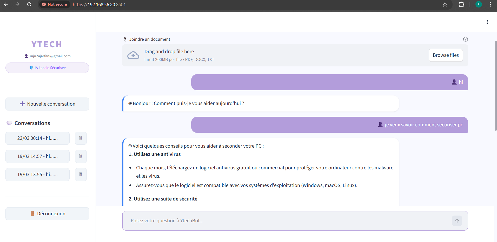
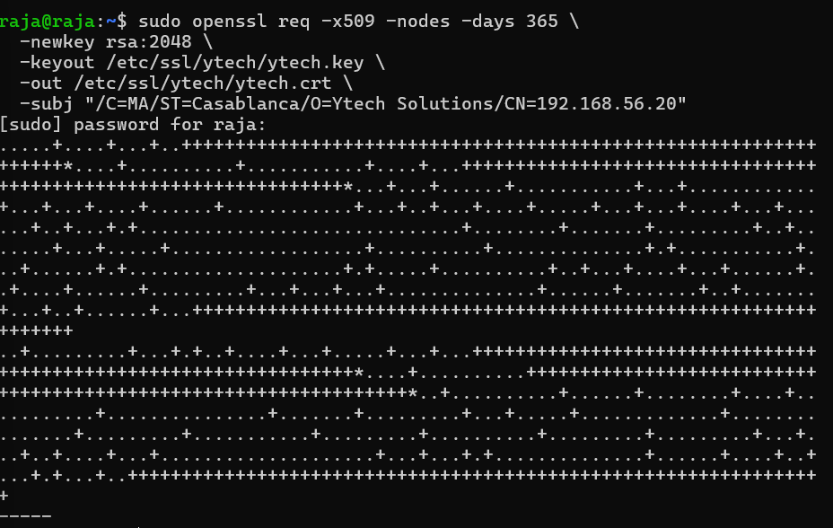

# Chatbot YtechBot

## Qu'est-ce que YtechBot ?

YtechBot est un assistant conversationnel IA développé **entièrement en interne** pour les employés de Ytech Solutions. Contrairement aux solutions cloud comme ChatGPT ou Gemini, YtechBot fonctionne **100% localement** — aucune donnée ne quitte l'infrastructure de l'entreprise.

C'est comme avoir un assistant personnel intelligent, mais qui travaille uniquement dans les bureaux de l'entreprise et ne partage jamais rien avec l'extérieur. Pour une entreprise qui gère des données sensibles de clients PME, c'est une exigence non négociable.

> 💶 **Dimension financière** : Un abonnement ChatGPT Team coûte **25$/utilisateur/mois**, soit **7 200 $/an** pour 24 employés — avec le risque que les données saisies alimentent les modèles d'OpenAI. YtechBot offre des capacités comparables pour un coût de **0 €** en licences, avec une conformité RGPD totale garantie.

---

## Stack technique

| Composant | Technologie | Rôle |
|---|---|---|
| **Interface web** | Streamlit (Python) | Interface de chat utilisateur |
| **Moteur IA** | Ollama + llama3.2:1b | Inférence locale — zéro cloud |
| **Base de données** | MariaDB — `ytech_chatbot` | Historique conversations, utilisateurs |
| **Chiffrement mots de passe** | bcrypt | Hashage robuste des credentials |
| **Conteneurisation** | Docker Compose | Déploiement reproductible |
| **HTTPS** | SSL auto-signé | Chiffrement des communications |

---

## Architecture de déploiement

YtechBot est déployé sur la **VM1 (APP Server)** dans le VLAN 20 :

```
VLAN 20 — APP Server (192.168.20.20)
│
├── Container : ollama
│     image  : ollama/ollama
│     port   : 11434
│     modèle : llama3.2:1b
│
└── Container : chatbot
      build  : ./
      port   : 8501 (HTTPS)
      env    : DB_HOST=192.168.56.25
               DB_NAME=ytech_chatbot
               OLLAMA_HOST=http://ollama:11434
```

:::info Docker Compose & Déploiement
La configuration Docker Compose complète et les étapes de déploiement sur Ubuntu sont détaillées dans la section [DevOps & Déploiement](/devops/docker-compose).
:::

---

## Fonctionnalités

### Interface utilisateur



*Page d'authentification avec protection anti brute-force*


*Interface de chat YtechBot — accessible via HTTPS depuis le réseau interne*

### Fonctionnalités disponibles

| Fonctionnalité | Détail |
|---|---|
| 💬 Chat conversationnel | Échange en langage naturel avec llama3.2:1b |
| 📎 Upload de fichiers | PDF, Word, TXT — analyse et résumé par l'IA |
| 🕐 Historique conversations | Sauvegarde en BDD, soft delete |
| 👤 Gestion multi-utilisateurs | Comptes séparés par employé |
| 🔒 Session sécurisée | Timeout automatique 30 minutes |

---

## Sécurité

La sécurité est au cœur de YtechBot — chaque fonctionnalité a été conçue avec un principe de sécurité en tête.

### Authentification

```python
# Hashage bcrypt à la création du compte
hashed_password = bcrypt.hashpw(
    password.encode('utf-8'),
    bcrypt.gensalt(rounds=12)
)

# Vérification à la connexion
bcrypt.checkpw(password.encode('utf-8'), hashed_password)
```

### Blocage brute-force

```python
MAX_ATTEMPTS = 3
LOCKOUT_DURATION = 15  # minutes

if failed_attempts >= MAX_ATTEMPTS:
    lockout_until = datetime.now() + timedelta(minutes=LOCKOUT_DURATION)
    # Compte bloqué 15 minutes
```

### Rate limiting

```python
RATE_LIMIT = 10  # messages par minute
# Empêche le spam et les abus de l'API Ollama
```

### Sanitisation des inputs

```python
# Nettoyage de tous les inputs utilisateur
# avant envoi à Ollama et stockage BDD
# Protection contre les prompt injections
```

### HTTPS TLS

*Génération du certificat SSL avec OpenSSL*

### Tableau récapitulatif sécurité

| Mesure | Implémentation | Protection contre |
|---|---|---|
| bcrypt (rounds=12) | Hashage mots de passe | Vol de BDD + crack hashes |
| Blocage 15 min | 3 tentatives max | Brute-force login |
| Session timeout | 30 minutes inactivité | Session hijacking |
| Rate limiting | 10 msg/min | Abus API + DoS Ollama |
| Sanitisation inputs | Tous les champs | Prompt injection + SQLi |
| HTTPS TLS | SSL auto-signé | Interception réseau |
| Logs complets | Toutes actions en BDD | Forensics + audit |

---

## Base de données

### Schéma simplifié

```sql
-- Utilisateurs
CREATE TABLE users (
    id INT PRIMARY KEY AUTO_INCREMENT,
    username VARCHAR(50) UNIQUE NOT NULL,
    password_hash VARCHAR(255) NOT NULL,  -- bcrypt
    failed_attempts INT DEFAULT 0,
    lockout_until DATETIME NULL,
    created_at TIMESTAMP DEFAULT CURRENT_TIMESTAMP
);

-- Conversations
CREATE TABLE conversations (
    id INT PRIMARY KEY AUTO_INCREMENT,
    user_id INT,
    title VARCHAR(255),
    created_at TIMESTAMP DEFAULT CURRENT_TIMESTAMP,
    deleted_at TIMESTAMP NULL,  -- soft delete
    FOREIGN KEY (user_id) REFERENCES users(id)
);

-- Messages
CREATE TABLE messages (
    id INT PRIMARY KEY AUTO_INCREMENT,
    conversation_id INT,
    role ENUM('user', 'assistant'),
    content TEXT,
    created_at TIMESTAMP DEFAULT CURRENT_TIMESTAMP,
    FOREIGN KEY (conversation_id) REFERENCES conversations(id)
);
```

---

## Accès et URLs

| Réseau | URL |
|---|---|
| Host-Only (interne VM) | `https://192.168.56.20:8501` |
| Bridge (réseau de classe) | `https://192.168.9.253:8501` |

:::warning Accès restreint
YtechBot n'est **jamais exposé sur Internet**. L'accès est limité au réseau interne VLAN 20 et aux utilisateurs authentifiés via Headscale/Tailscale. OPNSense bloque tout accès WAN vers le port 8501.
:::

:::info Déploiement complet
Les étapes de déploiement sur Ubuntu, la génération du certificat SSL et les commandes Docker sont détaillées dans la section [Déploiement Ubuntu](/devops/deploiement-ubuntu).
:::

---

## Argumentation du choix technologique

### Pourquoi Streamlit ?

Streamlit permet de créer une interface web interactive en Python **sans écrire une ligne de JavaScript**. Pour un projet où le développeur maîtrise Python et non le développement web front-end, c'est le choix le plus rapide et le plus maintenable.

> Alternative considérée : Flask + React — rejeté car double stack à maintenir, délai de développement trop long pour un sprint de 5 semaines.

### Pourquoi Ollama + llama3.2:1b ?

| Critère | llama3.2:1b | GPT-4 (API) |
|---|---|---|
| Coût | 0 € | ~0.01$/1k tokens |
| Confidentialité | 100% local | Données envoyées à OpenAI |
| RGPD | ✅ Conforme | ⚠️ Risque |
| Performances | Correctes sur CPU | Excellentes |
| Disponibilité | Hors ligne possible | Dépend d'Internet |

Le modèle **llama3.2:1b** (1 milliard de paramètres) a été choisi car il tourne sur CPU sans GPU dédié — adapté aux contraintes matérielles du projet. En production avec un GPU, on pourrait utiliser llama3.2:8b ou 70b pour des performances bien supérieures.

### Pourquoi bcrypt avec 12 rounds ?

bcrypt est l'algorithme de hashage de référence pour les mots de passe. Avec 12 rounds, chaque vérification prend ~250ms — imperceptible pour un utilisateur légitime, mais qui rend une attaque par brute-force **des millions de fois plus lente** qu'avec MD5 ou SHA-256.
