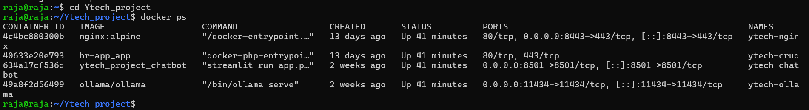
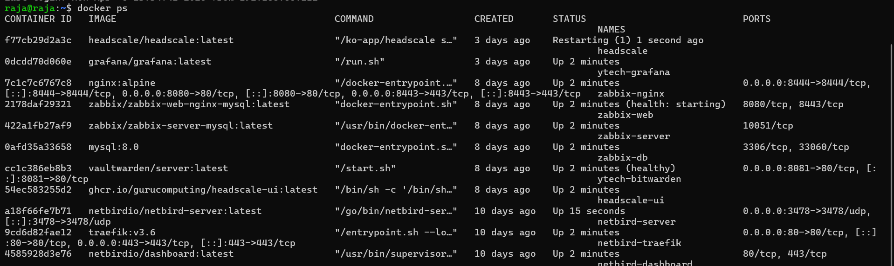

# Gestion des serveurs

## Vue d'ensemble

L'infrastructure de Ytech Solutions repose sur **3 serveurs principaux** hébergés sur le PC de Raja, plus les serveurs additionnels hébergés par Meryem. Tous les services sont conteneurisés avec Docker pour garantir l'isolation, la reproductibilité et la facilité de gestion.

> 💶 **Dimension financière** : La conteneurisation Docker représente un gain considérable en temps de déploiement et de maintenance. Un déploiement manuel de tous ces services prendrait plusieurs jours par serveur. Avec Docker Compose, l'ensemble est déployé en **moins d'une heure**, reproductible à l'identique sur n'importe quelle machine. En entreprise, ce gain se traduit directement en **réduction des coûts d'exploitation**.

---

## VM1 — APP Server

### Caractéristiques

| Attribut | Valeur |
|---|---|
| **OS** | Ubuntu 24.04 LTS |
| **IP Host-Only** | `192.168.56.20` |
| **IP Bridge** | `192.168.9.253` |
| **VLAN cible** | VLAN 20 — APP |
| **Responsable** | Raja |

### Services déployés

| Service | Port | Accès |
|---|---|---|
| YtechBot (Streamlit) | `8501` (HTTPS) | Réseau interne |
| Ollama API | `11434` | Interne uniquement |
| CRUD RH (Apache+PHP) | `8443` (HTTPS) | Réseau interne |

### État des containers


*Containers actifs sur VM1 — YtechBot, Ollama, CRUD RH*

:::info Déploiement VM1
Configuration Docker Compose et étapes de déploiement complètes → [DevOps & Déploiement](/devops/deploiement-ubuntu)
:::

---

## VM2 — DB Server

### Caractéristiques

| Attribut | Valeur |
|---|---|
| **OS** | Ubuntu 24.04 LTS |
| **IP Host-Only** | `192.168.56.25` |
| **IP Bridge** | `192.168.10.2` |
| **VLAN cible** | VLAN 25 — DB |
| **Responsable** | Raja |

### Services déployés

| Service | Port | Accès autorisé depuis |
|---|---|---|
| MariaDB | `3306` | VM1 + Web Server uniquement |
| SSH | `2222` | Équipe admin uniquement |

### État du container


*Container MariaDB actif sur VM2 — DB Server*

:::info Déploiement VM2
Configuration Docker Compose et étapes de déploiement complètes → [DevOps & Déploiement](/devops/deploiement-ubuntu)
:::

---

## VM3 — Monitoring Server

### Caractéristiques

| Attribut | Valeur |
|---|---|
| **OS** | Ubuntu 24.04 LTS |
| **IP Host-Only** | `192.168.56.30` |
| **IP Bridge** | `192.168.10.5` |
| **VLAN cible** | VLAN 30 — MGMT |
| **Responsable** | Raja |

### Services déployés

| Service | Port | URL d'accès |
|---|---|---|
| Zabbix Web | `8443` (HTTPS) | `https://192.168.56.30:8443` |
| Bitwarden | `8444` (HTTPS) | `https://192.168.56.30:8444` |
| Nessus | `8834` (HTTPS) | `https://192.168.56.30:8834` |
| Headscale API | `8085` | `http://192.168.56.30:8085` |
| Headscale UI | `9080` | `http://192.168.56.30:9080` |
| Grafana | `3000` | `http://192.168.56.30:3000` |

### État des containers


*Containers monitoring actifs sur VM3 — Zabbix, Bitwarden, Nessus, Headscale, Grafana*

:::info Déploiement VM3
Configuration Docker Compose complète (Zabbix, Bitwarden, Nessus, Headscale, Grafana) et étapes de déploiement → [DevOps & Déploiement](/devops/docker-compose)
:::

---

## Monitoring de l'infrastructure

### Zabbix — Hosts surveillés

Zabbix surveille en temps réel l'ensemble des serveurs via des agents installés sur chaque VM :

| Host Zabbix | IP surveillée | Rôle | Statut |
|---|---|---|---|
| VM1-APP-Server | `192.168.56.20` | Chatbot + CRUD RH | ✅ Vert |
| VM2-DB-Server | `192.168.56.25` | MariaDB | ✅ Vert |
| VM3-MGMT | `192.168.56.30` | Monitoring | ✅ Vert |
| Web-Server-Meryem | `192.168.10.21` | Laravel + WAF | ✅ Vert |


*Dashboard Zabbix — tous les hosts en statut vert*

### Installation agent Zabbix sur chaque VM

```bash
# Sur chaque VM à surveiller
wget https://repo.zabbix.com/zabbix/7.4/release/ubuntu/pool/main/z/\
zabbix-release/zabbix-release_latest_7.4+ubuntu24.04_all.deb

sudo dpkg -i zabbix-release_latest_7.4+ubuntu24.04_all.deb
sudo apt update && sudo apt install -y zabbix-agent

# Configuration
sudo nano /etc/zabbix/zabbix_agentd.conf
# Server=192.168.56.30
# ServerActive=192.168.56.30
# Hostname=NOM_DU_SERVEUR

sudo systemctl restart zabbix-agent
sudo systemctl enable zabbix-agent
```

---

:::info Hardening des serveurs
La configuration SSH, UFW et fail2ban détaillée pour chaque VM est documentée dans la section [Hardening](/hardening/hardening-linux).
:::

---

## Récapitulatif URLs d'accès

| Service | URL | Réseau |
|---|---|---|
| **YtechBot** | `https://192.168.9.253:8501` | Bridge (classe) |
| **CRUD RH** | `https://192.168.9.253:8443/hr-app/login.php` | Bridge (classe) |
| **Zabbix** | `https://192.168.10.5:8443` | Bridge (classe) |
| **Bitwarden** | `https://192.168.10.5:8444` | Bridge (classe) |
| **Nessus** | `https://192.168.10.5:8834` | Bridge (classe) |
| **Grafana** | `http://192.168.10.5:3000` | Bridge (classe) |
| **Headscale UI** | `http://192.168.10.5:9080` | Bridge (classe) |
| **MariaDB** | `192.168.10.2:3306` | Interne uniquement |

:::tip Production réelle
En production, les IPs Host-Only (`192.168.56.x`) seraient remplacées par les IPs des VLANs réels : VM1 → `192.168.20.20`, VM2 → `192.168.25.10`, VM3 → `192.168.30.10`. La structure Docker et les configurations restent identiques.
:::
