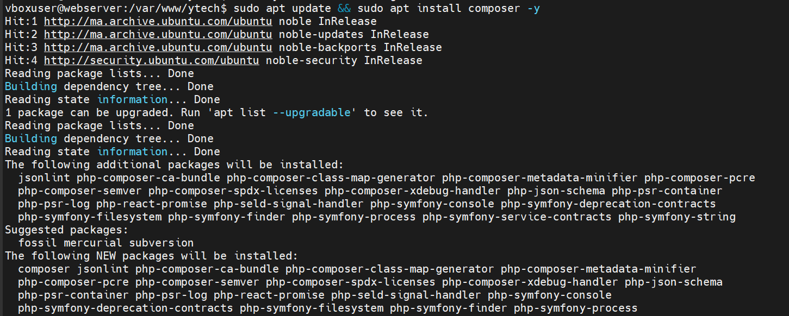
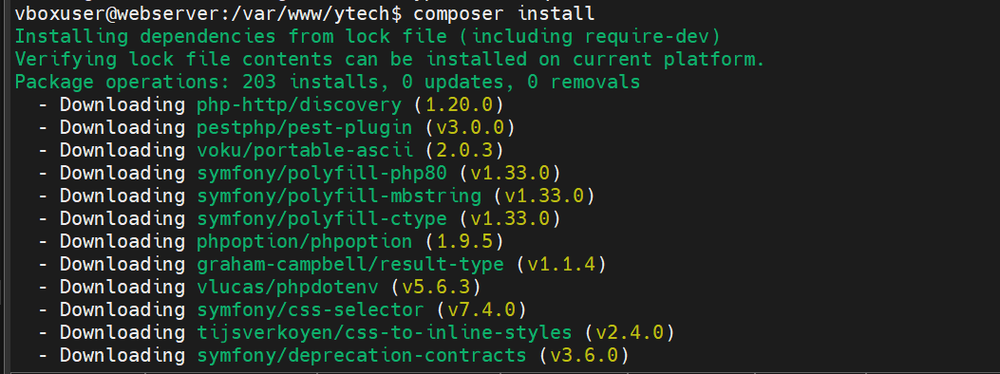
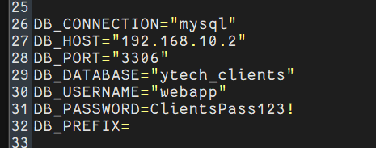
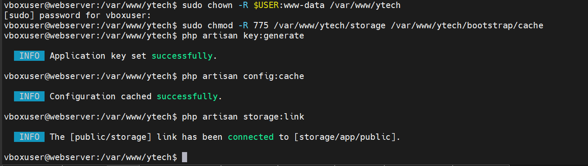
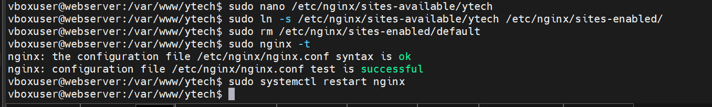
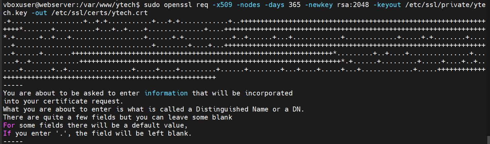

## 1. Présentation de l'Application
 
**Ytech Solutions** est une application web e-commerce développée avec le framework **Laravel** (PHP). Elle permet à l'entreprise de présenter et vendre ses packs de développement web à destination des PME.
 
### Caractéristiques principales
 
| Propriété | Valeur |
|-----------|--------|
| Framework | Laravel (PHP) |
| Base de données | MySQL 8.0 (serveur distant) |
| Serveur web | Nginx |
| Langage | PHP 8.3 |
| URL | `https://192.168.10.21` |
| OS Serveur Web | Ubuntu 24.04.4 LTS |
| Serveur DB | `192.168.10.2` |
 
### Ce que fait l'application
 
- Présentation des services de Ytech Solutions (packs web, maintenance, hébergement)
- Vente de packs de développement web aux PME
- Gestion des commandes et des clients (`ytech_clients`)
- Panier d'achat et système de paiement
- Tableau de bord administrateur complet
 
---
 
## 2. Architecture Technique
 
```
┌──────────────────────────────────────────────────────────────────┐
│                      Client (Navigateur)                          │
│                   https://192.168.10.21                         │
└────────────────────────────┬─────────────────────────────────────┘
                             │ HTTPS (TLS 1.2/1.3) Port 443
                             ▼
┌──────────────────────────────────────────────────────────────────┐
│           Nginx (Reverse Proxy + Web Server)                      │
│   IP: 192.168.10.21                                             │
│   - SSL Termination (certificat auto-signé ytech.crt)            │
│   - Redirection HTTP (80) → HTTPS (443)                          │
│   - Headers de sécurité                                           │
│   - Sert les fichiers statiques de /var/www/ytech/public/        │
└────────────────────────────┬─────────────────────────────────────┘
                             │ FastCGI via socket UNIX
                             ▼
┌──────────────────────────────────────────────────────────────────┐
│           PHP-FPM 8.3 (PHP FastCGI Process Manager)               │
│   - Exécute le code Laravel/PHP                                   │
│   - Gestion des sessions et du cache                             │
│   - Socket: /var/run/php/php8.3-fpm.sock                         │
└────────────────────────────┬─────────────────────────────────────┘
                             │ TCP/IP Port 3306 (réseau interne)
                             ▼
┌──────────────────────────────────────────────────────────────────┐
│           MySQL 8.0 – Serveur de Base de Données Distant          │
│   IP: 192.168.10.2  |  Port: 3306                                 │
│   Database: ytech_clients                                         │
│   Utilisateur: webapp                                             │
└──────────────────────────────────────────────────────────────────┘
 
Structure des fichiers sur le serveur web :
/var/www/ytech/
├── app/              ← Logique métier (Models, Controllers, Middleware)
│   ├── Http/
│   │   ├── Controllers/
│   │   └── Middleware/
│   └── Models/
├── bootstrap/        ← Cache et initialisation de l'application
├── config/           ← Configuration (database.php, app.php, mail.php…)
├── database/         ← Migrations et seeders
├── public/           ← Document root Nginx (index.php + assets)
├── resources/        ← Vues Blade, CSS, JS
├── routes/           ← Définition des routes (web.php, api.php)
├── storage/          ← Logs, cache, fichiers uploadés
├── vendor/           ← Dépendances Composer (non versionné)
└── .env              ← Variables d'environnement (SECRETS – ne jamais commit)
```
 
---
 

 
---
 
## 7. Clonage du Dépôt GitHub (Ytech)
 
### Navigation et clonage
 
```bash
cd /var/www
sudo git clone https://github.com/meeryyy/ytech.git
```
 

 
**Résultat :** 3800 objets téléchargés, 27.58 MiB de données transférées à 5.96 MiB/s — dépôt cloné dans `/var/www/ytech/`
 
### Structure complète du dépôt Laravel
 
```
/var/www/ytech/
│
├── app/
│   ├── Http/
│   │   ├── Controllers/        ← Logique de traitement des requêtes
│   │   │   ├── Auth/
│   │   │   └── Shop/
│   │   ├── Middleware/         ← Filtres avant/après requêtes
│   │   └── Requests/           ← Validation des formulaires
│   ├── Models/                 ← Représentation des tables DB (Eloquent)
│   ├── Providers/              ← Service providers Laravel
│   └── Services/               ← Logique métier réutilisable
│
├── bootstrap/
│   ├── app.php                 ← Initialisation de l'application
│   └── cache/                  ← Cache de configuration/routes
│
├── config/
│   ├── app.php                 ← Configuration générale
│   ├── database.php            ← Connexions DB (lit le .env)
│   └── session.php
│
├── database/
│   ├── migrations/             ← Historique du schéma DB
│   └── seeders/                ← Données initiales
│
├── public/                     ← SEUL dossier exposé par Nginx
│   ├── index.php               ← Point d'entrée unique
│   ├── css/ js/
│   └── storage/                ← Lien symbolique vers storage/app/public
│
├── resources/
│   ├── views/                  ← Templates Blade (.blade.php)
│   └── lang/                   ← Traductions
│
├── routes/
│   ├── web.php                 ← Routes frontend
│   └── api.php                 ← Routes API REST
│
├── storage/
│   ├── app/public/             ← Fichiers uploadés (images, etc.)
│   ├── framework/cache/        ← Cache applicatif
│   └── logs/                   ← Fichiers de log Laravel
│
├── vendor/                     ← Dépendances Composer (auto-généré)
├── .env                        ← Variables secrètes (non versionné !)
├── .env.example                ← Template des variables
├── artisan                     ← CLI Laravel
├── composer.json               ← Déclaration des dépendances
└── composer.lock               ← Versions exactes verrouillées
```
 
> ⚠️ **Sécurité :** Le fichier `.env` doit figurer dans `.gitignore`. Ne jamais pousser les credentials sur GitHub.
 
---
 
## 8. Installation de Composer et des Dépendances Laravel
 
### 8.1 Installation de Composer
 
Composer est le gestionnaire de dépendances PHP. Il lit `composer.json` et télécharge tous les packages nécessaires dans le dossier `vendor/`.
 
```bash
sudo apt update && sudo apt install composer -y
```
 

 
### 8.2 Installation des dépendances du projet
 
```bash
cd /var/www/ytech
composer install
```
 

 
**Résultat :** 203 packages installés depuis le `composer.lock`, incluant :
 
| Package | Version | Rôle |
|---------|---------|------|
| `laravel/framework` | 10.x | Framework principal |
| `symfony/polyfill-php80` | v1.33.0 | Compatibilité PHP 8 |
| `vlucas/phpdotenv` | v5.6.3 | Lecture du fichier `.env` |
| `tijsverkoyen/css-to-inline-styles` | v2.4.0 | Emails HTML |
| `graham-campbell/result-type` | v1.1.4 | Gestion des erreurs typées |
| `symfony/css-selector` | v7.4.0 | Parsing CSS |
| `pestphp/pest-plugin` | v3.0.0 | Tests unitaires |
 
### 8.3 Comprendre composer.json
 
```json
{
    "name": "ytech/solutions",
    "require": {
        "php": "^8.1",
        "laravel/framework": "^10.0",
        "laravel/sanctum": "^3.2",
        "guzzlehttp/guzzle": "^7.2"
    },
    "require-dev": {
        "pestphp/pest": "^2.0",
        "fakerphp/faker": "^1.9"
    },
    "autoload": {
        "psr-4": {
            "App\\": "app/",
            "Database\\Factories\\": "database/factories/",
            "Database\\Seeders\\":   "database/seeders/"
        }
    },
    "scripts": {
        "post-install-cmd": [
            "@php artisan key:generate --ansi"
        ]
    }
}
```
 
```bash
# En production : sans les dépendances de dev, avec autoload optimisé
composer install --no-dev --optimize-autoloader
 
# Vérifier les dépendances installées
composer show
 
# Mettre à jour une dépendance spécifique
composer update laravel/framework
```
 
---
 
## 9. Configuration de l'Environnement (.env)
 
### 9.1 Copie du fichier d'exemple
 
```bash
cd /var/www/ytech
cp .env.example .env
nano .env
```
 

 
### 9.2 Contenu du fichier .env – configuration réelle
 
Comme visible dans la capture d'écran, la configuration de base de données pointe vers le **serveur DB distant** (`192.168.10.2`) :
 

 
```env
# ============================================
# APPLICATION
# ============================================
APP_NAME="Ytech Solutions"
APP_ENV=production
APP_KEY=                          # Généré avec: php artisan key:generate
APP_DEBUG=false                   # CRITIQUE: toujours false en production
APP_URL=https://192.168.10.21
 
# ============================================
# BASE DE DONNÉES – SERVEUR DISTANT
# ============================================
DB_CONNECTION="mysql"
DB_HOST="192.168.10.2"            # Adresse IP du serveur DB dédié
DB_PORT="3306"                    # Port MySQL standard
DB_DATABASE="ytech_clients"       # Nom de la base de données
DB_USERNAME="webapp"              # Utilisateur avec droits limités
DB_PASSWORD="ClientsPass123!"     # Mot de passe
DB_PREFIX=                        # Pas de préfixe pour les tables
 
# ============================================
# CACHE ET SESSIONS
# ============================================
CACHE_DRIVER=file
SESSION_DRIVER=file
SESSION_LIFETIME=120
QUEUE_CONNECTION=sync
 
# ============================================
# STOCKAGE DES FICHIERS
# ============================================
FILESYSTEM_DISK=local
 
# ============================================
# MAIL
# ============================================
MAIL_MAILER=smtp
MAIL_HOST=smtp.mailtrap.io
MAIL_PORT=2525
MAIL_FROM_ADDRESS=noreply@ytech.ma
MAIL_FROM_NAME="${APP_NAME}"
```
 
### 9.3 Comment Laravel lit le .env — fichier config/database.php
 
```php
<?php
// config/database.php — Laravel lit les variables via la fonction env()
 
return [
    'default' => env('DB_CONNECTION', 'mysql'),
 
    'connections' => [
        'mysql' => [
            'driver'      => 'mysql',
            'host'        => env('DB_HOST', '127.0.0.1'),   // → 192.168.10.2
            'port'        => env('DB_PORT', '3306'),          // → 3306
            'database'    => env('DB_DATABASE', 'forge'),     // → ytech_clients
            'username'    => env('DB_USERNAME', 'forge'),     // → webapp
            'password'    => env('DB_PASSWORD', ''),          // → ClientsPass123!
            'prefix'      => env('DB_PREFIX', ''),
            'charset'     => 'utf8mb4',
            'collation'   => 'utf8mb4_unicode_ci',
            'strict'      => true,
            'engine'      => null,
        ],
    ],
];
```
 
> ⚠️ **Règle absolue :** Le fichier `.env` ne doit **jamais** être versionné dans Git. Vérifier que `.gitignore` contient bien la ligne `.env`.
 
---
 
## 10. Configuration PHP Artisan
 
### 10.1 Commandes d'initialisation Laravel
 
```bash
# 1. Définir les permissions (www-data = utilisateur Nginx/PHP-FPM)
sudo chown -R $USER:www-data /var/www/ytech
sudo chmod -R 775 /var/www/ytech/storage /var/www/ytech/bootstrap/cache
 
# 2. Générer la clé d'application AES-256 (stockée dans APP_KEY du .env)
php artisan key:generate
 
# 3. Mettre en cache la configuration pour les performances
php artisan config:cache
 
# 4. Créer le lien symbolique storage → public
php artisan storage:link
```
 

 
**Résultats :**
- ✅ `Application key set successfully.`
- ✅ `Configuration cached successfully.`
- ✅ `The [public/storage] link has been connected to [storage/app/public].`
 
### 10.2 Fonctionnement interne du fichier `artisan`
 
```php
#!/usr/bin/env php
<?php
// artisan — fichier à la racine du projet
 
// 1. Charge l'autoloader Composer (toutes les classes disponibles)
require __DIR__.'/vendor/autoload.php';
 
// 2. Bootstrappe l'application Laravel (conteneur IoC, services…)
$app = require_once __DIR__.'/bootstrap/app.php';
 
// 3. Résout le kernel Console depuis le conteneur
$kernel = $app->make(Illuminate\Contracts\Console\Kernel::class);
 
// 4. Exécute la commande passée en argument (ex: key:generate)
$status = $kernel->handle(
    $input  = new Symfony\Component\Console\Input\ArgvInput,
    $output = new Symfony\Component\Console\Output\ConsoleOutput
);
 
$kernel->terminate($input, $status);
exit($status);
```
 
### 10.3 Autres commandes Artisan utiles
 
```bash
# Lister toutes les commandes
php artisan list
 
# Vider les caches
php artisan config:clear && php artisan cache:clear
php artisan route:clear && php artisan view:clear
 
# Afficher les routes définies
php artisan route:list
 
# Optimiser pour la production
php artisan optimize
 
# Mode maintenance
php artisan down --message="Maintenance en cours" --retry=60
php artisan up
 
# Migrations
php artisan migrate
php artisan migrate:status
php artisan migrate:rollback
```
 
---
 
## 11. Connexion à la Base de Données Distante
 
### 11.1 Architecture DB séparée
 
Le **serveur web** (`192.168.10.21`) et le **serveur de base de données** (`192.168.10.2`) sont deux machines distinctes. Cette séparation est une bonne pratique de sécurité : même si le serveur web est compromis, l'attaquant n'a pas d'accès direct au système de fichiers de la DB.
 
```
Serveur Web (192.168.10.21)
        │
        │  TCP Port 3306 — réseau interne uniquement
        │
Serveur DB (192.168.10.2)
  └── MySQL 8.0
        └── Database: ytech_clients
              └── User: webapp
                    └── Autorisé uniquement depuis 192.168.10.21
```
 
### 11.2 Configuration sur le serveur DB (192.168.10.2)
 
```sql
-- Connexion root sur le serveur DB
sudo mysql -u root
 
-- Créer la base de données
CREATE DATABASE ytech_clients
  CHARACTER SET utf8mb4
  COLLATE utf8mb4_unicode_ci;
 
-- Créer l'utilisateur 'webapp' autorisé UNIQUEMENT depuis le serveur web
-- Principe du moindre privilège : accès refusé depuis toute autre IP
CREATE USER 'webapp'@'192.168.10.21' IDENTIFIED BY 'ClientsPass123!';
 
-- Accorder les permissions nécessaires uniquement
GRANT SELECT, INSERT, UPDATE, DELETE
    ON ytech_clients.*
    TO 'webapp'@'192.168.10.21';
 
FLUSH PRIVILEGES;
EXIT;
```
 
### 11.3 Autoriser MySQL à écouter sur le réseau interne
 
```bash
# Sur le serveur DB (192.168.10.2)
sudo nano /etc/mysql/mysql.conf.d/mysqld.cnf
```
 
```ini
# Remplacer 127.0.0.1 par l'IP du serveur DB
# bind-address = 127.0.0.1   ← commenter cette ligne
bind-address = 192.168.10.2
```
 
```bash
sudo systemctl restart mysql
```
 
### 11.4 Test de la connexion depuis le serveur web
 
```bash
# Depuis 192.168.10.21 — tester la connexion MySQL distante
mysql -h 192.168.10.2 -u webapp -p ytech_clients
# Entrer: ClientsPass123!
# Résultat attendu: mysql>
 
# Test rapide via PHP
php -r "
  try {
      \$pdo = new PDO(
          'mysql:host=192.168.10.2;port=3306;dbname=ytech_clients',
          'webapp',
          'ClientsPass123!'
      );
      echo 'Connexion DB réussie !' . PHP_EOL;
  } catch (PDOException \$e) {
      echo 'Erreur: ' . \$e->getMessage() . PHP_EOL;
  }
"
```
 
### 11.5 Comment Laravel établit la connexion PDO
 
```php
<?php
// Simplifié — Illuminate\Database\Connectors\MySqlConnector
 
namespace Illuminate\Database\Connectors;
 
use PDO;
 
class MySqlConnector extends Connector implements ConnectorInterface
{
    public function connect(array $config): PDO
    {
        // Construit le DSN: mysql:host=192.168.10.2;port=3306;dbname=ytech_clients
        $dsn = "mysql:host={$config['host']};port={$config['port']};dbname={$config['database']}";
 
        // Options PDO de sécurité
        $options = [
            PDO::ATTR_ERRMODE            => PDO::ERRMODE_EXCEPTION,
            PDO::ATTR_DEFAULT_FETCH_MODE => PDO::FETCH_ASSOC,
            PDO::ATTR_EMULATE_PREPARES   => false, // Requêtes préparées natives
        ];
 
        // Création de la connexion
        $connection = new PDO($dsn, $config['username'], $config['password'], $options);
 
        // Jeu de caractères UTF-8
        $connection->exec("set names '{$config['charset']}'");
 
        return $connection;
    }
}
```
 
---
 
## 12. Configuration Nginx
 
### 12.1 Création du fichier de configuration
 
```bash
sudo nano /etc/nginx/sites-available/ytech
```
 
**Contenu complet du fichier `/etc/nginx/sites-available/ytech` :**
 
```nginx
# ============================================================
# BLOC HTTP (Port 80) – Redirection forcée vers HTTPS
# ============================================================
server {
    listen 80;
    listen [::]:80;
    server_name 192.168.10.21;
 
    # Redirection permanente 301 → HTTPS
    return 301 https://$server_name$request_uri;
}
 
# ============================================================
# BLOC HTTPS (Port 443) – Configuration principale sécurisée
# ============================================================
server {
    listen 443 ssl;
    listen [::]:443 ssl;
    server_name 192.168.10.21;
 
    # Document root : UNIQUEMENT le dossier public/
    root /var/www/ytech/public;
    index index.php index.html;
 
    # --------------------------------------------------------
    # CERTIFICAT TLS AUTO-SIGNÉ
    # --------------------------------------------------------
    ssl_certificate     /etc/ssl/certs/ytech.crt;
    ssl_certificate_key /etc/ssl/private/ytech.key;
 
    ssl_protocols             TLSv1.2 TLSv1.3;
    ssl_ciphers               ECDHE-RSA-AES256-GCM-SHA512:DHE-RSA-AES256-GCM-SHA512:ECDHE-RSA-AES256-GCM-SHA384;
    ssl_prefer_server_ciphers on;
    ssl_session_cache         shared:SSL:10m;
    ssl_session_timeout       10m;
 
    # --------------------------------------------------------
    # HEADERS DE SÉCURITÉ
    # --------------------------------------------------------
    add_header Strict-Transport-Security "max-age=31536000; includeSubDomains" always;
    add_header X-Frame-Options           "SAMEORIGIN"                          always;
    add_header X-Content-Type-Options    "nosniff"                             always;
    add_header X-XSS-Protection          "1; mode=block"                       always;
    add_header Referrer-Policy           "strict-origin-when-cross-origin"     always;
 
    # Masquer la version de Nginx
    server_tokens off;
 
    # --------------------------------------------------------
    # GESTION DES REQUÊTES LARAVEL (Front Controller Pattern)
    # --------------------------------------------------------
    location / {
        try_files $uri $uri/ /index.php?$query_string;
    }
 
    # Passer les fichiers PHP à PHP-FPM
    location ~ \.php$ {
        include fastcgi_params;
        fastcgi_pass   unix:/var/run/php/php8.3-fpm.sock;
        fastcgi_param  SCRIPT_FILENAME $realpath_root$fastcgi_script_name;
        fastcgi_index  index.php;
        fastcgi_buffer_size 128k;
        fastcgi_buffers     4 256k;
    }
 
    # Bloquer l'accès aux fichiers cachés (.env, .git, .htaccess…)
    location ~ /\.(?!well-known).* {
        deny all;
        return 404;
    }
 
    # Cache des assets statiques
    location ~* \.(jpg|jpeg|png|gif|ico|css|js|woff2|svg)$ {
        expires 30d;
        add_header Cache-Control "public, immutable";
    }
 
    # --------------------------------------------------------
    # LOGS
    # --------------------------------------------------------
    access_log /var/log/nginx/ytech_access.log;
    error_log  /var/log/nginx/ytech_error.log warn;
}
```
 
### 12.2 Activation et test
 
```bash
# Lien symbolique pour activer le site
sudo ln -s /etc/nginx/sites-available/ytech /etc/nginx/sites-enabled/
 
# Supprimer la configuration par défaut
sudo rm /etc/nginx/sites-enabled/default
 
# Tester la syntaxe
sudo nginx -t
 
# Redémarrer
sudo systemctl restart nginx
```
 

 
**Résultat :**
```
nginx: the configuration file /etc/nginx/nginx.conf syntax is ok
nginx: configuration file /etc/nginx/nginx.conf test is successful
```
 
---
 
## 13. Sécurisation HTTPS – Certificat TLS Auto-Signé
 
### 13.1 Génération du certificat avec OpenSSL
 
```bash
sudo openssl req -x509 -nodes -days 365 \
  -newkey rsa:2048 \
  -keyout /etc/ssl/private/ytech.key \
  -out /etc/ssl/certs/ytech.crt
```
 

 
### 13.2 Informations du Distinguished Name
 
```
Country Name (2 letter code) [AU]:  MA
State or Province Name:             Casablanca-Settat
Locality Name:                      Casablanca
Organization Name:                  Ytech Solutions
Organizational Unit Name:           IT Department
Common Name (IP or FQDN):           192.168.10.21
Email Address:                      admin@ytech.ma
```
 
### 13.3 Explication de chaque option OpenSSL
 
| Option | Valeur | Description |
|--------|--------|-------------|
| `req -x509` | — | Certificat auto-signé X.509 (pas une CSR) |
| `-nodes` | — | **No DES** : clé privée non chiffrée (Nginx la lit sans mot de passe) |
| `-days 365` | 365 jours | Durée de validité |
| `-newkey rsa:2048` | RSA 2048 bits | Génère une nouvelle paire de clés |
| `-keyout` | `/etc/ssl/private/ytech.key` | Fichier de la **clé privée** |
| `-out` | `/etc/ssl/certs/ytech.crt` | Fichier du **certificat public** |
 
### 13.4 Sécurisation des permissions SSL
 
```bash
# Clé privée : accessible UNIQUEMENT par root (CRITIQUE)
sudo chmod 600 /etc/ssl/private/ytech.key
sudo chown root:root /etc/ssl/private/ytech.key
 
# Certificat public : lecture accessible par Nginx
sudo chmod 644 /etc/ssl/certs/ytech.crt
 
# Vérifier la correspondance clé / certificat
openssl x509 -noout -modulus -in /etc/ssl/certs/ytech.crt | md5sum
openssl rsa  -noout -modulus -in /etc/ssl/private/ytech.key | md5sum
# Les deux hash doivent être identiques ✅
```
 
### 13.5 Certificat Auto-Signé vs Let's Encrypt
 
| Critère | Auto-Signé | Let's Encrypt |
|---------|-----------|---------------|
| Coût | Gratuit | Gratuit |
| Validé par une CA publique | ❌ | ✅ |
| Avertissement navigateur | ⚠️ Oui | ✅ Non |
| Renouvellement | Manuel | Automatique (90j) |
| Usage recommandé | Interne / Dev / Lab | Production / Internet |
| Nom de domaine requis | Non | Oui |
 
> 💡 **Pour production avec domaine public :**
> ```bash
> sudo apt install certbot python3-certbot-nginx -y
> sudo certbot --nginx -d ytech.ma -d www.ytech.ma
> # Renouvellement automatique :
> sudo certbot renew --dry-run
> ```
 
---
 
## 14. Redirection HTTP → HTTPS
 
### 14.1 Configuration Nginx
 
```nginx
server {
    listen 80;
    server_name 192.168.10.21;
 
    # 301 = Redirection permanente (mise en cache par le navigateur)
    # $server_name = 192.168.10.21
    # $request_uri = /chemin?paramètres conservés
    return 301 https://$server_name$request_uri;
}
```
 
### 14.2 Test de la redirection
 
```bash
# Tester la redirection 301
curl -I http://192.168.10.21
 
# Réponse attendue :
# HTTP/1.1 301 Moved Permanently
# Location: https://192.168.10.21/
 
# Suivre la redirection (ignorer avertissement certificat auto-signé)
curl -Lk http://192.168.10.21 | head -30
```
 
### 14.3 Flux complet d'une requête sécurisée
 
```
┌─────────┐  http://192.168.10.21
│ Browser │ ─────────────────────────────────────► Nginx Port 80
└─────────┘                                         │
     ▲                                              │ return 301 https://...
     │ HTTP 301 Location: https://...               │
     │ ◄──────────────────────────────────────────-─┘
     │
     │ https://192.168.10.21 (nouvelle requête automatique)
     │ ─────────────────────────────────────────────► Nginx Port 443
     │                                                │
     │                                 TLS Handshake  │
     │                          ┌─────────────────────┤
     │                          │ Envoie ytech.crt    │
     │                          │ Négociation TLS 1.3  │
     │                          │ Chiffrement AES-256 │
     │                          └─────────────────────┤
     │                                                │
     │                                                │ PHP-FPM (socket UNIX)
     │                                                ▼
     │                                         Laravel traite
     │                                         PDO → MySQL (192.168.10.2)
     │                                         Retourne HTML
     │
     │ Réponse chiffrée TLS
     │ ◄──────────────────────────────────────────────
```
 
### 14.4 Forcer HTTPS dans Laravel (niveau applicatif)
 
```php
// app/Providers/AppServiceProvider.php
<?php
 
namespace App\Providers;
 
use Illuminate\Support\ServiceProvider;
use Illuminate\Support\Facades\URL;
 
class AppServiceProvider extends ServiceProvider
{
    public function boot(): void
    {
        // Forcer HTTPS pour toutes les URLs générées par Laravel
        if (config('app.env') === 'production') {
            URL::forceScheme('https');
        }
    }
}
```
 
---
 
## 15. Headers de Sécurité HTTP
 
### 15.1 Configuration Nginx complète
 
```nginx
# Dans le bloc server 443 de /etc/nginx/sites-available/ytech
 
# HSTS : Forcer HTTPS pour 1 an (31536000 secondes)
add_header Strict-Transport-Security "max-age=31536000; includeSubDomains" always;
 
# Anti-clickjacking : empêche l'affichage dans des iframes
add_header X-Frame-Options "SAMEORIGIN" always;
 
# Anti-MIME sniffing : le navigateur doit respecter le Content-Type
add_header X-Content-Type-Options "nosniff" always;
 
# Filtre XSS navigateur (protection legacy)
add_header X-XSS-Protection "1; mode=block" always;
 
# Contrôle des informations envoyées dans Referer
add_header Referrer-Policy "strict-origin-when-cross-origin" always;
 
# Content Security Policy
add_header Content-Security-Policy "
    default-src 'self';
    script-src  'self' 'unsafe-inline' 'unsafe-eval';
    style-src   'self' 'unsafe-inline' https://fonts.googleapis.com;
    font-src    'self' https://fonts.gstatic.com;
    img-src     'self' data: blob:;
    connect-src 'self';
    frame-src   'none';
" always;
```
 
### 15.2 Middleware Laravel – SecurityHeaders
 
```php
<?php
// app/Http/Middleware/SecurityHeaders.php
 
namespace App\Http\Middleware;
 
use Closure;
use Illuminate\Http\Request;
use Symfony\Component\HttpFoundation\Response;
 
class SecurityHeaders
{
    public function handle(Request $request, Closure $next): Response
    {
        $response = $next($request);
 
        $response->headers->set(
            'Strict-Transport-Security',
            'max-age=31536000; includeSubDomains'
        );
        $response->headers->set('X-Frame-Options',        'SAMEORIGIN');
        $response->headers->set('X-Content-Type-Options', 'nosniff');
        $response->headers->set('X-XSS-Protection',       '1; mode=block');
        $response->headers->set(
            'Referrer-Policy',
            'strict-origin-when-cross-origin'
        );
 
        // Supprimer les headers qui révèlent la stack technique
        $response->headers->remove('X-Powered-By');
        $response->headers->remove('Server');
 
        return $response;
    }
}
```
 
```php
<?php
// app/Http/Kernel.php — Enregistrement du middleware
 
namespace App\Http;
 
use Illuminate\Foundation\Http\Kernel as HttpKernel;
 
class Kernel extends HttpKernel
{
    // Appliqué à TOUTES les requêtes HTTP
    protected $middleware = [
        \App\Http\Middleware\TrustProxies::class,
        \Illuminate\Http\Middleware\HandleCors::class,
        \App\Http\Middleware\PreventRequestsDuringMaintenance::class,
        \Illuminate\Foundation\Http\Middleware\ValidatePostSize::class,
        \App\Http\Middleware\TrimStrings::class,
        \Illuminate\Foundation\Http\Middleware\ConvertEmptyStringsToNull::class,
        \App\Http\Middleware\SecurityHeaders::class,  // ← Notre middleware
    ];
 
    protected $middlewareGroups = [
        'web' => [
            \App\Http\Middleware\EncryptCookies::class,
            \Illuminate\Cookie\Middleware\AddQueuedCookiesToResponse::class,
            \Illuminate\Session\Middleware\StartSession::class,
            \Illuminate\View\Middleware\ShareErrorsFromSession::class,
            \App\Http\Middleware\VerifyCsrfToken::class,  // Protection CSRF
            \Illuminate\Routing\Middleware\SubstituteBindings::class,
        ],
    ];
}
```
 
---
 
## 16. Résultat Final – Application en Ligne
 
Après toutes les étapes de configuration, l'application Ytech Solutions est accessible via HTTPS :
 

 
**URL :** `https://192.168.10.21`
 
**Interface visible :**
- Header avec logo **YTECH SOLUTIONS** — *"Technology That Empowers"*
- Barre de recherche de produits avec option scan photo
- Panier d'achat et gestion de compte utilisateur
- Section hero : *"Votre partenaire digital pour des projets web performants"*
- Compteur : *"+10 Projets Réussis"*
 
> ⚠️ L'indication **"Not secure"** dans la barre d'adresse est normale pour un certificat auto-signé — le navigateur ne reconnaît pas l'autorité de certification car elle n'est pas enregistrée auprès d'une CA publique. Le chiffrement TLS est néanmoins actif : les données sont bien chiffrées en transit.
 
---
 
## 17. Fonctionnement Interne de Laravel
 
### 17.1 Cycle de vie complet d'une requête HTTP
 
```
1.  Navigateur → GET https://192.168.10.21/products
                   │
2.  Nginx (Port 443) — déchiffre TLS, passe à PHP-FPM
                   │
3.  public/index.php — seul fichier PHP accessible depuis le web
    ├── require vendor/autoload.php
    └── $app = require bootstrap/app.php
                   │
4.  bootstrap/app.php — conteneur IoC Laravel
    ├── Binding des interfaces (DB, Mail, Cache…)
    └── Chargement des Service Providers
                   │
5.  HTTP Kernel — middlewares globaux
    ├── TrustProxies
    ├── HandleCors
    └── SecurityHeaders
                   │
6.  Router (routes/web.php)
    ├── Route trouvée: GET /products → ProductController@index
    └── Middlewares de groupe 'web'
        ├── StartSession
        ├── VerifyCsrfToken
        └── Auth (si route protégée)
                   │
7.  ProductController@index
    └── Appelle Model Eloquent
                   │
8.  Eloquent ORM — génère le SQL, PDO → MySQL (192.168.10.2:3306)
    └── Retourne Collection d'objets Product
                   │
9.  Vue Blade — compile template → HTML pur
                   │
10. HTTP Response → Nginx → chiffrement TLS → Client
```
 
### 17.2 Définition des routes
 
```php
<?php
// routes/web.php
 
use App\Http\Controllers\Shop\ProductController;
use App\Http\Controllers\Shop\CartController;
use App\Http\Controllers\Auth\LoginController;
use Illuminate\Support\Facades\Route;
 
// Page d'accueil
Route::get('/', fn() => view('shop.home'))->name('home');
 
// Catalogue produits
Route::get('/products',       [ProductController::class, 'index'])->name('products.index');
Route::get('/products/{slug}',[ProductController::class, 'show']) ->name('products.show');
 
// Panier
Route::post  ('/cart/add',    [CartController::class, 'store'])  ->name('cart.add');
Route::get   ('/cart',        [CartController::class, 'index'])  ->name('cart.index');
Route::delete('/cart/{id}',   [CartController::class, 'destroy'])->name('cart.remove');
 
// Routes protégées
Route::middleware(['auth'])->group(function () {
    Route::get('/dashboard', fn() => view('admin.dashboard'))->name('dashboard');
    Route::resource('/orders', OrderController::class);
});
 
// Auth
Route::get ('/login',  [LoginController::class, 'showLoginForm'])->name('login');
Route::post('/login',  [LoginController::class, 'login']);
Route::post('/logout', [LoginController::class, 'logout'])->name('logout');
```
 
### 17.3 Controller – ProductController
 
```php
<?php
// app/Http/Controllers/Shop/ProductController.php
 
namespace App\Http\Controllers\Shop;
 
use App\Http\Controllers\Controller;
use App\Models\Product;
use Illuminate\Http\Request;
 
class ProductController extends Controller
{
    /**
     * Liste paginée des produits avec filtres
     */
    public function index(Request $request)
    {
        $query = Product::query()
            ->where('status', 'active')
            ->with(['category', 'images']); // Eager loading — évite le problème N+1
 
        // Filtrage optionnel par catégorie
        if ($request->filled('category')) {
            $query->whereHas('category', function ($q) use ($request) {
                $q->where('slug', $request->category);
            });
        }
 
        // Recherche par nom
        if ($request->filled('search')) {
            $query->where('name', 'like', '%' . $request->search . '%');
        }
 
        $products = $query->orderBy('created_at', 'desc')->paginate(12);
 
        return view('shop.products.index', compact('products'));
    }
 
    /**
     * Détail d'un produit par son slug
     */
    public function show(string $slug)
    {
        $product = Product::where('slug', $slug)
            ->where('status', 'active')
            ->with(['category', 'images', 'reviews'])
            ->firstOrFail(); // Lève une exception 404 si non trouvé
 
        $relatedProducts = Product::where('category_id', $product->category_id)
            ->where('id', '!=', $product->id)
            ->limit(4)
            ->get();
 
        return view('shop.products.show', compact('product', 'relatedProducts'));
    }
}
```
 
### 17.4 Model Eloquent – Product
 
```php
<?php
// app/Models/Product.php
 
namespace App\Models;
 
use Illuminate\Database\Eloquent\Model;
use Illuminate\Database\Eloquent\Factories\HasFactory;
use Illuminate\Database\Eloquent\SoftDeletes;
 
class Product extends Model
{
    use HasFactory, SoftDeletes;
 
    protected $table    = 'products';
    protected $fillable = ['name','slug','description','price','status','category_id','stock'];
 
    protected $casts = [
        'price'      => 'decimal:2',
        'created_at' => 'datetime',
    ];
 
    // ── RELATIONS ───────────────────────────────────────────
    public function category()  { return $this->belongsTo(Category::class); }
    public function images()    { return $this->hasMany(ProductImage::class); }
    public function reviews()   { return $this->hasMany(Review::class); }
    public function orders()    {
        return $this->belongsToMany(Order::class, 'order_items')
                    ->withPivot('quantity', 'price')
                    ->withTimestamps();
    }
 
    // ── SCOPES ──────────────────────────────────────────────
    public function scopeActive($query)  { return $query->where('status', 'active'); }
    public function scopeInStock($query) { return $query->where('stock', '>', 0); }
 
    // ── ACCESSEUR ───────────────────────────────────────────
    public function getFormattedPriceAttribute(): string
    {
        return number_format($this->price, 2) . ' MAD';
    }
}
```
 
### 17.5 Controller Panier – CartController
 
```php
<?php
// app/Http/Controllers/Shop/CartController.php
 
namespace App\Http\Controllers\Shop;
 
use App\Http\Controllers\Controller;
use App\Models\Product;
use Illuminate\Http\Request;
 
class CartController extends Controller
{
    public function store(Request $request)
    {
        // Validation stricte — protège contre les entrées malveillantes
        $validated = $request->validate([
            'product_id' => 'required|integer|exists:products,id',
            'quantity'   => 'required|integer|min:1|max:99',
        ]);
 
        $product = Product::active()->findOrFail($validated['product_id']);
        $cart    = session()->get('cart', []);
        $id      = $product->id;
 
        if (isset($cart[$id])) {
            $cart[$id]['quantity'] += $validated['quantity'];
        } else {
            $cart[$id] = [
                'name'     => $product->name,
                'price'    => $product->price,
                'quantity' => $validated['quantity'],
                'image'    => $product->images->first()?->url,
            ];
        }
 
        session()->put('cart', $cart);
 
        return redirect()->route('cart.index')
                         ->with('success', 'Produit ajouté au panier !');
    }
 
    public function index()
    {
        $cart  = session()->get('cart', []);
        $total = collect($cart)->sum(fn($i) => $i['price'] * $i['quantity']);
        return view('shop.cart.index', compact('cart', 'total'));
    }
 
    public function destroy(int $id)
    {
        $cart = session()->get('cart', []);
        unset($cart[$id]);
        session()->put('cart', $cart);
        return redirect()->route('cart.index')->with('success', 'Article supprimé.');
    }
}
```
 
### 17.6 Vue Blade – Liste des produits
 
```blade
{{-- resources/views/shop/products/index.blade.php --}}
@extends('layouts.app')
 
@section('title', 'Nos Packs Web – Ytech Solutions')
 
@section('content')
<div class="container mx-auto px-4 py-8">
 
    <h1 class="text-3xl font-bold mb-6">Nos Packs de Développement Web</h1>
 
    {{-- Formulaire de recherche --}}
    <form action="{{ route('products.index') }}" method="GET" class="mb-6">
        <input type="text"
               name="search"
               value="{{ request('search') }}"
               placeholder="Rechercher un pack..."
               class="border rounded px-4 py-2 w-full md:w-1/3">
        <button type="submit" class="btn-primary ml-2">Rechercher</button>
    </form>
 
    <div class="grid grid-cols-1 md:grid-cols-3 gap-6">
        @forelse($products as $product)
            <div class="product-card bg-white rounded-lg shadow p-4">
 
                @if($product->images->isNotEmpty())
                    images->first()->path) }}"
                         alt="{{ $product->name }}"
                         class="w-full h-48 object-cover rounded mb-4">
                @endif
 
                <h3 class="text-lg font-semibold">{{ $product->name }}</h3>
                <p class="text-gray-600 text-sm mt-1">
                    {{ Str::limit($product->description, 100) }}
                </p>
                <p class="text-purple-600 font-bold text-xl mt-2">
                    {{ $product->formatted_price }}
                </p>
 
                <form action="{{ route('cart.add') }}" method="POST" class="mt-4">
                    @csrf
                    <input type="hidden" name="product_id" value="{{ $product->id }}">
                    <input type="number" name="quantity" value="1" min="1" max="10"
                           class="border rounded px-2 py-1 w-16 mr-2">
                    <button type="submit" class="btn-primary">Ajouter au panier</button>
                </form>
            </div>
        @empty
            <div class="col-span-3 text-center text-gray-500">
                <p>Aucun produit trouvé.</p>
            </div>
        @endforelse
    </div>
 
    <div class="mt-8">
        {{ $products->withQueryString()->links() }}
    </div>
 
</div>
@endsection
```
 
### 17.7 Migration – Création de la table products
 
```php
<?php
// database/migrations/xxxx_create_products_table.php
 
use Illuminate\Database\Migrations\Migration;
use Illuminate\Database\Schema\Blueprint;
use Illuminate\Support\Facades\Schema;
 
return new class extends Migration
{
    public function up(): void
    {
        Schema::create('products', function (Blueprint $table) {
            $table->id();
            $table->foreignId('category_id')
                  ->constrained()
                  ->onDelete('restrict');
            $table->string('name');
            $table->string('slug')->unique();
            $table->text('description')->nullable();
            $table->decimal('price', 10, 2);
            $table->unsignedInteger('stock')->default(0);
            $table->enum('status', ['active', 'inactive', 'draft'])->default('draft');
            $table->timestamps();
            $table->softDeletes();
 
            $table->index(['status', 'category_id']);
        });
    }
 
    public function down(): void
    {
        Schema::dropIfExists('products');
    }
};
```
 
### 17.8 Sécurité Laravel – Protections intégrées
 
```php
// ── 1. PROTECTION CSRF ─────────────────────────────────────
// Automatique pour POST/PUT/PATCH/DELETE via VerifyCsrfToken
// Token injecté dans les formulaires Blade avec @csrf :
<form method="POST" action="/cart/add">
    @csrf {{-- <input type="hidden" name="_token" value="aB3xK..."> --}}
</form>
 
// ── 2. ANTI-INJECTION SQL — Requêtes préparées ────────────
// ❌ DANGEREUX — interpolation directe
DB::select("SELECT * FROM products WHERE name = '$name'");
 
// ✅ SÉCURISÉ — Eloquent (bindings automatiques)
Product::where('name', $name)->get();
 
// ✅ SÉCURISÉ — Query Builder
DB::table('products')->where('slug', $slug)->first();
 
// ── 3. VALIDATION DES ENTRÉES ────────────────────────────
$validated = $request->validate([
    'name'       => 'required|string|max:255',
    'email'      => 'required|email|unique:customers',
    'price'      => 'required|numeric|min:0',
    'product_id' => 'required|integer|exists:products,id',
    'quantity'   => 'required|integer|between:1,99',
]);
 
// ── 4. PROTECTION XSS DANS LES VUES BLADE ────────────────
// {{ }} échappe automatiquement le HTML
{{ $product->name }}
// → htmlspecialchars($product->name, ENT_QUOTES, 'UTF-8')
 
// {!! !!} affiche sans échappement (à utiliser avec extrême prudence)
{!! $product->description !!}
 
// ── 5. HACHAGE DES MOTS DE PASSE ─────────────────────────
use Illuminate\Support\Facades\Hash;
 
// Lors de la création
$user->password = Hash::make($request->password);
// → $2y$12$salt.hash (bcrypt, cost 12)
 
// Lors de la connexion
if (Hash::check($request->password, $user->password)) {
    // Authentification réussie
}
```
 
---
 
## 18. Analyse de Sécurité Initiale
 
### 18.1 Points forts de la configuration mise en place
 
| Mesure de sécurité | Statut | Détail |
|--------------------|--------|--------|
| HTTPS / TLS actif | ✅ | TLS 1.2/1.3, certificat auto-signé |
| Redirection HTTP→HTTPS | ✅ | Port 80 → 301 → Port 443 |
| PHP-FPM isolé de Nginx | ✅ | Processus séparés via socket UNIX |
| Accès `.env` bloqué | ✅ | `location ~ /\. { deny all; }` dans Nginx |
| Serveur DB séparé | ✅ | `192.168.10.2` distinct de `192.168.10.21` |
| Utilisateur DB limité | ✅ | `webapp` sur `ytech_clients` depuis `192.168.10.21` seulement |
| Protection CSRF | ✅ | `VerifyCsrfToken` middleware actif |
| Requêtes SQL préparées | ✅ | Eloquent ORM — pas d'injection SQL |
| Headers de sécurité | ✅ | HSTS, X-Frame-Options, CSP, etc. |
| `server_tokens off` | ✅ | Version Nginx masquée |
 
### 18.2 Faiblesses identifiées
 
| Faiblesse | Impact CIA | Priorité |
|-----------|-----------|----------|
| Certificat auto-signé | Confidentialité | Moyenne |
| Pas de WAF | Intégrité (SQLi, XSS, LFI) | Haute |
| Pas de fail2ban | Disponibilité (brute-force SSH) | Haute |
| `APP_DEBUG` à vérifier | Confidentialité (stack trace) | Haute |
| Pas de segmentation VLAN | Confidentialité (RH accessible depuis LAN) | Haute |
| Pas de monitoring | Disponibilité (intrusions non détectées) | Haute |
| Logs non centralisés | Intégrité (analyse post-incident difficile) | Moyenne |
 
### 18.3 Commandes de durcissement recommandées
 
```bash
# 1. Pare-feu UFW
sudo ufw default deny incoming
sudo ufw default allow outgoing
sudo ufw allow 22/tcp
sudo ufw allow 80/tcp
sudo ufw allow 443/tcp
sudo ufw deny 3306/tcp   # MySQL ne doit pas être accessible de l'extérieur
sudo ufw enable
sudo ufw status verbose
 
# 2. fail2ban — protection brute-force SSH
sudo apt install fail2ban -y
sudo tee /etc/fail2ban/jail.local << 'EOF'
[sshd]
enabled  = true
maxretry = 5
bantime  = 3600
findtime = 600
EOF
sudo systemctl enable --now fail2ban
 
# 3. Vérifier APP_DEBUG
grep APP_DEBUG /var/www/ytech/.env
# Doit afficher: APP_DEBUG=false
 
# 4. Permissions strictes
find /var/www/ytech -type f -name "*.php" -exec chmod 644 {} \;
find /var/www/ytech -type d -exec chmod 755 {} \;
sudo chmod -R 775 /var/www/ytech/storage /var/www/ytech/bootstrap/cache
sudo chmod 600 /var/www/ytech/.env
 
# 5. Consulter les logs
tail -f /var/www/ytech/storage/logs/laravel.log
tail -f /var/log/nginx/ytech_error.log
tail -f /var/log/nginx/ytech_access.log
 
# 6. Vérifier les connexions actives vers la DB
netstat -an | grep 3306
```
 
---
 
## Récapitulatif des Commandes (Ordre Chronologique)
 
```bash
# 1. Connexion SSH
ssh vboxuser@192.168.10.21
 
# 2. Mise à jour système
sudo apt update && sudo apt upgrade -y
 
# 3. Installation dépendances (sans MySQL local)
sudo apt install nginx php-fpm php-mysql php-xml \
  php-curl php-gd php-mbstring php-zip php-intl php-bcmath php-cli unzip git -y
 
# 4. Clonage du projet
cd /var/www && sudo git clone https://github.com/meeryyy/ytech.git
 
# 5. Composer + dépendances Laravel
sudo apt install composer -y
cd /var/www/ytech && composer install
 
# 6. Configuration .env (DB distante 192.168.10.2)
cp .env.example .env && nano .env
 
# 7. Permissions + initialisation Laravel
sudo chown -R $USER:www-data /var/www/ytech
sudo chmod -R 775 /var/www/ytech/storage /var/www/ytech/bootstrap/cache
php artisan key:generate
php artisan config:cache
php artisan storage:link
 
# 8. Certificat SSL auto-signé
sudo openssl req -x509 -nodes -days 365 -newkey rsa:2048 \
  -keyout /etc/ssl/private/ytech.key -out /etc/ssl/certs/ytech.crt
sudo chmod 600 /etc/ssl/private/ytech.key
 
# 9. Configuration Nginx
sudo nano /etc/nginx/sites-available/ytech
sudo ln -s /etc/nginx/sites-available/ytech /etc/nginx/sites-enabled/
sudo rm /etc/nginx/sites-enabled/default
sudo nginx -t && sudo systemctl restart nginx
 
# 10. Vérification finale
curl -I  http://192.168.10.21          # Doit retourner 301
curl -Ik https://192.168.10.21         # Doit retourner 200
```
 
---
 
*Documentation rédigée dans le cadre du Projet Final JobInTech Cybersécurité – Casablanca 2026*  
*Application : Ytech Solutions (Laravel) | Serveur Web : Ubuntu 24.04.4 LTS (`192.168.10.21`) | Serveur DB : `192.168.10.2`*  
*Stack : Nginx + PHP 8.3-FPM + MySQL 8.0 (distant) | Sécurité : TLS auto-signé + Headers HTTP + CSRF + Eloquent ORM*