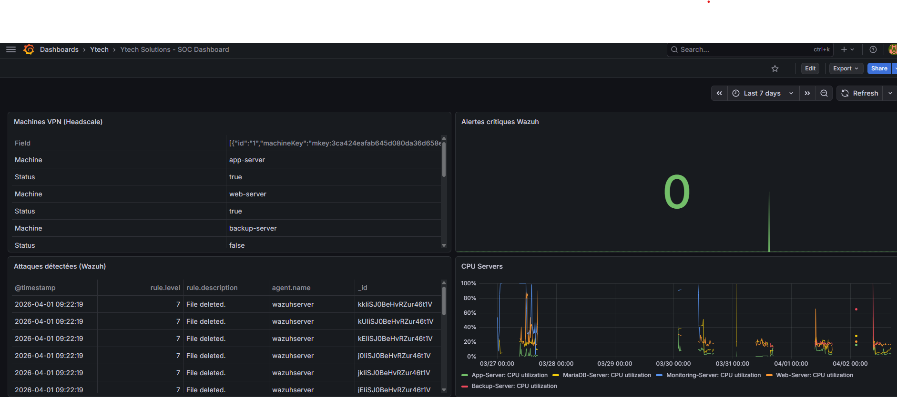
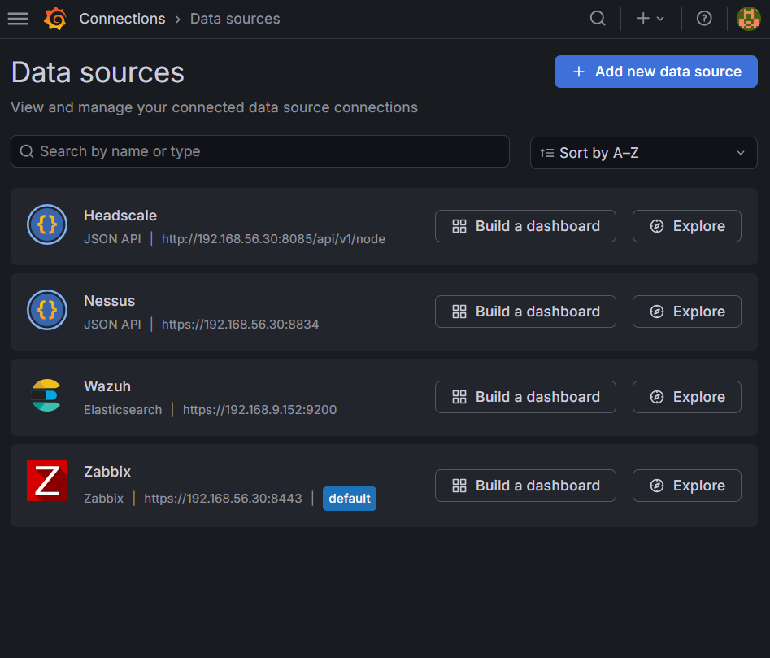

# Grafana — SOC Dashboard

## Qu'est-ce que le SOC Dashboard ?

Un **SOC (Security Operations Center) Dashboard** est un tableau de bord centralisé qui agrège toutes les données de sécurité de l'infrastructure en un seul écran. C'est la tour de contrôle de la sécurité — en un coup d'œil, on voit si tout va bien ou si une attaque est en cours.

Pour Ytech Solutions, le Grafana SOC Dashboard est la pièce maîtresse de la supervision : il centralise les données de **Zabbix** (infrastructure), **Wazuh** (sécurité), **Nessus** (vulnérabilités) et **Headscale** (VPN Zero Trust) dans une interface unifiée.

> 💶 **Dimension financière** : Un SOC externalisé (SOCaaS) coûte entre **2 000 € et 10 000 €/mois** pour une PME. Notre Grafana SOC Dashboard offre une visibilité équivalente pour **0 €** — open source, auto-hébergé, données jamais transmises à un tiers.

---

## Déploiement

Grafana est déployé sur la **VM3 (Monitoring Server)** dans le VLAN 30.

| Attribut | Valeur |
|---|---|
| **IP** | `192.168.56.30` / `192.168.10.5` |
| **Port** | `3000` |
| **URL** | `http://192.168.56.30:3000` |
| **Version** | Grafana Latest |
| **Plugins** | `alexanderzobnin-zabbix-app` + `marcusolsson-json-datasource` |

:::info Configuration Docker Compose
La configuration complète Docker Compose de Grafana est documentée dans la section [DevOps — Docker Compose](/devops/docker-compose).
:::

---

## Dashboard SOC — Vue globale


*Grafana SOC Dashboard — vue unifiée de la posture de sécurité Ytech Solutions*

Le dashboard est organisé en **7 panels** couvrant l'ensemble de la surface de supervision :

| Panel | Source | Type | Refresh |
|---|---|---|---|
| Security Score | Wazuh | Gauge (0-100) | 30s |
| Problèmes actifs | Zabbix | Stat | 30s |
| État des serveurs | Zabbix | Stat (vert/rouge) | 30s |
| Attaques temps réel | Wazuh | Table | 5s |
| CPU / RAM serveurs | Zabbix | Time Series | 30s |
| Vulnérabilités Nessus | Nessus | Bar Chart | 5min |
| Peers VPN actifs | Headscale | Stat | 60s |

---

## Sources de données configurées


*4 sources de données configurées dans Grafana*

### Zabbix

```
Plugin  : alexanderzobnin-zabbix-app
URL     : https://127.0.0.1:8443/api_jsonrpc.php
Auth    : user: grafana / pass: Raja@2003
TLS     : Skip verify (certificat auto-signé)
```

### Wazuh (Elasticsearch)

```
Plugin  : Elasticsearch
URL     : https://192.168.9.152:9200
Auth    : admin / wbUdIoo.T32ZivW89G4EHhu8XxYUIecP
Index   : wazuh-alerts-*
TLS     : Skip verify
```

### Nessus

```
Plugin  : JSON API (marcusolsson-json-datasource)
URL     : https://127.0.0.1:8834
Headers : X-ApiKeys: accessKey=<key>;secretKey=<key>
TLS     : Skip verify
```

### Headscale

```
Plugin  : JSON API
URL     : http://192.168.56.30:8085/api/v1/node
Headers : Authorization: Bearer <api_key>
```

---

## Panels en détail

### Panel 1 — Security Score


*Panel Security Score — score calculé à partir des alertes Wazuh*

Le Security Score est une **jauge de 0 à 100** calculée à partir du nombre et de la sévérité des alertes Wazuh actives :

```
Score = 100 - (alertes_critiques × 10) - (alertes_high × 5) - (alertes_medium × 2)
Vert  : > 80
Jaune : 50 - 80
Rouge : < 50
```

### Panel 2 — Attaques temps réel


*Panel attaques temps réel — données Wazuh, refresh toutes les 5 secondes*

Ce panel affiche en temps réel :
- **IP source** de l'attaquant
- **Type d'attaque** (brute-force, SQLi, scan...)
- **Sévérité** (Critical / High / Medium)
- **Serveur ciblé**
- **Timestamp**

### Panel 3 — État des serveurs

Alimenté par Zabbix, ce panel affiche l'état de chaque host :

| Host | Indicateur | Seuil rouge |
|---|---|---|
| VM1-APP-Server | ✅ / ❌ | Service down > 1 min |
| VM2-DB-Server | ✅ / ❌ | MariaDB inaccessible |
| VM3-MGMT | ✅ / ❌ | Zabbix server down |
| Web-Server | ✅ / ❌ | Laravel inaccessible |

### Panel 4 — Vulnérabilités Nessus

Graphique en barres montrant les vulnérabilités détectées par Nessus, classées par sévérité :

```
Critical  → Rouge  → Traitement immédiat
High      → Orange → Traitement prioritaire
Medium    → Jaune  → Planifier correction
Low       → Bleu   → Surveillance
Info      → Gris   → Informatif
```

### Panel 5 — Peers VPN Headscale

Affiche en temps réel le nombre de **nodes Tailscale connectés** au serveur Headscale :

| Node | IP Tailscale | Statut |
|---|---|---|
| app-server | `100.64.0.1` | ✅ Online |
| web-server | `100.64.0.2` | ✅ Online |
| backup-server | `100.64.0.3` | ✅ Online |
| db-server | `100.64.0.4` | ✅ Online |
| monitoring-server | `100.64.0.5` | ✅ Online |

---

## Argumentation des choix

### Pourquoi Grafana plutôt qu'une autre solution ?

| Critère | Grafana | Kibana | Splunk |
|---|---|---|---|
| Sources multiples | ✅ Zabbix+Wazuh+Nessus+Headscale | ⚠️ ELK Stack seulement | ✅ Nombreuses |
| Coût | Gratuit (open source) | Gratuit | 💰 Très cher |
| Personnalisation | ✅ Très haute | ✅ Haute | ✅ Haute |
| Facilité de prise en main | ✅ Bonne | Moyenne | Complexe |
| Plugins | ✅ Zabbix officiel | ✗ | ✗ |

Grafana a été choisi car c'est la **seule solution open source** capable d'agréger simultanément Zabbix, Wazuh (Elasticsearch), Nessus (API REST) et Headscale (API JSON) dans un seul dashboard, avec un plugin officiel Zabbix de qualité.

### Pourquoi un refresh à 5 secondes pour les attaques ?

Un refresh à 5 secondes sur le panel "Attaques temps réel" permet de détecter une attaque en cours **presque instantanément**. Une attaque brute-force génère des dizaines d'alertes par minute — avec un refresh de 30 secondes, on risquerait de rater le pic d'activité.

> 💶 **Valeur ajoutée** : La détection rapide d'une attaque réduit considérablement son impact. Chaque minute gagnée dans la détection représente des données potentiellement sauvées et des dommages évités. Le MTTR (Mean Time To Respond) est directement corrélé au coût d'un incident — le réduire de 60 à 5 secondes sur les alertes critiques est un gain opérationnel majeur.
