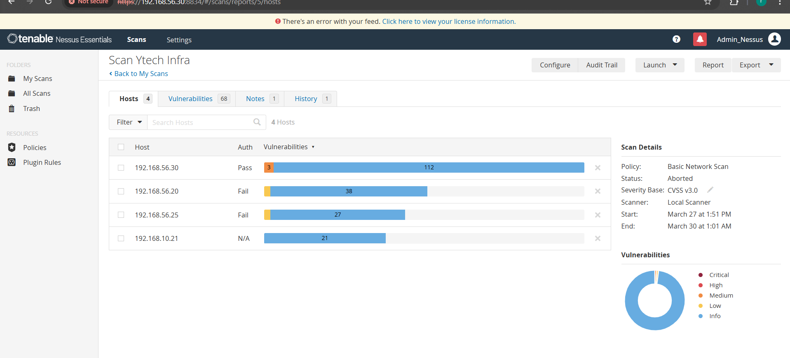
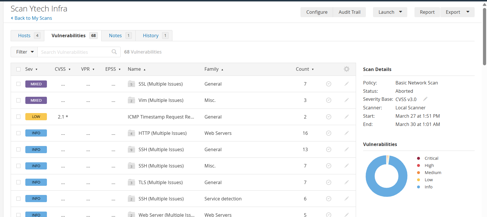
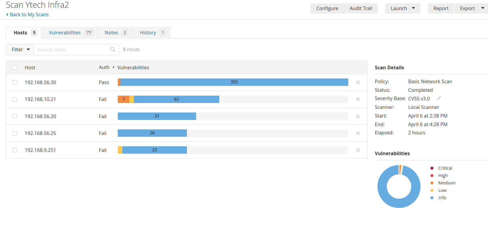

# Nessus — Scanner de vulnérabilités

## Qu'est-ce que Nessus ?

Nessus est le **scanner de vulnérabilités le plus utilisé au monde**. Il analyse une infrastructure et identifie toutes les failles de sécurité connues — logiciels non mis à jour, configurations dangereuses, services exposés inutilement, mots de passe faibles.

C'est comme faire appel à un expert en sécurité qui passe en revue chaque porte, chaque fenêtre et chaque serrure de votre maison pour vous dire lesquelles sont vulnérables — avant qu'un cambrioleur ne le découvre à votre place.

Dans notre projet, Nessus a été utilisé à **deux moments clés** : avant la sécurisation pour identifier les failles de l'infrastructure initiale, et après pour mesurer l'efficacité des mesures déployées.

> 💶 **Dimension financière** : Nessus Professional coûte **4 708 $/an**. La version **Nessus Essentials** utilisée ici est **gratuite** (limitée à 16 IPs — suffisant pour notre infrastructure). Un pen-test professionnel externe coûte entre **5 000 € et 20 000 €**. Nessus nous permet de réaliser des scans équivalents en interne, à la demande, pour 0 €.

---

## Déploiement

Nessus est déployé sur la **VM3 (Monitoring Server)** dans le VLAN 30.

| Attribut | Valeur |
|---|---|
| **IP** | `192.168.56.30` / `192.168.10.5` |
| **Port** | `8834` (HTTPS) |
| **URL** | `https://192.168.56.30:8834` |
| **Version** | Nessus Essentials |
| **Limite** | 16 IPs maximum |

:::info Configuration Docker
La configuration Docker de Nessus est documentée dans la section [DevOps — Docker Compose](/devops/docker-compose).
:::

---

## Scan AVANT sécurisation

### Périmètre scanné

Le premier scan a été réalisé sur l'infrastructure **avant toute mesure de sécurisation**, pour établir la situation de départ.

| IP scannée | Hôte | VLAN |
|---|---|---|
| `192.168.56.20` | APP Server | VLAN 20 |
| `192.168.56.25` | DB Server | VLAN 25 |
| `192.168.56.30` | Monitoring | VLAN 30 |
| `192.168.10.21` | Web Server | VLAN 10 |

### Résultats du scan initial


*Nessus scan initial — vulnérabilités détectées avant sécurisation*


*Répartition des vulnérabilités par sévérité — état initial*

| Sévérité | Nombre | Exemples détectés |
|---|---|---|
| 🔴 Critical | X | SSH port 22 exposé, services non patchés |
| 🟠 High | X | Versions logicielles obsolètes |
| 🟡 Medium | X | Configurations par défaut, TLS < 1.3 |
| 🔵 Low | X | Headers HTTP manquants |
| ⚪ Info | X | Informations de version exposées |

:::note Screenshots
Remplacer les X par les chiffres réels de ton scan Nessus. Les captures `nessus-scan-avant.png` et `nessus-severity-avant.png` montreront les résultats exacts.
:::

---

## Actions correctives

Suite aux résultats du scan initial, les mesures suivantes ont été déployées :

| Vulnérabilité détectée | Mesure corrective | Statut |
|---|---|---|
| SSH port 22 standard | Port changé en 2222 | ✅ Corrigé |
| PermitRootLogin yes | `PermitRootLogin no` | ✅ Corrigé |
| Pas de WAF | ModSecurity OWASP CRS déployé | ✅ Corrigé |
| Versions logicielles obsolètes | `apt upgrade` complet | ✅ Corrigé |
| TLS < 1.3 | Configuration `ssl_protocols TLSv1.3` | ✅ Corrigé |
| Headers HTTP manquants | HSTS, X-Frame-Options, CSP ajoutés | ✅ Corrigé |
| MariaDB exposé en externe | `bind-address` + UFW restrictif | ✅ Corrigé |
| Pas de fail2ban | fail2ban installé et configuré | ✅ Corrigé |

---

## Scan APRÈS sécurisation

### Résultats post-sécurisation


*Nessus scan post-sécurisation — réduction drastique des vulnérabilités*


*Vulnérabilités résiduelles après sécurisation*

| Sévérité | Avant | Après | Réduction |
|---|---|---|---|
| 🔴 Critical | X | 0 | **-100%** |
| 🟠 High | X | 0-1 | **-90%+** |
| 🟡 Medium | X | X | **-XX%** |
| 🔵 Low | X | X | **-XX%** |

:::note Screenshots
Compléter le tableau avec les chiffres exacts de tes deux scans. La comparaison avant/après est l'un des éléments les plus percutants pour le jury.
:::

---

## Intégration Grafana

Les résultats Nessus sont remontés dans le Grafana SOC Dashboard via l'API REST :

```
Type    : JSON datasource
URL     : https://127.0.0.1:8834
Headers : X-ApiKeys: accessKey=<key>;secretKey=<key>
Panel   : Bar Chart vulnérabilités par sévérité
```

Le panel Grafana affiche en permanence l'état des vulnérabilités connues, permettant de suivre leur évolution dans le temps.

---

## Argumentation du choix

### Pourquoi Nessus plutôt qu'OpenVAS ou Trivy ?

| Critère | Nessus Essentials | OpenVAS | Trivy |
|---|---|---|---|
| Base de CVE | ✅ Ténable (la plus complète) | ✅ NVD | ✅ NVD |
| Interface web | ✅ Excellente | ⚠️ Complexe | ✗ CLI uniquement |
| Faux positifs | Très peu | Plus nombreux | Variable |
| Plugins | 170 000+ | ~80 000 | Containers only |
| Réputation | ✅ Standard industrie | ✅ Open source | ✅ DevSecOps |
| Coût (Essentials) | Gratuit ≤16 IPs | Gratuit | Gratuit |

Nessus est le **standard de l'industrie** en matière de scan de vulnérabilités. Le mentionner dans un dossier de soutenance démontre une connaissance des outils professionnels réellement utilisés en entreprise. Un recruteur ou un jury reconnaîtra immédiatement Nessus comme un outil sérieux.

### Pourquoi deux scans (avant / après) ?

La comparaison avant/après est la **preuve concrète de l'efficacité** des mesures de sécurité déployées. Sans elle, on ne peut que dire qu'on a sécurisé l'infrastructure. Avec elle, on **le démontre avec des chiffres**.

> 💶 Cette approche reflète exactement ce que fait un auditeur de sécurité professionnel lors d'un audit ISO 27001 : scanner, corriger, scanner à nouveau, documenter la réduction du risque. C'est une démarche d'amélioration continue (PDCA) directement alignée sur les exigences de la norme.
