# Wazuh — SIEM & Détection d'intrusions

:::caution Page en cours de rédaction
Cette section est rédigée par **Meryem** — responsable du déploiement Wazuh SIEM.
:::

## Informations techniques de référence

Pour la coordination avec les autres services, voici les paramètres Wazuh utilisés dans l'infrastructure :

| Attribut | Valeur |
|---|---|
| **IP** | `192.168.9.152` |
| **VM** | PC Meryem |
| **Elasticsearch** | Port `9200` |
| **API Wazuh** | Port `55000` |
| **Dashboard** | Port `443` |

### Intégration Grafana

Les données Wazuh sont remontées dans le Grafana SOC Dashboard :

```
Source     : Wazuh Elasticsearch
URL        : https://192.168.9.152:9200
Auth       : admin / wbUdIoo.T32ZivW89G4EHhu8XxYUIecP
Index      : wazuh-alerts-*
```

### Agents déployés

| Serveur | Agent Wazuh | Statut |
|---|---|---|
| APP Server (VM1) | ✅ Installé | Actif |
| DB Server (VM2) | ✅ Installé | Actif |
| Web Server (Meryem) | ✅ Installé | Actif |

---

*Section à compléter par Meryem avec : présentation Wazuh, déploiement Docker, dashboard screenshots, règles de détection, alertes configurées.*


## 1. Introduction et Architecture Générale
 
Ce document présente en détail le déploiement complet d'une solution **SIEM** (Security Information and Event Management) basée sur **Wazuh 4.8.0**, une plateforme open source de cybersécurité. La solution est déployée dans un environnement virtualisé sous Oracle VirtualBox, simulant un réseau d'entreprise avec un serveur central Wazuh et un endpoint (serveur web) surveillé.
 
### Objectifs du Projet
 
- Déployer Wazuh Manager sur une VM Ubuntu dédiée
- Installer et enregistrer un agent Wazuh sur un serveur web
- Configurer la surveillance d'intégrité des fichiers (FIM)
- Collecter et analyser les logs Nginx
- Détecter les vulnérabilités système (CVE)
- Assurer la conformité PCI DSS
- Intégrer Grafana pour une visualisation avancée
 
### Architecture du Système
 
| Composant | Rôle | Détails |
|-----------|------|---------|
| **VM Wazuh (Serveur)** | Wazuh Manager + Dashboard | Ubuntu 24.04 LTS, IP: 192.168.9.224 |
| **VM Webserver (Agent)** | Endpoint surveillé | Ubuntu 24.04 LTS, IP: 192.168.10.21 |
| **Wazuh Manager** | Collecte & analyse des alertes | Port 1514 (agent), 443 (dashboard) |
| **Wazuh Indexer** | Stockage des logs (OpenSearch) | Port 9200 |
| **Wazuh Dashboard** | Interface Web de visualisation | HTTPS Port 443 |
| **Grafana** | Dashboards avancés | Port 3000, connecté à OpenSearch |
 
---
 
## 2. Étape 1 — Création des Machines Virtuelles (VirtualBox)
 
Avant d'installer Wazuh, il faut créer deux machines virtuelles sous Oracle VirtualBox. La première hébergera le serveur Wazuh, la seconde servira de machine surveillée (webserver).
 
### 2.1 Création de la VM Wazuh (Serveur)
 
Dans VirtualBox, créer une nouvelle VM avec les paramètres suivants :
 
- **Nom de la VM :** `wazuh`
- **ISO Image :** `ubuntu-24.04.4-live-server-amd64.iso`
- **OS :** Linux / Ubuntu (64-bit)
- **Activer :** "Proceed with Unattended Installation"
 
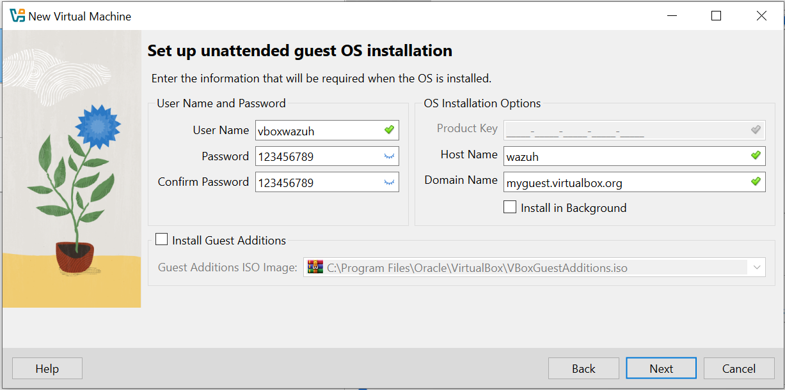
 
*Figure 1 — Paramétrage de la VM Wazuh : nom, dossier, image ISO et OS détecté automatiquement*
 
### 2.2 Configuration des Credentials de la VM
 
Lors de la configuration automatique, entrer les informations d'identification et le nom de l'hôte :
 
| Champ | Valeur |
|-------|--------|
| **User Name** | `vboxwazuh` |
| **Password** | `123456789` |
| **Host Name** | `wazuh` |
| **Domain Name** | `myguest.virtualbox.org` |
 
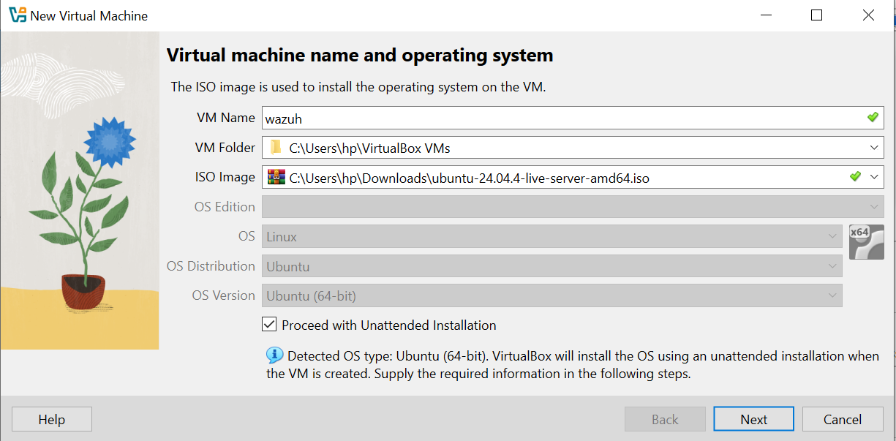
 
*Figure 2 — Configuration des identifiants et du nom d'hôte de la VM Wazuh*
 
> **📌 Note :** La même procédure est répétée pour créer la VM "webserver" qui accueillera l'agent Wazuh. Cette VM simulera un serveur web Nginx dans l'environnement de test.
 
---
 
## 3. Étape 2 — Installation de Wazuh Manager (Serveur)
 
Une fois la VM Wazuh démarrée, l'installation du serveur Wazuh se fait via le script d'installation officiel en une seule commande. Ce script installe automatiquement tous les composants : Wazuh Manager, Wazuh Indexer et Wazuh Dashboard.
 
### 3.1 Commande d'Installation
 
Se connecter à la VM `wazuh` via SSH ou directement, puis exécuter :
 
```bash
curl -sO https://packages.wazuh.com/4.8/wazuh-install.sh && sudo bash wazuh-install.sh -a
```
 
L'option `-a` installe tous les composants **(all-in-one)**. L'installation démarre et génère automatiquement les certificats, configure le cluster et installe les services.
 
### 3.2 Déroulement de l'Installation
 
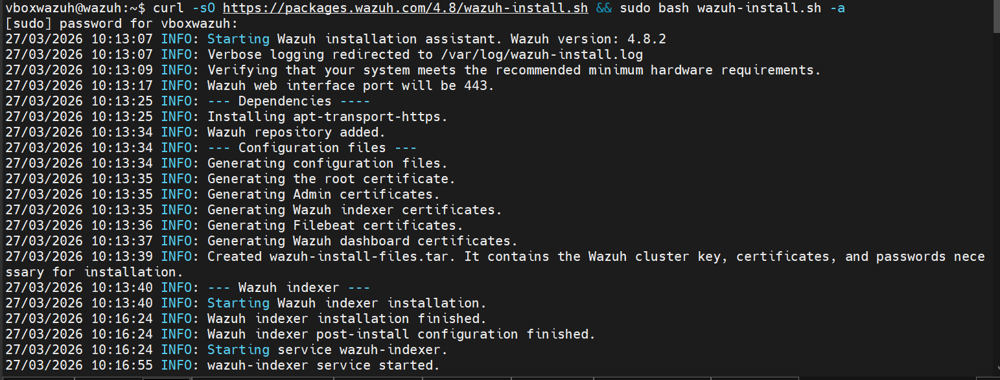
 
*Figure 3 — Sortie console de l'installation Wazuh 4.8.2 : génération des certificats, installation de l'indexer*
 
Les étapes clés de l'installation visible dans la capture :
 
- `INFO: Vérification des prérequis matériels`
- `INFO: Wazuh web interface port will be 443`
- `INFO: Installation des dépendances (apt-transport-https)`
- `INFO: Génération des fichiers de configuration et certificats`
- `INFO: Génération du fichier wazuh-install-files.tar` (clés cluster + mots de passe)
- `INFO: Installation et démarrage du Wazuh Indexer (OpenSearch)`
 
> **📌 Note :** À la fin de l'installation, le script affiche les identifiants générés automatiquement (admin/mot-de-passe). Ces informations doivent être **sauvegardées immédiatement**.
 
---
 
## 4. Étape 3 — Accès au Tableau de Bord Wazuh
 
Après l'installation, le dashboard Wazuh est accessible via le navigateur à l'adresse IP du serveur sur le port 443 (HTTPS). Dans notre configuration, l'IP du serveur Wazuh est `192.168.9.224`.
 
### 4.1 Connexion à l'Interface Web
 
Ouvrir un navigateur et naviguer vers :
 
```
https://192.168.9.224/app/login?
```
 
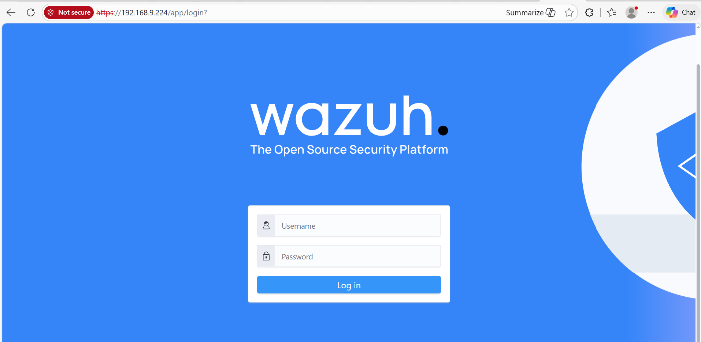
 
*Figure 4 — Page de connexion du Dashboard Wazuh accessible à l'adresse https://192.168.9.224*
 
Utiliser les identifiants affichés à la fin de l'installation (par défaut : `admin` / `<mot-de-passe-généré>`). La connexion est sécurisée via HTTPS avec un certificat auto-signé.
 
### 4.2 Vue Initiale du Dashboard
 
Après connexion, le tableau de bord principal affiche :
 
- **Agents Summary :** aucun agent encore connecté
- **Last 24 Hours Alerts :** 10 alertes Medium, 11 alertes Low
- **Message :** "No agents were added to this manager" avec lien "Add agent"
- **Modules disponibles :** Configuration Assessment, Malware Detection, Threat Hunting, Vulnerability Detection
 
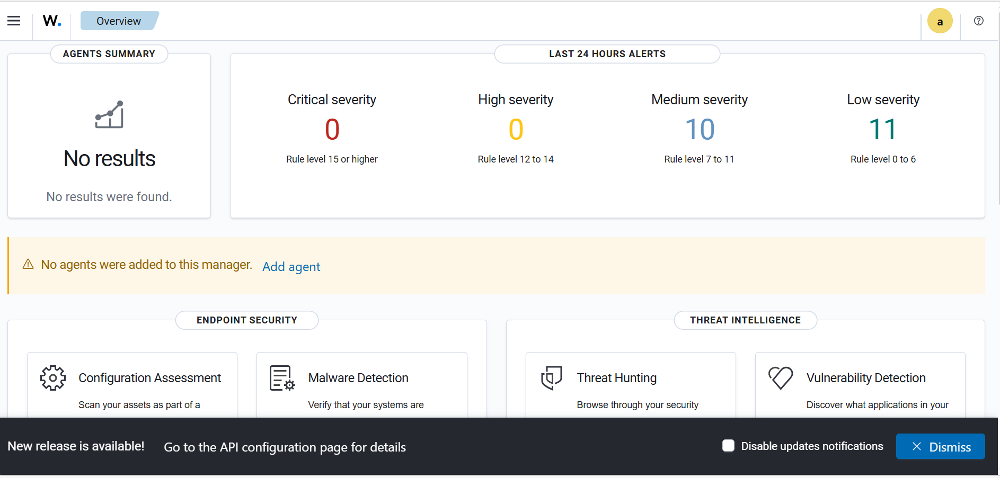
 
*Figure 5 — Tableau de bord Wazuh après installation : vue d'ensemble avec résumé des alertes et modules de sécurité*
 
> **📌 Note :** Le message "No agents were added" est normal à ce stade. La prochaine étape consiste à installer un agent Wazuh sur le serveur web et à l'enregistrer auprès de ce manager.
 
---
 
## 5. Étape 4 — Installation et Enregistrement de l'Agent Wazuh
 
L'agent Wazuh doit être installé sur chaque endpoint à surveiller. Dans notre cas, c'est le serveur web (VM webserver). L'agent communique avec le manager via le **port 1514**.
 
### 5.1 Téléchargement du Package Agent
 
Sur la VM webserver, télécharger le package Debian de l'agent Wazuh :
 
```bash
wget https://packages.wazuh.com/4.x/apt/pool/main/w/wazuh-agent/wazuh-agent_4.8.0-1_amd64.deb
```
 
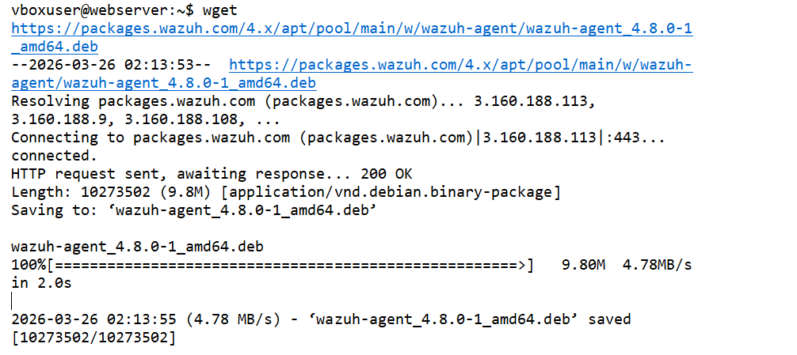
 
*Figure 6 — Téléchargement réussi du package wazuh-agent 4.8.0 (9.8 MB) à une vitesse de 4.78 MB/s*
 
Le fichier `wazuh-agent_4.8.0-1_amd64.deb` est téléchargé depuis les serveurs officiels Wazuh (`packages.wazuh.com`) en environ **2 secondes**.
 
### 5.2 Installation et Activation de l'Agent
 
Installer le package en spécifiant l'adresse IP du manager Wazuh, puis activer le service :
 
```bash
sudo WAZUH_MANAGER='192.168.9.224' dpkg -i wazuh-agent_4.8.0-1_amd64.deb
sudo systemctl daemon-reload
sudo systemctl enable wazuh-agent --now
```
 
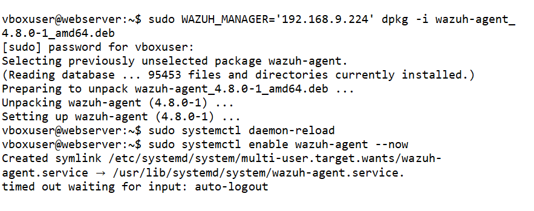
 
*Figure 7 — Installation et activation de l'agent Wazuh sur le serveur web avec enregistrement automatique auprès du manager*
 
La variable `WAZUH_MANAGER` lors du `dpkg` configure automatiquement l'agent pour pointer vers le serveur Wazuh (`192.168.9.224`). La création du symlink systemd confirme que le service est activé au démarrage.
 
> **📌 Note :** Le message "timed out waiting for input: auto-logout" en fin de session est normal — c'est le timeout de session SSH qui se déclenche. L'agent est bien installé et actif.
 
---
 
## 6. Étape 5 — Surveillance de l'Agent depuis le Dashboard
 
Une fois l'agent installé et activé, il apparaît automatiquement dans le dashboard Wazuh. Il est possible de surveiller son état, ses informations système et ses événements de sécurité.
 
### 6.1 Vue Détaillée de l'Agent Webserver
 
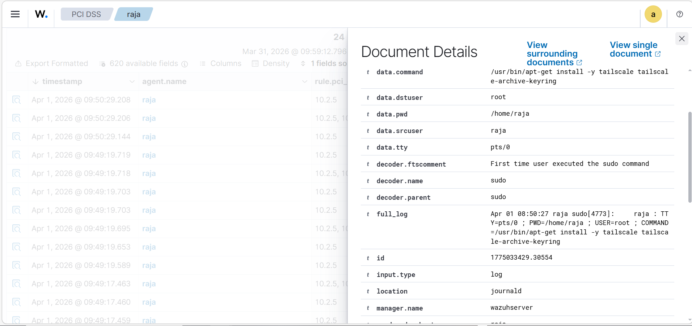
 
*Figure 8 — Profil de l'agent "webserver" (ID: 001) dans le dashboard Wazuh : statut actif, IP, version, OS Ubuntu 24.04.4 LTS*
 
Informations visibles sur l'agent connecté :
 
| Champ | Valeur |
|-------|--------|
| **ID** | `001` (premier agent enregistré) |
| **Status** | Active (point vert) |
| **IP Address** | `192.168.10.21` |
| **Version** | `v4.8.0` |
| **Groups** | `default` |
| **Operating System** | Ubuntu 24.04.4 LTS |
| **Cluster Node** | `node01` |
| **Registration Date** | Mar 27, 2026 @ 11:38:57.000 |
 
### 6.2 Modules Disponibles pour l'Agent
 
L'interface offre plusieurs onglets de surveillance :
 
- **Threat Hunting** — Recherche de menaces via les événements système
- **File Integrity Monitoring (FIM)** — Surveillance des modifications de fichiers
- **MITRE ATT&CK** — Cartographie des tactiques d'attaque détectées
- **Compliance** — Conformité PCI DSS, HIPAA, GDPR
- **Inventory Data** — Inventaire matériel et logiciel
- **Stats** — Statistiques de l'agent
- **Configuration** — Configuration distante de l'agent
 
---
 
## 7. Étape 6 — Configuration de la Surveillance des Répertoires (FIM)
 
Le **File Integrity Monitoring (FIM)** est l'une des fonctionnalités clés de Wazuh. Il surveille les modifications apportées aux fichiers et répertoires critiques en temps réel. La configuration se fait dans le fichier `ossec.conf` de l'agent.
 
### 7.1 Configuration du FIM dans ossec.conf
 
Éditer le fichier de configuration de l'agent sur la VM webserver :
 
```bash
sudo nano /var/ossec/etc/ossec.conf
```
 
Ajouter ou modifier la section `<syscheck>` pour surveiller le répertoire web en temps réel :
 
```xml
<!-- Frequency that syscheck is executed default every 12 hours -->
<frequency>43200</frequency>
 
<scan_on_start>yes</scan_on_start>
 
<!-- Directories to check (perform all possible verifications) -->
<directories>/etc,/usr/bin,/usr/sbin</directories>
<directories>/bin,/sbin,/boot</directories>
<directories check_all="yes" report_changes="yes" realtime="yes">/var/www/ytech</directories>
 
<!-- Files/directories to ignore -->
<ignore>/etc/mtab</ignore>
<ignore>/etc/hosts.deny</ignore>
<ignore>/etc/mail/statistics</ignore>
<ignore>/etc/random-seed</ignore>
<ignore>/etc/random.seed</ignore>
<ignore>/etc/adjtime</ignore>
<ignore>/etc/httpd/logs</ignore>
<ignore>/etc/utmpx</ignore>
<ignore>/etc/wtmpx</ignore>
<ignore>/etc/cups/certs</ignore>
<ignore>/etc/dumpdates</ignore>
<ignore>/etc/svc/volatile</ignore>
```
 
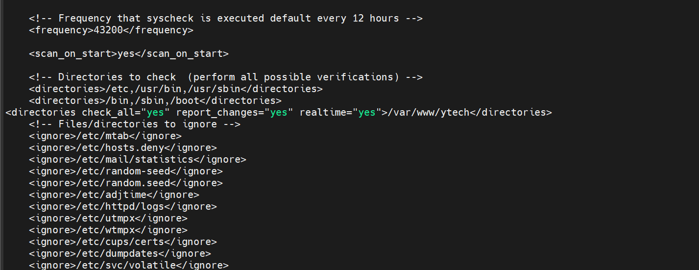
 
*Figure 9 — Configuration syscheck dans ossec.conf : surveillance temps réel de /var/www/ytech avec vérification complète et rapport des changements*
 
Paramètres clés de la configuration FIM :
 
| Paramètre | Valeur | Description |
|-----------|--------|-------------|
| `<frequency>` | `43200` | Scan complet toutes les 12 heures |
| `<scan_on_start>` | `yes` | Scan au démarrage de l'agent |
| `<directories>` | `/etc,/usr/bin,/usr/sbin` | Répertoires système standards |
| `<directories>` | `/bin,/sbin,/boot` | Binaires et bootloader |
| `check_all="yes"` | — | Vérifie tous les attributs du fichier |
| `report_changes="yes"` | — | Rapport des différences de contenu |
| `realtime="yes"` | — | Surveillance en temps réel (inotify) |
 
### 7.2 Résultats FIM dans le Dashboard
 
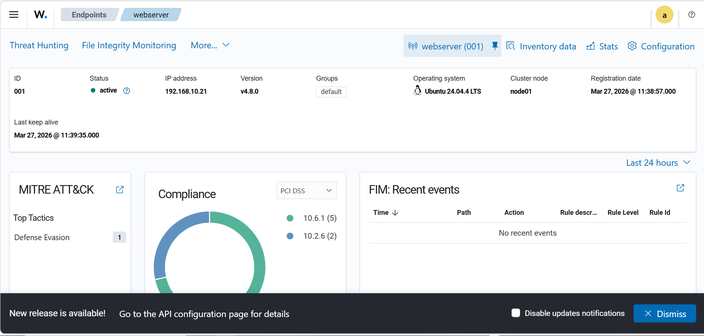
 
*Figure 10 — Dashboard FIM : événements récents de modifications et ajouts dans /var/www/ytech, compliance PCI DSS et MITRE ATT&CK*
 
Le dashboard FIM montre :
 
- **Top Tactics MITRE ATT&CK :** Impact (2000 événements), Defense Evasion (45), Initial Access (38)
- **Compliance PCI DSS :** Règles 11.5 (8810 événements), 10.6.1 (2575), 11.4 (181)
- **FIM Recent Events :** Fichiers modifiés dans `/var/www/...` avec Rule Level 7 (Integrity) et Rule 550
- **Actions détectées :** `modified` (modification), `added` (ajout de nouveaux fichiers)
 
> **📌 Note :** La règle **550** (Rule Level 7) indique une modification d'intégrité. La règle **554** (Rule Level 5) indique l'ajout de nouveaux fichiers. Ces alertes correspondent aux changements sur le site web `/var/www/ytech`.
 
---
 
## 8. Étape 7 — Configuration de la Collecte des Logs Nginx
 
Pour surveiller les accès et les erreurs du serveur web Nginx, il faut configurer l'agent Wazuh pour qu'il lise et transmette les logs Nginx au manager. Cette configuration est ajoutée dans `ossec.conf`.
 
### 8.1 Ajout des Localfiles Nginx dans ossec.conf
 
Ajouter les blocs `<localfile>` à la fin du fichier `ossec.conf` sur l'agent webserver :
 
```xml
<localfile>
  <log_format>apache</log_format>
  <location>/var/log/nginx/access.log</location>
</localfile>
 
<localfile>
  <log_format>apache</log_format>
  <location>/var/log/nginx/error.log</location>
</localfile>
 
</ossec_config>
```
 
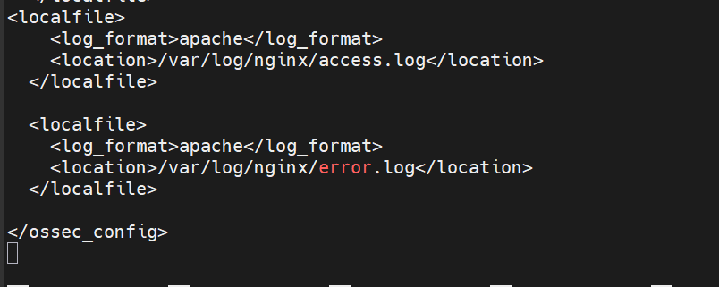
 
*Figure 11 — Configuration des localfiles dans ossec.conf pour la collecte des logs Nginx access.log et error.log au format Apache*
 
> **📌 Note :** Le format `"apache"` est utilisé car Nginx utilise un format de log compatible avec le parseur Apache de Wazuh. Après modification, il faut redémarrer l'agent :
> ```bash
> sudo systemctl restart wazuh-agent
> ```
> Les logs Nginx commenceront alors à apparaître dans le dashboard Wazuh sous "Threat Hunting".
 
---
 
## 9. Étape 8 — Surveillance en Temps Réel des Logs
 
Wazuh collecte et indexe tous les logs des agents. La fonctionnalité **"Threat Hunting"** permet de rechercher, filtrer et analyser tous les événements de sécurité en temps réel.
 
### 9.1 Analyse des Logs PCI DSS
 
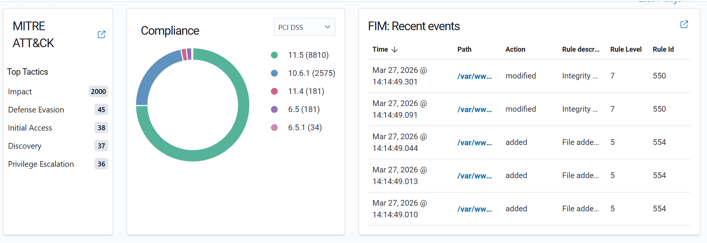
 
*Figure 12 — Vue Threat Hunting PCI DSS pour l'agent "raja" : document détaillé montrant l'exécution d'une commande sudo par l'utilisateur raja*
 
La capture montre un exemple d'alerte de sécurité critique :
 
| Champ | Valeur |
|-------|--------|
| `data.command` | `/usr/bin/apt-get install -y tailscale tailscale-archive-keyring` |
| `data.dstuser` | `root` (exécuté en tant que root) |
| `data.srcuser` | `raja` (l'utilisateur qui a lancé la commande) |
| `decoder.ftscomment` | "First time user executed the sudo command" |
| `decoder.name` | `sudo` (commande sudo utilisée) |
| `full_log` | `Apr 01 08:50:27 raja sudo[4773]` |
| `location` | `journald` (source des logs systemd) |
| `manager.name` | `wazuhserver` |
 
Cette alerte est conforme **PCI DSS 10.2.5** (logging des accès root) et **10.6.1** (surveillance des logs système).
 
### 9.2 Signification Sécuritaire
 
L'installation de Tailscale (VPN mesh) via sudo par un utilisateur "raja" pour la première fois représente :
 
- Un changement de configuration réseau potentiellement **non autorisé**
- L'utilisation de sudo pour la **première fois** par cet utilisateur (flag "First time")
- Une installation de logiciel tiers qui **doit être validée** par l'administrateur
 
---
 
## 10. Étape 9 — Détection de Vulnérabilités
 
Le module de détection de vulnérabilités de Wazuh analyse les paquets installés sur les agents et les compare aux bases de données **CVE** (Common Vulnerabilities and Exposures). Pour Ubuntu, il faut configurer un provider spécifique.
 
### 10.1 Configuration du Provider Ubuntu
 
Éditer `/var/ossec/etc/ossec.conf` sur le **serveur Wazuh** :
 
```xml
<provider name="ubuntu">
  <enabled>yes</enabled>
  <os>trusty</os>
  <os>xenial</os>
  <os>bionic</os>
  <os>focal</os>
  <os>jammy</os>
  <os>noble</os>
  <update_interval>1h</update_interval>
</provider>
```
 
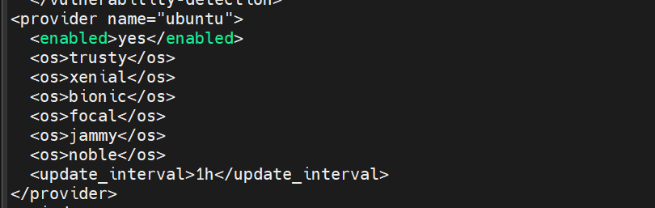
 
*Figure 13 — Configuration du provider Ubuntu dans Wazuh pour la détection de vulnérabilités : support de Trusty jusqu'à Noble (24.04)*
 
Le paramètre `update_interval=1h` signifie que la base CVE est mise à jour **toutes les heures** depuis les sources Ubuntu Security Notices (USN).
 
### 10.2 Résultats de la Détection de Vulnérabilités
 
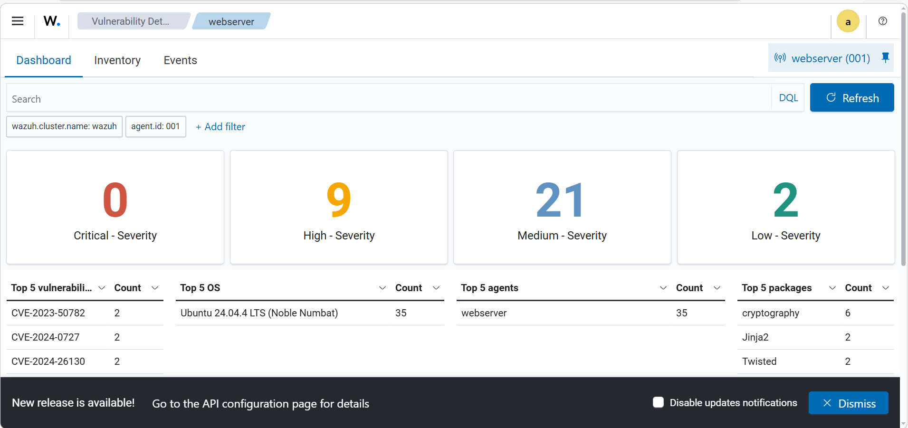
 
*Figure 14 — Dashboard Vulnerability Detection pour l'agent webserver : 9 vulnérabilités High, 21 Medium, 2 Low sur Ubuntu 24.04.4 LTS*
 
Résumé des vulnérabilités détectées sur le webserver :
 
| Sévérité | Nombre | Exemple CVE | Paquets Affectés |
|----------|--------|-------------|-----------------|
| **Critical** | 0 | — | — |
| **High** | 9 | CVE-2024-0727 | `cryptography` (×6), `Jinja2` |
| **Medium** | 21 | CVE-2023-50782 | `Twisted` (×2) |
| **Low** | 2 | CVE-2024-26130 | Divers paquets |
 
Les vulnérabilités les plus critiques concernent le paquet **cryptography** (bibliothèque Python) avec 6 occurrences, suivi de **Jinja2** (moteur de templates) et **Twisted** (framework réseau).
 
---
 
## 11. Étape 10 — Conformité PCI DSS et Logs de Sécurité
 
Wazuh intègre nativement le mapping vers les standards de conformité. Les règles sont automatiquement taggées avec les références PCI DSS correspondantes, permettant de prouver la conformité lors d'audits.
 
### 11.1 Règles PCI DSS Actives
 
Les principales règles PCI DSS détectées dans l'environnement :
 
| Règle PCI DSS | Nombre d'Événements | Description |
|---------------|---------------------|-------------|
| **11.5** | 8810 | Détection de modifications de fichiers (FIM) |
| **10.6.1** | 2575 | Surveillance des logs et événements système |
| **11.4** | 181 | Détection d'intrusions réseau |
| **6.5** | 181 | Protection contre les vulnérabilités applicatives |
| **6.5.1** | 34 | Injection et contrôle d'accès |
 
### 11.2 Exemple d'Alerte PCI DSS Réelle
 
Un cas concret d'alerte PCI DSS capturé : l'utilisateur `raja` a exécuté pour la première fois une commande `sudo` pour installer un logiciel réseau (`tailscale`). Cette action déclenche automatiquement les règles :
 
- **PCI DSS 10.2.5** — Logging de l'utilisation des droits root
- **PCI DSS 10.6.1** — Examen des logs de sécurité
 
---
 
## 12. Étape 11 — Intégration Grafana avec Wazuh
 
Grafana permet de créer des dashboards de visualisation personnalisés en se connectant à l'indexer Wazuh (OpenSearch). Pour cela, un utilisateur dédié doit être créé dans Wazuh avec les permissions appropriées.
 
### 12.1 Création de l'Utilisateur Grafana dans Wazuh
 
Dans le dashboard Wazuh, naviguer vers **Security > Internal Users > Create internal user** :
 
| Paramètre | Valeur |
|-----------|--------|
| **Nom d'utilisateur** | `grafana` |
| **Mot de passe** | `0.wazuh` |
| **Rôle** | Lecture seule sur les index Wazuh |
 
Ce compte sera utilisé par Grafana pour interroger l'API OpenSearch de Wazuh.
 

 
*Figure 15 — Création de l'utilisateur interne "grafana" dans Wazuh Security avec mot de passe pour permettre l'accès depuis Grafana*
 
### 12.2 Connexion Grafana à OpenSearch
 
Dans Grafana, configurer la source de données OpenSearch avec :
 
```
URL           : https://192.168.9.224:9200
Auth          : Basic Auth (grafana / 0.wazuh)
Index         : wazuh-alerts-4.x-*
TLS           : Désactiver la vérification (certificat auto-signé)
```
 
### 12.3 Dashboard Grafana — Résultat Final
 
Le dashboard Grafana visualise les données Wazuh en temps réel, offrant une vue consolidée de l'état de sécurité de l'infrastructure.
 
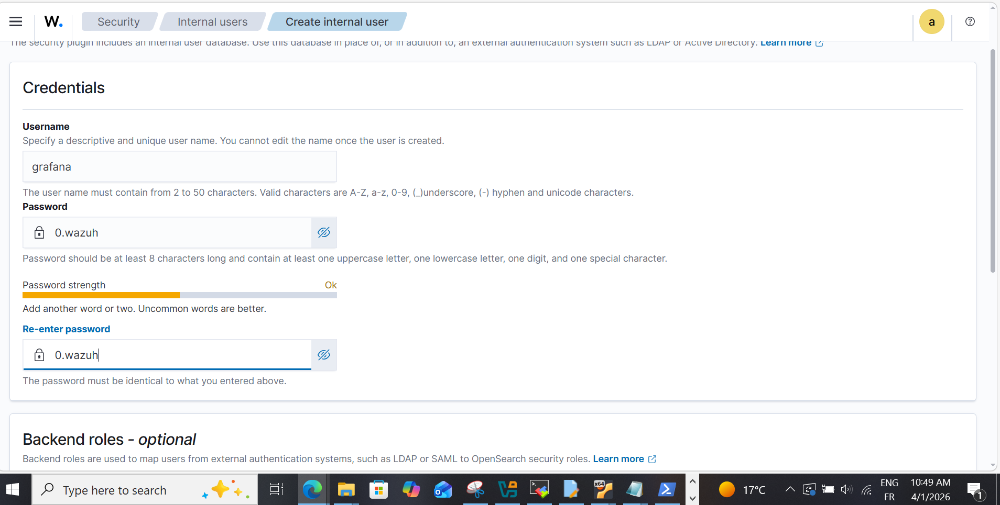
 
*Figure 16 — Dashboard Grafana connecté à Wazuh OpenSearch : visualisation des alertes de sécurité*
 
> **📌 Note :** Une fois la connexion établie, des dashboards Grafana peuvent être importés depuis le catalogue officiel Wazuh ou créés manuellement pour visualiser les alertes, les logs et les métriques de sécurité en temps réel.
 
---
 
## 13. Conclusion et Résumé
 
Le déploiement complet de Wazuh SIEM a été réalisé avec succès dans un environnement virtualisé. La solution offre une surveillance complète de la sécurité pour le serveur web.
 
### Récapitulatif des Fonctionnalités Déployées
 
| Fonctionnalité | Statut | Résultat |
|----------------|--------|----------|
| **Installation Wazuh Manager** | ✅ Opérationnel | Version 4.8.2 sur Ubuntu 24.04 |
| **Agent Webserver** | ✅ Actif (ID: 001) | Ubuntu 24.04.4 LTS, IP: 192.168.10.21 |
| **File Integrity Monitoring** | ✅ Configuré | Surveillance temps réel `/var/www/ytech` |
| **Collecte Logs Nginx** | ✅ Configuré | `access.log` et `error.log` indexés |
| **Détection Vulnérabilités** | ✅ Actif | 32 CVE détectées (0 Critical) |
| **Conformité PCI DSS** | ✅ Actif | Alertes sudo et accès root trackés |
| **Intégration Grafana** | ✅ Configuré | Utilisateur grafana créé |
| **MITRE ATT&CK Mapping** | ✅ Actif | Impact, Defense Evasion, Initial Access |
 
### Points Clés de la Sécurité Observée
 
- **0 vulnérabilité critique** sur le serveur web (bonne posture de sécurité)
- **9 vulnérabilités High** à corriger en priorité (paquets `cryptography` et `Jinja2`)
- Surveillance FIM en **temps réel** active sur le répertoire web
- Détection du **premier usage sudo** par l'utilisateur `raja`
- Conformité **PCI DSS 10.x** trackée automatiquement
- **MITRE ATT&CK :** 2000 événements de type "Impact" détectés et analysés
 
