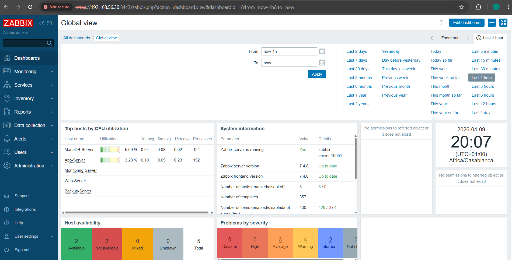
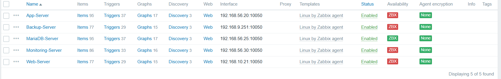
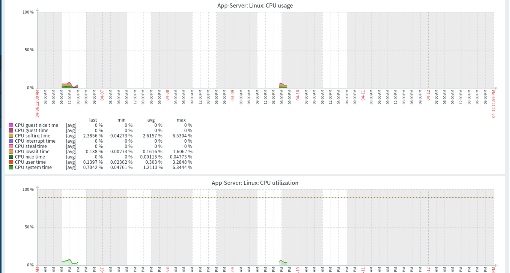
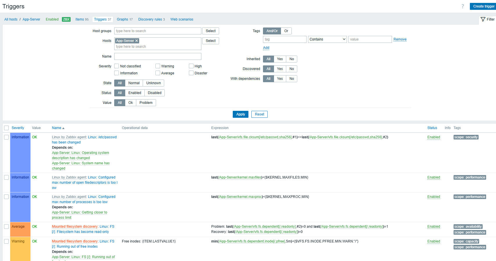

# Zabbix — Supervision de l'infrastructure

## Qu'est-ce que Zabbix ?

Zabbix est un outil de **monitoring open source** qui surveille en temps réel l'état de l'infrastructure — serveurs, services, réseau, performances. C'est comme avoir un tableau de bord de contrôle qui vous alerte immédiatement si quelque chose ne va pas, avant que les utilisateurs ne s'en rendent compte.

Sans monitoring, un serveur peut tomber en pleine nuit et personne ne le sait avant le lendemain matin. Avec Zabbix, une alerte est envoyée en **moins de 60 secondes** après la détection d'un problème.

> 💶 **Dimension financière** : Zabbix Enterprise coûte plusieurs milliers d'euros par an. La version open source utilisée ici offre les **mêmes fonctionnalités** pour 0 €. Un équivalent commercial comme Datadog coûte **15$/host/mois**, soit **720$/an** pour nos 4 serveurs. Zabbix open source = 0 €.

---

## Déploiement

Zabbix est déployé sur la **VM3 (Monitoring Server)** dans le VLAN 30, via Docker Compose.

| Composant | Détail |
|---|---|
| **IP** | `192.168.56.30` / `192.168.10.5` |
| **Port** | `8443` (HTTPS via Nginx proxy) |
| **URL** | `https://192.168.56.30:8443` |
| **Stack** | Zabbix Server + Zabbix Web + MySQL 8.0 + Nginx |

:::info Configuration Docker Compose
La configuration complète Docker Compose de Zabbix est documentée dans la section [DevOps — Docker Compose](/devops/docker-compose).
:::

---

## Dashboard principal


*Dashboard Zabbix — vue globale de l'infrastructure Ytech Solutions*

Le dashboard affiche en temps réel :
- **État de tous les hosts** surveillés
- **Problèmes actifs** avec niveau de sévérité
- **Graphes de performance** CPU, RAM, réseau
- **Disponibilité des services** (uptime)

---

## Hosts surveillés

Zabbix surveille **5 hosts** via des agents installés sur chaque VM :


*Tous les hosts Ytech Solutions en statut vert — infrastructure opérationnelle*

| Host | IP surveillée | Services | Statut |
|---|---|---|---|
| VM1-APP-Server | `192.168.56.20` | YtechBot + CRUD RH + Ollama | ✅ Vert |
| VM2-MariaDB-Server | `192.168.56.25` | MariaDB | ✅ Vert |
| VM3-MGMT-Server | `192.168.56.30` | Monitoring complet | ✅ Vert |
| Web-Server | `192.168.10.21` | Laravel + WAF | ✅ Vert |
| Backup-Server | `192.168.9.251` | Sauvegardes chiffrées AES-256 | ✅ Vert |

### Installation de l'agent Zabbix

```bash
# Sur chaque VM à surveiller
wget https://repo.zabbix.com/zabbix/7.4/release/ubuntu/pool/main/z/\
zabbix-release/zabbix-release_latest_7.4+ubuntu24.04_all.deb

sudo dpkg -i zabbix-release_latest_7.4+ubuntu24.04_all.deb
sudo apt update && sudo apt install -y zabbix-agent

# /etc/zabbix/zabbix_agentd.conf
Server=192.168.56.30
ServerActive=192.168.56.30
Hostname=NOM_DU_SERVEUR

sudo systemctl restart zabbix-agent
sudo systemctl enable zabbix-agent
```

---

## Métriques surveillées

### Performance serveurs


*Graphes de performance CPU et RAM — VM1 APP Server*

| Métrique | Seuil d'alerte | Action déclenchée |
|---|---|---|
| CPU usage | > 80% pendant 5 min | Alerte Warning |
| CPU usage | > 95% pendant 2 min | Alerte Critical |
| RAM usage | > 85% | Alerte Warning |
| RAM usage | > 95% | Alerte Critical |
| Disk usage | > 80% | Alerte Warning |
| Service down | Indisponible > 1 min | Alerte Critical |
| Réseau | Perte de paquets > 5% | Alerte Warning |

### Services applicatifs

Zabbix vérifie la disponibilité de chaque service via des checks HTTP/TCP :

| Service | Check | Fréquence |
|---|---|---|
| YtechBot (8501) | HTTP check HTTPS | Toutes les 60s |
| CRUD RH (8443) | HTTP check HTTPS | Toutes les 60s |
| MariaDB (3306) | TCP check | Toutes les 60s |
| Zabbix Web (8443) | HTTP check | Toutes les 60s |
| Grafana (3000) | HTTP check | Toutes les 60s |

---

## Alertes et triggers


*Page des triggers Zabbix — historique des alertes*

Zabbix est configuré avec des **triggers** qui déclenchent des alertes selon la sévérité :

| Sévérité | Couleur | Exemples |
|---|---|---|
| Information | 🔵 Bleu | Redémarrage d'un service |
| Warning | 🟡 Jaune | CPU > 80%, RAM > 85% |
| Average | 🟠 Orange | Service intermittent |
| High | 🔴 Rouge | Service down |
| Disaster | ⛔ Rouge foncé | Host inaccessible |

---

## Intégration avec Grafana

Les données Zabbix sont remontées dans le **Grafana SOC Dashboard** via le plugin `alexanderzobnin-zabbix-app` :

```
Zabbix Server → Grafana Data Source → SOC Dashboard
URL : https://192.168.56.30:8443/api_jsonrpc.php
```

Les panels Grafana alimentés par Zabbix :
- **État des serveurs** (Stat panel — vert/rouge)
- **CPU temps réel** (Time Series)
- **RAM utilisation** (Gauge)
- **Uptime services** (Stat)

---

## Argumentation du choix

### Pourquoi Zabbix plutôt que Nagios ou Prometheus ?

| Critère | Zabbix | Nagios | Prometheus |
|---|---|---|---|
| Interface web | ✅ Native complète | ⚠️ Basique | ⚠️ Via Grafana |
| Configuration | Interface graphique | Fichiers texte | Fichiers YAML |
| Agents | ✅ Agents natifs | ✅ NRPE | ✅ Exporters |
| Alerting | ✅ Intégré | ✅ Intégré | Via Alertmanager |
| Courbe d'apprentissage | Moyenne | Élevée | Élevée |
| Coût | Gratuit (open source) | Gratuit | Gratuit |
| Intégration Grafana | ✅ Plugin officiel | ⚠️ Limité | ✅ Natif |

Zabbix a été choisi pour son **interface web complète** qui permet de configurer les hosts, triggers et dashboards sans toucher à des fichiers de configuration — adapté à un projet en 5 semaines avec plusieurs membres d'équipe.
