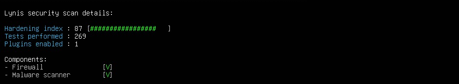

import Tabs from '@theme/Tabs';
import TabItem from '@theme/TabItem';

# 🐧 Hardening Linux — Ubuntu Server

## Présentation

Le durcissement des serveurs Ubuntu est réalisé via le script **`ytech_hardening_v7.sh`**, développé sur mesure pour l'infrastructure Y-Tech. Il implémente les recommandations **CIS Benchmarks** et vise un score **Lynis > 85/100**.

| Attribut | Valeur |
|----------|--------|
| **Script** | `ytech_hardening_v7.sh` |
| **Version** | v7.0 |
| **Référentiel** | CIS Benchmarks + Lynis |
| **Score obtenu** | **87/100** (269 tests) |
| **Durée d'exécution** | ~10 minutes |

## Déploiement du script

### Transfert depuis Windows

```bash
# Depuis CMD Windows — transfert vers le serveur Ubuntu
scp -P 22 ytech_hardening_v7.sh ubub@192.168.10.26:/tmp/
scp -P 22 ytech_boost_score.sh  ubub@192.168.10.26:/tmp/
```

### Exécution sur Ubuntu

```bash
# Donner les permissions
chmod +x /tmp/ytech_hardening_v7.sh
chmod +x /tmp/ytech_boost_score.sh

# Lancer le hardening principal (~10 min)
sudo bash /tmp/ytech_hardening_v7.sh

# Lancer le boost du score (~5 min)
sudo bash /tmp/ytech_boost_score.sh

# Reboot obligatoire
sudo reboot
```

---

## Les 18 étapes du script

<Tabs>
  <TabItem value="systeme" label="Système (1-4)" default>

### Étape 1 — Mise à jour & suppression services

```bash
apt-get update && apt-get upgrade -y && apt-get dist-upgrade -y
```

Services et paquets supprimés (CIS 2.2.x) :

| Paquet supprimé | Raison |
|----------------|--------|
| `nis`, `rsh-client`, `telnet` | Protocoles non chiffrés |
| `avahi-daemon` | Découverte réseau zero-conf inutile |
| `cups` | Service impression |
| `bind9`, `vsftpd`, `samba` | Services réseau non nécessaires |
| `snmp`, `xinetd` | Services exposés non utilisés |

### Étape 2 — Mises à jour automatiques

```bash
# /etc/apt/apt.conf.d/50unattended-upgrades
Unattended-Upgrade::Allowed-Origins {
    "${distro_id}:${distro_codename}-security";
};
Unattended-Upgrade::Automatic-Reboot "false";
Unattended-Upgrade::Mail "root";
```

### Étape 3 — Installation outils de sécurité

Outils installés : `lynis`, `rkhunter`, `chkrootkit`, `aide`, `debsums`, `fail2ban`, `auditd`, `apparmor`, `chrony`

### Étape 4 — Filesystem hardening (CIS 1.1)

```bash
# Sticky bit sur répertoires world-writable
find / -xdev -type d \( -perm -0002 -a ! -perm -1000 \) -exec chmod a+t {} +

# Permissions fichiers sensibles
chmod 640 /etc/shadow /etc/gshadow
chmod 644 /etc/passwd /etc/group
chmod 700 /root /boot
chmod 600 /boot/grub/grub.cfg
chmod 600 /etc/crontab

# Restreindre cron à root uniquement
echo "root" > /etc/cron.allow
echo "root" > /etc/at.allow
rm -f /etc/cron.deny /etc/at.deny

# Compilateurs — accès restreint
chmod 750 /usr/bin/gcc /usr/bin/g++ /usr/bin/make
```

  </TabItem>
  <TabItem value="securite" label="Sécurité (5-9)">

### Étape 5 — Politique mots de passe

```bash
# /etc/login.defs
PASS_MAX_DAYS   90
PASS_MIN_DAYS   7
PASS_WARN_AGE   14
UMASK           027
ENCRYPT_METHOD  SHA512
```

```bash
# /etc/security/pwquality.conf
minlen      = 14       # minimum 14 caractères
dcredit     = -1       # au moins 1 chiffre
ucredit     = -1       # au moins 1 majuscule
ocredit     = -1       # au moins 1 caractère spécial
lcredit     = -1       # au moins 1 minuscule
maxrepeat   = 3        # pas plus de 3 répétitions
reject_username = 1    # interdire le nom d'utilisateur
```

```bash
# /etc/security/faillock.conf
deny         = 5       # 5 tentatives max
fail_interval = 900    # fenêtre 15 minutes
unlock_time   = 1800   # déverrouillage 30 minutes
```

### Étape 6 — Sysctl réseau & kernel (CIS 3.x)

Paramètres appliqués dans `/etc/sysctl.d/99-ytech-hardening.conf` :

| Paramètre | Valeur | Protection contre |
|-----------|--------|------------------|
| `net.ipv4.conf.all.rp_filter` | 1 | IP spoofing |
| `net.ipv4.conf.all.accept_redirects` | 0 | ICMP redirects |
| `net.ipv4.conf.all.send_redirects` | 0 | Manipulation routage |
| `net.ipv4.tcp_syncookies` | 1 | SYN flood |
| `net.ipv4.conf.all.log_martians` | 1 | Log paquets suspects |
| `net.ipv4.tcp_timestamps` | 0 | Fingerprinting OS |
| `kernel.randomize_va_space` | 2 | Exploitation mémoire (ASLR) |
| `kernel.kptr_restrict` | 2 | Fuite pointeurs noyau |
| `kernel.dmesg_restrict` | 1 | Info noyau sensibles |
| `kernel.sysrq` | 0 | Accès console urgence |
| `kernel.yama.ptrace_scope` | 1 | Injection de processus |
| `net.ipv6.conf.all.disable_ipv6` | 1 | IPv6 désactivé |
| `fs.suid_dumpable` | 0 | Core dumps SUID |
| `fs.protected_hardlinks` | 1 | Hardlink attacks |

### Étape 7 — Blacklist modules

```bash
# /etc/modprobe.d/ytech-blacklist.conf
# Protocoles réseau inutiles
blacklist dccp, sctp, rds, tipc, atm, can, ax25

# USB Storage
blacklist usb-storage

# Filesystems rares
install cramfs /bin/true
install hfs /bin/true
install hfsplus /bin/true
install udf /bin/true
install squashfs /bin/true
```

### Étape 8 — GRUB hardening

```bash
# /etc/default/grub
GRUB_CMDLINE_LINUX_DEFAULT="quiet splash \
  apparmor=1 security=apparmor \
  audit=1 audit_backlog_limit=8192 \
  ipv6.disable=1 \
  init_on_alloc=1 init_on_free=1 \
  vsyscall=none \
  page_alloc.shuffle=1"
GRUB_DISABLE_RECOVERY="true"
```

### Étape 9 — SSH hardening (CIS 5.2)

```bash
# /etc/ssh/sshd_config
Port 22
Protocol 2
HostKey /etc/ssh/ssh_host_ed25519_key   # Ed25519 uniquement
HostKey /etc/ssh/ssh_host_rsa_key       # RSA 4096

# Crypto forte
KexAlgorithms curve25519-sha256@libssh.org
Ciphers chacha20-poly1305@openssh.com,aes256-gcm@openssh.com
MACs hmac-sha2-512-etm@openssh.com,hmac-sha2-256-etm@openssh.com

# Authentification
PermitRootLogin no
MaxAuthTries 4
MaxSessions 4
PasswordAuthentication yes
PermitEmptyPasswords no

# Restrictions
X11Forwarding no
AllowTcpForwarding no
AllowAgentForwarding no
Compression no
ClientAliveInterval 300
ClientAliveCountMax 2
LogLevel VERBOSE
Banner /etc/issue.net
```

Bannière légale :
```
+--------------------------------------------------+
|       YTECH SOLUTIONS - ACCES RESTREINT          |
|  Systeme prive. Acces non autorise interdit.     |
|  Toute activite est enregistree et surveillee.   |
+--------------------------------------------------+
```

Suppression des clés faibles :
```bash
rm -f ssh_host_dsa_key* ssh_host_ecdsa_key*
# Supprimer les moduli < 3071 bits
awk '$5 >= 3071' /etc/ssh/moduli > /tmp/moduli_strong
```

  </TabItem>
  <TabItem value="monitoring" label="Monitoring (10-14)">

### Étape 10 — UFW

```bash
ufw default deny incoming
ufw default allow outgoing
ufw allow 22/tcp       # SSH
ufw allow 80/tcp       # HTTP
ufw allow 443/tcp      # HTTPS
ufw allow from 192.168.0.0/16 to any port 3306   # MariaDB LAN only
ufw allow from 192.168.0.0/16 to any port 10050  # Zabbix Agent
ufw limit 22/tcp       # Rate-limit SSH
ufw logging full
```

### Étape 11 — Fail2ban

```bash
# /etc/fail2ban/jail.local
[sshd]
enabled  = true
port     = ssh
maxretry = 4
bantime  = 7200    # 2 heures
findtime = 600

[apache-auth]
enabled  = true
port     = http,https
maxretry = 5
```

### Étape 12 — Auditd (CIS 4.1)

Règles d'audit dans `/etc/audit/rules.d/99-ytech-cis.rules` :

```bash
# Identité
-w /etc/passwd   -p wa -k identity
-w /etc/shadow   -p wa -k identity
-w /etc/sudoers  -p wa -k privilege_escalation

# SSH
-w /etc/ssh/sshd_config -p wa -k sshd_config

# Syscalls critiques
-a always,exit -F arch=b64 -S execve -k exec
-a always,exit -F arch=b64 -S chmod,fchmod,fchmodat -k perm_mod
-a always,exit -F arch=b64 -S ptrace -k ptrace
-a always,exit -F arch=b64 -S mount -k mounts

# Réseau
-w /etc/hosts       -p wa -k network
-w /etc/resolv.conf -p wa -k network

# Modules noyau
-w /sbin/insmod  -p x -k modules
-w /sbin/rmmod   -p x -k modules
-w /sbin/modprobe -p x -k modules
```

### Étape 13 — AppArmor + Scanners malware

```bash
systemctl enable --now apparmor
aa-enforce /etc/apparmor.d/*

rkhunter --update --propupd
aide --init && cp /var/lib/aide/aide.db.new /var/lib/aide/aide.db
```

### Étape 14 — Chrony NTP

```bash
systemctl enable --now chrony
# Fixe Lynis TIME-3104
```

  </TabItem>
  <TabItem value="final" label="Finalisation (15-18)">

### Étape 15 — Sudo hardening

```bash
# /etc/sudoers.d/ytech-security
Defaults  env_reset
Defaults  logfile="/var/log/sudo.log"
Defaults  log_input,log_output
Defaults  use_pty               # anti-injection
Defaults  !visiblepw
Defaults  timestamp_timeout=5   # expire après 5 min
%sudo   ALL=(ALL:ALL) ALL

# Restreindre 'su' au groupe sudo
echo "auth required pam_wheel.so use_uid" >> /etc/pam.d/su
```

### Étape 16 — Coredump + Sessions

```bash
# Désactiver core dumps
echo "* hard core 0" >> /etc/security/limits.conf
echo "* soft core 0" >> /etc/security/limits.conf

# /etc/profile.d/ytech-security.sh
export TMOUT=900        # timeout 15 minutes
export HISTSIZE=500
export HISTTIMEFORMAT="%F %T "
umask 027

# Désactiver Ctrl+Alt+Del
systemctl mask ctrl-alt-del.target
```

### Étape 17 — Apache + MariaDB

```apache
# Headers sécurité Apache
Header always set X-Frame-Options "SAMEORIGIN"
Header always set X-XSS-Protection "1; mode=block"
Header always set X-Content-Type-Options "nosniff"
Header always set Strict-Transport-Security "max-age=63072000; includeSubDomains"
Header always set Content-Security-Policy "default-src 'self';"
Header unset Server
Header unset X-Powered-By
ServerTokens Prod
ServerSignature Off
TraceEnable Off
```

```ini
# /etc/mysql/mariadb.conf.d/99-ytech.cnf
[mysqld]
bind-address = 127.0.0.1   # écoute locale uniquement
local-infile = 0            # désactiver import local
skip-symbolic-links = 1
skip-show-database
```

### Étape 18 — Score Lynis final

```bash
sudo lynis audit system
sudo grep "Hardening index" /var/log/lynis.log
```

  </TabItem>
</Tabs>

---

## Résultat — Score Lynis



```
Lynis security scan details:

Hardening index : 87 [##################  ]
Tests performed : 269
Plugins enabled : 1

Components:
- Firewall          [V]
- Malware scanner   [V]
```

:::success Score 87/100
**87/100** avec 269 tests et les composants Firewall + Malware scanner validés. Score au-dessus de l'objectif initial (85/100).
:::

## Résumé des mesures appliquées

| Catégorie | Mesures |
|-----------|---------|
| **Système** | MAJ auto, services inutiles supprimés, filesystem permissions |
| **Réseau** | sysctl anti-spoofing, IPv6 désactivé, TCP timestamps OFF |
| **Authentification** | SHA512, minlen=14, faillock 5 essais/30min |
| **SSH** | Ed25519, no root, moduli forts, banner légale |
| **Firewall** | UFW deny incoming, rate-limit SSH, logging full |
| **Audit** | auditd CIS complet, sudo logging, AIDE quotidien |
| **Kernel** | ASLR=2, ptrace=1, kptr_restrict=2, modules blacklistés |
| **Application** | Apache headers complets, MariaDB bind=127.0.0.1 |
