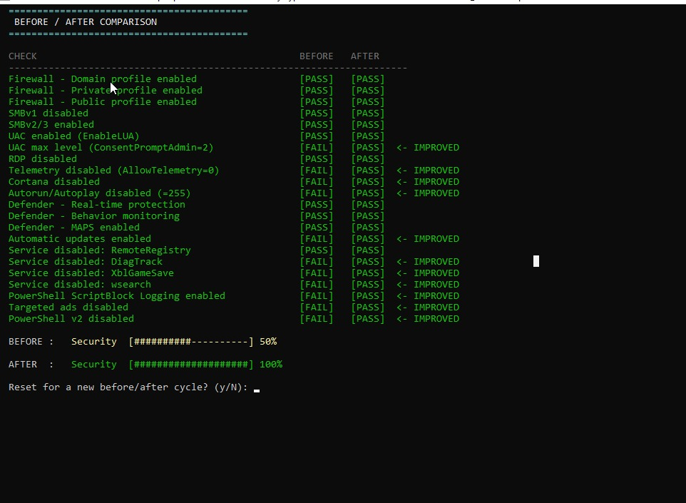

import Tabs from '@theme/Tabs';
import TabItem from '@theme/TabItem';

# 🪟 Hardening Windows 10

## Présentation

Le durcissement de Windows 10 est réalisé via deux scripts PowerShell :

| Script | Rôle |
|--------|------|
| `hardening_windows10.ps1` | Applique toutes les mesures de sécurité |
| `audit_windows10.ps1` | Mesure le score avant / après hardening |

## Résultat — Audit avant / après



```
BEFORE / AFTER COMPARISON

CHECK                                          BEFORE    AFTER
Firewall - Domain profile enabled              [PASS]    [PASS]
Firewall - Private profile enabled             [PASS]    [PASS]
Firewall - Public profile enabled              [PASS]    [PASS]
SMBv1 disabled                                 [PASS]    [PASS]
SMBv2/3 enabled                                [PASS]    [PASS]
UAC enabled (EnableLUA)                        [PASS]    [PASS]
UAC max level (ConsentPromptAdmin=2)           [FAIL]    [PASS]  ← IMPROVED
RDP disabled                                   [PASS]    [PASS]
Telemetry disabled (AllowTelemetry=0)          [FAIL]    [PASS]  ← IMPROVED
Cortana disabled                               [FAIL]    [PASS]  ← IMPROVED
Autorun/Autoplay disabled (=255)               [FAIL]    [PASS]  ← IMPROVED
Defender - Real-time protection                [PASS]    [PASS]
Defender - Behavior monitoring                 [PASS]    [PASS]
Defender - MAPS enabled                        [PASS]    [PASS]
Automatic updates enabled                      [FAIL]    [PASS]  ← IMPROVED
Service disabled: RemoteRegistry               [PASS]    [PASS]
Service disabled: DiagTrack                    [FAIL]    [PASS]  ← IMPROVED
Service disabled: XblGameSave                  [FAIL]    [PASS]  ← IMPROVED
Service disabled: wsearch                      [FAIL]    [PASS]  ← IMPROVED
PowerShell ScriptBlock Logging enabled         [FAIL]    [PASS]  ← IMPROVED
Targeted ads disabled                          [FAIL]    [PASS]  ← IMPROVED
PowerShell v2 disabled                         [FAIL]    [PASS]  ← IMPROVED

BEFORE :  Security [##########----------]  50%
AFTER  :  Security [####################] 100%
```

:::success 50% → 100%
**12 points améliorés** après l'application du script de hardening. Score de sécurité : **50% → 100%**.
:::

## Script de hardening — 9 sections

<Tabs>
  <TabItem value="services" label="Services & Firewall" default>

### 1 — Désactivation services inutiles

```powershell
$servicesToDisable = @(
    "wsearch",          # Windows Search
    "XblGameSave",      # Xbox Live Game Save
    "XboxNetApiSvc",    # Xbox Live Networking
    "DiagTrack",        # Télémétrie Windows
    "dmwappushservice", # WAP Push
    "RemoteRegistry",   # Remote Registry
    "Fax",              # Service Fax
    "lfsvc",            # Géolocalisation
    "MapsBroker"        # Cartes hors-ligne
)

foreach ($svc in $servicesToDisable) {
    Stop-Service -Name $svc -Force -ErrorAction SilentlyContinue
    Set-Service -Name $svc -StartupType Disabled
}
```

### 2 — Pare-feu Windows

```powershell
# Activer sur tous les profils
Set-NetFirewallProfile -Profile Domain,Public,Private -Enabled True

# Politique : bloquer entrant, autoriser sortant
Set-NetFirewallProfile -Profile Public,Private `
    -DefaultInboundAction Block `
    -DefaultOutboundAction Allow
```

### 3 — Mises à jour automatiques

```powershell
$wuPath = "HKLM:\SOFTWARE\Policies\Microsoft\Windows\WindowsUpdate\AU"
Set-ItemProperty -Path $wuPath -Name "NoAutoUpdate" -Value 0
Set-ItemProperty -Path $wuPath -Name "AUOptions"    -Value 4  # auto install
Set-ItemProperty -Path $wuPath -Name "ScheduledInstallTime" -Value 3  # 3h
```

  </TabItem>
  <TabItem value="mdp" label="Comptes & MDP">

### 4 — Politique de mot de passe

```powershell
secedit /export /cfg C:\secpol.cfg

# Modifier : longueur minimum 12 caractères
(gc C:\secpol.cfg).replace(
    "MinimumPasswordLength = 0",
    "MinimumPasswordLength = 12"
) | Out-File C:\secpol.cfg

# Appliquer
secedit /configure /db C:\Windows\Security\Database\secedit.sdb `
    /cfg C:\secpol.cfg /areas SECURITYPOLICY
```

### 5 — UAC niveau maximal

```powershell
Set-ItemProperty -Path "HKLM:\SOFTWARE\Microsoft\Windows\CurrentVersion\Policies\System" `
    -Name "ConsentPromptBehaviorAdmin" -Value 2  # Toujours notifier
```

  </TabItem>
  <TabItem value="telemetrie" label="Confidentialité">

### 6 — Télémétrie & Cortana

```powershell
# Désactiver télémétrie
Set-ItemProperty -Path "HKLM:\SOFTWARE\Policies\Microsoft\Windows\DataCollection" `
    -Name "AllowTelemetry" -Value 0

# Désactiver Cortana
Set-ItemProperty -Path "HKLM:\SOFTWARE\Policies\Microsoft\Windows\Windows Search" `
    -Name "AllowCortana" -Value 0

# Désactiver publicités ciblées
Set-ItemProperty -Path "HKCU:\SOFTWARE\Microsoft\Windows\CurrentVersion\AdvertisingInfo" `
    -Name "Enabled" -Value 0
```

### 7 — Autorun / Autoplay

```powershell
Set-ItemProperty -Path "HKLM:\SOFTWARE\Microsoft\Windows\CurrentVersion\Policies\Explorer" `
    -Name "NoDriveTypeAutoRun" -Value 255  # Désactiver pour tous les lecteurs
```

  </TabItem>
  <TabItem value="smb" label="SMB & Defender">

### 8 — SMB & Protocoles

```powershell
# Désactiver SMBv1 (EternalBlue / WannaCry)
Set-SmbServerConfiguration -EnableSMB1Protocol $false -Force

# Désactiver PowerShell v2
Disable-WindowsOptionalFeature -Online `
    -FeatureName MicrosoftWindowsPowerShellV2Root -NoRestart

# Désactiver RDP (si non nécessaire)
Set-ItemProperty -Path "HKLM:\System\CurrentControlSet\Control\Terminal Server" `
    -Name "fDenyTSConnections" -Value 1
```

### 9 — PowerShell & Logging

```powershell
# Activer ScriptBlock Logging (détection scripts malveillants)
$psLogPath = "HKLM:\SOFTWARE\Policies\Microsoft\Windows\PowerShell\ScriptBlockLogging"
if (-not (Test-Path $psLogPath)) { New-Item -Path $psLogPath -Force }
Set-ItemProperty -Path $psLogPath -Name "EnableScriptBlockLogging" -Value 1

# Activer Windows Defender MAPS (Cloud Protection)
Set-MpPreference -MAPSReporting Advanced
Set-MpPreference -SubmitSamplesConsent SendAllSamples
```

### BitLocker (si TPM disponible)

```powershell
# Chiffrement disque complet
Enable-BitLocker -MountPoint "C:" `
    -EncryptionMethod XtsAes256 `
    -UsedSpaceOnly
```

  </TabItem>
</Tabs>

## Script d'audit — Mesure avant/après

Le script `audit_windows10.ps1` effectue **22 vérifications** et calcule un score de sécurité :

```powershell
# Première exécution → sauvegarde le score AVANT
.\audit_windows10.ps1

# Appliquer le hardening
.\hardening_windows10.ps1

# Deuxième exécution → affiche BEFORE / AFTER + comparaison
.\audit_windows10.ps1
```

### Points vérifiés par l'audit

| Catégorie | Vérifications |
|-----------|--------------|
| **Pare-feu** | Domain, Private, Public activés |
| **SMB** | SMBv1 désactivé, SMBv2/3 activé |
| **UAC** | Activé, niveau maximal |
| **Services** | RemoteRegistry, DiagTrack, Xbox, wsearch |
| **Confidentialité** | Télémétrie, Cortana, Autorun, Pubs |
| **Mises à jour** | Windows Update automatique |
| **Défense** | Defender Real-time, Behavior, MAPS |
| **PowerShell** | ScriptBlock Logging, v2 désactivé |
| **RDP** | Désactivé si non utilisé |

## Tableau récapitulatif des améliorations

| Vérification | Avant | Après | Impact |
|---|---|---|---|
| UAC niveau max | ❌ FAIL | ✅ PASS | Élévation de privilèges |
| Télémétrie désactivée | ❌ FAIL | ✅ PASS | Confidentialité |
| Cortana désactivée | ❌ FAIL | ✅ PASS | Réduction surface |
| Autorun désactivé | ❌ FAIL | ✅ PASS | Malware USB |
| MAJ automatiques | ❌ FAIL | ✅ PASS | Patchs sécurité |
| DiagTrack désactivé | ❌ FAIL | ✅ PASS | Télémétrie |
| Xbox services désactivés | ❌ FAIL | ✅ PASS | Surface d'attaque |
| wsearch désactivé | ❌ FAIL | ✅ PASS | Service inutile |
| PS ScriptBlock Logging | ❌ FAIL | ✅ PASS | Détection scripts |
| Pubs désactivées | ❌ FAIL | ✅ PASS | Confidentialité |
| PowerShell v2 désactivé | ❌ FAIL | ✅ PASS | Downgrade attacks |

:::info Utilisation du script
```powershell
# Exécuter en tant qu'Administrateur
Set-ExecutionPolicy -ExecutionPolicy RemoteSigned -Scope LocalMachine
.\hardening_windows10.ps1
```
:::
