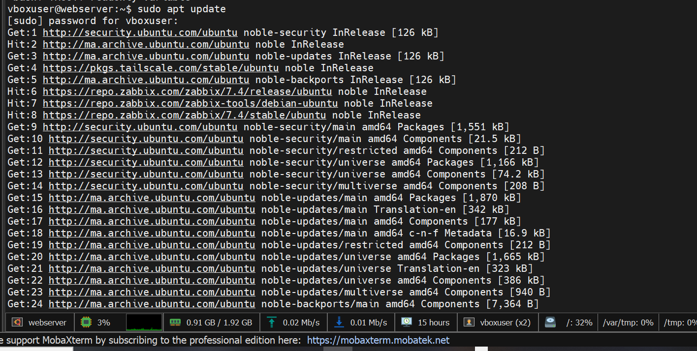
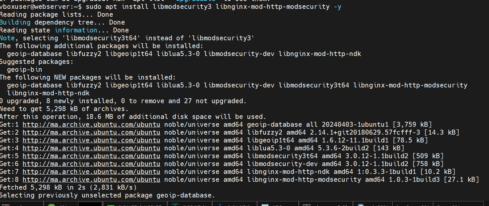
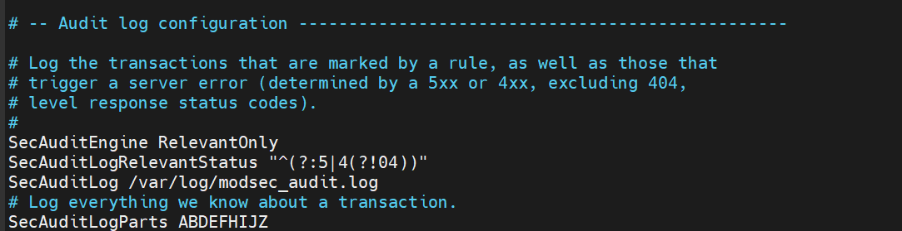
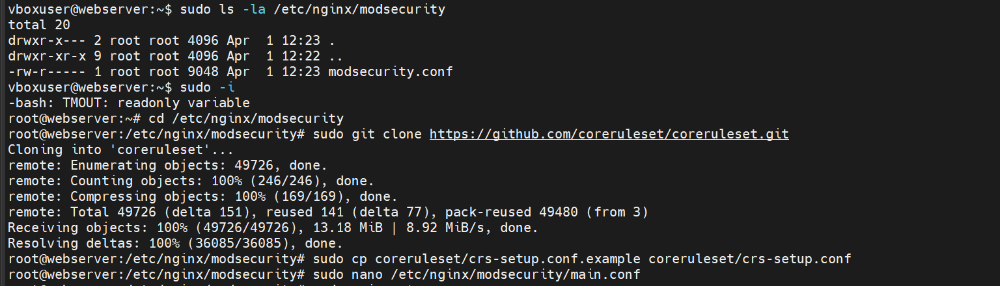
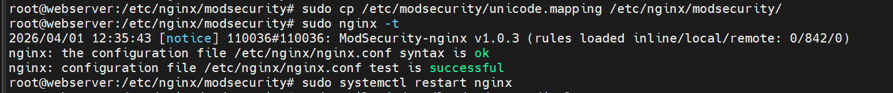
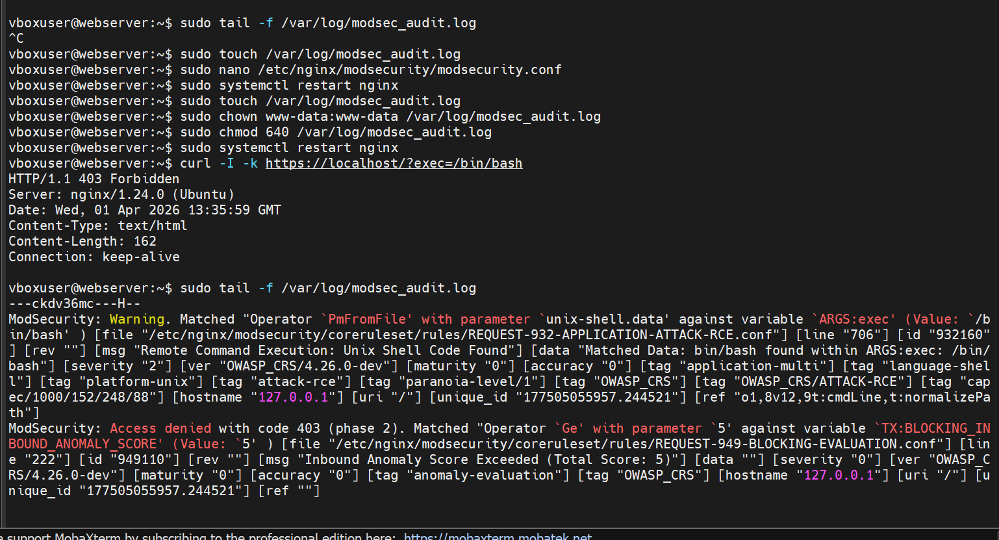
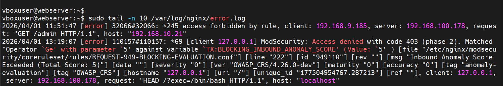

# 🧱 WAF — ModSecurity (Web Application Firewall)

## Présentation

**ModSecurity** est un pare-feu applicatif web (WAF) open source intégré à Apache. Il analyse le trafic HTTP/HTTPS en temps réel et bloque les attaques web courantes : injections SQL, XSS, traversées de répertoires, etc.

| Attribut | Valeur |
|----------|--------|
| **Module** | `libapache2-mod-security2` |
| **Serveur** | Apache2 (Ubuntu Server) |
| **Mode** | DetectionOnly → On |
| **Règles** | OWASP Core Rule Set (CRS) |

---

## Installation

### Étape 1 — Mise à jour du système

Avant toute installation, on met à jour les dépôts pour garantir la compatibilité des paquets.

```bash
sudo apt update
```



> **Figure 1** — La commande `apt update` rafraîchit les dépôts Ubuntu Noble, Zabbix 7.4 et Tailscale.
> Les miroirs marocains (`ma.archive.ubuntu.com`) sont utilisés pour optimiser la vitesse de téléchargement.

---

### Étape 2 — Installation des paquets ModSecurity

Installé dans le cadre du script `ytech_hardening_v7.sh` (étape 3) :

```bash
apt-get install -y libapache2-mod-evasive libapache2-mod-security2
a2enmod security2 evasive headers ssl rewrite
```

Sur Nginx, les paquets équivalents sont :

```bash
sudo apt install libmodsecurity3 libnginx-mod-http-modsecurity -y
```



> **Figure 2** — Installation de `libmodsecurity3` et `libnginx-mod-http-modsecurity` avec 8 dépendances automatiques
> (geoip-database, libfuzzy2, libgeoip1t64, liblua5.3-0, libmodsecurity-dev, libnginx-mod-http-ndk).
> Total téléchargé : 5 298 kB — 18.6 MB d'espace disque utilisé.

---

## Configuration de base

### Activer ModSecurity

```bash
# Copier la config par défaut
cp /etc/modsecurity/modsecurity.conf-recommended \
   /etc/modsecurity/modsecurity.conf

# Passer de DetectionOnly à On
sed -i 's/SecRuleEngine DetectionOnly/SecRuleEngine On/' \
   /etc/modsecurity/modsecurity.conf
```

```apache
# /etc/modsecurity/modsecurity.conf
SecRuleEngine On
SecRequestBodyAccess On
SecResponseBodyAccess On
SecResponseBodyMimeType text/plain text/html text/xml application/json
SecAuditLog /var/log/apache2/modsecurity_audit.log
SecDebugLog /var/log/apache2/modsecurity_debug.log
SecDebugLogLevel 0
```

### Configuration du journal d'audit



> **Figure 3** — Paramétrage du journal d'audit dans `modsecurity.conf`.
> `SecAuditEngine RelevantOnly` enregistre uniquement les transactions suspectes (codes 4xx/5xx hors 404),
> ce qui réduit le volume des logs tout en conservant toutes les alertes importantes.
> Le paramètre `SecAuditLogParts ABDEFHIJZ` détermine les sections de la transaction enregistrées
> (headers de requête, body, réponse, etc.).

---

## OWASP Core Rule Set (CRS)

Le CRS est le jeu de règles de référence pour ModSecurity. Il couvre les **Top 10 OWASP** :

### Étape 3 — Installation du CRS via Git

```bash
# Vérification du dossier ModSecurity Nginx
sudo ls -la /etc/nginx/modsecurity

# Passage en root et clonage du CRS depuis GitHub
sudo -i
cd /etc/nginx/modsecurity
sudo git clone https://github.com/coreruleset/coreruleset.git

# Copie de la configuration de base
sudo cp coreruleset/crs-setup.conf.example coreruleset/crs-setup.conf
sudo nano /etc/nginx/modsecurity/main.conf
```

> **Alternative via paquet système :**
> ```bash
> apt-get install -y modsecurity-crs
> ln -s /usr/share/modsecurity-crs/owasp-crs.load \
>       /etc/apache2/mods-enabled/
> ```



> **Figure 4** — Clonage réussi du dépôt OWASP CRS depuis GitHub (49 726 objets, 13.18 MiB à 8.92 MiB/s).
> Le dossier `/etc/nginx/modsecurity` ne contenait initialement que `modsecurity.conf` (9 048 octets).
> Après le clone, le sous-dossier `coreruleset/` est créé avec l'ensemble des règles CRS v4.26.0-dev.

### Attaques détectées par le CRS

| Catégorie | Règles | Exemples détectés |
|-----------|--------|------------------|
| **Injection SQL** | CRS 942xxx | `' OR 1=1 --`, `UNION SELECT` |
| **XSS** | CRS 941xxx | `<script>alert()</script>` |
| **Path Traversal** | CRS 930xxx | `../../etc/passwd` |
| **Remote File Inclusion** | CRS 931xxx | `?file=http://evil.com/shell.php` |
| **Scanners** | CRS 913xxx | Nmap, Nikto, SQLMap détectés |
| **Protocol** | CRS 920xxx | Headers malformés |
| **RCE Unix Shell** | CRS 932xxx | `/bin/bash`, `/bin/sh` dans les paramètres |

---

## Règles complémentaires Y-Tech

```apache
# /etc/apache2/conf-available/ytech-security.conf
# Headers de sécurité (déjà configurés dans hardening)
Header always set X-Frame-Options "SAMEORIGIN"
Header always set X-Content-Type-Options "nosniff"
Header always set X-XSS-Protection "1; mode=block"

# Cacher la version Apache
ServerTokens Prod
ServerSignature Off

# Désactiver TRACE (évite XST attacks)
TraceEnable Off
```

---

## mod_evasive — Protection DDoS

`mod_evasive` complète ModSecurity en détectant les attaques par déni de service applicatif :

```apache
# /etc/apache2/mods-available/evasive.conf
<IfModule mod_evasive20.c>
    DOSHashTableSize    3097
    DOSPageCount        2       # max 2 req/sec sur une même page
    DOSSiteCount        50      # max 50 req/sec sur le site
    DOSPageInterval     1
    DOSSiteInterval     1
    DOSBlockingPeriod   10      # blocage 10 secondes
    DOSLogDir           /var/log/apache2/mod_evasive
    DOSEmailNotify      root
</IfModule>
```

---

## Validation du WAF

### Étape 4 — Test de configuration Nginx

Après configuration, on valide la syntaxe avant de redémarrer le service :

```bash
sudo cp /etc/modsecurity/unicode.mapping /etc/nginx/modsecurity/
sudo nginx -t
sudo systemctl restart nginx
```



> **Figure 5** — Validation réussie de la configuration Nginx avec ModSecurity-nginx v1.0.3.
> La ligne `rules loaded inline/local/remote: 0/842/0` confirme que les **842 règles OWASP CRS**
> ont été correctement chargées. Le test retourne `successful`, autorisant le redémarrage du service.

---

### Étape 5 — Tests d'attaques et vérification du blocage

```bash
# Tester la détection XSS (depuis Kali Admin)
curl -v "http://192.168.9.253/?q=<script>alert('xss')</script>"
# Réponse attendue : 403 Forbidden

# Tester la détection SQLi
curl -v "http://192.168.9.253/?id=1' OR '1'='1"
# Réponse attendue : 403 Forbidden

# Tester la détection RCE (Remote Command Execution)
curl -I -k https://localhost/?exec=/bin/bash
# Réponse attendue : 403 Forbidden

# Vérifier dans les logs
sudo grep "403" /var/log/apache2/access.log
sudo grep "OWASP" /var/log/apache2/modsecurity_audit.log
```



> **Figure 6** — ✅ **Le WAF est opérationnel et détecte les attaques.**
>
> La requête `curl -I -k https://localhost/?exec=/bin/bash` retourne **HTTP/1.1 403 Forbidden**,
> ce qui prouve que ModSecurity intercepte et bloque l'attaque RCE en temps réel.
>
> Le journal `/var/log/modsec_audit.log` enregistre deux alertes successives pour cette requête :
>
> 1. **Règle 932160** (`REQUEST-932-APPLICATION-ATTACK-RCE.conf`, ligne 706) — Détection de `/bin/bash`
>    dans la variable `ARGS:exec`. Sévérité CRITICAL (2), tags `attack-rce`, `platform-unix`, `OWASP_CRS/ATTACK-RCE`.
>    Score d'anomalie ajouté : **5**.
>
> 2. **Règle 949110** (`REQUEST-949-BLOCKING-EVALUATION.conf`, ligne 222) — Le score d'anomalie entrant
>    atteint 5, dépassant le seuil configuré. **Accès refusé avec code 403 (phase 2)**.
>    `TX:BLOCKING_INBOUND_ANOMALY_SCORE` = 5.

---

## Consultation des logs WAF

```bash
# Logs d'audit ModSecurity — alertes détectées
sudo tail -f /var/log/apache2/modsecurity_audit.log

# Filtrer les attaques SQL
sudo grep "SQL" /var/log/apache2/modsecurity_audit.log

# Filtrer les XSS
sudo grep "XSS" /var/log/apache2/modsecurity_audit.log

# Logs mod_evasive
ls /var/log/apache2/mod_evasive/
```

### Logs d'erreurs Nginx

```bash
sudo tail -n 10 /var/log/nginx/error.log
```



> **Figure 7** — ✅ **Confirmation dans les logs Nginx que le WAF travaille et bloque activement.**
>
> Deux types de blocages sont visibles :
>
> - **2026/04/01 11:51:47** — Accès interdit à `/admin` (règle `*245`) depuis `192.168.9.185` vers
>   `192.168.100.178`. Tentative de reconnaissance de l'interface d'administration.
>
> - **2026/04/01 13:19:07** — Blocage ModSecurity de `HEAD /?exec=/bin/bash` depuis `127.0.0.1`.
>   Règle **949110** déclenchée : `Inbound Anomaly Score Exceeded (Total Score: 5)`,
>   OWASP CRS v4.26.0-dev, `anomaly-evaluation`. **Code 403 retourné en phase 2.**

---

## ✅ Statut — Le WAF est actif et fonctionne

| Composant | Statut |
|-----------|--------|
| Installation `libmodsecurity3` | ✅ Installé (v3.0.12) |
| Installation `libnginx-mod-http-modsecurity` | ✅ Installé (v1.0.3) |
| OWASP CRS cloné depuis GitHub | ✅ 842 règles chargées |
| `SecRuleEngine On` | ✅ Mode Enforcement actif |
| Journal d'audit configuré | ✅ `/var/log/modsec_audit.log` |
| Validation `nginx -t` | ✅ Syntaxe OK |
| Détection RCE (`?exec=/bin/bash`) | ✅ **Bloqué — 403 Forbidden** |
| Détection accès `/admin` non autorisé | ✅ **Bloqué — 403 Forbidden** |

> 🛡️ **Le WAF ModSecurity est pleinement opérationnel.** Il détecte et bloque en temps réel
> les attaques RCE, les tentatives d'accès aux interfaces d'administration, et l'ensemble
> des menaces couvertes par les 842 règles OWASP CRS v4.26.0-dev.

---

:::info Intégration avec Wazuh
Les logs ModSecurity peuvent être ingérés par **Wazuh** (section 12. Monitoring) pour une corrélation centralisée des événements de sécurité web.
:::