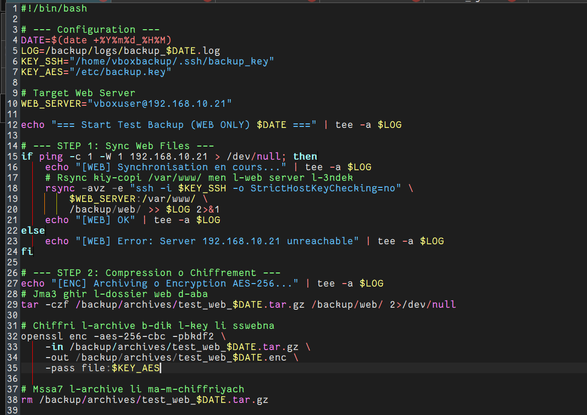
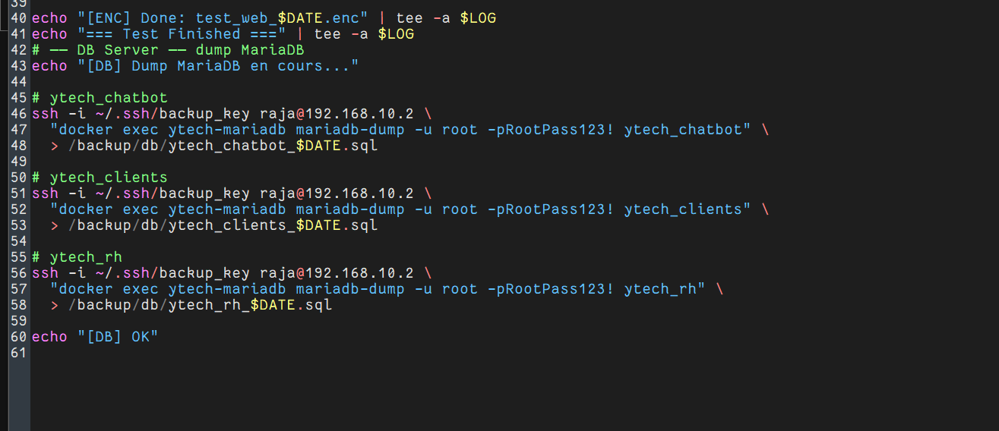
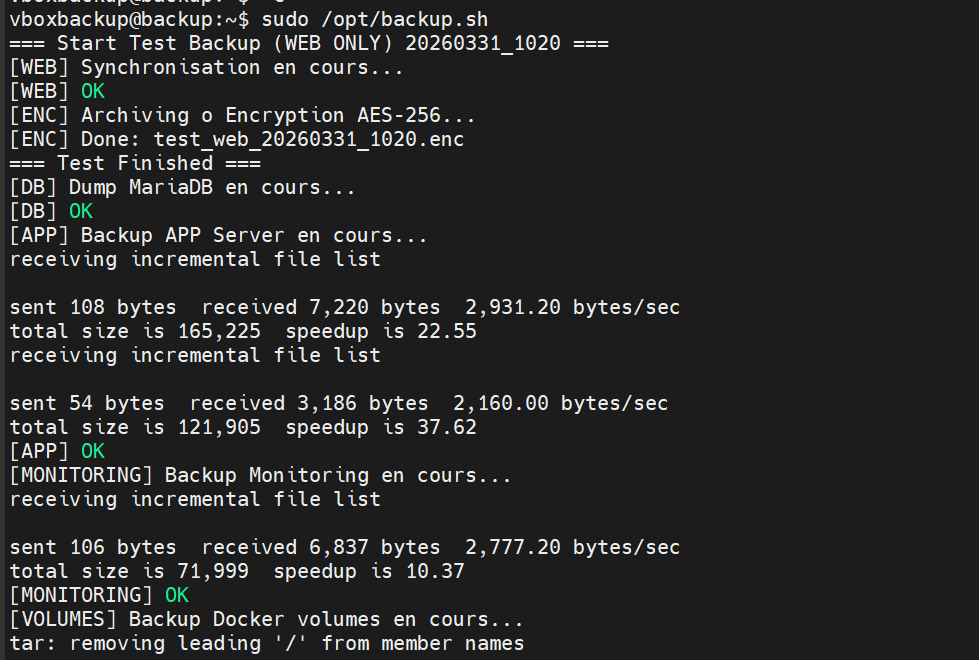
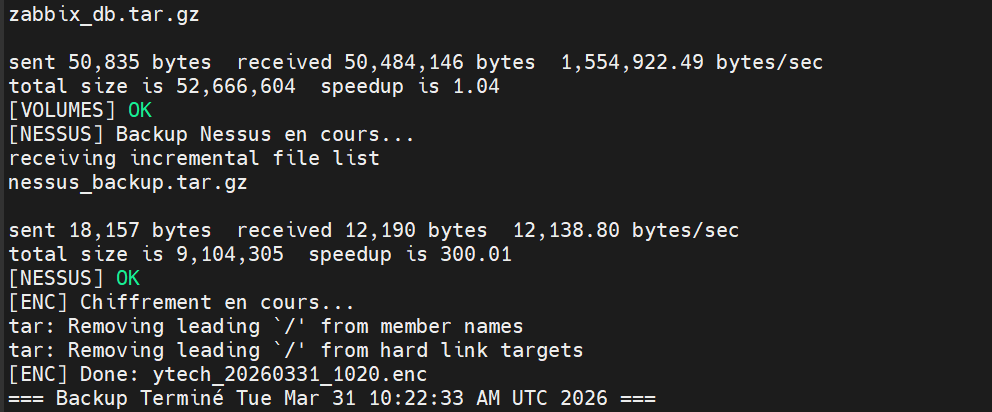

# 🟢 Partie 2 — Scripts Backup
 
## Vue d'ensemble
 
Le script principal `/opt/backup.sh` orchestre l'ensemble du processus de sauvegarde en plusieurs étapes séquentielles :
 
```
[ÉTAPE 1] Synchronisation fichiers Web  →  rsync depuis webserver
[ÉTAPE 2] Dump bases de données         →  mariadb-dump via SSH
[ÉTAPE 3] Sauvegarde APP Server         →  rsync applications
[ÉTAPE 4] Sauvegarde Monitoring         →  rsync configs surveillance
[ÉTAPE 5] Volumes Docker                →  tar des volumes
[ÉTAPE 6] Nessus                        →  sauvegarde scanner
[ÉTAPE 7] Chiffrement AES-256           →  openssl enc
[ÉTAPE 8] Transfert Google Drive        →  rclone copy
```
 
---
 
## Script — Partie 1 : Configuration & Synchronisation Web
 

 
```bash
#!/bin/bash
 
# ═══════════════════════════════════════
#  CONFIGURATION GÉNÉRALE
# ═══════════════════════════════════════
 
DATE=$(date +%Y%m%d_%H%M)                          # Format : 20260326_1500
LOG=/backup/logs/backup_$DATE.log                   # Un log par exécution
KEY_SSH="/home/vboxbackup/.ssh/backup_key"          # Clé SSH Ed25519 (sans passphrase)
KEY_AES="/etc/backup.key"                           # Clé AES-256 pour chiffrement
 
# Serveur Web cible
WEB_SERVER="vboxuser@192.168.10.21"
 
# ═══════════════════════════════════════
#  DÉMARRAGE
# ═══════════════════════════════════════
echo "=== Start Test Backup (WEB ONLY) $DATE ===" | tee -a $LOG
 
# ───────────────────────────────────────
#  ÉTAPE 1 : Synchronisation fichiers Web
# ───────────────────────────────────────
if ping -c 1 -W 1 192.168.10.21 > /dev/null; then
    echo "[WEB] Synchronisation en cours..." | tee -a $LOG
 
    rsync -avz -e "ssh -i $KEY_SSH -o StrictHostKeyChecking=no" \
        $WEB_SERVER:/var/www/ \
        /backup/web/ >> $LOG 2>&1
 
    echo "[WEB] OK" | tee -a $LOG
else
    echo "[WEB] Error: Server 192.168.10.21 unreachable" | tee -a $LOG
fi
 
# ───────────────────────────────────────
#  ÉTAPE 2 : Compression & Chiffrement
# ───────────────────────────────────────
echo "[ENC] Archiving o Encryption AES-256..." | tee -a $LOG
 
# Compression du dossier web
tar -czf /backup/archives/test_web_$DATE.tar.gz /backup/web/ 2>/dev/null
 
# Chiffrement avec AES-256-CBC
openssl enc -aes-256-cbc -pbkdf2 \
    -in  /backup/archives/test_web_$DATE.tar.gz \
    -out /backup/archives/test_web_$DATE.enc \
    -pass file:$KEY_AES
 
# Suppression de l'archive non chiffrée
rm /backup/archives/test_web_$DATE.tar.gz
 
echo "[ENC] Done: test_web_$DATE.enc" | tee -a $LOG
echo "=== Test Finished ===" | tee -a $LOG
```
 
**Points clés :**
- `ping -c 1 -W 1` : teste la disponibilité avant toute opération (timeout 1 seconde)
- `rsync -avz` : synchronisation efficace avec compression réseau (`-z`) et archivage (`-a`)
- `StrictHostKeyChecking=no` : évite les blocages lors du premier contact SSH
- La clé AES est stockée dans `/etc/backup.key` avec droits `400` (root only)
 
---
 
## Script — Partie 2 : Dumps MariaDB & Bases de données
 

 
```bash
# ═══════════════════════════════════════
#  DUMP DES BASES DE DONNÉES MARIADB
#  Serveur DB : raja@192.168.10.2
#  MariaDB dans Docker : ytech-mariadb
# ═══════════════════════════════════════
 
echo "[DB] Dump MariaDB en cours..."
 
# ── Base ytech_chatbot ──
ssh -i ~/.ssh/backup_key raja@192.168.10.2 \
    "docker exec ytech-mariadb mariadb-dump -u root -pRootPass123! ytech_chatbot" \
    > /backup/db/ytech_chatbot_$DATE.sql
 
# ── Base ytech_clients ──
ssh -i ~/.ssh/backup_key raja@192.168.10.2 \
    "docker exec ytech-mariadb mariadb-dump -u root -pRootPass123! ytech_clients" \
    > /backup/db/ytech_clients_$DATE.sql
 
# ── Base ytech_rh ──
ssh -i ~/.ssh/backup_key raja@192.168.10.2 \
    "docker exec ytech-mariadb mariadb-dump -u root -pRootPass123! ytech_rh" \
    > /backup/db/ytech_rh_$DATE.sql
 
echo "[DB] OK"
```
 
**Architecture du dump :**
- Le backup server se connecte en SSH au serveur DB (`192.168.10.2`)
- Il exécute `mariadb-dump` à l'intérieur du conteneur Docker `ytech-mariadb`
- Le résultat SQL est redirigé directement vers `/backup/db/` sur le serveur backup
- Aucune copie intermédiaire n'est créée sur le serveur DB
 
---
 
## Exécution et vérification du script
 

 
> **Résultat de `sudo /opt/backup.sh` :**
 
```
=== Start Test Backup (WEB ONLY) 20260326_1500 ===
[WEB] Synchronisation en cours...
[WEB] OK
[ENC] Archiving o Encryption AES-256...
[ENC] Done: test_web_20260326_1500.enc
=== Test Finished ===
[DB] Dump MariaDB en cours...
[DB] OK
```
 
Chaque étape affiche son statut en vert (`OK`) ou en rouge (`Error`) dans le terminal.
 
---
 
## Exécution complète — Tous les serveurs
 

 
> Lors du run complet (`20260331_1020`), le script sauvegarde **tous les composants** :
 
```
=== Start Test Backup 20260331_1020 ===
[WEB]        OK  ✓ Fichiers web synchronisés
[ENC]        Done: test_web_20260331_1020.enc
=== Test Finished ===
[DB]         OK  ✓ 3 bases MariaDB dumpées
[APP]        Backup APP Server en cours...
             sent 108 bytes / received 7,220 bytes
[APP]        OK  ✓ Applications sauvegardées
[MONITORING] Backup Monitoring en cours...
             total size is 71,999
[MONITORING] OK  ✓ Configs monitoring sauvegardées
[VOLUMES]    Backup Docker volumes en cours...
             zabbix_db.tar.gz — 52.6 MB
[VOLUMES]    OK  ✓
[NESSUS]     Backup Nessus en cours...
             nessus_backup.tar.gz — 9.1 MB
[NESSUS]     OK  ✓
[ENC]        Chiffrement en cours...
[ENC]        Done: ytech_20260331_1020.enc
=== Backup Terminé Tue Mar 31 10:22:33 AM UTC 2026 ===
```
 
**Statistiques observées :**
- APP Server : **121,905 bytes** (speedup 22.55x grâce au mode incrémental)
- Monitoring : **71,999 bytes** (speedup 10.37x)
- Volumes Docker (Zabbix) : **52,666,604 bytes** (~50 MB)
- Nessus : **9,104,305 bytes** (~9 MB)
 
---
 
## Vérification des dumps SQL
 

 
```bash
# Vérification que les dumps ont bien été créés
ls -lh /backup/db/
```
 
**Résultat :**
 
```
total 320K
-rw-r--r-- 1 root root    0  Mar 26 14:52  ytech_chatbot_20260326_1452.sql   # Run initial (0 bytes = DB vide)
-rw-r--r-- 1 root root  9.6K Mar 26 15:01  ytech_chatbot_20260326_1500.sql   # Run suivant (données présentes)
-rw-r--r-- 1 root root    0  Mar 26 14:54  ytech_clients_20260326_1452.sql
-rw-r--r-- 1 root root  298K Mar 26 15:01  ytech_clients_20260326_1500.sql   # 298 KB de données clients
-rw-r--r-- 1 root root    0  Mar 26 14:57  ytech_rh_20260326_1452.sql
-rw-r--r-- 1 root root  7.0K Mar 26 15:01  ytech_rh_20260326_1500.sql
```
 
> On observe que la base `ytech_clients` est la plus volumineuse (298 KB), ce qui est cohérent avec une base contenant les données clients de l'entreprise.
 
---
 
---