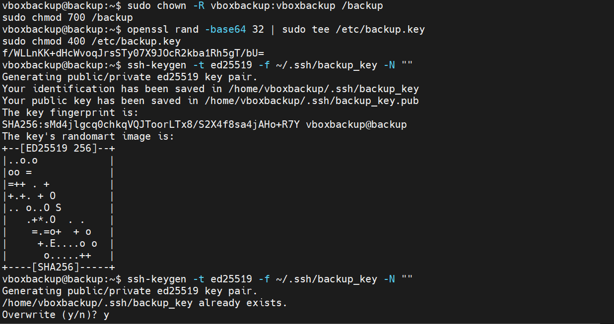
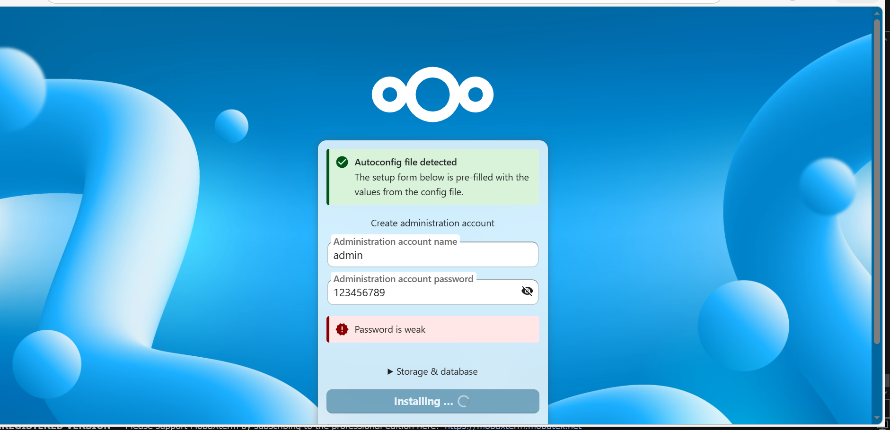

# 🔴 Partie 4 — Sécurisation des Sauvegardes
 
## Vue d'ensemble
 
La sécurisation des sauvegardes repose sur **3 couches** :
 
```
┌─────────────────────────────────────────────────────┐
│  COUCHE 1 : Authentification SSH (Ed25519)          │
│  → Accès sans mot de passe aux serveurs sources     │
├─────────────────────────────────────────────────────┤
│  COUCHE 2 : Chiffrement AES-256-CBC                 │
│  → Archives chiffrées avant stockage cloud          │
├─────────────────────────────────────────────────────┤
│  COUCHE 3 : Permissions système (chmod/chown)       │
│  → Clés accessibles uniquement par root             │
└─────────────────────────────────────────────────────┘
```
 
---
 
## Couche 1 : Génération des clés SSH
 

 
### Création de l'utilisateur backup et des permissions
 
```bash
# Changer le propriétaire du répertoire backup
sudo chown -R vboxbackup:vboxbackup /backup
sudo chmod 700 /backup                      # Seul vboxbackup peut y accéder
```
 
### Génération de la clé AES-256
 
```bash
# Générer 32 bytes aléatoires encodés en base64 → clé AES-256
openssl rand -base64 32 | sudo tee /etc/backup.key
sudo chmod 400 /etc/backup.key              # Lecture seule, uniquement root
```
 
**Résultat :**
```
f/WLLnKK+dHcWvoqJrsSTy07X9JOcR2kba1Rh5gT/bU=
```
 
> Cette clé de 32 caractères base64 représente **256 bits** d'entropie cryptographique.  
> Avec `chmod 400`, seul `root` peut lire cette clé — même l'utilisateur `vboxbackup` ne peut pas y accéder.
 
### Génération de la paire de clés SSH Ed25519
 
```bash
# Générer une clé SSH sans passphrase pour les scripts automatisés
ssh-keygen -t ed25519 -f ~/.ssh/backup_key -N ""
```
 
**Résultat :**
```
Your identification has been saved in /home/vboxbackup/.ssh/backup_key
Your public key has been saved in /home/vboxbackup/.ssh/backup_key.pub
The key fingerprint is:
SHA256:sMd4jlgcq0chkqVQJToorLTx8/S2X4f8sa4jAHo+R7Y vboxbackup@backup
```
 
**Pourquoi Ed25519 ?**
 
| Algorithme | Sécurité | Performance | Taille clé |
|------------|----------|-------------|------------|
| RSA 2048 | Moyen | Lente | 411 bytes |
| RSA 4096 | Bon | Très lente | 812 bytes |
| **Ed25519** | **Excellent** | **Très rapide** | **68 bytes** |
| ECDSA | Bon | Rapide | 132 bytes |
 
> Ed25519 est l'algorithme recommandé en 2026 : résistant aux attaques par timing, clé compacte, performance optimale.
 
---
 
## Couche 2 : Déploiement de la clé SSH sur les serveurs
 
### Copie de la clé vers root et vérification des permissions
 
```bash
# Copier la clé vers /root/.ssh/ pour exécution avec sudo
sudo mkdir -p /root/.ssh
sudo cp /home/vboxbackup/.ssh/backup_key /root/.ssh/backup_key
sudo chmod 600 /root/.ssh/backup_key
```
 
### Vérification complète des permissions
 

 
```bash
# Vérification des droits sur la clé
sudo ls -la /root/.ssh/backup_key
```
 
```
-rw------- 1 root root  411 Mar 26 15:00  backup_key    # chmod 600 ✓
```
 
### Test de connexion vers le serveur APP
 
```bash
sudo ssh -i /root/.ssh/backup_key raja@192.168.9.253
```
 
```
Warning: Permanently added '192.168.9.253' (ED25519) to the list of known hosts.
Welcome to Ubuntu 24.04.4 LTS (GNU/Linux 6.8.0-106-generic x86_64)
System information as of Mon Mar 30 10:45:41 AM UTC 2026
```
 
> **La connexion SSH sans mot de passe fonctionne** entre le serveur backup et le serveur APP.  
> La clé publique a été préalablement ajoutée dans `~/.ssh/authorized_keys` du serveur cible.
 
---
 
## Couche 3 : Chiffrement AES-256 des archives
 
### Processus de chiffrement
 
```bash
# ── COMPRESSION ──────────────────────────────────────────
tar -czf /backup/archives/test_web_$DATE.tar.gz /backup/web/ 2>/dev/null
#    │ │ │                                        └── Source
#    │ │ └── fichier de sortie
#    │ └── z : compression gzip
#    └── c : créer une archive
 
# ── CHIFFREMENT ──────────────────────────────────────────
openssl enc -aes-256-cbc -pbkdf2 \
    -in  /backup/archives/test_web_$DATE.tar.gz \
    -out /backup/archives/test_web_$DATE.enc \
    -pass file:/etc/backup.key
#           │                   └── Clé lue depuis le fichier (pas en clair dans la commande)
#           └── pbkdf2 : dérivation de clé sécurisée (PKCS#5 v2)
 
# ── NETTOYAGE ────────────────────────────────────────────
rm /backup/archives/test_web_$DATE.tar.gz
# Suppression de l'archive non chiffrée — seul le .enc est conservé
```
 
**Pourquoi AES-256-CBC avec PBKDF2 ?**
 
- **AES-256** : standard militaire, approuvé NSA pour informations classifiées
- **CBC** (Cipher Block Chaining) : chaque bloc dépend du précédent → résistant aux patterns
- **PBKDF2** : dérive une clé robuste depuis le fichier clé, résiste aux attaques par force brute
- **`-pass file:`** : la clé n'apparaît jamais dans les processus système (`ps aux`)
 
---
 
## Résultat complet du premier test de backup
 

 
```bash
vboxbackup@backup:~$ sudo mkdir -p /root/.ssh
vboxbackup@backup:~$ sudo cp /home/vboxbackup/.ssh/backup_key /root/.ssh/backup_key
vboxbackup@backup:~$ sudo chmod 600 /root/.ssh/backup_key
vboxbackup@backup:~$ sudo /opt/backup.sh
```
 
**Sortie du script :**
```
=== Start Test Backup (WEB ONLY) 20260326_1500 ===
[WEB] Synchronisation en cours...
[WEB] OK
[ENC] Archiving o Encryption AES-256...
[ENC] Done: test_web_20260326_1500.enc
=== Test Finished ===
[DB] Dump MariaDB en cours...
[DB] OK
```
 
> **Toutes les étapes se sont exécutées avec succès** : synchronisation web, chiffrement AES-256, dump des 3 bases MariaDB.
 
---
 
## Connexion SSH au serveur Web — Nextcloud installé
 

 
> Nextcloud est déployé sur le serveur web (`192.168.10.21`) et ses données sont également incluses dans les sauvegardes `/var/www/`.
 
```
Autoconfig file detected
The setup form is pre-filled with the values from the config file.
 
Administration account name    : admin
Administration account password: ********
⚠️  Password is weak
 
▶ Storage & database
[Installing...  ⟳]
```
 
> **Note de sécurité :** Nextcloud signale que le mot de passe admin est faible.  
> En production, il est impératif d'utiliser un mot de passe conforme à la politique de sécurité.
 
---
 
## Récapitulatif de sécurité
 
| Élément | Configuration | Niveau |
|---------|---------------|--------|
| Accès SSH | Ed25519, sans passphrase, clé dédiée backup | 🟢 Bon |
| Permissions clé SSH | `chmod 600`, propriétaire `root` | 🟢 Bon |
| Clé AES | 256 bits, `chmod 400`, propriétaire `root` | 🟢 Bon |
| Chiffrement | AES-256-CBC + PBKDF2 | 🟢 Excellent |
| Stockage cloud | Fichiers `.enc` uniquement (jamais de données brutes) | 🟢 Bon |
| Répertoire backup | `chmod 700`, propriétaire `vboxbackup` | 🟢 Bon |
| Mot de passe Nextcloud | Faible (signalé) | 🔴 À corriger |
 
---
 
---
 
## 📊 Bilan Global du Module 14
 
```
┌──────────────────────────────────────────────────────────────┐
│                    RÉCAPITULATIF FINAL                       │
├──────────────────┬───────────────────────────────────────────┤
│ Stratégie        │ 3-2-1 : local + backup server + GDrive    │
│ Serveurs         │ Web (10.21) + DB (10.2) + APP (9.253)     │
│ Fréquence        │ Multiple fois par jour (timestamps uniques)│
│ Chiffrement      │ AES-256-CBC avec PBKDF2                    │
│ Authentification │ SSH Ed25519 sans passphrase                │
│ Cloud            │ Google Drive via rclone                    │
│ Volume transféré │ ~5.8 GiB par backup complet               │
│ Durée            │ ~20 minutes pour un backup complet         │
│ Rétention        │ Historique complet conservé sur Drive      │
└──────────────────┴───────────────────────────────────────────┘
```
 
---