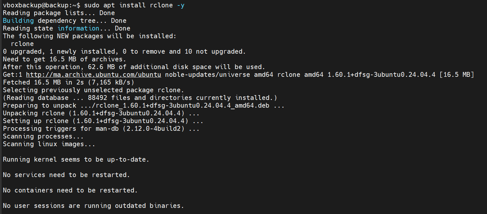
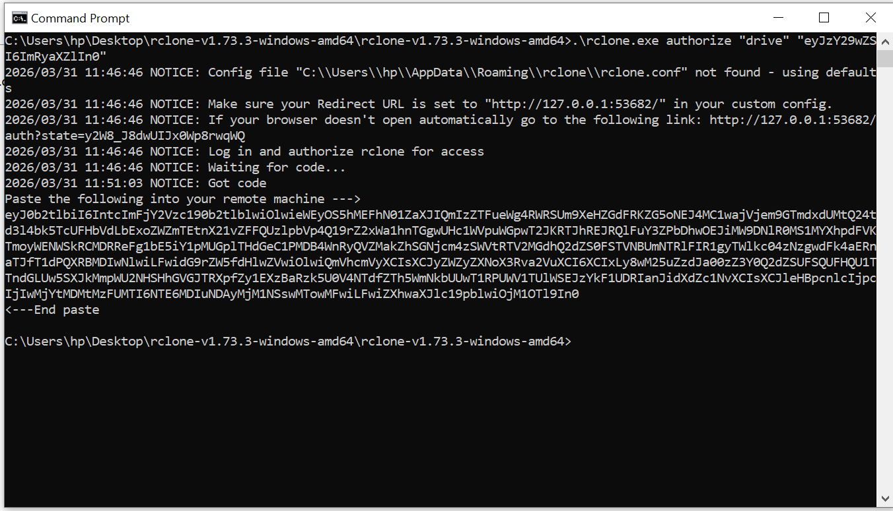

# 🟡 Partie 3 — Stockage Externe : Google Drive via rclone
 
## Vue d'ensemble
 
**Rclone** est un outil open-source permettant de synchroniser des fichiers entre un serveur Linux et de nombreux services cloud (Google Drive, S3, Azure Blob, etc.).
 
```
Serveur Backup  ──── rclone copy ────►  Google Drive
  /backup/                              ytech-backup/
  archives/                             *.enc files
```
 
---
 
## Étape 1 : Installation de rclone
 

 
```bash
sudo apt install rclone -y
```
 
**Résultat de l'installation :**
 
```
The following NEW packages will be installed: rclone
Version installée : rclone 1.60.1+dfsg-3ubuntu0.24.04.4 [amd64]
Téléchargé depuis : http://ma.archive.ubuntu.com/ubuntu
Taille : 16.5 MB  →  62.6 MB sur disque
```
 
> Rclone est disponible directement dans les dépôts Ubuntu Noble (24.04).  
> Pas besoin d'ajouter de PPA ou de téléchargement manuel.
 
---
 
## Étape 2 : Configuration du remote Google Drive
 

 
```bash
rclone config
```
 
**Flux de configuration interactif :**
 
```
No remotes found, make a new one?
n/s/q> n                    # Créer un nouveau remote
 
Enter name for new remote.
name> gdrive               # Nom du remote (utilisé dans les scripts)
 
Option Storage.
Type of storage to configure.
```
 
> La liste affiche tous les providers supportés : Amazon S3, Backblaze B2, Box, Google Drive (#17), etc.  
> On sélectionne **Google Drive** dans la liste numérotée.
 
---
 
## Étape 3 : Autorisation OAuth2 côté Windows
 
> Comme le serveur backup n'a pas de navigateur graphique, l'autorisation OAuth2 se fait en **mode headless** : rclone génère un token sur une machine Windows avec navigateur.
 

 
```cmd
C:\Users\hp> cd C:\Users\hp\Desktop\rclone-v1.73.3-windows-amd64\rclone-v1.73.3-windows-amd64
C:\...> .\rclone.exe authorize "drive" "eyJzY29wZSI6ImRyaXZlIn0"
 
2026/03/31 11:46:46 NOTICE: Config file not found - using defaults
2026/03/31 11:46:46 NOTICE: Make sure your Redirect URL is set to "http://127.0.0.1:53682/"
2026/03/31 11:46:46 NOTICE: Log in and authorize rclone for access
2026/03/31 11:46:46 NOTICE: Waiting for code...
```
 
> Un navigateur s'ouvre automatiquement pour demander l'autorisation Google.  
> Après validation, rclone génère un **token d'accès** à copier-coller sur le serveur Linux.
 
---
 
## Étape 4 : Récupération du token OAuth2
 

 
```
2026/03/31 11:51:03 NOTICE: Got code
 
Paste the following into your remote machine --->
eyJ0b2tlbiI6IntcImFjY2Vzc190b2tlbiI6Ik...
[token complet affiché]
<---End paste
```
 
**Ce token :**
- Est un JWT (JSON Web Token) signé par Google
- Contient les credentials d'accès à Google Drive
- Est stocké dans `~/.config/rclone/rclone.conf` sur le serveur backup
- A une durée de vie limitée mais se renouvelle automatiquement via le refresh token
 
---
 
## Étape 5 : Fichiers présents dans Google Drive
 

 
> Les fichiers `.enc` (chiffrés) sont automatiquement transférés vers le dossier `ytech-backup` sur Google Drive.
 
**Fichiers présents :**
 
| Fichier | Date | Taille |
|---------|------|--------|
| `test_web_20260326_1331.enc` | Mar 26 | 180.2 MB |
| `test_web_20260326_1452.enc` | Mar 26 | 180.2 MB |
| `test_web_20260326_1500.enc` | Mar 26 | 180.2 MB |
| `test_web_20260330_0912.tar.gz` | Mar 30 | 15.5 MB |
| `test_web_20260330_1105.enc` | Mar 30 | 187 MB |
| `test_web_20260330_1200.enc` | Mar 30 | 187 MB |
| `test_web_20260330_1222.enc` | Mar 30 | 187 MB |
 
> On observe l'historique des sauvegardes avec plusieurs snapshots par jour, permettant une restauration granulaire.
 
---
 
## Transfert en cours vers Google Drive
 

 
```
[GDRIVE] Copie vers Google Drive en cours...
Transferred:   5.179 GiB / 5.373 GiB,  96%,  5.124 MiB/s,  ETA 38s
Transferred:        20 / 24,  83%
Elapsed time:  13m13.2s
 
Transferring:
 * test_web_20260331_1020.enc:  48% / 187.267Mi,  1.824Mi/s,  52s
 * ytech_20260331_1004.enc:    100% / 46.202Mi,  503.502Ki/s,  0s
 * ytech_20260331_1100.enc:     13% / 55.941Mi,  1.010Mi/s,  48s
 * ytech_20260331_1105.enc:      5% / 56.023Mi,  0/s,  -
```
 
**Statistiques du transfert :**
- Débit moyen : **~5 MiB/s** (soit ~40 Mbps)
- 24 fichiers à transférer (archives web + archives ytech)
- Durée totale : **~19 minutes** pour 5.8 GiB
 
---
 
## Transfert terminé avec succès
 

 
```
[NESSUS]  OK
[ENC]     Chiffrement en cours...
[GDRIVE]  Copie vers Google Drive en cours...
          Transferred:  5.829 GiB / 5.829 GiB,  100%,  5.961 MiB/s,  ETA 0s
          Transferred:       24 / 24,  100%
          Elapsed time: 19m35.4s
[GDRIVE]  OK
[ENC]     Done: ytech_20260331_1105.enc
=== Backup Terminé Tue Mar 31 11:26:58 AM UTC 2026 ===
```
 
> **5.829 GiB transférés en 19m35s** — Le backup complet de l'infrastructure est désormais sécurisé hors site.
 
---
 
## Intégration rclone dans le script
 
```bash
# Ajout du transfert Google Drive dans backup.sh
echo "[GDRIVE] Copie vers Google Drive en cours..." | tee -a $LOG
 
rclone copy /backup/archives/ gdrive:ytech-backup/ \
    --progress \
    --log-file=$LOG \
    --log-level INFO
 
echo "[GDRIVE] OK" | tee -a $LOG
```
 
**Options rclone utilisées :**
- `copy` : copie sans suppression des fichiers déjà présents (différent de `sync`)
- `--progress` : affichage temps réel de la progression
- `--log-file` : journalisation dans le même fichier de log que le script
- `gdrive:ytech-backup/` : remote `gdrive` configuré, dossier `ytech-backup`
 
---
 
---
 