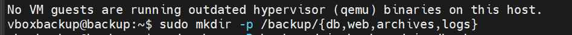

 
> Ce module documente l'ensemble du système de sauvegarde mis en place pour l'infrastructure ytech.  
> Il couvre la stratégie 3-2-1, les scripts automatisés, le stockage externe sur Google Drive, et la sécurisation des sauvegardes par chiffrement AES-256.
 
 
## 🗂️ Table des Matières
 
1. [Stratégie 3-2-1](#-partie-1--stratégie-3-2-1)
2. [Scripts Backup](#-partie-2--scripts-backup)
3. [Stockage Externe — Google Drive](#-partie-3--stockage-externe--google-drive-via-rclone)
4. [Sécurisation des Sauvegardes](#-partie-4--sécurisation-des-sauvegardes)
 
---
 
---
 
# 🔵 Partie 1 — Stratégie 3-2-1
 
## Vue d'ensemble
 
La **règle 3-2-1** est la norme de référence en matière de sauvegarde :
 
| Principe | Description |
|----------|-------------|
| **3** copies | 1 originale + 2 sauvegardes |
| **2** supports différents | Ex : disque local + cloud |
| **1** copie hors site | Stockée à distance (Google Drive) |
 
Cette stratégie garantit qu'une panne matérielle, une erreur humaine ou une compromission ne peut pas détruire toutes les données simultanément.
 
---
 
## Architecture de l'infrastructure ytech
 
```
┌─────────────────────────────────────────────────────────┐
│                   INFRASTRUCTURE YTECH                  │
│                                                         │
│  ┌──────────────┐   ┌──────────────┐   ┌─────────────┐ │
│  │  Web Server  │   │  DB Server   │   │  App Server │ │
│  │ 192.168.10.21│   │192.168.10.2  │   │(monitoring) │ │
│  │   (Nginx)    │   │  (MariaDB)   │   │  (Docker)   │ │
│  └──────┬───────┘   └──────┬───────┘   └──────┬──────┘ │
│         │                  │                   │        │
│         └──────────────────┴───────────────────┘        │
│                            │                            │
│                     ┌──────▼──────┐                     │
│                     │   BACKUP    │                     │
│                     │   SERVER    │                     │
│                     │  /backup/   │                     │
│                     └──────┬──────┘                     │
│                            │ rclone                     │
│                     ┌──────▼──────┐                     │
│                     │  GOOGLE     │                     │
│                     │   DRIVE     │                     │
│                     │ytech-backup │                     │
│                     └─────────────┘                     │
└─────────────────────────────────────────────────────────┘
```
 
---
 
## Serveurs impliqués
 
| Serveur | IP | Rôle | Données sauvegardées |
|---------|----|------|----------------------|
| **webserver** | `192.168.10.21` | Serveur Web (Nginx) | `/var/www/` — fichiers du site |
| **DB Server** | `192.168.10.2` | Base de données MariaDB | Dumps SQL (ytech_chatbot, ytech_clients, ytech_rh) |
| **App Server** | `192.168.9.253` | Applications Docker | Volumes Docker, configs |
| **backup** | Serveur dédié | Orchestrateur | Centralise toutes les sauvegardes |
 
---
 
## Connexion SSH vers le serveur Web (test de connectivité)
 
> Avant de mettre en place les sauvegardes automatiques, on vérifie que le serveur Web est accessible en SSH.
 

 
```
╔══════════════════════════════════════════════════════╗
║  Système Ubuntu 24.04 LTS                           ║
║  IP : 192.168.10.21                                 ║
║  Utilisateur : vboxuser@webserver                   ║
║  Mémoire : 36% utilisée                             ║
║  Disque : 17.7% de 24.44 GB                         ║
╚══════════════════════════════════════════════════════╝
```
 
**Ce qu'on observe :**
- Le serveur web tourne sous Ubuntu avec 134 processus actifs
- La mémoire RAM est bien en dessous du seuil critique (36%)
- La connexion SSH fonctionne correctement depuis `192.168.9.185`
- Un message de sécurité est configuré : *"Authorized access only. All activities are monitored."*
 
---
 
## Structure des répertoires de sauvegarde
 
> La première étape est de créer l'arborescence qui accueillera les sauvegardes sur le serveur backup.
 

 
```bash
# Création de la structure complète en une commande
sudo mkdir -p /backup/{db,web,archives,logs}
```
 
**Explication de chaque répertoire :**
 
| Répertoire | Contenu |
|------------|---------|
| `/backup/db/` | Dumps SQL des bases MariaDB |
| `/backup/web/` | Fichiers synchronisés depuis `/var/www/` du serveur web |
| `/backup/archives/` | Archives `.tar.gz` et `.enc` (compressées & chiffrées) |
| `/backup/logs/` | Journaux d'exécution des scripts (un fichier par run) |
 
---
 
---