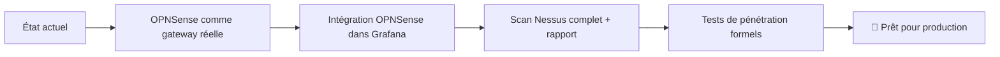

## 16.3 Écart avec la Production

### Comparaison Simulation vs Production

| Composant | Notre simulation | Production réelle |
|---|---|---|
| **Firewall** | OPNSense sur VM | Appliance physique (Fortinet, Palo Alto) |
| **Switch** | Cisco simulé (GNS3) | Switch physique avec PoE, SFP |
| **Serveurs** | VMs VirtualBox | Serveurs dédiés / Cloud (AWS, Azure) |
| **Stockage** | Disque local VM | SAN / NAS avec RAID 6 |
| **Redondance** | Aucune (single point) | HA clusters, load balancing |
| **Monitoring** | Zabbix sur la même VM | Serveur monitoring dédié isolé |
| **Certificats SSL** | Auto-signés | Let's Encrypt / PKI d'entreprise |
| **IAM** | Bitwarden local | Active Directory / LDAP / Okta |
| **Réseau** | WiFi partagé | Fibre dédiée, BGP, redondance FAI |
| **Backup** | Google Drive personnel | Stockage S3, Tape, Vault |
| **Compliance** | Simulation ISO 27001 | Audit formel + certification |

### Ce qui reste à faire avant production

:::info Tâches restantes
| Tâche | Responsable | Priorité |
|---|---|---|
| OPNSense gateway pour toutes les VMs | Raja + Asmaa | 🔴 Haute |
| Ajouter OPNSense dans Grafana | Raja + Asmaa | 🟡 Moyenne |
| Nessus scan complet + screenshots | Raja | 🔴 Haute |
:::

---

## 16.4 Risques résiduels identifiés

| Risque | Probabilité | Impact | Mitigation |
|---|---|---|---|
| Fuite de credentials dans GitHub | Faible | Critique | `.gitignore` + secrets dans env vars |
| Certificats SSL auto-signés non vérifiés | Certaine | Moyen | Avertissement navigateur — PKI en prod |
| Modèle IA local sans filtrage | Faible | Moyen | Rate limiting + authentification |
| Single point of failure (Headscale) | Faible | Élevé | Backup config + réplication cible |
| Latence réseau WiFi école | Certaine | Faible | Tests effectués en Host-Only isolé |
