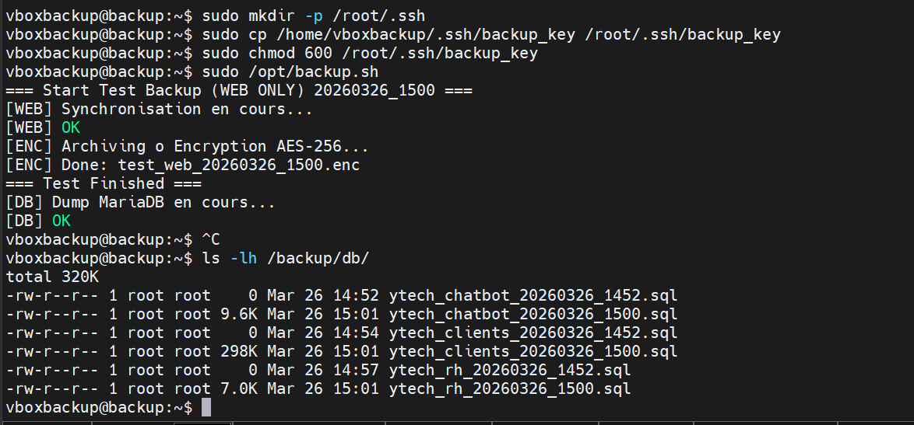
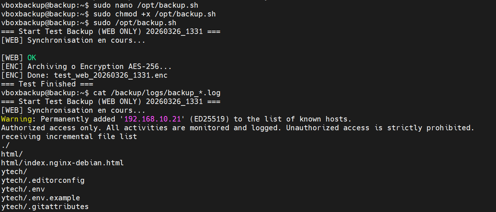

##  Conception et Logique du Script

L'automatisation est le moteur de notre stratégie de résilience. Pour éviter les erreurs humaines et garantir une régularité absolue, nous avons développé un script Bash "Maître". Ce script orchestre la collecte, la centralisation et la préparation des données avant leur exportation vers le Cloud.

---

#### A. Initialisation et Configuration des Variables
Un script professionnel commence toujours par une déclaration claire des variables. Cela permet de modifier l'infrastructure (changement d'IP ou de répertoire) sans avoir à réécrire tout le code.

*Figure 5 : Initialisation des paramètres techniques dans /opt/backup.sh.*

**Analyse détaillée de la Figure 5 :**
Dans cette première partie du script, nous observons une structuration rigoureuse :
* **Horodatage Dynamique (`DATE`)** : L'utilisation de `$(date +%Y%m%d_%H%M)` est cruciale. Elle permet de créer des noms de fichiers uniques. Sans cela, chaque nouvelle sauvegarde écraserait la précédente, rendant impossible la restauration à une date antérieure.
* **Définition des Cibles (IPs)** : On identifie clairement les serveurs Web (`192.168.10.21`) et Database (`192.168.10.2`). Le script sait exactement vers quelles destinations se diriger pour aspirer les flux de données.
* **Sécurisation par Clé (`SSH_KEY`)** : Le script pointe vers la clé privée `backup_key`. C'est l'élément qui permet l'authentification automatique.

---

#### B. Logique de Traitement et Boucles d'Archivage
Une fois les cibles identifiées, le script doit traiter les données. Nous avons opté pour une approche modulaire : collecter d'abord, compresser ensuite.

*Figure 6 : Détail des commandes de traitement et de compression des données.*

**Analyse détaillée de la Figure 6 :**
La **Figure 6** nous montre l'intelligence du script :
1.  **Le Répertoire Temporaire** : Le script crée un dossier de transit. C'est ici que les fichiers SQL et les fichiers Web sont rassemblés.
2.  **L'Archivage avec `tar`** : L'amr `tar -czf` est utilisé pour transformer des milliers de petits fichiers Web en un seul bloc compressé. Le format `.tar.gz` réduit considérablement l'espace disque consommé et accélère le transfert vers Google Drive.
3.  **Gestion des Erreurs** : Le script inclut des vérifications. Si une étape échoue (par exemple, si le serveur DB est éteint), le script consigne l'erreur dans les logs au lieu de continuer avec une archive vide.

---

#### C. Centralisation des Logs pour l'Audit
Chaque action effectuée par le script est enregistrée. C'est ce qui permet à l'administrateur système de vérifier l'état de santé du système de backup sans avoir à lancer les commandes manuellement.

* **Fichiers de Logs** : Localisés dans `/backup/logs/`, ils contiennent le compte-rendu de chaque transfert Rsync et de chaque Dump SQL.
* **Transparence** : Les logs affichent la taille des fichiers transférés, ce qui permet de détecter immédiatement une anomalie (ex: un backup anormalement léger).

---

###  Exécution Technique et Planification

Une fois la logique du script établie, nous passons à la phase de validation. Cette étape est cruciale car elle permet de confirmer que les flux de données circulent correctement entre les serveurs et que l'automatisation est opérationnelle sur le long terme.

---

#### A. Validation de l'Extraction Database (MariaDB)
Le premier test critique concerne la base de données. Puisque les données sont dynamiques, le script doit être capable d'extraire une image fidèle (Snapshot) de la base sans corrompre les tables.

*Figure 7 : Log de succès du dump de la base de données MariaDB.*

**Analyse détaillée de la Figure 7 :**
Sur cette capture d'écran, nous observons le résultat de la commande `mysqldump` exécutée à distance :
* **Flux de données** : Le script a ouvert un tunnel SSH vers `192.168.10.2`.
* **Vérification** : On voit que le fichier SQL a été généré avec succès. Ce fichier contient l'intégralité des structures de tables et des données de **Ytech Solutions**, prêt à être restauré en cas de crash du serveur de base de données.

---

#### B. Synchronisation des Fichiers Web (Rsync)
Pour les fichiers du site web, nous n'utilisons pas une simple copie, mais l'outil `rsync`. C'est une méthode beaucoup plus intelligente et économe en ressources.

*Figure 8 : Résultat du transfert différentiel via Rsync.*

**Analyse détaillée de la Figure 8 :**
La **Figure 8** nous montre l'efficacité de cette méthode :
* **Méthode Différentielle** : `rsync` compare les fichiers du serveur Web (`192.168.10.21`) avec ceux déjà présents sur le serveur de Backup. Il ne transfère que les fichiers nouveaux ou modifiés.
* **Rapidité** : On observe la liste des fichiers synchronisés. Cette approche permet de réduire le temps de sauvegarde de plusieurs minutes à quelques secondes seulement si peu de changements ont eu lieu.

---

#### C. Automatisation par le Planificateur de Tâches (Cron)
Pour que la sauvegarde soit réellement "résiliente", elle ne doit pas dépendre d'un humain. Nous utilisons le démon **Cron** pour transformer notre script en une tâche récurrente.

*Figure 9 : Commande d'édition du fichier Crontab.*

**Analyse détaillée de la Figure 9 :**
Pour configurer l'automatisme, nous utilisons la commande `crontab -e` (Figure 9). Cela ouvre un fichier de configuration où chaque ligne représente une tâche programmée.

*Figure 10 : Liste des tâches planifiées pour l'utilisateur de sauvegarde.*

**Analyse détaillée de la Figure 10 :**
Dans la **Figure 10**, nous voyons la ligne finale de programmation : `0 2 * * * /opt/backup.sh`.
* **Interprétation technique** : Le script se lancera automatiquement chaque jour à **02h00 du matin**. 
* **Justification du créneau** : À cette heure, l'activité sur le site Web et la base de données est minimale. Cela garantit que la sauvegarde ne ralentira pas l'expérience des utilisateurs de Ytech Solutions.

---

#### D. Conclusion de la phase d'exécution
Grâce à cette combinaison de scripts Bash et de planification Cron, nous avons transformé une tâche manuelle fastidieuse en un processus "Set and Forget" (configurer et oublier). L'administrateur n'a plus qu'à consulter les logs périodiquement pour s'assurer que tout se passe bien.