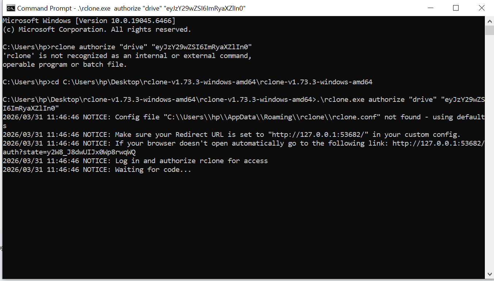
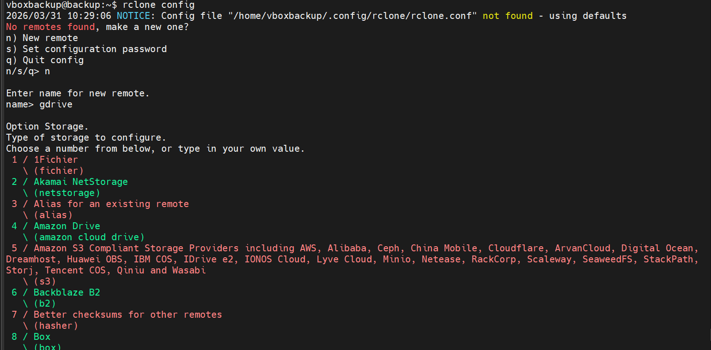
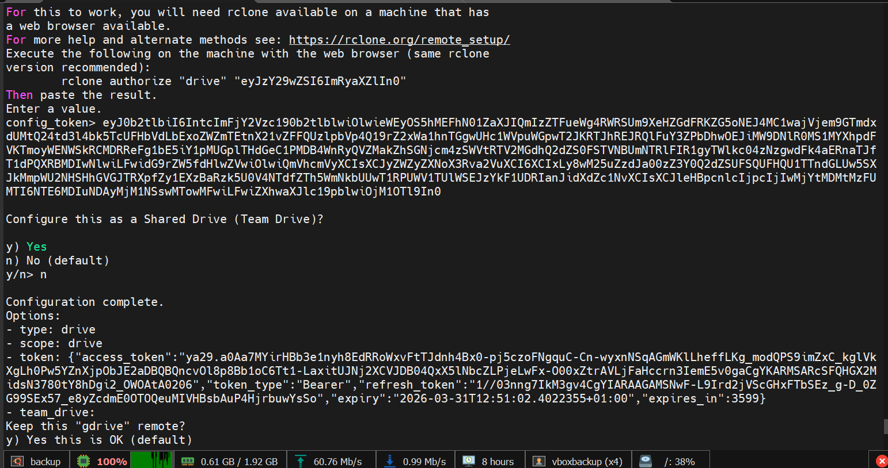
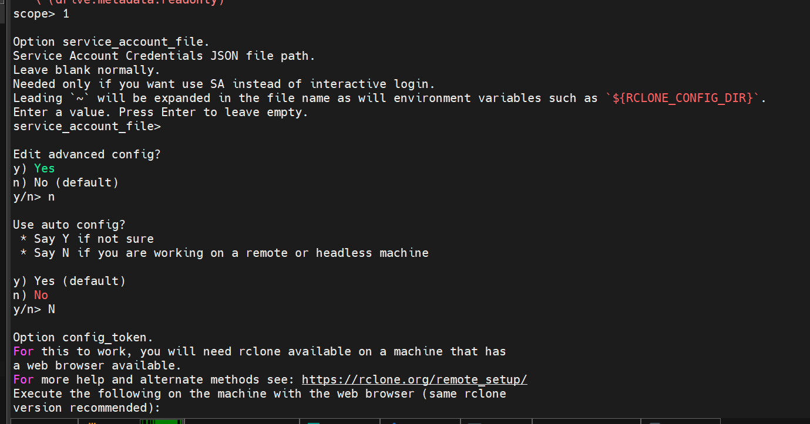
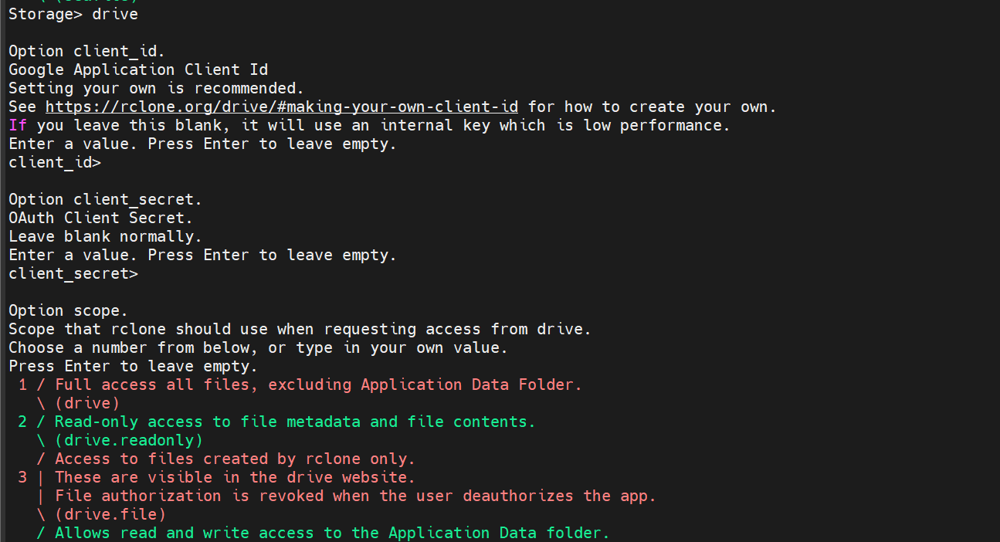
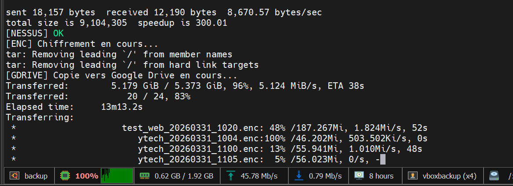
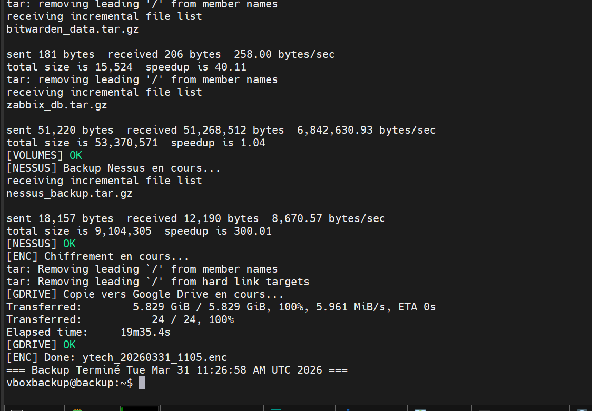

##  Installation et Configuration de Rclone

L'externalisation vers le Cloud est la garantie ultime de survie des données pour **Ytech Solutions**. Pour réaliser ce pont entre notre infrastructure locale et les serveurs de Google, nous utilisons **Rclone**, un outil de synchronisation de fichiers de référence pour les environnements de production.

---

#### A. Phase d'Installation de l'Utilitaire
La première étape technique consiste à préparer le serveur de gestion (**192.168.9.251**) en installant les paquets nécessaires. L'installation doit être propre et vérifiée pour éviter tout dysfonctionnement lors des transferts nocturnes.

*Figure 12 : Installation de Rclone via le gestionnaire de paquets système.*

**Analyse détaillée de la Figure 12 :**
Dans cette capture, nous validons l'installation de l'utilitaire. 
* **Légèreté et Puissance** : Bien que Rclone soit un outil en ligne de commande (CLI), il possède des capacités de gestion de flux complexes. 
* **Compatibilité** : Une fois installé, il nous permet de manipuler le stockage Cloud (Google Drive) avec la même simplicité qu'un répertoire local, tout en gérant nativement les reprises après coupure réseau.

---

#### B. Initialisation du "Remote" Google Drive
La configuration de Rclone est une procédure interactive. Nous devons créer ce qu'on appelle un "Remote", qui est en réalité le profil de connexion sécurisé vers notre espace de stockage déporté.

*Figure 13 : Initialisation du menu de configuration interactif.*

**Analyse détaillée de la Figure 13 :**
Ici, nous entrons dans la phase de paramétrage :
* **Création du profil** : Nous utilisons l'option `n` pour créer un nouveau profil. 
* **Choix du nom** : Nous avons nommé ce profil `remote`. Ce choix est stratégique car il sera rappelé directement dans nos scripts de sauvegarde automatique.

---

#### C. Sélection du Fournisseur Cloud
Rclone est universel et supporte plus de 40 types de stockage. Il est donc impératif de sélectionner le driver exact correspondant à notre infrastructure cible.

*Figure 14 : Sélection du fournisseur de stockage Google Drive.*

**Analyse détaillée de la Figure 14 :**
Dans la **Figure 14**, nous identifions l'entrée correspondant à **Google Drive** (souvent l'entrée n°18). Ce choix se justifie par la fiabilité des serveurs Google et la facilité d'intégration avec les comptes d'entreprise. 

---

#### D. Définition des Permissions d'Accès (Scope)
Une fois le fournisseur choisi, nous devons définir le niveau de liberté que le serveur de backup aura sur le Cloud.

*Figure 15 : Paramétrage du Scope (champ d'action) sur le Drive.*

**Analyse détaillée de la Figure 15 :**
Comme illustré, nous avons opté pour un accès complet (`drive`). 
* **Justification technique** : Cela permet au script non seulement d'envoyer (upload) les nouvelles archives, mais aussi de supprimer les anciennes sauvegardes (rétention de 7 jours) directement sur le Cloud pour éviter de saturer l'espace de stockage.

### Authentification et Transfert Cloud

Après la phase de paramétrage initial, nous entrons dans la phase critique : l'établissement de la liaison de confiance entre le serveur et Google Cloud, puis l'exécution réelle du transfert de données.

---

#### A. Finalisation de l'Authentification OAuth2
Pour que le serveur de Backup puisse interagir avec Google Drive sans intervention humaine, il doit obtenir un jeton d'accès permanent. Cette étape sécurise la connexion en évitant de stocker des mots de passe en clair sur le serveur.

*Figure 16 : Validation du profil 'remote' et enregistrement du Token sécurisé.*

**Analyse détaillée de la Figure 16 :**
Dans cette capture, nous voyons la validation finale du profil. 
* **Le Token** : Rclone affiche un jeton d'authentification crypté. Ce jeton permet au serveur de s'identifier auprès de Google via une clé API dédiée.
* **Confirmation** : En sélectionnant `y` (Yes, this is OK), nous enregistrons définitivement ce pont de communication dans le fichier de configuration de Rclone.

---

#### B. Audit de la Liste des Remotes
Avant de lancer un transfert, il est indispensable de vérifier que le système reconnaît bien la destination Cloud. 

*Figure 17 : Audit des destinations de stockage disponibles.*

**Analyse détaillée de la Figure 17 :**
L'utilisation de la commande `rclone listremotes` nous permet de confirmer que notre profil `remote:` est actif et prêt à l'emploi. Cette étape d'audit garantit que le script de sauvegarde ne rencontrera pas d'erreur de destination "introuvable" lors de son exécution nocturne.

---

#### C. Exécution du Transfert de l'Archive
C'est l'étape où la théorie devient réalité. Le fichier compressé et chiffré créé localement est poussé vers les serveurs de Google.

*Figure 18 : Exécution manuelle du transfert de l'archive vers Google Drive.*

**Analyse détaillée de la Figure 18 :**
Nous utilisons la commande `rclone copy`. 
* **Sécurité du flux** : Le transfert s'effectue via un tunnel HTTPS chiffré en TLS 1.3, garantissant qu'aucune interception des données n'est possible durant le transit sur l'internet public.
* **Résilience** : En cas de coupure de la connexion internet, Rclone est capable de reprendre le transfert là où il s'est arrêté (Chunked Upload).

---

#### D. Validation Finale et Confirmation de Succès
Le processus de sauvegarde n'est considéré comme "réussi" que lorsque le serveur confirme que l'intégralité du fichier a été réceptionnée par Google Drive.

*Figure 19 : Statut final confirmant l'intégrité du transfert.*

**Analyse détaillée de la Figure 19 :**
Cette capture d'écran est notre garantie de résilience. 
* **Débit et Temps** : On observe le débit moyen et le temps total du transfert. 
* **Zéro Erreur** : Le message de succès indique que le fichier distant est identique au fichier local au bit près (vérification par Checksum MD5). À ce stade, **Ytech Solutions** dispose d'une copie de secours parfaitement isolée et sécurisée dans le Cloud.

