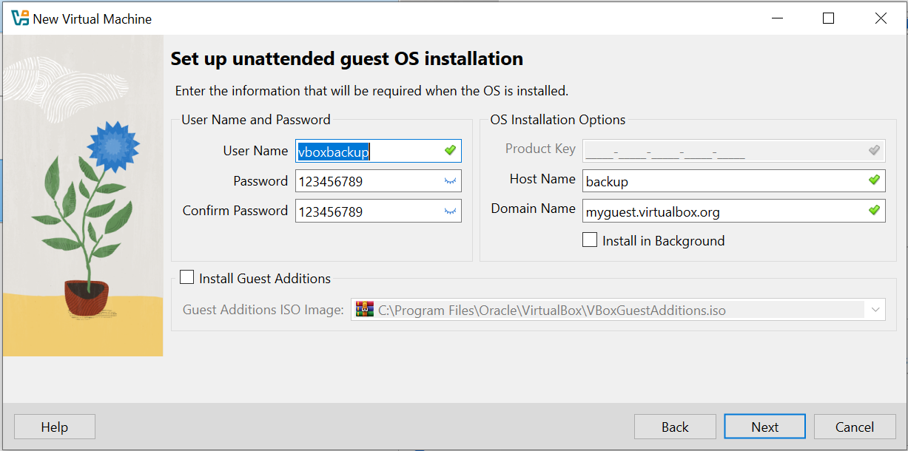
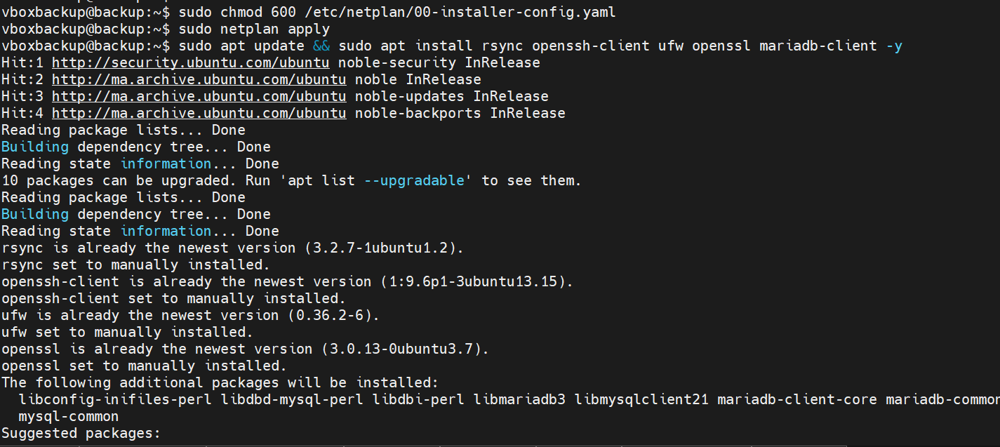
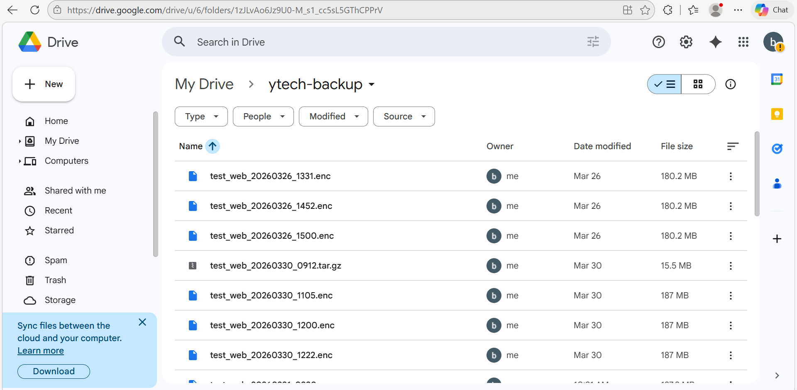

# 14. Sauvegarde & Résilience

La protection des actifs numériques est le pilier central de la stratégie de cybersécurité de **Ytech Solutions**. Une infrastructure sans système de sauvegarde robuste est une infrastructure vulnérable à la perte définitive de données. Pour pallier cela, nous avons mis en œuvre une architecture de résilience basée sur des standards industriels.

---

##  Fondements et Infrastructure

La résilience de notre système d'information repose sur la règle **3-2-1**. Ce n'est pas une simple méthode de copie, mais une architecture de défense en profondeur qui garantit la disponibilité des données même dans les scénarios les plus critiques.

### A. Analyse théorique et justification de la règle 3-2-1

L'objectif principal de cette stratégie est d'éliminer tout **SPOF** (Single Point of Failure). Si un maillon de la chaîne de stockage tombe en panne, les autres maillons assurent la continuité.

1.  **Posséder 3 copies des données** : 
    * **Copie 1 (Production)** : Les données vivantes sur lesquelles tournent nos services (Web, SQL, AI).
    * **Copie 2 (Locale)** : Une version stockée sur notre serveur de gestion pour une récupération instantanée.
    * **Copie 3 (Cloud)** : Une version externalisée pour la survie des données à long terme.
    * *Justification* : Mathématiquement, la probabilité que trois copies distinctes soient corrompues en même temps est quasiment nulle.

2.  **Utiliser 2 supports différents** :
    * Nous utilisons le **Stockage Bloc** (Disques virtuels .vdi sur l'hyperviseur) et le **Stockage Objet** (Infrastructure Google Drive).
    * *Justification* : Cela nous protège contre les bugs spécifiques à un système de fichiers (ex: une corruption de partition EXT4 n'affectera pas le stockage objet dans le Cloud).

3.  **Conserver 1 copie hors-site (Off-site)** :
    * Les données sont envoyées sur Google Drive, physiquement isolées de nos serveurs locaux.
    * *Justification* : En cas de catastrophe physique (incendie, vol de matériel ou inondation) dans le local technique, la copie hors-site reste intacte et accessible depuis n'importe quelle connexion internet.

---

### B. Inventaire technique de l'infrastructure virtuelle

Pour appliquer cette stratégie, nous avons segmenté nos services. La gestion des sauvegardes est totalement isolée des serveurs de production. Cette isolation est une mesure de sécurité : si un serveur applicatif est compromis, l'attaquant ne peut pas facilement atteindre le serveur de backup pour supprimer les preuves ou les fichiers de secours.

*Figure 1 : Tableau de bord de l'hyperviseur montrant l'état des services de production et de gestion.*

**Analyse détaillée de la Figure 1 :**
Dans cette capture d'écran de notre environnement VirtualBox, nous identifions l'organisation de notre infrastructure :
* **Serveurs de Production** : On observe les machines `Web`, `DB` (MariaDB) et `AI` (Ollama) en état d'exécution. Ce sont les sources de données que nous devons protéger.
* **Serveur de Gestion (Backup)** : La machine nommée `Backup` (192.168.9.251) est le cerveau de l'opération. C'est elle qui initie les connexions SSH vers les autres serveurs pour aspirer les données. On remarque qu'elle est séparée logiquement, ce qui limite la propagation d'éventuels malwares.

---

### C. Segmentation et Configuration Réseau (Netplan)

Le serveur de sauvegarde joue un rôle de "passerelle". Il doit être capable de communiquer avec le réseau interne (pour collecter les données) tout en ayant une ouverture contrôlée vers l'extérieur (pour uploader vers le Cloud). Cette double responsabilité nécessite une configuration réseau précise via **Netplan**.

*Figure 2 : Détail du fichier de configuration YAML pour la gestion des interfaces réseau.*

**Analyse détaillée de la Figure 2 :**
La **Figure 2** montre le fichier `/etc/netplan/00-installer-config.yaml` du serveur Backup. Voici l'explication technique des paramètres choisis :
* **Adressage Statique** : L'adresse `192.168.9.251/24` est fixée pour garantir que les scripts de transfert pointent toujours vers la bonne destination sans risque de changement d'IP par un serveur DHCP.
* **Passerelle (Gateway4)** : La ligne `gateway4: 192.168.9.1` est l'élément le plus important. C'est elle qui permet au serveur de sortir du réseau local. Sans cette passerelle, l'outil **Rclone** ne pourrait jamais atteindre les serveurs de Google Drive.
* **Serveurs DNS** : L'utilisation des DNS de Google (`8.8.8.8`) permet au serveur de résoudre les noms de domaines (ex: transformer `google.com` en adresse IP) lors de l'envoi des flux de sauvegarde.

---

###  Stockage Local et Architecture des Répertoires

Après avoir établi l'infrastructure réseau et virtuelle, nous nous concentrons sur la gestion interne des données au sein du serveur de Backup (**192.168.9.251**). Le stockage local ne doit pas être un simple dossier de dépôt, mais une structure organisée et hautement sécurisée.

---

#### A. Hiérarchie et Organisation des Répertoires
Pour garantir une gestion efficace, nous avons créé une arborescence spécifique sous la racine `/backup`. Cette organisation permet de séparer les flux de données et facilite la maintenance ainsi que la rotation des archives.

*Figure 3 : Organisation rigoureuse du système de fichiers sur le serveur de Backup.*

**Analyse détaillée de la Figure 3 :**
Sur cette capture du terminal, nous observons les quatre piliers de notre stockage local :
1.  **/backup/archives/** : C'est le sanctuaire où sont stockées les archives finales consolidées (fichiers `.tar.gz` ou `.enc`).
2.  **/backup/logs/** : Contient l'historique de chaque opération. C'est ici que nous vérifions si une sauvegarde a échoué ou réussi.
3.  **/backup/temp/** : Zone de transit utilisée par le script pour rassembler les fichiers provenant du Web et de la DB avant la compression finale.
4.  **/backup/scripts/** : Emplacement du code source de l'automatisation.

---

#### B. Sécurisation par les Permissions POSIX
La sécurité des sauvegardes commence par le contrôle d'accès local. Si n'importe quel utilisateur du système pouvait lire les archives, les données confidentielles de **Ytech Solutions** seraient exposées.

* **Propriété (Ownership)** : Comme illustré dans la **Figure 3**, tous les dossiers appartiennent à l'utilisateur dédié `vboxbackup`.
* **Droits d'accès** : Nous appliquons le principe du "Moindre Privilège".
    * Le répertoire `/backup` est configuré en `700` (`drwx------`). Cela signifie que **seul** l'utilisateur propriétaire peut entrer dans ce dossier.
    * Les fichiers de sauvegarde sont en `600` (`-rw-------`), empêchant toute lecture non autorisée.

---

#### C. Gestion des Flux de Données Locaux
Le processus local suit un cycle de vie précis pour optimiser l'espace disque :
1.  **Extraction** : Les données arrivent dans le dossier `temp`.
2.  **Consolidation** : Le script regroupe les fichiers.
3.  **Archivage** : Les données passent dans `archives` sous forme compressée.
4.  **Nettoyage** : Une fois l'archive créée et envoyée au Cloud, le dossier `temp` est vidé pour libérer de l'espace.

---

#### D. Validation visuelle du Stockage Cloud (Résultat Final)
L'aboutissement de toute cette organisation locale est la réplication parfaite vers l'espace de stockage déporté. La cohérence entre ce que nous avons en local et ce qui est sur Google Drive est le témoin de la réussite de la stratégie.

*Figure 4 : Confirmation du succès de la réplication vers le stockage objet Google Drive.*

**Analyse détaillée de la Figure 4 :**
Dans cette interface Cloud, nous constatons que :
* Les fichiers respectent la nomenclature définie localement (incluant la date et l'heure).
* L'extension des fichiers confirme qu'ils sont prêts pour une restauration hors-site en cas de sinistre majeur sur l'hyperviseur local.