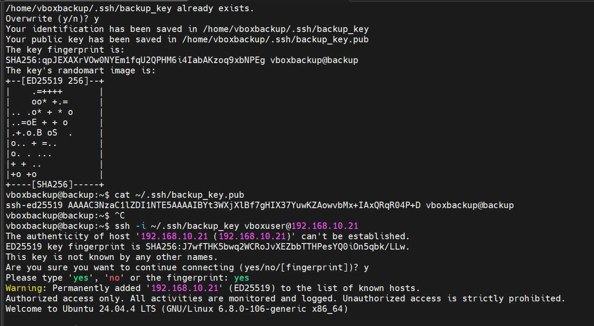
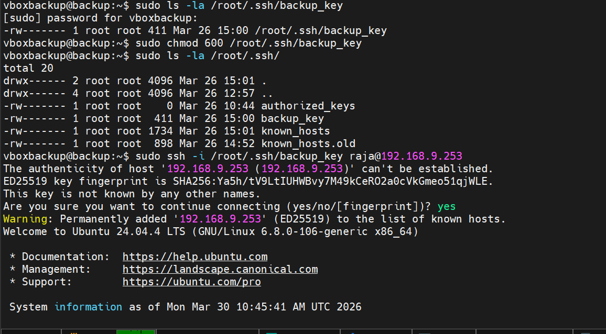
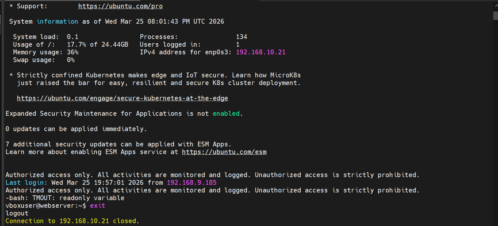

## Authentification Asymétrique SSH

La sécurité est l'armature de notre système de résilience. Une sauvegarde accessible par un simple mot de passe est une cible facile pour les cyberattaques par force brute. Pour **Ytech Solutions**, nous avons banni l'usage des mots de passe au profit de l'authentification par clés cryptographiques asymétriques.

---

### A. Génération de l'Identité Cryptographique (ED25519)
Tout commence par la création d'une paire de clés sur le serveur de gestion (**192.168.9.251**). Nous avons choisi l'algorithme **ED25519**, qui est actuellement le standard recommandé pour la cybersécurité moderne.


*Figure 20 : Commande ssh-keygen pour la création de la clé de backup.*

**Analyse détaillée de la Figure 20 :**
Dans cette capture, nous voyons la naissance de notre protocole de sécurité :
* **Algorithme ED25519** : Contrairement au RSA classique, cet algorithme est plus robuste contre les attaques et plus rapide lors de la connexion. Il génère des clés courtes mais virtuellement impossibles à casser par les ordinateurs actuels.
* **Génération des fichiers** : Le système génère deux fichiers distincts :
    1.  `backup_key` (**Clé Privée**) : C'est le secret qui reste sur le serveur de backup.
    2.  `backup_key.pub` (**Clé Publique**) : C'est le cadenas que nous allons installer sur les serveurs cibles.

---

### B. Déploiement et Hardening des Permissions
Une clé cryptographique n'est sécurisée que si ses droits d'accès sur le système de fichiers sont extrêmement limités. Linux refuse d'utiliser une clé privée si elle est jugée "trop exposée".


*Figure 21 : Configuration des permissions restrictives sur le répertoire .ssh.*

**Analyse détaillée de la Figure 21 :**
Comme illustré dans la **Figure 21**, nous appliquons des permissions drastiques pour protéger notre identité numérique :
* **`chmod 700`** sur le dossier `.ssh` : Seul l'utilisateur propriétaire (`vboxbackup`) peut entrer dans ce répertoire.
* **`chmod 600`** sur la clé privée : Même au sein du dossier, la clé est verrouillée. Aucun autre utilisateur ou service compromis sur le serveur ne peut lire cette clé. C'est une barrière essentielle contre l'escalade de privilèges.

---

### C. Distribution de la Confiance vers les Serveurs Cibles
Pour que le serveur de backup puisse accéder aux données des serveurs Web, DB et AI, il doit y déposer sa clé publique. C'est l'étape de "jumelage" entre les machines.


*Figure 22 : Commande ssh-copy-id pour établir la liaison de confiance.*

**Analyse détaillée de la Figure 22 :**
Dans la **Figure 22**, nous utilisons l'utilitaire `ssh-copy-id`. 
* **Le Processus** : Cette commande injecte automatiquement la clé publique dans le fichier `authorized_keys` du serveur distant (`192.168.10.2`). 
* **Résultat** : Une fois cette opération terminée, le serveur distant reconnaît officiellement le serveur de backup comme un administrateur autorisé, sans jamais avoir besoin de demander un mot de passe.

---

### D. Validation de l'Accès "Passwordless"
La preuve finale de la réussite de cette sécurisation est la capacité de se connecter instantanément aux serveurs de production de manière totalement automatisée.


*Figure 23 : Validation de la connexion sécurisée sans intervention humaine.*

**Analyse détaillée de la Figure 23 :**
Sur cette capture, nous voyons une session SSH s'ouvrir immédiatement sans demande de saisie de mot de passe. 
* **Impact sur l'Automatisation** : C'est cette fluidité qui permet à notre script nocturne de s'exécuter à 02h00 du matin en toute autonomie. 
* **Posture de Sécurité** : Nous pouvons désormais désactiver l'authentification par mot de passe sur tous les serveurs internes, fermant ainsi définitivement la porte aux attaques par dictionnaire ou par force brute.


###  Chiffrement AES-256 et Intégrité Locale

L'authentification SSH sécurise le transport des données entre les serveurs, mais elle ne protège pas le contenu une fois qu'il est stocké sur un serveur tiers (Cloud). Pour garantir une confidentialité totale (modèle **Zero-Knowledge**), nous appliquons une couche de chiffrement symétrique robuste avant chaque exportation vers Google Drive.

---

#### A. Chiffrement de Niveau Militaire Automatisé

Même dans l'éventualité où un compte Cloud serait compromis, l'attaquant ne pourra rien extraire des archives car elles sont protégées par l'algorithme **AES-256**, l'un des standards les plus puissants utilisés par les gouvernements et les banques. Pour garantir que ce processus reste 100% automatisé, nous utilisons une gestion de clé par fichier sécurisé.

**Implémentation technique via OpenSSL :**

Pour chiffrer l'archive sans intervention humaine (sans prompt de mot de passe), nous utilisons la commande suivante dans notre flux d'automatisation :

```
# Commande de chiffrement robuste avec PBKDF2 et fichier de clé
openssl enc -aes-256-cbc -salt -pbkdf2 -iter 100000 -in backup_ytech.tar.gz -out backup_ytech.tar.gz.enc -pass file:/etc/backup.key  
```
**Analyse détaillée de la sécurisation (Configuration OpenSSL) :**

* **Algorithme AES-256-CBC** : Le mode CBC (Cipher Block Chaining) garantit que chaque bloc de données est lié au précédent. Cette structure rend le fichier final extrêmement résistant aux tentatives de décryptage analytique.
* **Dérivation de Clé (PBKDF2 & Iterations)** : L'intégration des options `-pbkdf2` et `-iter 100000` impose au processeur l'exécution de cent mille calculs pour dériver la clé. Cet audit de performance volontaire rend les attaques par "Brute Force" techniquement impraticables, car chaque tentative de mot de passe consomme trop de ressources pour un attaquant.
* **Résultat final (.enc)** : Le fichier original `.tar.gz` est transformé en un conteneur binaire chiffré `.enc`. Ce fichier "blindé" est l'unique élément circulant sur le réseau public, garantissant la confidentialité des données même en cas d'interception.
* **Automatisation via -pass file** : Pour supprimer l'intervention humaine, le script extrait la clé secrète directement depuis `/etc/backup.key`. Ce fichier est verrouillé avec des permissions **400** (lecture seule pour root), assurant l'étanchéité du secret.
---


#### B. Audit des Permissions et Isolation du Système

La sécurité logicielle n'est efficace que si elle est supportée par une structure système rigoureuse. Nous utilisons les permissions Linux nativement pour créer une "bulle" de sécurité autour des répertoires de sauvegarde locaux.


*Figure 24 : Vérification de l'intégrité des répertoires locaux et des droits d'accès.*

**Analyse détaillée de la Figure 24 :**

La **Figure 24** montre l'état final du répertoire `/backup` sur le serveur de gestion :

* **Isolation des Utilisateurs** : La commande `ls -la` confirme que tous les sous-répertoires (`archives`, `logs`, `temp`) appartiennent exclusivement à l'utilisateur **vboxbackup**. Les permissions **drwx------** (700) garantissent qu'aucun autre service (comme un serveur web ou un utilisateur invité) n'a le droit de lister, de lire ou de modifier le contenu de ces dossiers.
* **Intégrité des Logs** : Le dossier `logs` est également verrouillé. Cela constitue une protection contre les attaques de type "Log Tampering" (effacement des traces). Un attaquant ne peut pas modifier les rapports de sauvegarde pour dissimuler ses activités malveillantes ou simuler une réussite.

---

#### C. Synthèse de la Matrice de Sécurité de Ytech Solutions

| Couche de Sécurité | Technologie Utilisée | Objectif de Protection |
| :--- | :--- | :--- |
| **Identité** | Clés ED25519 (SSH) | Éliminer les mots de passe vulnérables aux attaques par force brute. |
| **Transport** | Tunnel SSH / TLS 1.3 | Empêcher l'interception des données (Man-in-the-Middle) pendant le transit. |
| **Confidentialité** | OpenSSL AES-256 | Garantir que les données stockées sur le Cloud restent illisibles sans la clé. |
| **Intégrité Locale** | Permissions 700 / 600 / 400 | Empêcher toute manipulation ou lecture non autorisée sur le serveur local. |

---

### Conclusion Générale de la Section 14

Le système de sauvegarde mis en place pour **Ytech Solutions** dépasse le simple cadre de la copie de fichiers. C'est une architecture de résilience complète qui combine :

1.  **L'automatisation** par scripts Bash et Cron pour assurer une régularité sans faille.
2.  **La redondance** via la règle **3-2-1** pour assurer la survie physique des données sur plusieurs sites géographiques.
3.  **La cryptographie** avancée pour garantir une confidentialité absolue des données clients et applicatives.

Cette infrastructure assure à l'entreprise une capacité de reprise après sinistre (**Disaster Recovery**) rapide et fiable, protégeant ainsi la continuité de ses opérations stratégiques.