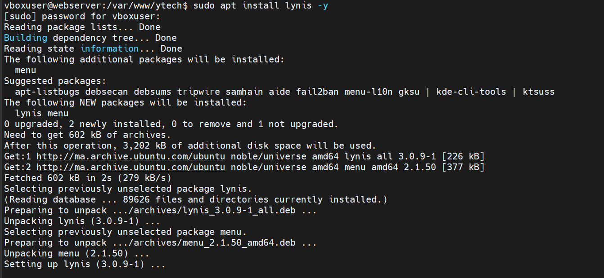

# Phase 4 : Audit de Configuration Interne (Système)

Contrairement aux phases précédentes simulant une attaque externe, cette étape consiste à analyser la sécurité interne du système d'exploitation (White/Grey Box). Nous utilisons l'outil **Lynis** pour évaluer la conformité du serveur aux standards de sécurité (NIST, CIS).

---

## 1. Audit de Durcissement du Système (Lynis)

L'outil **Lynis** effectue un scan complet du système Linux pour identifier les faiblesses de configuration, les fichiers mal protégés et les services inutiles.

* **Commande :** `sudo lynis audit system`
* **Analyse des Résultats Globaux :**
    * **Hardening Index : 63.** Ce score indique une posture de sécurité moyenne. Un score inférieur à 70 signifie que plusieurs vecteurs d'exploitation locale sont possibles.
    * **Tests passés :** 227 tests de sécurité ont été effectués.
* **Impact :** Un index de 63 expose **Ytech Solutions** à des risques d'escalade de privilèges. Si un attaquant parvient à obtenir un accès utilisateur simple, il pourra facilement devenir `root`.

---

## 2. Analyse des Points Critiques (Checklist Sécurité)

L'audit a mis en évidence plusieurs domaines nécessitant une attention immédiate pour renforcer la résilience du serveur.

### 2.1 Firewall et Réseau
* **Firewall [V] :** Un pare-feu est détecté comme actif, assurant une protection périmétrique.
* **Point Faible :** Malgré le firewall, l'index reste bas à cause de services écoutant sur des interfaces non sécurisées.

### 2.2 Détection et Protection
* **Malware Scanner [X] :** **L'absence totale de scanner de malwares** (comme Rootkit Hunter ou ClamAV) est une lacune critique. Si un fichier malveillant est déposé sur le serveur, aucun mécanisme ne permet sa détection.
* **Système IDS/IPS [X] :** Aucun système de détection d'intrusion n'est configuré pour surveiller les comportements anormaux.

---

## 3. Synthèse des Vulnérabilités Identifiées (Pentest Global)

Voici un tableau récapitulatif de toutes les failles découvertes durant les 4 phases de l'audit offensif.

| Niveau | Vulnérabilité | Impact Technique | Action de Remédiation |
| :--- | :--- | :--- | :--- |
| **CRITIQUE** | **MySQL Public (3306)** | Accès direct à la DB. | Isolation VLAN + Bind 127.0.0.1 |
| **HAUT** | **Certificat Auto-signé** | Attaque MITM. | Déploiement SSL via Let's Encrypt |
| **MOYEN** | **Cookies Insecure** | Vol de session. | Flag HttpOnly / Secure |
| **MOYEN** | **Anti-CSRF manquant** | Manipulation de comptes. | Ajout de tokens applicatifs |
| **FAIBLE** | **Hardening Index (63)** | Escalade de privilèges. | Durcissement système (Suggestions Lynis) |

---

:::success Conclusion de l'Audit Offensif
L'infrastructure **Ytech Solutions** est fonctionnelle mais présente des "portes ouvertes" critiques au niveau réseau et applicatif. L'absence de segmentation et de protection contre les attaques web classiques rend la mise en œuvre d'un **Pare-feu Applicatif (WAF)** et d'un **Firewall Périmétrique (OPNsense)** indispensable.
:::