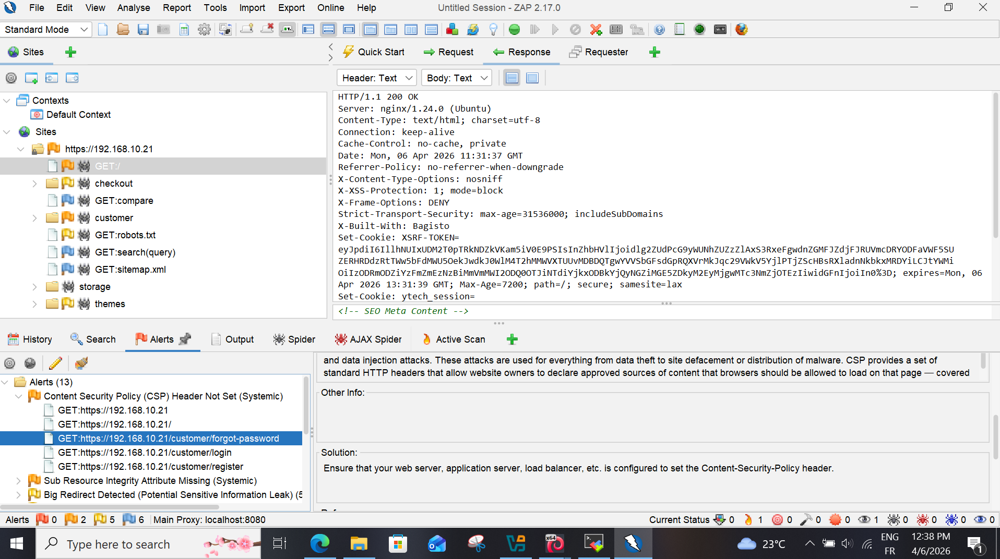
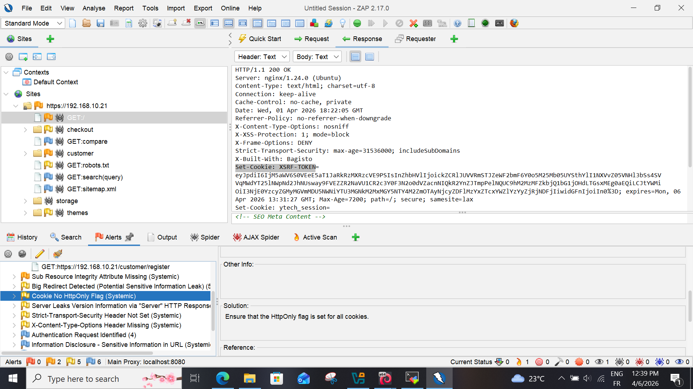
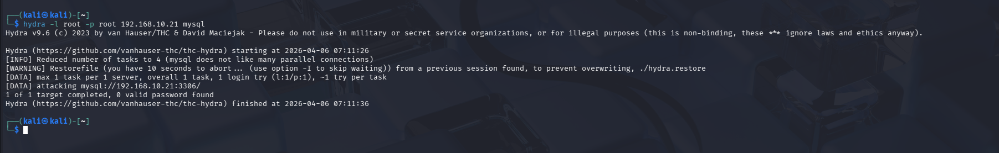
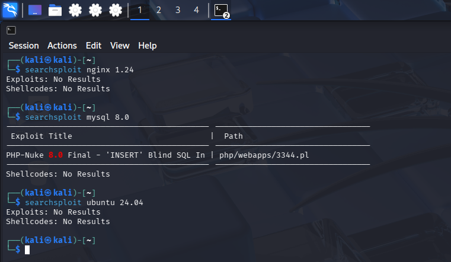

# Phase 3 : Analyse des Vulnérabilités et Tests d'Exploitation

Cette phase vise à identifier les failles logicielles et les erreurs de configuration spécifiques à l'application web et aux services exposés. Nous passons d'une simple cartographie à une évaluation de l'exploitabilité réelle des cibles.

---

## 1. Audit de Configuration Web (Nikto)

L'outil **Nikto** a été utilisé pour scanner le serveur Nginx à la recherche de fichiers dangereux, de bannières logicielles et de problèmes de configuration HTTP.

* **Commande :** `nikto -h https://192.168.10.21`
* **Vulnérabilités identifiées :**
    * **Information Disclosure :** Le header `X-Powered-By` ou les signatures de serveur permettent d'identifier précisément les frameworks utilisés.
    * **Absence de protection anti-XSS :** Le header `X-XSS-Protection` n'est pas défini, facilitant l'exécution de scripts malveillants.
    * **Cookies non sécurisés :** Le cookie de session ne possède pas le flag `HttpOnly`, ce qui permet son extraction via un script JavaScript (XSS).

---

## 2. Scan de Vulnérabilités Dynamique (OWASP ZAP)

Pour une analyse plus profonde (DAST), nous avons utilisé **OWASP ZAP**. Contrairement à Nikto, ZAP simule des attaques réelles sur les formulaires et les paramètres de l'application.

* **Analyse des Alertes (Flags) :**
    * **🟠 Orange (Medium) :** Absence de jetons **Anti-CSRF**. Un attaquant peut forcer un utilisateur authentifié à effectuer des actions à son insu (ex: changer son mot de passe).
    * **🟡 Jaune (Low) :** Absence de headers `Content-Security-Policy` (CSP).
* **Impact :** Ces failles combinées permettent de compromettre l'intégrité des sessions des employés de **Ytech Solutions**.

---

## 3. Test de Résistance au Brute-Force (Hydra)

Suite à l'identification du port 3306 (MySQL) ouvert, nous avons testé la résistance du service face à une attaque par dictionnaire.

* **Commande :** `hydra -l root -P /usr/share/wordlists/rockyou.txt mysql://192.168.10.21`
* **Observation :** Le service MySQL ne possède pas de mécanisme de verrouillage après plusieurs échecs (Rate Limiting). 
* **Risque :** Un attaquant disposant de temps peut finir par compromettre le compte `root` de la base de données, menant à une fuite de données totale.

---

## 4. Corrélation avec les Exploits Publics (Searchsploit)

Pour chaque version logicielle détectée (Nginx 1.24, MySQL 8.0), nous avons recherché des exploits publics via la base de données **Exploit-DB**.

* **Commande :** `searchsploit nginx 1.24` / `searchsploit mysql 8.0`
* **Résultats :** Plusieurs vulnérabilités de type **Déni de Service (DoS)** et **Escalade de privilèges** ont été identifiées. Cela prouve que le maintien de versions logicielles "bavardes" facilite grandement le travail d'un attaquant.

---

:::danger Conclusion de l'Audit Offensif
L'application **Ytech Solutions** présente des failles critiques de segmentation réseau (MySQL exposé) et des lacunes majeures en sécurité applicative (Absence de protection CSRF et cookies vulnérables). Sans intervention (WAF, IPS, Firewall), l'infrastructure est hautement exposée à un vol de données ou à un arrêt de service.
:::