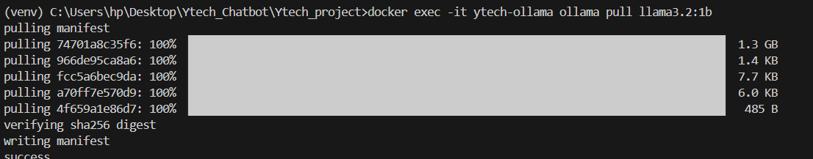
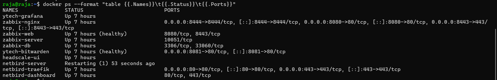

# Déploiement Ubuntu — Guide complet

## Pourquoi documenter le déploiement ?

Un déploiement non documenté n'existe pas vraiment — si la personne qui l'a fait n'est plus là, personne ne peut le reproduire. Dans un contexte professionnel, une infrastructure non reproductible est une **dette technique** et un risque opérationnel majeur.

Ce guide permet à **n'importe quel membre de l'équipe** de reconstruire l'intégralité de l'infrastructure depuis zéro, en suivant les étapes dans l'ordre. C'est aussi la base d'une future automatisation via Ansible ou Terraform.

> 💶 **Dimension financière** : Le temps moyen pour reconstruire une infrastructure non documentée après un incident est estimé à **18,5 heures** (IBM CODB 2023). Avec ce guide, ce temps tombe à **moins de 2 heures**. Sur un coût d'ingénieur de 75€/h, c'est une économie de **1 237 €** par incident évité.

---

## Prérequis communs à toutes les VMs

### Configuration VirtualBox

Chaque VM est configurée avec **deux interfaces réseau** :

```
Adaptateur 1 : Host-Only (réseau interne VMs sur même PC)
  → Réseau : 192.168.56.0/24
  → Utilité : communication entre VM1, VM2, VM3

Adaptateur 2 : Bridge (réseau physique de classe)
  → Réseau : 192.168.9.0/24 ou 192.168.10.0/24
  → Utilité : communication entre PCs des membres
```

### OS de base

```bash
# Ubuntu 24.04 LTS Server — installation minimale
# Après installation, mise à jour complète du système

sudo apt update && sudo apt upgrade -y
sudo apt install -y curl wget git net-tools ufw fail2ban auditd
```

### Configuration SSH sécurisée (toutes VMs)

```bash
# Générer une paire de clés SSH sur le poste admin
ssh-keygen -t ed25519 -C "ytechadmin@ytech.local"

# Copier la clé publique sur la VM
ssh-copy-id -i ~/.ssh/id_ed25519.pub ytechadmin@<IP_VM>

# Durcir la configuration SSH
sudo nano /etc/ssh/sshd_config
```

```ini
# /etc/ssh/sshd_config — Configuration sécurisée
Port 2222
PermitRootLogin no
PasswordAuthentication no
PubkeyAuthentication yes
AuthorizedKeysFile .ssh/authorized_keys
MaxAuthTries 2
MaxSessions 3
AllowUsers ytechadmin
ClientAliveInterval 300
ClientAliveCountMax 2
X11Forwarding no
AllowTcpForwarding no
```

```bash
sudo systemctl restart sshd

# Tester la connexion avant de fermer la session courante !
ssh -p 2222 -i ~/.ssh/id_ed25519 ytechadmin@<IP_VM>
```

### Installation Docker (toutes VMs)

```bash
# Désinstaller les anciennes versions
sudo apt remove docker docker-engine docker.io containerd runc

# Installer les dépendances
sudo apt install -y ca-certificates curl gnupg lsb-release

# Ajouter le dépôt officiel Docker
sudo install -m 0755 -d /etc/apt/keyrings
curl -fsSL https://download.docker.com/linux/ubuntu/gpg \
  | sudo gpg --dearmor -o /etc/apt/keyrings/docker.gpg
sudo chmod a+r /etc/apt/keyrings/docker.gpg

echo "deb [arch=$(dpkg --print-architecture) \
  signed-by=/etc/apt/keyrings/docker.gpg] \
  https://download.docker.com/linux/ubuntu \
  $(. /etc/os-release && echo "$VERSION_CODENAME") stable" \
  | sudo tee /etc/apt/sources.list.d/docker.list > /dev/null

# Installer Docker Engine
sudo apt update
sudo apt install -y docker-ce docker-ce-cli containerd.io \
  docker-buildx-plugin docker-compose-plugin

# Permettre à l'utilisateur d'utiliser Docker sans sudo
sudo usermod -aG docker ytechadmin
newgrp docker

# Vérifier
docker --version
docker compose version
```

### Génération du certificat SSL (toutes VMs)

```bash
sudo mkdir -p /etc/ssl/ytech

sudo openssl req -x509 -nodes -days 365 \
  -newkey rsa:2048 \
  -keyout /etc/ssl/ytech/ytech.key \
  -out /etc/ssl/ytech/ytech.crt \
  -subj "/C=MA/ST=Casablanca/L=Casablanca/O=Ytech Solutions/CN=<IP_VM>"

# Vérifier le certificat
openssl x509 -in /etc/ssl/ytech/ytech.crt -text -noout | grep -E "Subject|Validity"
```


*Génération du certificat SSL auto-signé sur VM1*

### Configuration fail2ban (toutes VMs)

```bash
sudo apt install -y fail2ban

sudo cat > /etc/fail2ban/jail.local << 'EOF'
[DEFAULT]
bantime  = 3600    # 1 heure
findtime = 600     # fenêtre de 10 minutes
maxretry = 3       # 3 tentatives max

[sshd]
enabled  = true
port     = 2222
logpath  = /var/log/auth.log
maxretry = 3

[nginx-http-auth]
enabled  = true
EOF

sudo systemctl enable fail2ban
sudo systemctl start fail2ban

# Vérifier
sudo fail2ban-client status
```

### Configuration auditd (toutes VMs)

```bash
sudo apt install -y auditd

# Règles d'audit
sudo auditctl -w /etc/passwd -p wa -k user_modification
sudo auditctl -w /etc/shadow -p wa -k password_modification
sudo auditctl -w /etc/ssh/sshd_config -p wa -k ssh_config
sudo auditctl -w /var/log/ -p rwa -k log_access
sudo auditctl -w /etc/ssl/ -p rwa -k ssl_access

sudo systemctl enable auditd
sudo systemctl start auditd
```

---

## VM1 — Déploiement APP Server

### UFW — Règles firewall VM1

```bash
sudo ufw default deny incoming
sudo ufw default allow outgoing

# SSH
sudo ufw allow from 192.168.56.0/24 to any port 2222
sudo ufw allow from 192.168.9.0/24 to any port 2222

# YtechBot
sudo ufw allow from 192.168.56.0/24 to any port 8501
sudo ufw allow from 192.168.9.0/24 to any port 8501
sudo ufw allow from 192.168.10.0/24 to any port 8501

# CRUD RH
sudo ufw allow from 192.168.56.0/24 to any port 8443
sudo ufw allow from 192.168.9.0/24 to any port 8443

# Ollama (interne uniquement)
sudo ufw allow from 192.168.56.0/24 to any port 11434

# Zabbix agent
sudo ufw allow from 192.168.56.30 to any port 10050

sudo ufw enable
sudo ufw status verbose
```

### Déploiement YtechBot + Ollama

```bash
# 1. Cloner le dépôt
git clone https://github.com/oussanea/Ytech_project.git
cd Ytech_project
git checkout feature/chatbot-ollama

# 2. Lancer les containers
docker compose -f docker-compose.prod.yml up -d

# 3. Vérifier que les containers sont UP
docker ps

# 4. Télécharger le modèle IA
docker exec -it ytech-ollama ollama pull llama3.2:1b
```


*Téléchargement du modèle llama3.2:1b via Ollama*

```bash
# 5. Vérifier que le modèle est disponible
docker exec -it ytech-ollama ollama list

# 6. Tester le chatbot
curl -k https://192.168.56.20:8501
```

### Installation agent Zabbix — VM1

```bash
wget https://repo.zabbix.com/zabbix/7.4/release/ubuntu/pool/main/z/\
zabbix-release/zabbix-release_latest_7.4+ubuntu24.04_all.deb

sudo dpkg -i zabbix-release_latest_7.4+ubuntu24.04_all.deb
sudo apt update && sudo apt install -y zabbix-agent

sudo sed -i 's/^Server=.*/Server=192.168.56.30/' \
  /etc/zabbix/zabbix_agentd.conf
sudo sed -i 's/^ServerActive=.*/ServerActive=192.168.56.30/' \
  /etc/zabbix/zabbix_agentd.conf
sudo sed -i 's/^Hostname=.*/Hostname=VM1-APP-Server/' \
  /etc/zabbix/zabbix_agentd.conf

sudo systemctl restart zabbix-agent
sudo systemctl enable zabbix-agent
```

---

## VM2 — Déploiement DB Server

### UFW — Règles firewall VM2

```bash
sudo ufw default deny incoming
sudo ufw default allow outgoing

# SSH
sudo ufw allow from 192.168.56.0/24 to any port 2222
sudo ufw allow from 192.168.9.0/24 to any port 2222

# MariaDB — uniquement depuis APP Server et Web Server
sudo ufw allow from 192.168.56.20 to any port 3306
sudo ufw allow from 192.168.9.253 to any port 3306
sudo ufw allow from 192.168.10.21 to any port 3306

# Zabbix agent
sudo ufw allow from 192.168.56.30 to any port 10050

# Bloquer MariaDB depuis tout autre source
sudo ufw deny 3306

sudo ufw enable
```

### Déploiement MariaDB

```bash
cd Ytech_project
git checkout feature/chatbot-ollama

# Lancer MariaDB
docker compose -f docker-compose.db.yml up -d

# Vérifier
docker ps
docker logs ytech-mariadb

# Vérifier la création des bases
docker exec -it ytech-mariadb mariadb \
  -u root -pRootPass123! \
  -e "SHOW DATABASES; SELECT User, Host FROM mysql.user;"
```

### Installation agent Zabbix — VM2

```bash
# (mêmes étapes que VM1, avec Hostname=VM2-DB-Server)
sudo sed -i 's/^Hostname=.*/Hostname=VM2-DB-Server/' \
  /etc/zabbix/zabbix_agentd.conf
sudo systemctl restart zabbix-agent
```

---

## VM3 — Déploiement Monitoring Server

### UFW — Règles firewall VM3

```bash
sudo ufw default deny incoming
sudo ufw default allow outgoing

# SSH
sudo ufw allow from 192.168.56.0/24 to any port 2222

# Zabbix Web
sudo ufw allow from 192.168.56.0/24 to any port 8443
sudo ufw allow from 192.168.9.0/24 to any port 8443

# Bitwarden
sudo ufw allow from 192.168.56.0/24 to any port 8444

# Nessus
sudo ufw allow from 192.168.56.0/24 to any port 8834

# Headscale
sudo ufw allow from 192.168.56.0/24 to any port 8085
sudo ufw allow 3478/udp    # STUN

# Grafana
sudo ufw allow from 192.168.56.0/24 to any port 3000
sudo ufw allow from 192.168.9.0/24 to any port 3000
sudo ufw allow from 192.168.10.0/24 to any port 3000

# Zabbix server (communication avec agents)
sudo ufw allow 10050/tcp
sudo ufw allow 10051/tcp

sudo ufw enable
```

### Déploiement Stack Monitoring

```bash
cd Ytech_project
git checkout feature/monitoring

# 1. Stack principale (Zabbix + Bitwarden + Nessus + Nginx)
cd zabbix
docker compose up -d

# Attendre que Zabbix soit initialisé (~2 minutes)
docker logs -f zabbix-server | grep "Zabbix Server started"

# 2. Headscale
cd ~/Ytech_project/headscale
docker compose up -d

# Créer l'utilisateur Ytech dans Headscale
docker exec ytech-headscale headscale users create ytech

# 3. Grafana
cd ~/Ytech_project/grafana
docker compose up -d

# Vérifier tous les services
docker ps --format "table {{.Names}}\t{{.Status}}\t{{.Ports}}"
```


*Tous les services opérationnels après déploiement complet VM3*

### Configuration Headscale — Enregistrement des nodes

```bash
# Générer une clé d'enregistrement
docker exec ytech-headscale headscale preauthkeys create \
  --user ytech --expiration 24h

# Sur chaque serveur à connecter (APP Server, DB Server, etc.)
sudo tailscale up \
  --login-server=http://192.168.56.30:8085 \
  --hostname=app-server \
  --force-reauth

# Vérifier les nodes connectés
docker exec ytech-headscale headscale nodes list
```

### Installation agent Zabbix — VM3

```bash
# (mêmes étapes, Hostname=VM3-MGMT)
sudo sed -i 's/^Hostname=.*/Hostname=VM3-MGMT/' \
  /etc/zabbix/zabbix_agentd.conf
sudo systemctl restart zabbix-agent
```

---

## Vérification finale — Checklist

Après déploiement complet, vérifier chaque point :

```bash
# ── VM1 ─────────────────────────────────────────────────
✅ docker ps → ytech-chatbot, ytech-ollama UP
✅ curl -k https://192.168.56.20:8501 → réponse 200
✅ curl http://192.168.56.20:11434/api/tags → modèle llama3.2:1b listé
✅ sudo ufw status → règles actives
✅ sudo fail2ban-client status → actif
✅ sudo systemctl status zabbix-agent → running

# ── VM2 ─────────────────────────────────────────────────
✅ docker ps → ytech-mariadb UP
✅ docker exec -it ytech-mariadb mariadb -u root -p → connexion OK
✅ SHOW DATABASES → ytech_chatbot, ytech_rh, ytech_clients présentes
✅ sudo ufw status → port 3306 restreint aux IPs autorisées

# ── VM3 ─────────────────────────────────────────────────
✅ docker ps → 8 containers UP (zabbix-db, zabbix-server, zabbix-web,
              bitwarden, nessus, nginx-proxy, headscale, grafana)
✅ curl -k https://192.168.56.30:8443 → Zabbix login OK
✅ curl -k https://192.168.56.30:8444 → Bitwarden OK
✅ curl -k https://192.168.56.30:8834 → Nessus OK
✅ curl http://192.168.56.30:3000 → Grafana OK
✅ curl http://192.168.56.30:8085/api/v1/node → Headscale API OK
✅ docker exec headscale headscale nodes list → nodes connectés
✅ Zabbix → 4 hosts en vert dans le dashboard
```

:::tip Durée totale de déploiement
Avec ce guide et Docker, le déploiement complet de l'infrastructure (VM1 + VM2 + VM3) prend environ **90 minutes** pour un membre familier avec Linux. Sans Docker et sans documentation, le même déploiement manuel prendrait **plusieurs jours**.
:::