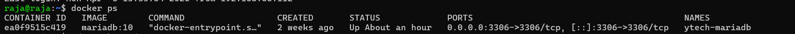
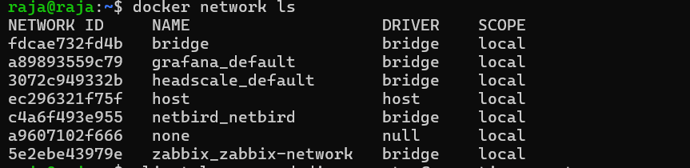

# Docker Compose — Configuration complète

## Pourquoi Docker ?

Sans Docker, déployer chaque service manuellement signifie installer des dépendances, configurer des fichiers, résoudre des conflits de versions — et recommencer à zéro si quelque chose ne va pas. C'est long, source d'erreurs et impossible à reproduire exactement.

Docker résout ce problème en **empaquetant chaque service avec tout ce dont il a besoin**. C'est comme livrer une application dans une boîte hermétique qui fonctionne de la même façon partout — sur le PC de Raja, sur le serveur de Meryem, ou en production réelle.

Docker Compose va plus loin en permettant de **définir et lancer plusieurs containers ensemble** en une seule commande.

> 💶 **Dimension financière** : Docker réduit le temps de déploiement d'un nouveau service de **plusieurs jours à quelques minutes**. En entreprise, chaque heure d'un ingénieur système coûte entre 50 € et 100 €. Sur un projet avec 6 services à déployer sur 3 VMs, Docker représente une économie estimée à **plusieurs dizaines d'heures** de travail manuel.

---

## Vue d'ensemble des stacks

| VM | Fichier Compose | Services |
|---|---|---|
| **VM1** | `docker-compose.prod.yml` | YtechBot + Ollama |
| **VM1** | `docker-compose.crud.yml` | App CRUD RH |
| **VM2** | `docker-compose.db.yml` | MariaDB |
| **VM3** | `zabbix/docker-compose.yml` | Zabbix + Bitwarden + Nessus + Nginx |
| **VM3** | `headscale/docker-compose.yml` | Headscale |
| **VM3** | `grafana/docker-compose.yml` | Grafana |

---

## VM1 — Stack Chatbot + Ollama

### docker-compose.prod.yml

```yaml
version: '3.8'

services:

  # ── Moteur IA local ──────────────────────────────────────
  ollama:
    image: ollama/ollama
    container_name: ytech-ollama
    ports:
      - "11434:11434"
    volumes:
      - ollama_data:/root/.ollama
    restart: always
    networks:
      - ytech-net

  # ── Interface Streamlit YtechBot ─────────────────────────
  chatbot:
    build:
      context: ./chatbot
      dockerfile: Dockerfile
    container_name: ytech-chatbot
    ports:
      - "8501:8501"
    environment:
      DB_HOST: 192.168.56.25       # IP VM2 MariaDB
      DB_PORT: 3306
      DB_NAME: ytech_chatbot
      DB_USER: chatbot
      DB_PASSWORD: ChatbotPass123!
      OLLAMA_HOST: http://ollama:11434
      SESSION_TIMEOUT: 1800        # 30 minutes
      MAX_LOGIN_ATTEMPTS: 3
      LOCKOUT_DURATION: 900        # 15 minutes
      RATE_LIMIT: 10               # messages/minute
    volumes:
      - /etc/ssl/ytech:/certs:ro
    command: >
      streamlit run app.py
      --server.port=8501
      --server.address=0.0.0.0
      --server.sslCertFile=/certs/ytech.crt
      --server.sslKeyFile=/certs/ytech.key
    depends_on:
      - ollama
    restart: always
    networks:
      - ytech-net

volumes:
  ollama_data:

networks:
  ytech-net:
    driver: bridge
```

### Dockerfile — YtechBot

```dockerfile
FROM python:3.11-slim

WORKDIR /app

# Dépendances système
RUN apt-get update && apt-get install -y \
    libmariadb-dev \
    gcc \
    && rm -rf /var/lib/apt/lists/*

# Dépendances Python
COPY requirements.txt .
RUN pip install --no-cache-dir -r requirements.txt

# Code de l'application
COPY . .

EXPOSE 8501

CMD ["streamlit", "run", "app.py", "--server.port=8501"]
```

### requirements.txt

```txt
streamlit==1.28.0
ollama==0.1.7
mariadb==1.1.9
bcrypt==4.0.1
python-dotenv==1.0.0
PyPDF2==3.0.1
python-docx==0.8.11
```

---

## VM1 — Stack CRUD RH

### docker-compose.crud.yml

```yaml
version: '3.8'

services:

  # ── Application RH PHP + Apache ──────────────────────────
  hr-app:
    build:
      context: ./hr-app
      dockerfile: Dockerfile
    container_name: ytech-crud
    ports:
      - "8443:443"      # HTTPS
      - "8080:80"       # HTTP → redirigé vers HTTPS
    volumes:
      - ./config/database.php:/var/www/html/hr-app/config/database.php
      - ./config/app.php:/var/www/html/hr-app/config/app.php
      - /etc/ssl/ytech:/etc/ssl/ytech:ro
    environment:
      DB_HOST: 192.168.56.25
      DB_NAME: ytech_rh
      DB_USER: rh_user
      DB_PASSWORD: RHPass123!
    restart: always
    networks:
      - ytech-net

networks:
  ytech-net:
    driver: bridge
```

---

## VM2 — Stack MariaDB

### docker-compose.db.yml

```yaml
version: '3.8'

services:

  # ── Base de données MariaDB ───────────────────────────────
  mariadb:
    image: mariadb:10.11
    container_name: ytech-mariadb
    environment:
      MYSQL_ROOT_PASSWORD: RootPass123!
      MYSQL_DATABASE: ytech_chatbot
      MYSQL_USER: chatbot
      MYSQL_PASSWORD: ChatbotPass123!
    ports:
      - "3306:3306"
    volumes:
      - mariadb_data:/var/lib/mysql
      - ./init.sql:/docker-entrypoint-initdb.d/init.sql:ro
    command: >
      --bind-address=0.0.0.0
      --character-set-server=utf8mb4
      --collation-server=utf8mb4_unicode_ci
      --max_connections=200
    restart: always
    networks:
      - ytech-net

volumes:
  mariadb_data:

networks:
  ytech-net:
    driver: bridge
```

### init.sql — Initialisation des bases

```sql
-- ── Base Chatbot ─────────────────────────────────────────
CREATE DATABASE IF NOT EXISTS ytech_chatbot CHARACTER SET utf8mb4;
CREATE USER IF NOT EXISTS 'chatbot'@'192.168.56.20'
  IDENTIFIED BY 'ChatbotPass123!';
GRANT ALL PRIVILEGES ON ytech_chatbot.*
  TO 'chatbot'@'192.168.56.20';

-- ── Base RH ──────────────────────────────────────────────
CREATE DATABASE IF NOT EXISTS ytech_rh CHARACTER SET utf8mb4;
CREATE USER IF NOT EXISTS 'rh_user'@'192.168.56.20'
  IDENTIFIED BY 'RHPass123!';
GRANT SELECT, INSERT, UPDATE, DELETE ON ytech_rh.*
  TO 'rh_user'@'192.168.56.20';

-- ── Base Clients (Web App) ────────────────────────────────
CREATE DATABASE IF NOT EXISTS ytech_clients CHARACTER SET utf8mb4;
CREATE USER IF NOT EXISTS 'web_user'@'192.168.10.21'
  IDENTIFIED BY 'ClientsPass123!';
GRANT SELECT, INSERT, UPDATE ON ytech_clients.*
  TO 'web_user'@'192.168.10.21';

FLUSH PRIVILEGES;
```

---

## VM3 — Stack Monitoring (Zabbix + Bitwarden + Nessus)

### zabbix/docker-compose.yml

```yaml
version: '3.8'

services:

  # ── Base MySQL pour Zabbix ────────────────────────────────
  zabbix-db:
    image: mysql:8.0
    container_name: zabbix-mysql
    environment:
      MYSQL_ROOT_PASSWORD: ZabbixRoot123!
      MYSQL_DATABASE: zabbix
      MYSQL_USER: zabbix
      MYSQL_PASSWORD: ZabbixPass123!
    command:
      - mysqld
      - --character-set-server=utf8mb4
      - --collation-server=utf8mb4_bin
      - --log_bin_trust_function_creators=1
    volumes:
      - zabbix_db_data:/var/lib/mysql
    restart: always
    networks:
      - monitoring-net

  # ── Zabbix Server ─────────────────────────────────────────
  zabbix-server:
    image: zabbix/zabbix-server-mysql:latest
    container_name: zabbix-server
    environment:
      DB_SERVER_HOST: zabbix-db
      MYSQL_DATABASE: zabbix
      MYSQL_USER: zabbix
      MYSQL_PASSWORD: ZabbixPass123!
      MYSQL_ROOT_PASSWORD: ZabbixRoot123!
    ports:
      - "10051:10051"
    depends_on:
      - zabbix-db
    restart: always
    networks:
      - monitoring-net

  # ── Zabbix Web Interface ──────────────────────────────────
  zabbix-web:
    image: zabbix/zabbix-web-nginx-mysql:latest
    container_name: zabbix-web
    environment:
      ZBX_SERVER_HOST: zabbix-server
      DB_SERVER_HOST: zabbix-db
      MYSQL_DATABASE: zabbix
      MYSQL_USER: zabbix
      MYSQL_PASSWORD: ZabbixPass123!
      PHP_TZ: Africa/Casablanca
    expose:
      - "8080"
    depends_on:
      - zabbix-server
    restart: always
    networks:
      - monitoring-net

  # ── Bitwarden (Vaultwarden) ───────────────────────────────
  bitwarden:
    image: vaultwarden/server:latest
    container_name: ytech-bitwarden
    ports:
      - "8081:80"
    volumes:
      - bitwarden_data:/data
    environment:
      WEBSOCKET_ENABLED: "true"
      SIGNUPS_ALLOWED: "false"    # Inscription désactivée en prod
    restart: always
    networks:
      - monitoring-net

  # ── Nessus Scanner ────────────────────────────────────────
  nessus:
    image: tenableofficial/nessus
    container_name: ytech-nessus
    ports:
      - "8834:8834"
    volumes:
      - nessus_data:/opt/nessus/var/nessus
    restart: always
    networks:
      - monitoring-net

  # ── Nginx Reverse Proxy HTTPS ─────────────────────────────
  nginx-proxy:
    image: nginx:alpine
    container_name: ytech-nginx-proxy
    ports:
      - "8443:443"    # Zabbix HTTPS
      - "8444:8444"   # Bitwarden HTTPS
      - "8080:80"     # HTTP → HTTPS redirect
    volumes:
      - ./nginx/nginx.conf:/etc/nginx/nginx.conf:ro
      - /etc/ssl/ytech:/etc/ssl/ytech:ro
    depends_on:
      - zabbix-web
      - bitwarden
    restart: always
    networks:
      - monitoring-net

volumes:
  zabbix_db_data:
  bitwarden_data:
  nessus_data:

networks:
  monitoring-net:
    driver: bridge
```

### nginx/nginx.conf

```nginx
events { worker_connections 1024; }

http {

  # ── Redirect HTTP → HTTPS ──────────────────────────────
  server {
    listen 80;
    return 301 https://$host$request_uri;
  }

  # ── Zabbix HTTPS (port 8443) ───────────────────────────
  server {
    listen 443 ssl;
    ssl_certificate     /etc/ssl/ytech/ytech.crt;
    ssl_certificate_key /etc/ssl/ytech/ytech.key;
    ssl_protocols       TLSv1.3;

    add_header Strict-Transport-Security "max-age=31536000" always;
    add_header X-Frame-Options DENY always;
    add_header X-Content-Type-Options nosniff always;

    location / {
      proxy_pass http://zabbix-web:8080;
      proxy_set_header Host $host;
      proxy_set_header X-Real-IP $remote_addr;
    }
  }

  # ── Bitwarden HTTPS (port 8444) ────────────────────────
  server {
    listen 8444 ssl;
    ssl_certificate     /etc/ssl/ytech/ytech.crt;
    ssl_certificate_key /etc/ssl/ytech/ytech.key;
    ssl_protocols       TLSv1.3;

    location / {
      proxy_pass http://bitwarden:80;
      proxy_set_header X-Forwarded-Proto https;
      proxy_set_header X-Real-IP $remote_addr;
    }

    location /notifications/hub {
      proxy_pass http://bitwarden:3012;
      proxy_http_version 1.1;
      proxy_set_header Upgrade $http_upgrade;
      proxy_set_header Connection "upgrade";
    }
  }
}
```

---

## VM3 — Stack Headscale

### headscale/docker-compose.yml

```yaml
version: '3.8'

services:

  # ── Headscale Zero Trust Server ───────────────────────────
  headscale:
    image: headscale/headscale:latest
    container_name: ytech-headscale
    ports:
      - "8085:8080"     # API + DERP
      - "9090:9090"     # Metrics
      - "3478:3478/udp" # STUN
    volumes:
      - ./config:/etc/headscale
      - headscale_data:/var/lib/headscale
    command: headscale serve
    restart: always
    networks:
      - monitoring-net

volumes:
  headscale_data:

networks:
  monitoring-net:
    external: true    # Partage le réseau avec la stack monitoring
```

### headscale/config/config.yaml (extrait)

```yaml
server_url: http://192.168.56.30:8085

listen_addr: 0.0.0.0:8080
metrics_listen_addr: 0.0.0.0:9090

ip_prefixes:
  - 100.64.0.0/10    # Plage IPs Tailscale

dns_config:
  nameservers:
    - 1.1.1.1
  magic_dns: true
  base_domain: ytech.internal

db_type: sqlite3
db_path: /var/lib/headscale/db.sqlite

log:
  level: info
```

---

## VM3 — Stack Grafana

### grafana/docker-compose.yml

```yaml
version: '3.8'

services:

  # ── Grafana SOC Dashboard ─────────────────────────────────
  grafana:
    image: grafana/grafana:latest
    container_name: ytech-grafana
    ports:
      - "3000:3000"
    environment:
      GF_SECURITY_ADMIN_USER: admin
      GF_SECURITY_ADMIN_PASSWORD: YtechGrafana123!
      GF_INSTALL_PLUGINS: >
        alexanderzobnin-zabbix-app,
        marcusolsson-json-datasource
      GF_USERS_ALLOW_SIGN_UP: "false"
      GF_SERVER_ROOT_URL: http://192.168.56.30:3000
    volumes:
      - grafana_data:/var/lib/grafana
      - ./provisioning:/etc/grafana/provisioning
    restart: always
    networks:
      - monitoring-net

volumes:
  grafana_data:

networks:
  monitoring-net:
    external: true
```

---

## Commandes de gestion courantes

```bash
# ── Démarrer une stack ────────────────────────────────────
docker-compose -f docker-compose.prod.yml up -d

# ── Arrêter sans supprimer les données ───────────────────
docker-compose -f docker-compose.prod.yml stop

# ── Voir l'état des containers ────────────────────────────
docker ps --format "table {{.Names}}\t{{.Status}}\t{{.Ports}}"

# ── Voir les logs d'un service ────────────────────────────
docker logs -f ytech-chatbot
docker logs -f ytech-mariadb
docker logs --tail=100 zabbix-server

# ── Redémarrer un service ─────────────────────────────────
docker restart ytech-chatbot

# ── Accéder à un container ───────────────────────────────
docker exec -it ytech-mariadb bash
docker exec -it ytech-ollama ollama list

# ── Voir les réseaux Docker ───────────────────────────────
docker network ls
docker network inspect monitoring-net

# ── Supprimer et recréer (reset complet) ─────────────────
docker-compose down -v    # ⚠️ Supprime les volumes
docker-compose up -d --build
```

### État des containers par VM


*docker ps VM1 — YtechBot, Ollama, CRUD RH actifs*


*docker ps VM2 — MariaDB actif*


*docker ps VM3 — Zabbix, Bitwarden, Nessus, Headscale, Grafana, Nginx actifs*


*Réseaux Docker sur VM3 — isolation des stacks*