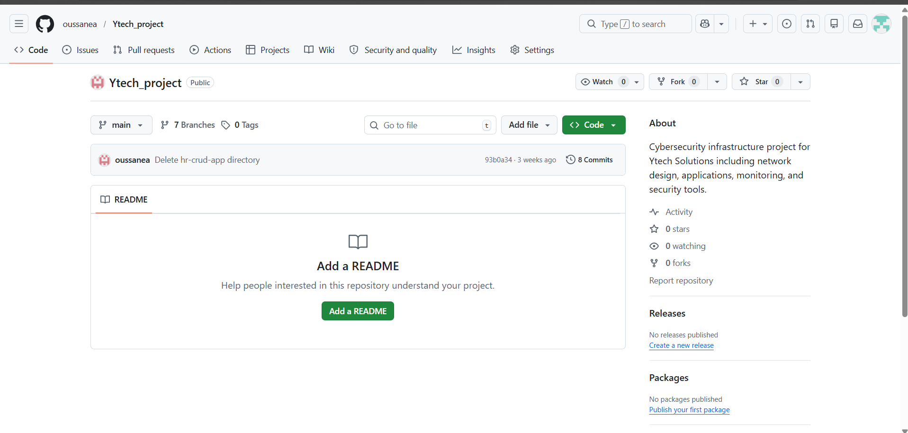
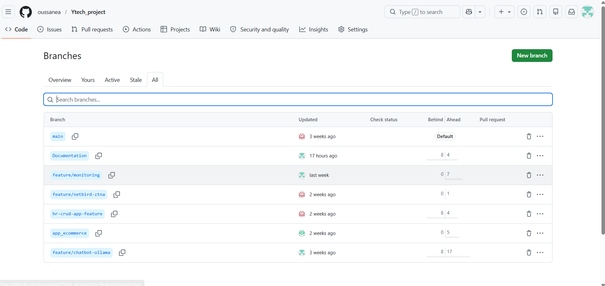
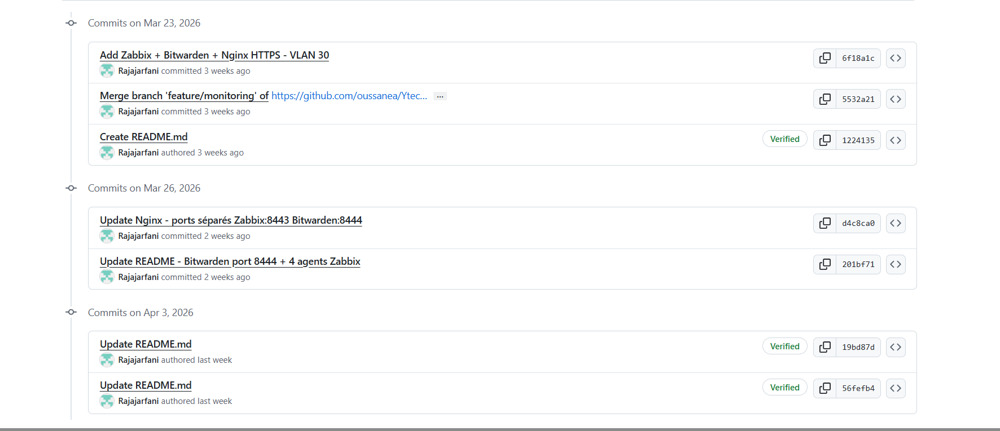

# GitHub — Organisation du dépôt

## Pourquoi Git et GitHub ?

Dans un projet impliquant 5 développeurs travaillant simultanément sur des composants différents, travailler sans versioning c'est comme construire une maison à 5 ouvriers en modifiant les mêmes plans papier en même temps — quelqu'un va forcément écraser le travail d'un autre.

Git résout ce problème en permettant à chaque membre de travailler sur sa **propre branche isolée**, puis d'intégrer son travail de manière contrôlée. GitHub apporte en plus la **visibilité**, la **traçabilité** et la **collaboration**.

> 💶 **Dimension financière** : Git est le standard absolu de l'industrie. 94% des développeurs professionnels l'utilisent (Stack Overflow Survey 2023). Maîtriser Git et GitHub est une compétence directement valorisable sur le marché — et pour Ytech Solutions, c'est aussi une **preuve de maturité DevOps** qui rassure les clients sur la qualité des livrables.

---

## Le dépôt Ytech Solutions

```
https://github.com/oussanea/Ytech_project
```


*Dépôt GitHub Ytech_project — vue principale avec README*

### Structure du dépôt

```
Ytech_project/
│
├── README.md                    # Présentation du projet
│
├── feature/chatbot-ollama       # Branche Raja — Chatbot + MariaDB
│   ├── chatbot/                 # Code Streamlit YtechBot
│   │   ├── app.py               # Application principale
│   │   ├── requirements.txt     # Dépendances Python
│   │   └── Dockerfile           # Image Docker chatbot
│   ├── docker-compose.prod.yml  # Stack VM1 (Chatbot + Ollama)
│   └── docker-compose.db.yml    # Stack VM2 (MariaDB)
│
├── feature/monitoring           # Branche Raja — Monitoring
│   ├── zabbix/
│   │   └── docker-compose.yml   # Stack Zabbix + Bitwarden + Nessus
│   ├── headscale/
│   │   ├── docker-compose.yml   # Stack Headscale
│   │   └── config/config.yaml   # Config Headscale
│   └── grafana/
│       ├── docker-compose.yml   # Stack Grafana
│       └── provisioning/        # Dashboards et datasources
│
├── hr-crud-app-feature  # Branche Sara — App CRUD RH
├── feature/hardening            # Branche Asmaa — OPNSense + Hardening
└── app_ecommerce                # Branche Meryem — Laravel
```
---

## Stratégie de branches


*Branches du dépôt — une branche par membre de l'équipe*

### Convention de nommage

Toutes les branches suivent la convention **`feature/<composant>`** :

| Branche | Membre | Contenu |
|---|---|---|
| `feature/chatbot-ollama` | Raja | YtechBot + MariaDB + Docker Compose VM1+VM2 |
| `feature/monitoring` | Raja | Zabbix + Bitwarden + Nessus + Headscale + Grafana |
| `feature/hr-crud-app-feature` | Sara | Application CRUD RH PHP |
| `feature/hardening` | Asmaa | Hardening Ubuntu + OPNSense + WireGuard |
| `feature/app-ecommerce` | Meryem | Laravel + ModSecurity WAF + Wazuh |

### Pourquoi une branche par membre ?

Cette stratégie garantit :

1. **Isolation** — le travail d'un membre ne perturbe jamais celui d'un autre
2. **Traçabilité** — on sait exactement qui a fait quoi et quand
3. **Rollback** — si une modification casse quelque chose, on peut revenir en arrière
4. **Revue** — possibilité de faire des Pull Requests pour valider avant merge

---

## Historique des commits


*Historique des commits — traçabilité complète des modifications*

### Convention de commits

Les commits suivent une convention claire pour faciliter la lecture de l'historique :

```
<type>: <description courte>

Types utilisés :
feat     → nouvelle fonctionnalité
fix      → correction de bug
config   → modification de configuration
docs     → documentation
security → mesure de sécurité
deploy   → déploiement / Docker
```

### Exemples de commits

```bash
feat: add bcrypt authentication to YtechBot
security: configure fail2ban SSH protection
config: update MariaDB bind-address to VLAN 25 IP
deploy: add docker-compose monitoring stack VM3
docs: add README deployment instructions
fix: resolve Headscale SSL certificate issue
security: implement rate limiting 10msg/min chatbot
config: add Zabbix agent configuration VM1
```

---

## Bonnes pratiques appliquées

### .gitignore

Les fichiers sensibles sont **exclus du dépôt** via `.gitignore` :

```gitignore
# Credentials et secrets
.env
*.key
*.crt
backup.key
config.yaml      # Config Headscale avec secrets

# Données locales
*.sql
/backup/
ollama_data/
mariadb_data/

# Python
__pycache__/
*.pyc
venv/

# Docker volumes
volumes/
```

:::danger Jamais de secrets dans Git
Les mots de passe, clés SSH, tokens API et certificats SSL ne sont **jamais committés** dans le dépôt. Tous ces éléments sont stockés dans Bitwarden et générés localement sur chaque VM au moment du déploiement.
:::

### README.md

Le README principal du projet contient :

```markdown
# Ytech Solutions — Infrastructure Cybersécurité

## Équipe
[Tableau membres + rôles]

## Architecture
[Description des VMs et services]

## Déploiement rapide
[Instructions par VM]

## URLs d'accès
[Tableau des services]

## Branches
[Description des branches]
```

---

## Workflow de collaboration

```
1. Chaque membre clone le dépôt
   git clone https://github.com/oussanea/Ytech_project.git

2. Il checkout sa branche
   git checkout feature/chatbot-ollama

3. Il travaille et commit régulièrement
   git add .
   git commit -m "feat: add session timeout 30min"

4. Il push ses changements
   git push origin feature/chatbot-ollama

5. En cas de besoin d'une config d'un autre membre
   git fetch origin feature/monitoring
   git checkout origin/feature/monitoring -- zabbix/docker-compose.yml
```

---

## Argumentation du choix GitHub

### Pourquoi GitHub plutôt que GitLab ou Bitbucket ?

| Critère | GitHub | GitLab | Bitbucket |
|---|---|---|---|
| Popularité | ✅ N°1 mondial | N°2 | N°3 |
| Plan gratuit | ✅ Repos publics + privés | ✅ | ✅ Limité |
| CI/CD intégré | ✅ GitHub Actions | ✅ GitLab CI | ✅ Pipelines |
| Interface | ✅ Très intuitive | Bonne | Correcte |
| Reconnaissance marché | ✅ Standard industrie | ✅ | ⚠️ |
| Intégration Jira | ✅ Native | ✅ | ✅ |

GitHub est le **standard de facto** de l'industrie. Un profil GitHub actif avec des contributions régulières est un élément valorisé dans un CV technique — pour chaque membre de l'équipe, ce projet GitHub est directement exploitable professionnellement.
