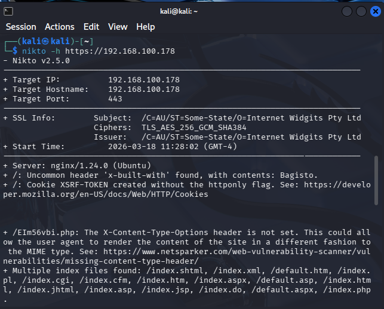
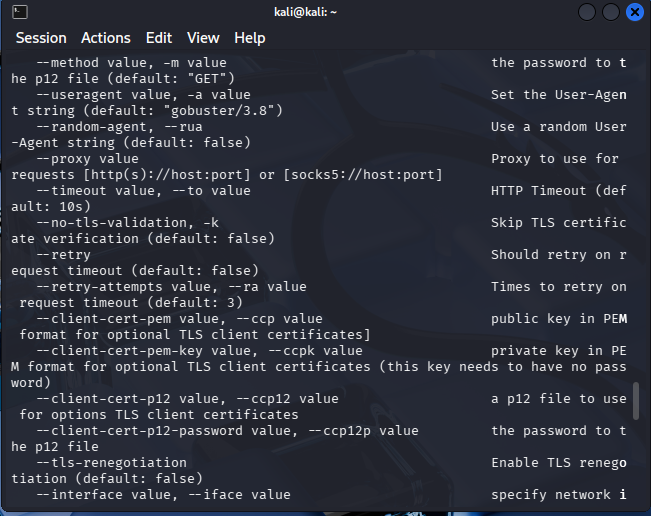
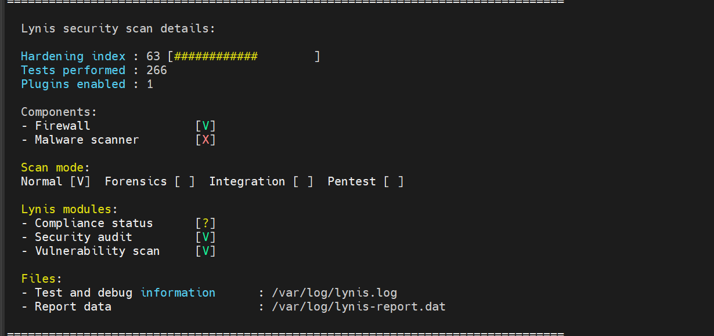

# Rapport d'Audit de Sécurité et de Durcissement : Infrastructure Ytech Solutions

Ce rapport documente l'audit de sécurité offensif (Pentest) et l'audit de configuration interne réalisés sur l'infrastructure **Ytech Solutions**. La méthodologie combine une analyse externe (Boîte Noire) et une analyse interne (Boîte Grise) pour une évaluation à 360°.

---

## 1. Reconnaissance Externe : Scan de Ports (Nmap)

La phase initiale identifie les vecteurs d'entrée potentiels via une cartographie des services réseau.

* **Commande :** `nmap -sV -sC -A 192.168.100.178`
* **Analyse :** Quatre services critiques ont été identifiés. Une exposition majeure du port **3306 (MySQL)** a été détectée sur l'interface publique (`0.0.0.0`), constituant une faille de configuration critique permettant des tentatives d'accès direct à la base de données.

---

## 2. Audit de la Surface Web (Nikto)

Analyse de la configuration du serveur Nginx pour détecter des défauts de durcissement HTTP.

* **Commande :** `nikto -h https://192.168.100.178`
* **Vulnérabilités identifiées :**
    * **Divulgation d'informations :** Le header `x-built-with` confirme l'utilisation de **Bagisto**, orientant les recherches d'exploits spécifiques.
    * **Insécurité des Cookies :** Absence du flag `httponly` sur le cookie `XSRF-TOKEN`, facilitant son extraction par des scripts malveillants (XSS).
    * **Headers de Sécurité :** Absence des en-têtes `X-Frame-Options` et `X-Content-Type-Options`.

---

## 3. Énumération de Répertoires (Gobuster)

Recherche de fichiers sensibles et de répertoires d'administration non indexés.

* **Outil :** Gobuster en mode `dir`.
* **Objectif :** Localisation de ressources critiques telles que les fichiers `.env` ou les répertoires de stockage de logs qui pourraient contenir des secrets applicatifs.

---

## 4. Test d'Accès Distant (MySQL)

Vérification de l'exploitabilité de l'exposition du port 3306 identifiée lors de la phase 1.

* **Commande :** `mysql -u vboxuser -p -h 192.168.100.178`
* **Résultat :** Échec de la connexion dû à une erreur de certificat auto-signé (`TLS/SSL error`). Cependant, l'accessibilité réseau au port confirme que le serveur est vulnérable aux attaques par déni de service (DoS) et au brute-force sur le service de base de données.

---

## 5. Audit de Durcissement Interne (Lynis)

Contrairement aux étapes précédentes, cette phase analyse la configuration interne du système d'exploitation Ubuntu 24.04 pour évaluer sa conformité aux standards de sécurité (CIS/NIST).

* **Commande :** `sudo lynis audit system`
* **Analyse des Résultats :** * **Hardening Index : 63.** Ce score indique une posture de sécurité moyenne. Bien que le firewall soit actif, l'absence de scanner de malwares et certaines faiblesses au niveau du noyau impactent le score global.
    * **Firewall [V] :** Détection d'un pare-feu actif, assurant une protection périmétrique de base.
    * **Malware Scanner [X] :** Lacune critique ; aucune solution de détection de logiciels malveillants n'est installée.

---

## 6. Synthèse des Vulnérabilités et Plan d'Action

| Niveau | Vulnérabilité | Impact Technique | Action Corrective |
| :--- | :--- | :--- | :--- |
| **CRITIQUE** | **MySQL Public (3306)** | Compromission totale des données. | Bind-address 127.0.0.1 |
| **HAUT** | **Hardening Index Bas (63)** | Système vulnérable aux attaques locales. | Appliquer les suggestions Lynis |
| **MOYEN** | **Cookies non sécurisés** | Détournement de session utilisateur. | Activer flag HttpOnly/Secure |
| **MOYEN** | **Headers HTTP manquants** | Clickjacking / MIME-sniffing. | Ajout headers de sécurité Nginx |

:::success Conclusion Technique
L'infrastructure **Ytech Solutions** présente des fondations robustes mais nécessite une intervention immédiate sur la **configuration réseau de MySQL** et un **durcissement des paramètres système** suggérés par Lynis pour atteindre un niveau de sécurité conforme aux exigences de production.
:::