# Rapport d'Ingénierie Système : Infrastructure Serveur Ytech Solutions

Ce rapport documente la conception technique, le déploiement et la sécurisation d'une infrastructure de production de niveau entreprise pour l'application **Ytech Solutions**. Ce projet a mobilisé des compétences avancées en administration système Linux, en ingénierie des réseaux virtuels et en gestion de la pile logicielle LEMP.

---

## 1. Stratégie de Virtualisation et Provisionnement des Ressources

Le déploiement commence par l'établissement d'une couche d'abstraction matérielle via l'hyperviseur **Oracle VM VirtualBox**. Le choix de la virtualisation est motivé par une nécessité impérative d'isolation environnementale, permettant de simuler un environnement de production réel sans interférer avec les processus de la machine hôte. 

Nous avons sélectionné la distribution **Ubuntu 24.04 LTS (Noble Numbat)** en version **Server**. Ce choix est stratégique : contrairement à une version "Desktop", la version Server ne charge aucun environnement graphique (GUI), ce qui réduit drastiquement la surface d'attaque et minimise la consommation de ressources RAM et CPU. Cela permet de dédier l'intégralité de la puissance de calcul aux services critiques tels que **Nginx**, **PHP-FPM** et **MySQL**. Le provisionnement a été optimisé pour garantir une stabilité exemplaire du noyau Linux 6.8 lors des opérations de lecture/écriture intensives.

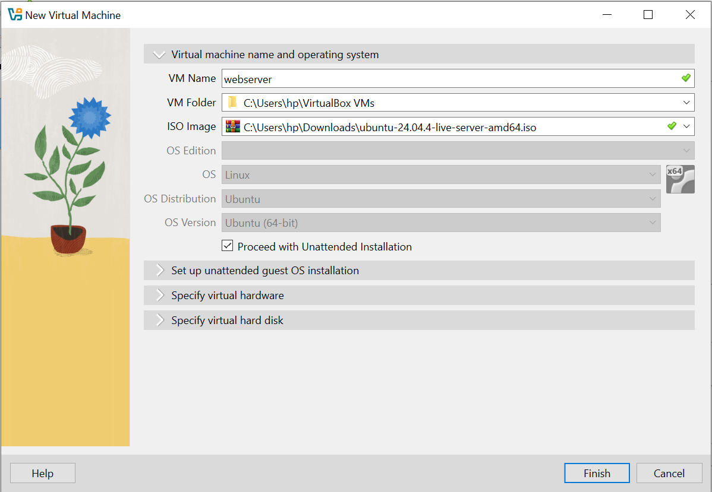
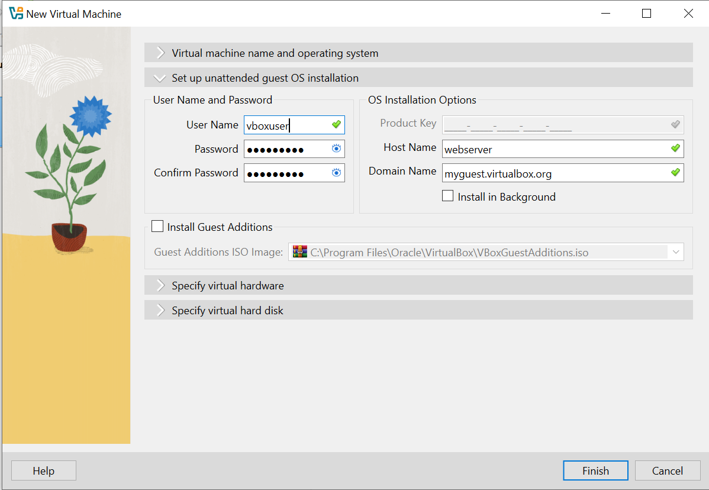

---

## 2. Ingénierie des Réseaux et Connectivité Distante

Une infrastructure isolée est inexploitable si elle n'est pas adressable. La transition du mode réseau NAT par défaut vers le mode **Accès par pont (Bridged Adapter)** constitue une décision architecturale majeure. En mode Pont, le serveur s'interface directement avec la couche 2 du modèle OSI, sollicitant une adresse IPv4 unique auprès du serveur DHCP du réseau local. Cela permet au serveur de se comporter comme une entité physique distincte sur le LAN.

[Image of the OSI model layers]

L'identification de l'adresse IP via la commande `ip a` a révélé l'adresse `192.168.100.178`, qui devient le point d'ancrage de toute l'administration. Parallèlement, l'activation du démon **OpenSSH** via `sudo systemctl enable --now ssh` est indispensable pour permettre une administration sécurisée à distance. Nous utilisons **MobaXterm** pour cette tâche, car cet outil offre une console X11 et un explorateur SFTP, facilitant la manipulation des fichiers de configuration complexes sans dépendre de l'interface limitée de VirtualBox.

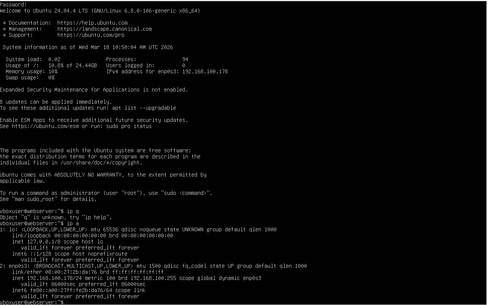
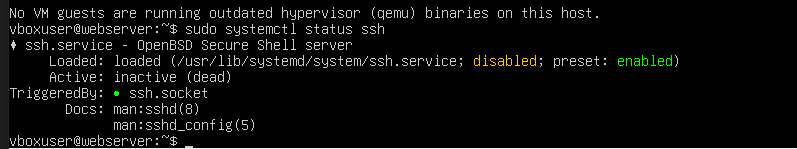
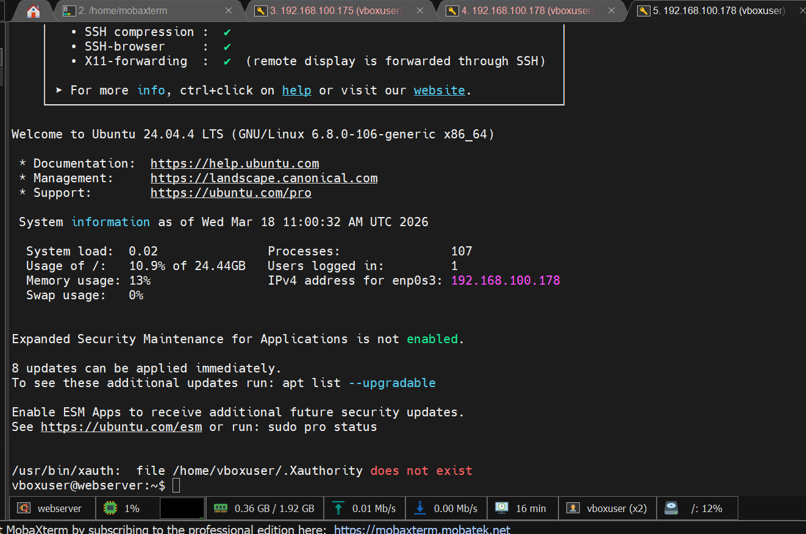

---

## 3. Architecture Logicielle : Déploiement de la Pile LEMP

L'infrastructure logicielle repose sur la pile **LEMP** (Linux, Nginx, MySQL, PHP). Le choix de **Nginx** par rapport à Apache se justifie par son architecture événementielle asynchrone, capable de gérer des milliers de connexions simultanées avec une empreinte mémoire extrêmement faible.

La maintenance préventive du système via `sudo apt update && sudo apt upgrade -y` garantit que tous les composants bénéficient des derniers correctifs de sécurité. L'installation des paquets inclut des modules PHP spécifiques indispensables : `php-fpm` pour le traitement des scripts, `php-bcmath` pour la précision des calculs monétaires (critique pour l'e-commerce Ytech) et `php-intl` pour la localisation. Chaque extension a été sélectionnée pour répondre aux exigences strictes du framework, assurant une compatibilité ascendante et des performances optimales.

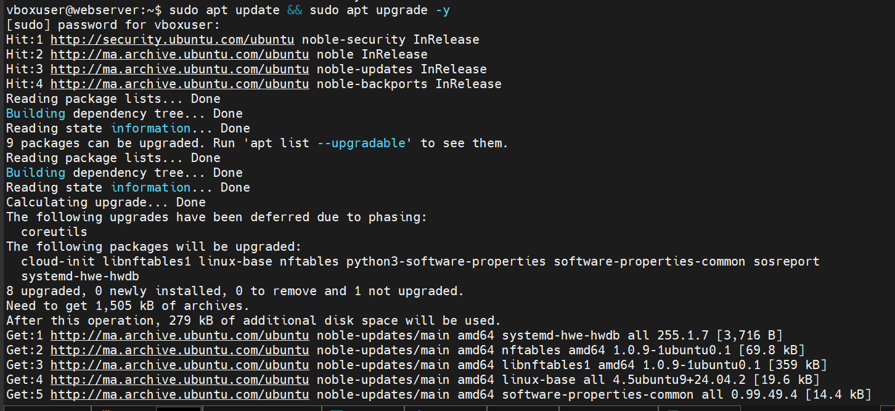
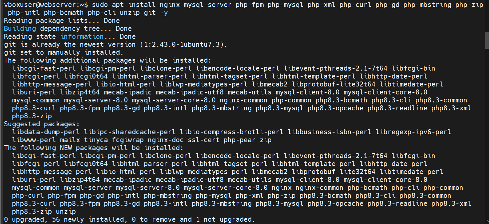

---

## 4. Persistance des Données et Optimisation MySQL

La gestion de la persistance est confiée à **MySQL**. La création de la base de données `ytech_db` et d'un utilisateur privilégié avec le joker `%` permet une flexibilité d'accès indispensable. Une modification critique de la configuration réseau de MySQL a été opérée : par défaut, MySQL restreint l'écoute à l'adresse de bouclage `127.0.0.1`. 

Nous avons édité le fichier `mysqld.cnf` pour passer le `bind-address` à `0.0.0.0`, forçant le service à écouter sur toutes les interfaces réseau. Cette ouverture du port `3306` permet à l'outil **HeidiSQL** (installé sur Windows) de communiquer avec le serveur pour l'importation massive des données. Cette étape démontre une compréhension approfondie des sockets réseau et des politiques d'accès aux bases de données en environnement hybride.

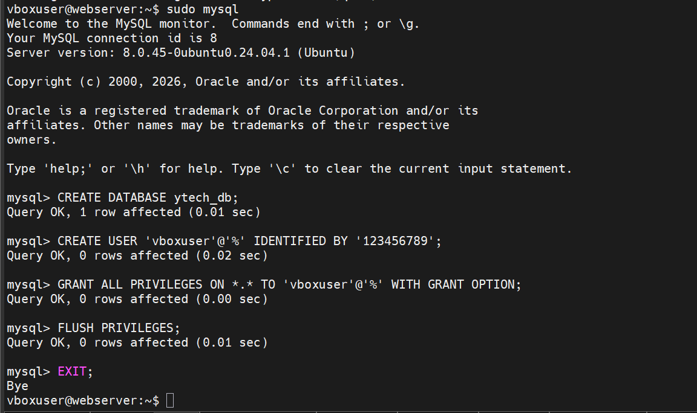
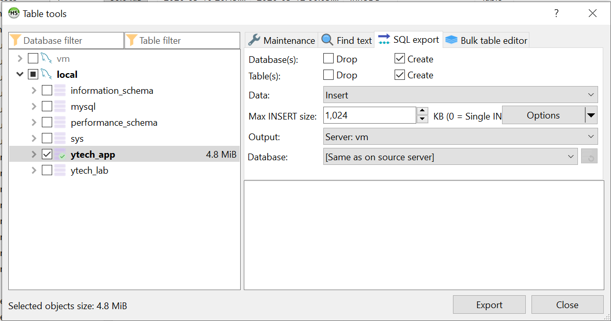

---

## 5. Cycle de Vie de l'Application : Git et Composer

L'intégrité du code source est maintenue via **Git**, permettant une synchronisation parfaite avec les versions de développement. Le clonage du dépôt dans `/var/www/ytech` établit la base de fichiers. Cependant, les bibliothèques tierces (dossier `vendor`) étant exclues des dépôts Git pour des raisons d'optimisation, leur reconstruction est assurée par **Composer**. 

L'exécution de `composer install` est une phase de résolution de dépendances complexe qui télécharge l'intégralité des paquets PHP nécessaires au moteur de l'application. Sans cette étape, l'autoloader serait incapable de localiser les classes, rendant l'application inopérante. La configuration finale du fichier `.env` fait office de pont entre le code source et l'infrastructure de données, injectant les secrets de connexion de manière sécurisée.

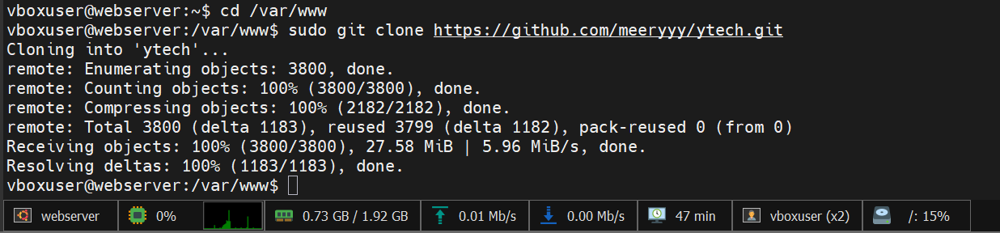

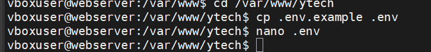

---

## 6. Sécurisation Cryptographique SSL/TLS

La protection des données en transit est une priorité absolue pour Ytech Solutions. Nous avons implémenté le protocole **HTTPS** via **OpenSSL**, générant un certificat RSA de 2048 bits.

Le certificat auto-signé (`ytech.crt`) et sa clé privée (`ytech.key`) ont été configurés dans le bloc **Virtual Host** de Nginx. Nous avons mis en place une redirection permanente (301) pour forcer tout trafic HTTP arrivant sur le port 80 vers le tunnel chiffré du port 443. Cette architecture garantit que chaque échange de données entre le navigateur et le serveur est protégé contre les interceptions malveillantes (Man-in-the-Middle).

---

## 7. Gestion des Permissions et Diagnostic Système

La sécurité sous Linux repose sur une gestion granulaire des droits. Une erreur "500 Internal Server Error" survient systématiquement lorsque l'interpréteur PHP ne peut pas écrire dans les répertoires système. 

Nous avons appliqué un changement de propriétaire récursif via `sudo chown -R $USER:www-data`, attribuant le groupe au serveur web (`www-data`). L'application des droits `775` sur le répertoire `storage` permet à l'application de générer ses journaux et ses caches de templates de manière autonome. Enfin, l'initialisation de la clé de chiffrement via `php artisan key:generate` sécurise les sessions utilisateurs grâce à l'algorithme AES-256.

---

## 8. Validation Finale et Mise en Production

L'infrastructure est désormais résiliente et optimisée. Le rendu final confirme que l'application **Ytech Solutions** est servie avec succès via une connexion sécurisée, prouvant la robustesse de la pile technologique déployée.

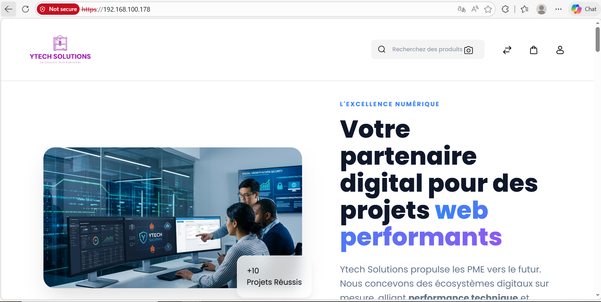